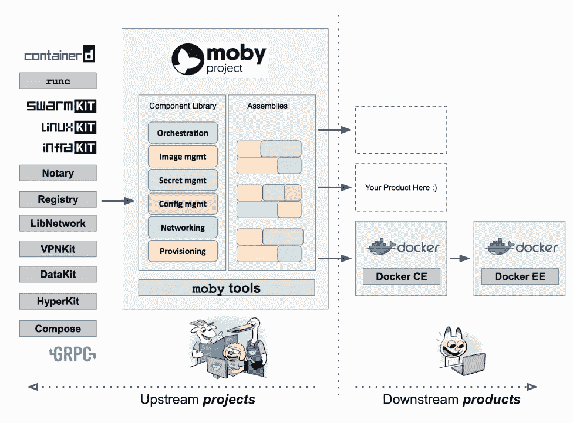

# 多克公司的莫比项目

> 原文：<https://thenewstack.io/what-is-the-moby-project/>

Docker 在上个月举行的年度用户大会 Dockercon 2017 上推出了许多新技术[其中之一是](https://thenewstack.io/docker-seeds-two-new-projects-building-containerized-infrastructure/)[莫比项目](https://mobyproject.org)，这是一个无需重新发明轮子就能组装专门集装箱系统的框架。根据 Docker 首席技术官 [Solomon Hykes](https://twitter.com/solomonstre) 的说法，莫比项目对于 Docker 就像 Fedora 对于 Red Hat Enterprise Linux 一样重要。

重要的是，通过成为等同于 Fedora 项目的容器项目，莫比正在改变 Docker 的构建方式。

红帽在 RHEL 混乱的早期做得很好，他们从产品中描绘了项目；它将软呢帽从 RHEL 分离出来。Docker 认为这种方法是更好地参与社区的一种方式。以前社区和产品的界限很模糊。人们不一定能分辨出他们是在为项目还是为产品做贡献。 [moby/moby](https://github.com/moby/moby) 存储库和 [docker/docker](https://github.com/docker/docker) 存储库之间的代码分离阐明了这种区别。

莫比将把 Docker 从一个整体引擎转换成一个工具包，将其组件组装成不同的配置。莫比项目应该鼓励每个组件的重用。Docker 在这方面有着成功的历史，可以从 Docker 之外的重用来衡量:

*   派生出 [OCI/runc](https://runc.io/) ，它现在是容器运行时和图像格式的既定标准。
*   从 containerd 发展而来，它现在是容器运行时事实上的行业标准，所有主要的云供应商和 99%的安装基础(全球数百万个节点)都做出了贡献。
*   [公证人](https://github.com/docker/notary)已经成为业界最成熟的 TUF 实施和安全社区的协作中心。
*   Docker 发行版是十几种商业产品的开源基础。

## 一点点

Docker 团队希望随着 Docker monolith 被分割成更小的部分，这些单独的组件可以成为定制解决方案的构建模块。之前驻留在 docker/docker 中，monolithic 项目已经迁移到 moby/moby。

这个项目引起了一些混乱。贡献者在会议上与大多数维护者进行了很好的沟通，然而，那些在社区中更随意地交流的人对其目的和影响感到惊讶和不清楚，对不理解各种部件如何组合在一起或新功能(例如 [LinuxKit](https://thenewstack.io/finally-linux-containers-really-will-run-windows-linuxkit/) )做什么感到沮丧。

莫比项目使系统构建者能够在相同的工具之上创建其他项目。系统构建者可能希望以不同的方式运行这些程序集，具体取决于它们是运行在小型物联网设备上，还是运行在带有 GPU 的大型系统上。

> 系统建造者可以利用莫比项目的组件进行创新，而不局限于 Docker。

分解组件还有很多工作要做，但是，目标是为 Docker 创建一个大的上游——那就是莫比。Docker Inc .希望工具比 Docker 更开放。产品设计决策有时与共识驱动的开源项目不一致。关注点的分离使得 Docker Inc .能够将用户体验的意见整合到他们的社区和企业 Docker 产品中。

莫比就是这个项目。Docker 就是产品。该项目可分为四个层次:

1.  所有的上游组件。
2.  莫比
3.  Docker 社区版(CE)
4.  Docker 企业版(EE)

信用:钟志文，码头公司。

当需要在项目和产品之间做出决策时，项目的分层组织应该澄清事情。Docker 作为一个产品将会添加用户的意见(最明显的是，对用户来说更容易)。例如，containerd 没有默认的注册表，而 Docker 会将 [Docker Hub](https://hub.docker.com/) 作为默认注册表。

## 用户不受影响

用户仍然会以同样的方式与 docker 交互。

*   正在寻找在容器中运行应用程序的简单方法的应用程序开发人员可以参考 Docker CE。
*   正在寻找一个现成的、受商业支持的容器平台的企业 IT 可以考虑 Docker EE。

对这些用户来说没有什么变化。命令行保持不变。Docker 现在可以利用生态系统为他们更快地创新。但是系统建造者可以利用莫比项目的组件进行创新，而不局限于 Docker。

## 项目治理

莫比项目是开放的，将是一个社区经营的项目。Docker Inc .通常倾向于在适当的时候向其他管理机构捐赠本项目中的个别组件。Containerd 必须独立于莫比项目，因为它是[捐赠给](https://thenewstack.io/docker-donate-container-runtime-containerd-cloud-native-computing-foundation/)云本地计算基金会的。长期的个人项目最终应该进入其他存储库。

<svg xmlns:xlink="http://www.w3.org/1999/xlink" viewBox="0 0 68 31" version="1.1"><title>Group</title> <desc>Created with Sketch.</desc></svg>