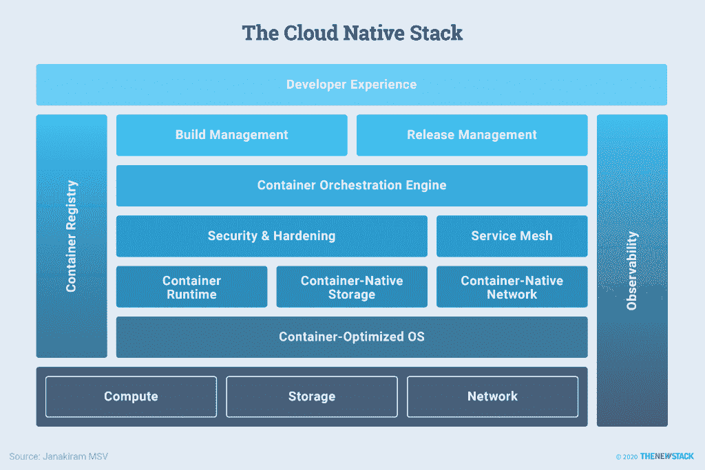

# 什么是现代云原生栈？

> 原文：<https://thenewstack.io/what-is-the-modern-cloud-native-stack/>

云原生系统的一个关键属性是可移植性，这只有在基础设施跨环境保持一致的情况下才有可能。Kubernetes 是基础设施的最小公分母，也是云原生堆栈的基础。我们还在上一篇文章中了解到【that Kubernetes 正迅速成为高度分布式环境中调度和管理作业的首选控制平面。

虽然 Kubernetes 是云原生堆栈的重要元素，但开发人员和 DevOps 工程师需要额外的软件来部署、扩展和管理现代应用程序。平台供应商如[红帽](http://red.ht/2uJGuQo)和 [VMware](http://bit.ly/2Rqhnu3) 提供基于 Kubernetes 的端到端平台。公共云供应商——包括[亚马逊网络服务](http://amzn.to/36oOGE9)(AWS)[谷歌云平台](https://cloud.google.com/) (GCP)和[微软 Azure](https://azure.microsoft.com/en-us/)——提供在现有计算、存储和网络基础设施上运行的基于 Kubernetes 的托管服务。

基于 Kubernetes 的集成容器管理平台创建了一种新的应用交付模型:容器即服务(CaaS)。与平台即服务(PaaS)类似，容器管理平台可以部署在企业数据中心运行的防火墙后面，或者作为托管云服务产品使用。

将 CaaS 作为跨数据中心和公共云的通用结构，组织可以构建混合应用程序，将内部资产安全地连接到公共云。CaaS 正迅速成为混合云和多云部署的推动者。开发人员和操作人员可以轻松地在不同的环境中移动应用程序。

## 容器管理平台的关键属性

无论部署在哪里，容器管理平台都必须满足以下要求:

*   **一致的平台**:开发人员和运营商希望在公共云和内部环境中获得一致的体验。
*   **DevOps 流程**:与成熟的 DevOps 实践相集成，确保软件的快速交付。
*   **安全性**:容器管理平台必须保证基础设施和应用程序的安全性。他们应该在部署应用程序之前检测漏洞，同时持续监控基础架构中的潜在违规行为。
*   **基础设施可靠性**:平台应支持服务水平协议(SLA)驱动的服务交付模式，最大限度地延长基础设施和平台的正常运行时间。
*   **工作负载的高可用性**:除了基础设施之外，部署在平台上的业务应用需要具有高可用性。
*   **可观察性:**该平台应通过从整个堆栈中捕获指标、事件、日志和跟踪，并将它们存储在一个可集中访问的位置，从而提供对基础设施、资源和应用的洞察。
*   **多租户和策略驱动的管理**:可选地，容器管理平台必须在使用平台的租户之间提供强大的隔离。应用程序的部署和管理应该由定义明确的策略来控制。

## 容器管理平台的全貌

作为集成容器管理平台交付的现代云原生堆栈由多个构建块组成。这些构建块中的一些可以作为开源项目获得，而另一些则是由独立软件供应商出售的商业产品。

云原生堆栈。资料来源:贾纳基拉姆·MSV

最底层以计算、存储和网络组件的形式代表群集的物理基础架构。该平台增加了各种抽象层，以优化利用底层物理基础设施。

本系列文章的其余部分将从容器优化的操作系统和容器运行时开始，深入研究每一层。

<svg xmlns:xlink="http://www.w3.org/1999/xlink" viewBox="0 0 68 31" version="1.1"><title>Group</title> <desc>Created with Sketch.</desc></svg>