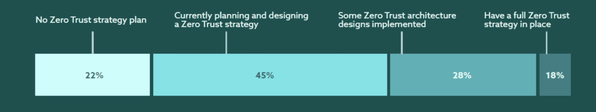

# 什么是零信任网络访问(ZTNA) |新堆栈

> 原文：<https://thenewstack.io/what-is-zero-trust-network-access-ztna/>

*在本系列的第一篇文章中，我们讨论了* [*什么是零信任安全*](https://thenewstack.io/what-is-zero-trust-security/) *以及它的重要性。在本文中，我们将深入探讨零信任网络访问，它是如何工作的，以及它对现代组织的好处。*

## 什么是零信任网络访问？

零信任网络访问(ZTNA)是一种安全解决方案，许多 IT 部门和 IT 组织使用它来确保安全地远程访问组织内的一系列数据、应用程序、网络和服务。ZTNA 基于已定义的访问控制策略，这些策略清楚地传达了谁有权访问什么，以及被授权访问多长时间。

当谈到安全远程访问工具、方法和技术时，ZTNA 是一个补缺者。VPN 或虚拟专用网络不同于零信任网络访问，因为 VPN 允许访问整个网络，而不是特定的应用程序或数据。随着远程员工队伍的不断壮大，许多公司将其作为员工满意度和雇主生产力的来源。零信任网络访问有助于将正确的人放入组织的系统，将错误的人排除在外。

## 零信任网络访问具体是如何工作的？

当组织使用零信任网络访问时，它可以确保用户在被授予访问权限之前通过 ZTNA 服务的验证和认证。[访问管理](https://thenewstack.io/why-access-management-is-step-one-for-zero-trust-security/)是 IT 部门实现零信任安全的首要步骤之一。虽然零信任访问有时可能是一个缓慢的过程，但避免以生产效率的名义在访问管理级别偷工减料是很重要的。

与 SDP 或软件定义的边界类似，零信任网络访问隐藏了设备、服务、资产和基础架构之间的连接。一旦用户通过访问身份验证，零信任网络访问系统就会为通过加密隧道访问特定应用程序、数据或服务开绿灯。加密的安全性作为一个额外的层，保护加密隧道另一端的所有内容不被未经授权的人访问或看到。

## 零信任网络访问如何防御网络安全攻击？

首先，整个零信任网络访问背后的想法始于这样一种假设，即网络安全攻击可能是网络内部和外部人员造成的。传统的 IT 网络信任几乎所有的东西，而零信任架构网络的字面意思是“不信任任何人”，包括系统、用户、软件和机器。

零信任网络访问验证用户的身份和权限，并强制对用户和设备进行持续监控和重新验证，以保持访问。例如，假设您通过移动设备甚至笔记本电脑登录您的银行帐户。一旦你检查了你的余额，你打开一个新的标签，继续在银行账户屏幕之外的其他事情。过一会儿，该选项卡会弹出一个超时警告，询问您是要继续还是注销。如果你没有及时回复，它会自动将你从屏幕上注销，如果你想再次访问你的银行账户详细信息，你将被迫重新登录。

这种持续监控最大限度地减少了用户暴露，并有助于保护网络免受内部和外部网络攻击。如今，随着许多应用程序和系统都在云中，零信任方法变得更加重要。由于零信任旨在防止和遏制网络攻击者，内部或外部网络攻击可以横向移动或在整个网络或应用程序中移动到网络的其他部分。

*资料来源:云安全联盟的* [*云安全和技术成熟度调查*](https://cloudsecurityalliance.org/artifacts/cloud-security-and-technology-maturity-survey/) *。根据 2021 年 11 月前完成的 256 项调查，只有 34%的人预计会有零信任。*

## 零信任网络访问的优势

在当今的多云环境中，许多应用程序和用户甚至不在组织的网络中。根据 Upwork 的 2021 年未来劳动力报告，到 2025 年，4070 万美国人将成为完全远程工作者。这意味着设备和位置位于组织网络之外的人数只会继续增长。

零信任网络访问允许基于微服务的应用驻留在多云环境中。当今的组织拥有驻留在多个位置的资产和数据，需要随时随地从任何设备进行访问，以提高员工的工作效率。

开发 ZTNA 模型是为了消除让每个人都可以访问所有内容的需求。因此，用户的访问权限非常有限，承包商、自由职业者、雇员和雇主可以放心地知道他们可以访问他们工作所需的内容，而不会访问他们不需要的任何内容。因为在被证明可信之前，任何东西都是不可信的，所以当连接丢失或改变时，需要重新进行身份验证。

## 一句话:如何实现零信任网络访问

零信任网络访问听起来可能很复杂，在整个组织中采用它听起来可能更复杂。找到合适的安全和技术合作伙伴来帮助您，是消除复杂性并步入正轨的第一步。将网络服务与用户和设备的内置零信任网络访问相结合，将有助于全面保护您的网络、资产和数据，并且只有需要的人才能在需要时访问。

**想了解更多信息？[了解零信任模型如何在集装箱安全中发挥作用](https://thenewstack.io/how-zero-trust-models-work-in-container-security/)。**

<svg xmlns:xlink="http://www.w3.org/1999/xlink" viewBox="0 0 68 31" version="1.1"><title>Group</title> <desc>Created with Sketch.</desc></svg>