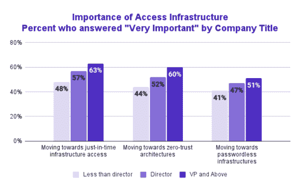
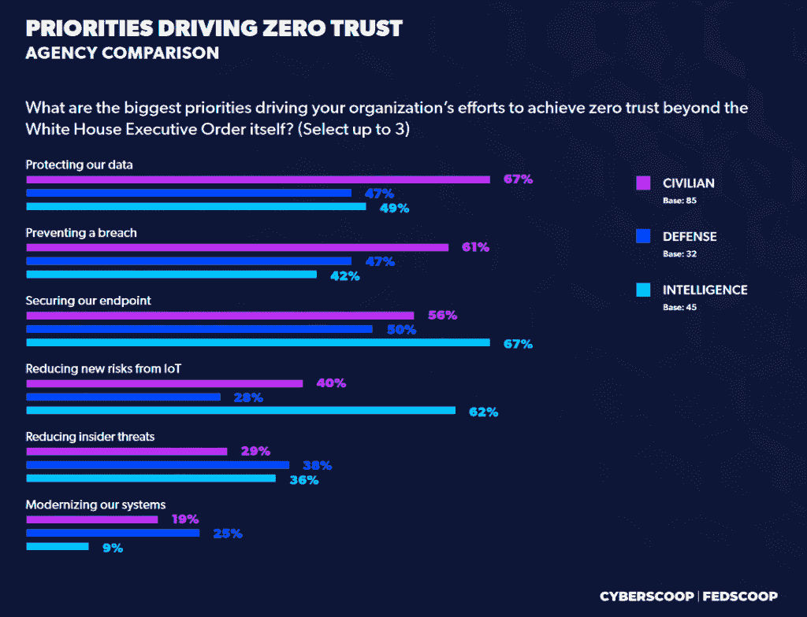

# 什么是零信任安全？

> 原文：<https://thenewstack.io/what-is-zero-trust-security/>

零信任是一种安全框架，在这种框架中，组织内部或外部的应用程序、软件、系统或网络的所有用户在被授予访问公司网络内特定数据或工具的权限之前，都必须经过身份验证、验证和频繁验证。在零信任框架中，网络可以位于云中、混合网络中，也可以位于员工所在的任何位置。假设在不满足必要的验证要求的情况下，不信任任何用户或设备进行访问。

[https://www.youtube.com/embed/x3Uk22OZ-I0](https://www.youtube.com/embed/x3Uk22OZ-I0)

视频

在当今的现代数字化转型环境中，零信任安全框架有助于确保基础设施和数据的安全，并妥善处理更多现代业务挑战。例如，随着疫情的发展，保护远程员工及其访问对于想要扩大员工规模的组织来说将变得更加重要。勒索软件威胁和攻击正在增加，零信任实施可以检测到这些威胁，从新奇的威胁到定制的恶意软件，远在它们造成伤害之前。

## 什么基础构成零信任？

零信任安全建立在美国国家标准与技术研究所(NIST)建立的架构之上。 [NIST 800-207](https://csrc.nist.gov/publications/detail/sp/800-207/final) 出版物概述了零信任程序的标准，并作为一个全面的基础来确保对现代攻击的兼容性，特别是在大多数公司使用的随处工作模式中。

随着安全漏洞的增加，联邦机构遵守 NIST 概述的零信任政策，并对供应商和其他利益相关者提出严格要求，以确保合规性。全球零信任安全市场预计将达到，而推动这一增长的主要因素是旨在摧毁基于云的应用程序、IT 基础架构组件和终端设备等基于目标的攻击的频率。

简而言之，零信任建立在几个原则之上:

1.  始终验证所有用户对所有设备的访问。
2.  通过最大限度地减少访问，外部和内部违规行为的影响也可以最小化(如果发生的话)。
3.  对资源、系统、软件和应用程序的访问仅由策略和用户身份决定。
4.  实施上下文分析和收集可以帮助您了解网络中的行为模式，并快速做出响应。

## 零信任是如何运作的？

传统的网络安全遵循“信任但验证”的思维方式，并授予对数据和信息的访问权限。零信任安全遵循“不信任任何人，验证一切”的思维模式。在传统方法中，用户会自动获得信任，这使公司面临遭受攻击和违规的重大风险。在零信任体系结构方法中，公司必须监控和验证用户访问，并在授予任何访问权限之前建立控制。

在 Teleport 的《2021 年基础设施访问和安全状况报告》中，百分之六十(60%)的副总裁或以上级别的高管认为向零信任架构发展非常重要。普通安全专业人员要谨慎得多。(密码问题应归咎于 IT 和安全部门，而不是最终用户)

使用零信任安全，电子邮件是安全的，数据是加密的。多因素身份验证(MFA)或双因素身份验证(2FA)已纳入组织的安全策略，确保终端和应用程序适当连接和安全。身份访问管理(IAM)是零信任的另一种形式，其中实现了一些系统，包括单点登录和特权访问管理。

在远程工作环境中，必须确保员工、自由职业者、供应商、客户和承包商能够在正确的时间以正确的方式访问正确的信息。如果您向公司内外的工作人员授予表面上的访问权限，您可能会使您的公司面临严重违规的风险。远程优先或远程混合工作环境中的 IT 团队必须准备好使用自动化策略来验证和确认用户和设备，即使他们不在办公桌前，这些策略也能发挥作用。

实时可见性也会影响零信任策略的实施。拥有数百个用户和应用程序的组织需要地理位置监控、端点功能知识、设备凭据权限、事件检测、软件版本控制和用户身份凭据。

根据对美国联邦政府 IT 和信息安全工作人员的调查，保护物联网和边缘设备安全的愿望正在推动情报机构(如 NSA、CIA)的零信任度。与此同时，政府中的平民更有可能认为零信任是关于，而政府更有可能认为零信任是关于保护数据和防止违规。

## 为什么零信任很重要

虚拟专用网络和防火墙可能仍然有用，但正在慢慢成为历史。随着如此多的信息在云中被访问，保护数据和应用程序的内部外围方法不如一二十年前有效。

零信任很重要，因为它提供了一个坚实而强大的保护帽，可以抵御一系列网络攻击、勒索软件和恶意软件的攻击，这些攻击如今呈指数级增长。对于现代企业来说，丢失数据、资产和身份可能会非常昂贵和耗时。

实施零信任后，公司可以实现以下目标:

*   提高对所有云、混合和本地环境的实时可见性。
*   保护数据、应用程序、设备和网络免受网络攻击渗透。
*   最大限度地降低数据和安全漏洞的风险。
*   减少检测和响应攻击所需的时间。
*   跨多个环境持续监控组件、用户、工作负载和设备。
*   为内部和外部员工和承包商构建一致的用户体验。

## 底线:今天零信任

如今，没有一种安全策略适用于所有组织。制定适用于所有场景、所有用户和设备的定制综合策略势在必行。应用访问策略可以防止员工访问私人或敏感信息，并确保相关信息的安全，以及在适当的环境中由适当的人访问。

***要了解关于零信任安全的更多信息，请了解什么是[零信任网络访问](https://thenewstack.io/what-is-zero-trust-network-access-ztna/)和[零信任模型如何在容器安全中工作](https://thenewstack.io/how-zero-trust-models-work-in-container-security/)。***

<svg xmlns:xlink="http://www.w3.org/1999/xlink" viewBox="0 0 68 31" version="1.1"><title>Group</title> <desc>Created with Sketch.</desc></svg>