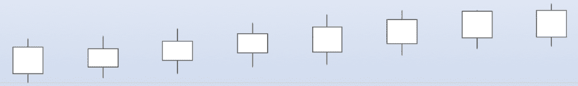

# MemSQL 能为时序应用做些什么

> 原文：<https://thenewstack.io/what-memsql-can-do-for-time-series-applications/>

[MemSQL](https://www.memsql.com/) 赞助本帖。

在 MemSQL，我们看到了人们对使用我们的数据库来处理时间序列的强烈兴趣。当组织经历以下情况时尤其如此:(1)高事件摄取率，(2)低延迟查询，以及(3)高并发查询率。

在接下来的内容中，我将展示如何将 MemSQL 用作一个强大的时间序列数据库，并通过简单的查询和用户定义的函数来说明这一点，这些函数展示了如何进行时间序列-频率转换、平滑等等。

我还将介绍如何快速加载时间序列数据点，没有尺度限制。

## 用 SQL 操作时间序列

与大多数特定于时间序列的数据库不同，MemSQL 支持标准 SQL，包括内部和外部连接、子查询、公共表表达式(cte)、视图、用于日期和时间操作的丰富标量函数、分组、聚合和窗口函数。我们支持所有常见的 SQL 数据类型，包括一个具有微秒级精度的 **datetime(6)** 类型，它非常适合作为时间序列时间戳。

金融交易系统中一种常见的时间序列分析是操纵股票报价。这里有一个使用标准 SQL 进行这种计算的简单例子。我们使用一个包含多只股票的时间序列的表格，并生成每只股票的最高价、最低价、开盘价和收盘价:

```
CREATE TABLE tick(ts datetime(6),  symbol varchar(5),  
 price numeric(18,4));
INSERT INTO tick VALUES
  ('2019-02-18 10:55:36.179760',  'ABC',  100.00),
  ('2019-02-18 10:57:26.179761',  'ABC',  101.00),
  ('2019-02-18 10:59:16.178763',  'ABC',  102.50),
  ('2019-02-18 11:00:56.179769',  'ABC',  102.00),
  ('2019-02-18 11:01:37.179769',  'ABC',  103.00),
  ('2019-02-18 11:02:46.179769',  'ABC',  103.00),
  ('2019-02-18 11:02:59.179769',  'ABC',  102.60),
  ('2019-02-18 11:02:46.179769',  'XYZ',  103.00),
  ('2019-02-18 11:02:59.179769',  'XYZ',  102.60),
  ('2019-02-18 11:03:59.179769',  'XYZ',  102.50);

```

该查询使用标准 SQL [窗口函数](https://docs.memsql.com/concepts/v6.7/window-functions-guide/) 为表中的每个符号生成高、低、开盘价和收盘价，假设“ticks”包含最近交易日的数据。

```
WITH ranked AS
(SELECT symbol,
 RANK()  OVER  w  as  r,
 MIN(price)  OVER  w  as min_pr,
 MAX(price)  OVER  w  as max_pr,
 FIRST_VALUE(price)  OVER  w  as first,
 LAST_VALUE(price)  OVER  w  as last
    FROM tick 
 WINDOW  w  AS  (PARTITION BY symbol
 ORDER BY ts
 ROWS BETWEEN UNBOUNDED PRECEDING
 AND UNBOUNDED FOLLOWING))

SELECT symbol,  min_pr,  max_pr,  first,  last
FROM ranked
WHERE  r  =  1;

```

```
Results:
+--------+----------+----------+----------+----------+
|  symbol  |  min_pr    |  max_pr    |  first     |  last      
+--------+----------+----------+----------+----------+
|  XYZ     |  102.5000  |  103.0000  |  103.0000  |  102.5000  |
|  ABC     |  100.0000  |  103.0000  |  100.0000  |  102.6000  |
+--------+----------+----------+----------+----------+

```

类似的查询可用于创建“烛台图表”，这是一种流行的金融时间序列报表样式，如下图所示，显示连续时间间隔内某一证券的开盘价、最高价、最低价和收盘价:



例如，此查询生成一个可以直接转换为三分钟间隔的蜡烛图的表格:

```
WITH ranked AS
 (SELECT symbol,  ts,
 RANK()  OVER  w  as  r,
 MIN(price)  OVER  w  as min_pr,
 MAX(price)  OVER  w  as max_pr,
 FIRST_VALUE(price)  OVER  w  as first,
 LAST_VALUE(price)  OVER  w  as last

 FROM tick
 WINDOW  w  AS  (PARTITION BY symbol,  time_bucket('3 minute',  ts)
 ORDER BY ts
 ROWS BETWEEN UNBOUNDED PRECEDING
                AND UNBOUNDED FOLLOWING))

SELECT symbol,  time_bucket('3 minute',  ts),  min_pr,  max_pr,
first,  last
FROM ranked
WHERE  r  =  1
ORDER BY  1,  2;

```

结果:

```
+--------+-----------------------------+----------+----------+----------+----------+
|  symbol  |  time_bucket('3 minute',  ts)  |  min_pr    |  max_pr    |  first     |  last      |
+--------+-----------------------------+----------+----------+----------+----------+
|  ABC     |  2019-02-18  10:54:00.000000   |  100.0000  |  100.0000  |  100.0000  |  100.0000  |
|  ABC     |  2019-02-18  10:57:00.000000   |  101.0000  |  102.5000  |  101.0000  |  102.5000  |
|  ABC     |  2019-02-18  11:00:00.000000   |  102.0000  |  103.0000  |  102.0000  |  102.6000  |
|  XYZ     |  2019-02-18  11:00:00.000000   |  102.6000  |  103.0000  |  103.0000  |  102.6000  |
|  XYZ     |  2019-02-18  11:03:00.000000   |  102.5000  |  102.5000  |  102.5000  |  102.5000  |
+--------+-----------------------------+----------+----------+----------+----------+

```

平滑是管理时间序列的另一个常见需求。该查询生成股票“ABC”的平滑价格序列，对最近三个基点的价格进行平均:

```
SELECT symbol,  ts,  price,
AVG(price)  OVER  (ORDER BY ts ROWS BETWEEN  3  PRECEDING AND CURRENT ROW)  AS smoothed_price
FROM tick
WHERE symbol  =  'ABC';

```

结果:

```
+--------+----------------------------+----------+----------------+
|  symbol  |  ts                          |  price     |  smoothed_price  |
+--------+----------------------------+----------+----------------+
|  ABC     |  2019-02-18  10:55:36.179760  |  100.0000  |    100.00000000  |
|  ABC     |  2019-02-18  10:57:26.179761  |  101.0000  |    100.50000000  |
|  ABC     |  2019-02-18  10:59:16.178763  |  102.5000  |    101.16666667  |
|  ABC     |  2019-02-18  11:00:56.179769  |  102.0000  |    101.37500000  |
|  ABC     |  2019-02-18  11:01:37.179769  |  103.0000  |    102.12500000  |
|  ABC     |  2019-02-18  11:02:46.179769  |  103.0000  |    102.62500000  |
|  ABC     |  2019-02-18  11:02:59.179769  |  102.6000  |    102.65000000  |
+--------+----------------------------+----------+----------------+

```

## 使用可扩展性增强 MemSQL 对时间序列的处理能力

 [埃里克·汉森

Eric Hanson 是 SingleStore 的首席产品经理，负责查询处理、可扩展性和地理空间功能领域。他是加州大学伯克利分校的博士毕业生，曾是美国空军军官，佛罗里达大学的计算机科学教授，也是微软公司 SQL Server 的首席项目经理和开发人员。](https://www.memsql.com/) 

MemSQL 通过用户定义的标量函数(UDF)、聚合函数和存储过程( [MPSQL](https://docs.memsql.com/concepts/v6.7/procedural-extensions/) 语言)支持可扩展性。MemSQL 将 UDF 和存储过程编译成机器代码，以获得高性能。我实际上使用可扩展性创建了在前面部分中作为 UDF 使用的 **time_bucket()** 函数(见下面的附录);这提供了与其他时序特定产品中的类似功能等效的功能。您可以轻松地创建一个函数或表达式来按时间间隔(如秒、分钟、小时或天)进行存储。时间序列数据的一个常见需求是执行插值。

例如，假设您有一个时间序列，其中各点的随机间隔平均为 30 秒。可能有几分钟没有数据点。因此，如果您将原始(不规则)时间序列数据转换为一分钟一个点的规则时间序列，可能会有间隙。如果要提供没有间隙的绘图输出，则需要从间隙前后的值内插间隙值。在 MemSQL 中实现存储过程很简单，方法是获取一个查询结果并输出一个行集，其中的间隙被插入到一个临时表中。

然后可以使用 [ECHO](https://docs.memsql.com/sql-reference/v6.7/echo-select/) 命令将其发送回客户端应用程序。此外，MemSQL 支持用户定义的聚合函数，可用于实现有用的时间序列操作，例如获取序列中第一个和最后一个值的简写，而不需要特定的窗口函数。考虑这个查询，它基于一个名为 **FIRST()** :
的用户定义的聚合函数(UDAF ),获取股票 ABC 每三分钟交易的第一个值

```
SELECT time_bucket('3 minute',  ts),  first(price,  ts)
FROM tick
WHERE symbol  =  "ABC"
GROUP BY  1
ORDER BY  1;

```

结果:

`+-----------------------------+------------------+`
`| time_bucket('3 minute', ts) | first(price, ts) |`
`+-----------------------------+------------------+`
`| 2019-02-18 10:54:00.000000  | 100.0000         |`
`| 2019-02-18 10:57:00.000000  | 101.0000         |`
`| 2019-02-18 11:00:00.000000  | 102.0000         |`


**FIRST()** 和类似的 **LAST()** UDAF 的实现在下面的补充材料部分显示。

## 时间序列压缩和生命周期管理

MemSQL 擅长处理时间序列事件的突发插入流量和历史时间序列信息，节省空间非常重要。对于突发的插入流量，可以使用 MemSQL 行存储表来保存时间序列事件。对于更大、寿命更长的时间序列事件集或已经老化的旧时间序列数据集，它们不再被更新，MemSQL [columnstore](https://docs.memsql.com/concepts/v6.7/columnstore/) 是一种很好的格式，因为它可以非常有效地压缩时间序列数据。此外，它驻留在磁盘上，所以主内存大小不会限制您可以存储多少数据。

## 可扩展的时间序列摄取

在构建时间序列应用程序时，数据可能来自许多来源，包括应用程序、文件系统、S3、HDFS、Azure Blob 存储和 Kafka 队列。MemSQL 能够以令人难以置信的速度从所有这些来源获取数据。MemSQL 可以以惊人的数据速率接收数据。在最近的一次测试中，我直接从应用程序中每秒插入 2，850，500 个事件，具有完全的事务完整性和持久性，使用双叶 MemSQL 集群，每个叶运行在英特尔至强白金 28 核系统上。使用直接装载或 Kafka 管道可以获得相当甚至更好的速度。如果您必须扩展得更高，只需添加更多节点—没有实际限制。

## 当通用 MemSQL 适合时间序列时

我们已经看到时间序列数据管理市场分成了时间序列专用产品，它们有自己的专用语言，以及可以与使用 SQL 的标准报告和商业智能工具互操作的扩展 SQL 系统。MemSQL 属于第二类。MemSQL 非常适合需要快速接收、低延迟查询和高并发性的时序应用程序，没有规模限制，并且受益于 SQL 语言功能和 SQL 工具连接。

许多特定于时间序列的产品在数据管理方面都有缺点。有些缺乏横向扩展，限制了他们可以解决的问题的规模，或者迫使应用程序开发人员在他们的代码中构建曲折的分片逻辑，以便在多个实例中分割数据，从而浪费了宝贵的人力资源，而这些人力资源本可以更好地投入到应用程序业务逻辑中。其他系统解释的查询处理器跟不上我们这样的最新查询执行实现。有些缺乏 SQL 数据库常见的事务处理完整性特性。MemSQL 让时序应用程序开发人员充满信心地前进，因为他们知道他们不会遇到规模问题，他们可以使用所有他们熟悉的工具——任何可以连接到 SQL 数据库的工具。

## 摘要

MemSQL 是管理时间序列数据的强大平台。它支持快速方便地加载事件流的能力，规模不限。它支持完整的 SQL，使用 SQL 92 的所有标准功能以及最近添加的窗口函数扩展来实现复杂的查询。它支持事务、高速并发更新和查询以及高可用性技术，许多开发人员需要这些技术用于各种应用程序，包括时间序列。并且您喜欢的 SQL 兼容工具可以连接到 MemSQL。这使得 MemSQL 成为一个强大的时间序列平台。 [今天就免费下载 MemSQL](https://www.memsql.com/free/)在你的时间序列数据上试试吧！

## 补充材料 1/2:time _ bucket()函数全文

```
    --  Usage:  time_bucket(interval_string,  timestamp_value)
  --  Examples:  time_bucket('1 day',  ts),  time_bucket('5 seconds',  ts)

  DELIMITER  //
  CREATE OR REPLACE FUNCTION time_bucket(
 bucket_desc varchar(64)  NOT NULL,  
 ts datetime(6))  RETURNS datetime(6)  NULL AS
  DECLARE
 num_periods bigint  =  -1;  
 second_part_offset int  =  -1;
 unit varchar(255)  =  NULL;
 num_str varchar(255)  =  NULL;
 unix_ts bigint;
 r  datetime(6);
 days_since_epoch bigint;
  BEGIN
 num_str  =  substring_index(bucket_desc,  ' ',  1);
 num_periods  =  num_str  &gt;  bigint;
 unit  =  substr(bucket_desc,  length(num_str)  +  2,  length(bucket_desc));
 IF unit  =  'second'  or unit  =  'seconds'  THEN
 unit  =  'second';
 ELSIF unit  =  'minute'  or unit  =  'minutes'  THEN
 unit  =  'minute';
 ELSIF unit  =  'hour'  or unit  =  'hours'  THEN
 unit  =  'hour';
 ELSIF unit  =  'day'  or unit  =  'days'  THEN
 unit  =  'day';
 ELSE
 raise user_exception(concat("Unknown time unit: ",  unit));
 END IF;

 unix_ts  =  unix_timestamp(ts);

 IF unit  =  'second'  THEN
 r  =  from_unixtime(unix_ts  -  (unix_ts  %  num_periods));
 ELSIF unit  =  'minute'  THEN  
 r  =  from_unixtime(unix_ts  -  (unix_ts  %  (num_periods *  60)));
 ELSIF unit  =  'hour'  THEN  
 r  =  from_unixtime(unix_ts  -  (unix_ts  %  (num_periods *  60  *  60)));
 ELSIF unit  =  'day'  THEN 
 unix_ts  +=  4  *  60  *  60;  --  adjust to align day boundary
 days_since_epoch  =  unix_ts  /  (24  *  60  *  60);
 days_since_epoch  =  days_since_epoch  -  (days_since_epoch  %  num_periods);
 r  =  (from_unixtime(days_since_epoch *  (24  *  60  *  60)))  &gt;  date;
 ELSE
 raise user_exception("Internal error -- bad time unit");
 END IF;

 RETURN  r;
  END;
  //
  DELIMITER  ;

```

## 补充材料 2/2:first()和 last()聚合函数的全文

下面的 UDAF 返回序列中的第一个值，按第二个参数排序，即时间戳:

```
--  Usage:  first(value,  timestamp_expr)
--  Example:  
--  Get first value of  x  for each day from  a  time series in table  
--  t(x,  ts)
--  with timestamp ts.
--  
-- SELECT ts  >  date,  first(x,  ts)  FROM  t  GROUP BY  1  ORDER BY  1;

DELIMITER  //
CREATE OR REPLACE FUNCTION first_init()  RETURNS RECORD(v  TEXT,  d  datetime(6))  AS
  BEGIN
    RETURN ROW("_empty_set_",  '9999-12-31 23:59:59.999999');
  END  //
DELIMITER  ;

DELIMITER  //
CREATE OR REPLACE FUNCTION first_iter(state RECORD(v  TEXT,  d  DATETIME(6)),  
 v  TEXT,  d  DATETIME(6))  
  RETURNS RECORD(v  TEXT,  d  DATETIME(6))  AS
  DECLARE 
    nv TEXT;
    nd DATETIME(6);
    nr RECORD(v  TEXT,  d  DATETIME(6));  
  BEGIN
    --  if new timestamp is less than lowest before,  update state
    IF state.d  >  d  THEN
      nr.v  =  v;
      nr.d  =  d;
      RETURN nr;
    END IF;
    RETURN state;  
  END  //
DELIMITER  ;

DELIMITER  //
CREATE OR REPLACE FUNCTION first_merge(state1 RECORD(v  TEXT,  d  DATETIME(6)),  
 state2 RECORD(v  TEXT,  d  DATETIME(6)))  RETURNS RECORD(v  TEXT,  d  DATETIME(6))  AS
  BEGIN
    IF state1.d  <  state2.d  THEN
      RETURN state1;
    END IF;
    RETURN state2;
  END  //
DELIMITER  ;

DELIMITER  //
CREATE OR REPLACE FUNCTION first_terminate(state RECORD(v  TEXT,  d  DATETIME(6)))  RETURNS TEXT AS
  BEGIN
    RETURN state.v;
  END  //
DELIMITER  ;

CREATE AGGREGATE first(TEXT,  DATETIME(6))  RETURNS TEXT
  WITH STATE RECORD(v  TEXT,  d  DATETIME(6))
  INITIALIZE WITH first_init
  ITERATE WITH first_iter
  MERGE WITH first_merge
  TERMINATE WITH first_terminate;

```

类似于 FIRST()的 LAST() UDAF，但返回按时间戳排序的序列中的最终值，如下:

```
--  Usage:  last(value,  timestamp_expr)
--  Example:  
-- Get last value of  x  for each day from  a  time series in table  t
-- t(x,  ts)
-- with timestamp column ts.
--  
-- SELECT ts  >  date,  last(x,  ts)  FROM  t  GROUP BY  1  ORDER BY  1;

DELIMITER  //
CREATE OR REPLACE FUNCTION last_init()  RETURNS RECORD(v  TEXT,  d  datetime(6))  AS
  BEGIN
    RETURN ROW("_empty_set_",  '1000-01-01 00:00:00.000000');
  END  //
DELIMITER  ;

DELIMITER  //
CREATE OR REPLACE FUNCTION last_iter(state RECORD(v  TEXT,  d  DATETIME(6)),  
 v  TEXT,  d  DATETIME(6))  
  RETURNS RECORD(v  TEXT,  d  DATETIME(6))  AS
  DECLARE 
    nv TEXT;
    nd DATETIME(6);
    nr RECORD(v  TEXT,  d  DATETIME(6));  
  BEGIN
    --  if new timestamp is greater than largest before,  update state
    IF state.d  <  d  THEN 
    nr.v  =  v;  
    nr.d  =  d;  
    RETURN nr;  
    END IF;  
    RETURN state;  
  END  // 
DELIMITER  ;  

DELIMITER  // 
CREATE OR REPLACE FUNCTION last_merge(state1 RECORD(v  TEXT,  d  DATETIME(6)),
 state2 RECORD(v  TEXT,  d  DATETIME(6)))  RETURNS RECORD(v  TEXT,  d  DATETIME(6))  AS 
BEGIN IF state1.d  <  state2.d  THEN
      RETURN state1;
    END IF;
    RETURN state2;
  END  //
DELIMITER  ;

DELIMITER  //
CREATE OR REPLACE FUNCTION last_terminate(state RECORD(v  TEXT,  d  DATETIME(6)))  RETURNS TEXT AS
  BEGIN
    RETURN state.v;
  END  //
DELIMITER  ;

CREATE AGGREGATE last(TEXT,  DATETIME(6))  RETURNS TEXT
  WITH STATE RECORD(v  TEXT,  d  DATETIME(6))
  INITIALIZE WITH last_init
  ITERATE WITH last_iter
  MERGE WITH last_merge
  TERMINATE WITH last_terminate;

```

通过 Pixabay 的特征图像。

<svg xmlns:xlink="http://www.w3.org/1999/xlink" viewBox="0 0 68 31" version="1.1"><title>Group</title> <desc>Created with Sketch.</desc></svg>