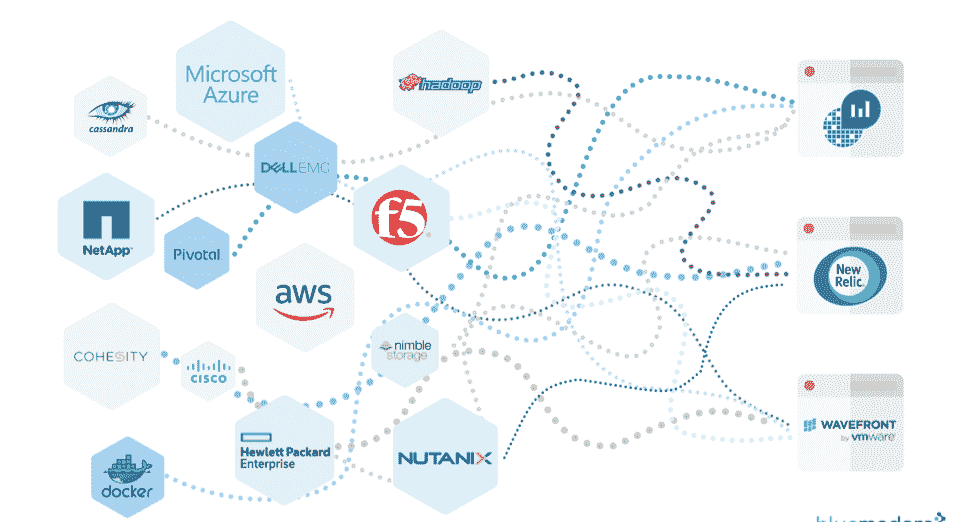
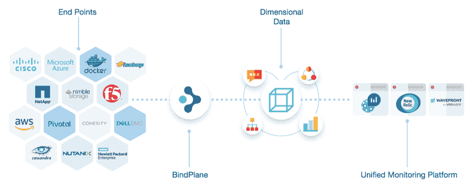
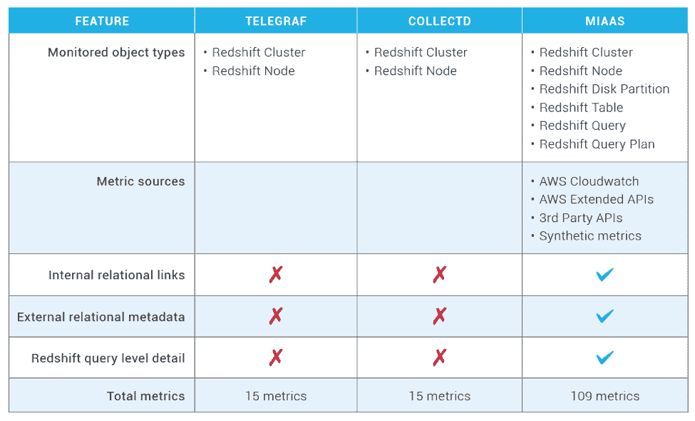

# 从美国职业棒球大联盟可以学到什么

> 原文：<https://thenewstack.io/what-monitoring-can-learn-from-major-league-baseball/>

[Blue Medora](https://bluemedora.com/) 赞助本帖。

1984 年，MLB 职业棒球大联盟拒绝公布每场比赛的详细报道，这让比尔·詹姆士很沮丧。

比尔认识到标准化、易于访问的数据深度可以为他通过观察单个球员表现的特定方面来分析棒球比赛的方法带来的价值，这种做法现在被称为 sabermetrics。

因为 MLB 没有他的模型工作所需的所有数据，比尔招募了一个粉丝网络，他们将一起工作来收集和分发这些信息(被称为项目记分卡)，它后来发展成为 STATS Inc .，在 2001 年被[福克斯](https://en.wikipedia.org/wiki/Fox_Network)体育收购之前，该公司向每个主要媒体提供数据和分析。

图 MIaaS 会像比尔·詹姆斯的统计公司一样关注棒球吗？

 [Mike Kelly，Blue Medora 首席技术官

作为首席技术官，Mike Kelly 专注于推进 Blue Medora 的整体战略和方向，并定义整个 IT 领域监控的未来。他还领导 Blue Medora 的 VMware 产品集成、产品冠军和新产品开发团队。在成为首席技术官之前，Kelly 领导了一个领先软件解决方案的创建和开发，该解决方案用于监控和管理 VMware 上的 Oracle 数据库。在加入 Blue Medora 之前，他的职业生涯专注于新产品开发和研究，并拥有产品开发周期各个阶段的经验。迈克拥有理学学士学位。西密歇根大学计算机工程专业。](https://bluemedora.com/) 

大约在那个时候，Paul DePodesta 改变了比赛，他采用了一种分析甚至是算法的方法来为奥克兰运动家队选择球员，奥克兰运动家队正在努力保持竞争力，其薪资只有纽约扬基队等球队的三分之一。

根据 DePodesta 对詹姆斯数据的分析，美国篮协总经理比利·比恩在 2003 年创下了 20 连胜的记录。他当时非常非正统但最终成功的“算法指导”方法永远改变了美国的伟大游戏，后来成为迈克尔·刘易斯的书《金钱球:赢得不公平游戏的艺术》和好莱坞电影的基础。

今天，在 IT 监控行业工作了十年之后，我可以肯定监控领域的算法导向分析也正在撼动 IT 世界。就像 21 世纪初的棒球一样，算法有机会彻底改变监控游戏。机器学习的进步有可能[将监控提升到可观察性](https://thenewstack.io/dimensional-data-making-the-leap-from-monitoring-to-observing/)。

但是，就像 STATS Inc .出现之前的棒球一样，我们传统的数据收集方法正在阻碍我们。可悲的是，一些最不可思议的分析引擎依赖于大杂烩的数据收集来源。许多是由技术提供商构建的，而其他的是基于开源甚至社区成员的。

图 2:今天的监控集成状态因 API 爆炸而恶化，并限制了预测分析的准确性。

大多数大型组织运行六个或更多的监控工具。维护几十个单独的集成实际上可以变成一项重大投资，随着时间的推移，它有可能与监控平台的成本相媲美。

然而，也许最重要的是，结果并不好。很多时候，当事情出错时，很难获得清晰的洞察力。

[监控集成即服务(MIaaS)](https://thenewstack.io/why-its-time-to-decouple-data-collection-from-monitoring-analytics/) 有机会通过将数据收集与数据分析分离来改变这种状况。在某种程度上，构建一个组织使用的任何监控或分析平台都可以利用的集成层。

图 3: MIaaS 提供了从您环境中的每项企业技术到任何监控平台的单一、自我维护的连接。

这里有四个现代监控用例，MIaaS 在其中非常有意义:

### 微服务监控

微服务架构需要一种不同的方法来监控集成，这种方法考虑了许多资源的临时性质。MIaaS 使得自动发现新的资源动态技术栈变得容易，例如那些使用容器或无服务器技术的技术栈。

MIaaS 也比 Collectd 或 StatsD 等社区或开源集成更深入，因为它有一个更灵活的摄取框架，可以适应更多和更多样的 API 类型。这使得在高度抽象的环境中交付组件数据成为可能。参见下面在容器化环境中运行的 Redshift 数据库的比较:

图 4。MIaaS 框架的灵活性支持对系统行为以及丰富的关系上下文进行高度精细的洞察。

### 混合云监控

查明云原生应用中的应用性能问题已经够困难的了。加上内部堆栈和一个或多个云提供商，您会突然拥有一个包含多个移动部件的环境，从几个方面影响应用程序性能。

MIaaS 可以统一传统数据中心技术和跨云的可见性。了解整个系统(如节点和群集或容器和主机)的各个组件之间的关系或上下文，可以使警报更加准确，并使根本原因分析更加快速。

### 多云应用优化

[来自](http://www.esg-global.com/blog/three-facts-about-multi-cloud-that-will-surprise-you) [的研究表明，ESG](http://www.esg-global.com/blog/three-facts-about-multi-cloud-that-will-surprise-you) 的 Edwin Yeun 认为，推动云计算利用的最大因素是单个应用程序或工作负载需求。每个主要的公共云监控提供商都提供了自己的监控解决方案，但是很难进行比较。指标可以以不同的深度甚至单位显示。

MIaaS 为所有公共云指标创造了公平的竞争环境。它还可以轻松地在一个云提供商的监控平台上实现标准化，或者使用第三方分析工具，通过[应用性能监控平台](https://stackify.com/what-is-application-performance-monitoring/) (APM)从面向应用的角度分析跨云。

### DevOps 收养

正如我提到的，大多数大型组织运行多种监控工具。这可能有多种原因，但其中之一可能是个人团队偏好。但是，随着“开发”和“运营”的传统孤岛不断碰撞，确保每个人都能访问相同的 MIaaS 是一种增强协作的简单方法。

你可能会从书中或电影中认出比尔·詹姆斯和保罗·德波斯塔的故事。如果是这样，你可能还记得詹姆斯的数据和德波斯塔的分析是如何永远改变了棒球比赛的。将数据收集从数据分析中分离出来可以以同样的方式革新 IT 监控。通过消除当前由数据收集引起的挑战，MIaaS 有潜力释放最佳人工智能技术的全部潜力。

通过 Pixabay 的特征图像。

<svg xmlns:xlink="http://www.w3.org/1999/xlink" viewBox="0 0 68 31" version="1.1"><title>Group</title> <desc>Created with Sketch.</desc></svg>