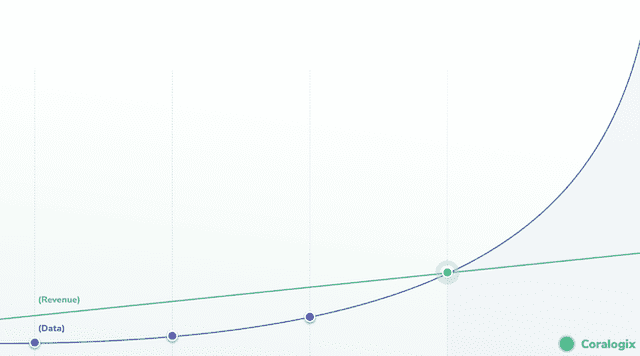
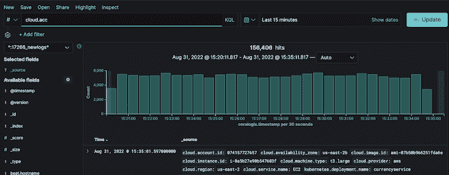
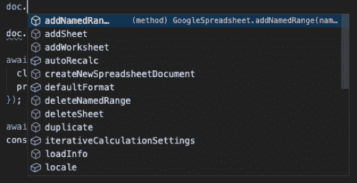
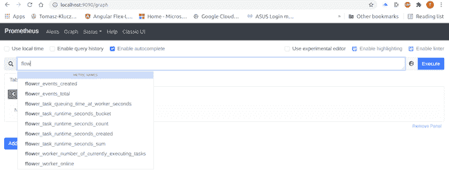
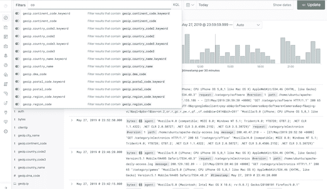
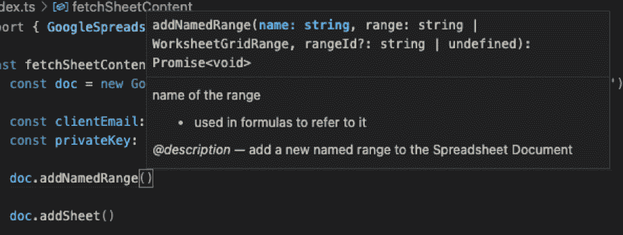

# 什么是可观察性必须从你的 IDE 中学习的

> 原文：<https://thenewstack.io/what-observability-must-learn-from-your-ide/>

可观测性是许多构建复杂软件的组织渴望已久的目标。一个可观察的系统不是简单地依赖几个静态仪表板，而是将可靠性视为一个数据分析问题，并将您的所有信息带到[一个单独的地方](https://coralogix.com/)，在那里可以对其进行查询、分析，并将其转化为可操作的见解。

这种方法允许团队从多个角度看待复杂的问题，开发有利于运营效率的新见解，并为更广泛的业务产生新见解，以做出更好的未来战略决策。

可观察性工程是由监测专家[慈善专业](https://twitter.com/mipsytipsy/)、[利兹·方-琼斯](https://twitter.com/mipsytipsy/)和[乔治·米兰达](https://twitter.com/gmiranda23)创造的一个术语。它指的是能够创建可观察系统的技能、技巧和技术的集合。“可观测性工程”已经存在了一段时间，但它还没有成为 TDD 或极限编程所拥有的主流学科。什么阻止了我们？

## 那么现在在可观察性方面缺少什么呢？

过去十年中，可观测性面临的主要挑战是数据的爆炸。数据量正以惊人的速度增长。组织被迫不断创新，只是为了能够保持对他们生成的大量数据的稳定访问。即使在可靠性的严格限制下，跟踪系统生成的数据量也不仅仅是简单的度量，而是一个数量级。

我们现在拥有的许多工具都是在数据量没有这么大的时候设计的。虽然我们已经升级了数据存储和收集机制来处理这种新的规模，但还没有尽最大努力让我们的工具使用起来更愉快。

简而言之，受影响最大的是[开发者体验](https://coralogix.com/blog/contextual-autocomplete-developer-productivity/)。

## 那么我们的可观察性工具能从 IDE 中学到什么呢？

开发人员经验是一件很难掌握的事情。它不同于一般的用户体验，因为你的每个用户都有一个基本的专业水平。因此，在开发工具中经常会发现一些可观察性系统实现得很差，或者更糟，根本没有实现的共同特性。下面重点举一个例子。自动完成。

### 自动完成应该是不可协商的

Autocomplete 仅适用于付费购买许可的 Kibana 查询语言(KQL)用户。否则，你就是瞎开枪。

自动完成已经存在了很长时间，将它从开发工具中剥离出来的想法似乎有些极端。如果我们求助于体现开发者体验的工具，比如 VS Code，我们可以看到，免费的，我们得到了一个很棒的自动完成对话框:

### 一些解决方案中提供了自动完成功能，但它一点也不像 IDE

Prometheus 内置了自动完成功能，这是一个很好的生产力助推器，但即使是这个神奇的工具也缺少一些在 IDE 中永远不会被忽略的东西:

没有提到基数、记录数量、收集指标的时间、最小值或最大值。如果工程师在 Kibana 中启用了自动完成功能，情况也是如此。他们只知道名字，仅此而已。如果这是 IDE 中的一个变量，工程师至少希望知道这个变量的类型。

元数据的缺失是生产力的杀手，因为现在用户需要研究每一个指标来找到他们需要的细节。同样，让我们将它与 VS 代码中的类似内容进行比较:

### 可观察的自动完成甚至更复杂

IDE 中的自动完成是索引现有代码路径的一个相对简单的挑战。代码只有一个当前版本，所以不需要再跟踪任何东西。然而，对于可观测性数据，数据可能只在特定的时间范围内可用。这意味着 Kibana 只能告诉用户给定的日志字段在某个时间存在。

用户不知道他们是否可以在查询中使用它，直到他们尝试并检查结果，这通常是一项复杂的任务。这是一个需要解决的重要问题，但一些公司正在着手解决。

### 聚合值甚至更复杂

当试图理解您的指标或给定的日志值时，聚合值是非常常见的。您通常会沿着一个标签聚合，但是是哪个标签呢？有些标签是字符串，有些是日期，有些是数字。大多数系统会简单地向你显示所有可能的标签，让你试着找到正确的。这不是以一种可行的方式呈现信息，只是增加了不必要的麻烦。

### 是时候重新关注开发者体验了

作为一个行业，可观察性一直在解决管理大量数据的复杂问题。尽管如此，随着我们找到管理所有这些信息的新技术，我们还需要继续专注于如何以可操作的方式呈现这些数据。

从根本上说，假设我们有一个拥有所有数据的系统，但使用起来既复杂又耗时。在这种情况下，最大的限制不是我们数据处理的复杂性，而是一旦数据被处理，我们的用户从数据中提取任何价值的能力。

那么下一步是什么？

幸运的是， [observability platforms](https://coralogix.com/) 正在努力让他们的平台对用户来说更加直观。每天，整个行业都有新的功能发布，包括 SaaS 和开源，这让我们重新相信，我们开始认识到可观察性的深度和复杂性，不仅仅是一个运营挑战，而是高性能工程组织结构的一部分。

<svg xmlns:xlink="http://www.w3.org/1999/xlink" viewBox="0 0 68 31" version="1.1"><title>Group</title> <desc>Created with Sketch.</desc></svg>