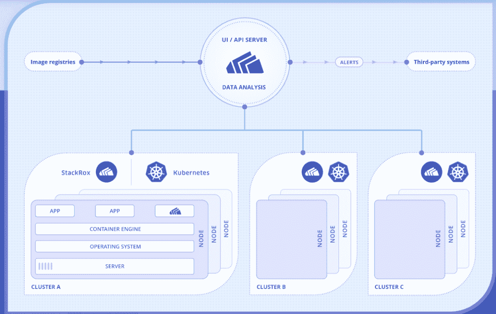
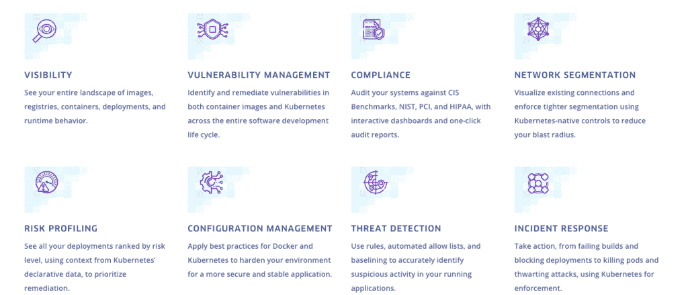
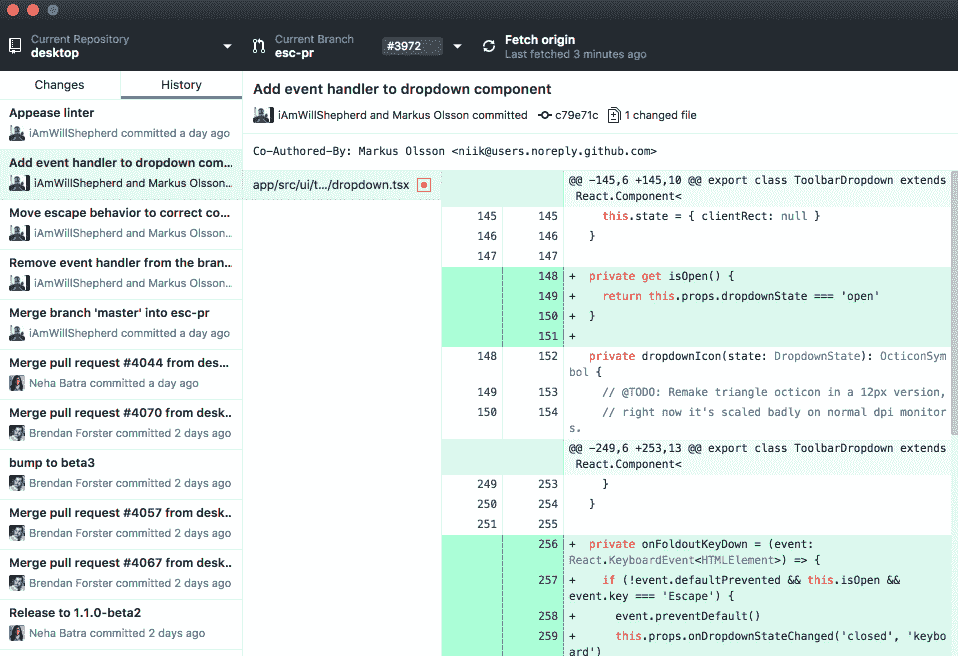

# 红帽收购 StackRox 对 OpenShift 意味着什么

> 原文：<https://thenewstack.io/what-red-hats-purchase-of-stackrox-means-for-openshift-security-and-observability/>

随着周四宣布对 Kubernetes 安全提供商 StackRox 的[计划收购](https://www.redhat.com/en/about/press-releases/red-hat-acquire-kubernetes-native-security-leader-stackrox?source=pressreleaselisting)，Red Hat 打算使用该公司的技术来支持 Red Hat 所谓的用于运行 Kubernetes 和容器化应用程序的 OpenShift 客户的多层安全方法。由于强调将安全性与容器和 Kubernetes 相集成，Red Hat 可以利用 StackRox 的安全插件如何从 CI/CD 流程的最开始以及应用程序部署后始终如一地覆盖应用程序。

通过这种方式， [StackRox](https://www.stackrox.com/) 为 [OpenShift](https://www.openshift.com/) 提供了额外的运行时保护和网络策略支持，同时改进了 OpenShift 的“更深入的数据收集，以实现更好的可观察性，这与 Red Hat 的战略方向非常吻合”，[密切参与此次收购的 OpenShift 内部负责安全的产品经理 Kirsten 新人](https://www.linkedin.com/in/kirsten-newcomer-36ab91/)告诉新 Stack。

StackRox 的自动生成网络策略管理功能是“我们一直在探索的东西”，最终，StackRox 将有助于改善易用性和红帽客户的整体安全体验，新人说。

对于 SecOps，StackRox 将在运行时端支持 OpenShift 客户的行为分析需求。“StackRox 提供的深度可观察性确实比我们以前做的更深入的数据收集，”新人说。“他们还可以帮助客户根据他们的应用程序分析自动创建网络策略，这对于任何 Kubernetes 用户来说都是一个复杂的问题。”

在 Kubernetes 上运行应用程序时，组织通常会面临额外的安全复杂性挑战，不用说，这本身就代表了巨大的复杂性。新人说，为了安全，组织必须确定网络策略，例如，添加微分段，然后添加服务网格层。“客户试图弄清楚这两套策略如何相互作用，以及他们的应用程序需要什么，”新人说。“因此，这种分析可以自动为网络策略提供建议，这无疑是 StackRox 提供的附加价值之一，另外还有行为分析和可观察性。”

StackRox 的堆栈也是为 Kubernetes 设计的，与现有的安全平台相反，现有的安全平台以前服务于单一应用程序，并且只扩展了这些功能来服务于 Kubernetes 环境。

新人说，许多传统的安全方法——尽管基本的安全原则和实践仍然适用——不适应云原生应用程序。“所以，我认为 StackRox 的特别之处在于，他们真正利用了 Kubernetes 的声明性本质，并利用这一点来实现声明性安全，”新人说。"所以，他们真的提供了一个非常 API 驱动和 Kubernetes 本地的方法."

## 左移/右移

虽然 StackRox 确实提供了“左移”安全性——据称许多安全公司也是如此——而 CI/CD 支持只是该平台提供的一部分，它涵盖了“跨所有这三个领域的安全功能”的构建、部署和运行。

“当我们想到‘左移’时，StackRox 已经完成了这项工作，我们已经看到市场上有其他参与者在做这项工作，他们最初左移并专注于漏洞分析——这是一部分，但还不够，”新人说。"你还必须做配置分析."

在为 Kubernetes 创建、部署和管理容器化应用时，安全平台必须考虑 Docker 文件、pod 配置数据和部署配置，作为基本基础的一部分，以实现有效的云原生安全性。“您必须根据最小特权原则来评估所有这些内容:是否存在不适当的过多特权请求，或者是否有嵌入在某些容器映像本身中的秘密被错误处理？”新人说。"因此，StackRox 超越了漏洞分析，进入了配置分析."

通过这种方式，StackRox 的平台旨在帮助组织将安全性应用于应用程序生命周期的整个范围，以实现这些目标。“StackRox 是完整解决方案的一部分，而不仅仅是有时被称为‘DevSecOps’的‘DevSec’部分，”新人说。这是因为 StackRox 可以在构建分析期间使用 CI/CD 管道分析期间收集的信息，并将其与 Kubernetes 准入控制器结合使用，根据发现的内容来声明“这是允许的还是不允许的”。“因此，您可以使用这些云原生工具，包括准入控制器等，来声明‘这是我的群集中需要的安全级别，根据所做的分析，您可以被允许部署或不被允许部署。’"

StackRox 的安保范围。

StackRox 由一个专有平台组成，该平台带有一个传感器和收集器，运行在 Kubernetes 上 Red Hat 计划最终开放源代码。它最近推出了开源的 Kubernetes 静态分析工具 KubeLinter，该工具检查 YAML 文件和 T2 掌舵图是否符合预设的最佳实践和政策，以检测 Kubernetes 部署中的异常情况。

使用中的 KubeLintern。

## 忠实于它的根源

自六年前 StackRox 创建以来，该公司围绕 Kubernetes 的安全管理构建了自己的平台，并将其集成到在容器中运行的微服务中。

“在微服务环境中，安全性需要以与它寻求保护的应用程序组件相同的方式运行。StackRox 的联合创始人兼首席战略官[在 2017 年的一篇](https://www.linkedin.com/in/weiliendang)[博客文章](https://www.stackrox.com/post/2017/07/introducing-stackrox-a-modern-security-platform-for-the-microservices-age/?utm_source=thenewstack&utm_medium=website&utm_campaign=platform)中写道，无论组件是瞬间扩展几个数量级，跨云(公共或私有)移动，还是依赖全自动的生命周期，安全都需要持续和一致的应用。“这需要将安全性构建到将应用粘合在一起的‘结缔组织’中，它必须是微服务结构本身的一部分。”

从那以后，StackRox 的总裁兼首席执行官 Kamal Shah 在本周的一篇博客文章中描述了 StackRox 是如何“以容器的运行时安全性为最初重点”而创建的。

“随着时间的推移，基于客户的反馈和围绕 DevSecOps 和 shift-left security 的行业趋势，我们扩大了产品覆盖范围，涵盖了容器生命周期的构建和部署阶段的用例。

“通过加入红帽，我们将能够加快产品创新，并在全球范围内实现比我们作为独立创业公司所能实现的更大的规模，”沙阿写道。“Red Hat 看到了我们的客户已经享受到的巨大 Kubernetes 安全优势，了解安全仍然是重中之重，并且知道我们可以一起进一步增加我们为客户提供的价值。”

新人无法详细说明 StackRox 将如何整合到红帽的 OpenShift 平台中，而交易条款和红帽同意为该公司支付的金额尚未披露。然而，StackRox 在宣布之前已经支持 open shift T1，将继续支持 T2 亚马逊网络服务(AWS)T3 亚马逊弹性 Kubernetes 服务(EKS)，微软 Azure Kubernetes 服务(AKS)，谷歌 Kubernetes 引擎(GKE)和其他 Kubernetes 平台，红帽说。

亚马逊网络服务和 Red Hat 是新堆栈的赞助商。

通过 Pixabay 的特征图像。

<svg xmlns:xlink="http://www.w3.org/1999/xlink" viewBox="0 0 68 31" version="1.1"><title>Group</title> <desc>Created with Sketch.</desc></svg>