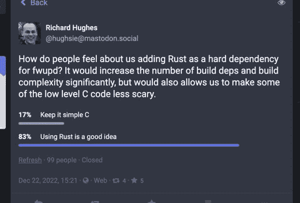

# Rust 给前端和 Web 开发带来了什么

> 原文：<https://thenewstack.io/what-rust-brings-to-frontend-and-web-development/>

2022 年很可能是[生锈的一年，](https://www.rust-lang.org/)将[引入 Linux 内核。但是在 2023 年，前端/网络开发者应该关注这种流行语言吗？](https://thenewstack.io/rust-in-the-linux-kernel/)

这取决于你需要做什么。Rust 更有可能取代 C/ [C++](https://thenewstack.io/c-23-standard-wont-have-a-key-parallelism-feature/) 而不是 [JavaScript，](https://thenewstack.io/the-case-for-rust-as-the-future-of-javascript-infrastructure/)但是如果你需要一个快速启动和运行的应用程序，Rust 可能就是你要的。弗雷斯特分析师兼研究主管[克里斯·加德纳](https://www.linkedin.com/in/chrismichaelgardner/)说，它还可以[与 WebAssembly](https://thenewstack.io/build-a-webassembly-app-with-rust/) 结合，在边缘提供快速、安全的应用。

## Rust 在 Frontend 中的作用是什么？

“Rust to WebAssembly 是最成熟的途径之一，因为社区之间有很多重叠，”Gardner 告诉 New Stack。"很多人同时对 Rust 和 WebAssembly 感兴趣."

他说，这不是一个“Rust 或 JavaScript”或“WebAssembly 或 JavaScript”的情况。可以将 [WebAssembly 与 JavaScript](https://thenewstack.io/kubecon-eu-why-webassembly-is-more-than-a-javascript-replacement/) 混合使用。

“你会看到一些人为 WebAssembly 重写代码，但你会看到一些人在适当的时候利用 WebAssembly，然后使用 JavaScript 连接不同的部分，并在必要时运行应用程序的一部分，”他说。

他补充道,[如何处理内存安全](https://stanford-cs242.github.io/f18/lectures/05-1-rust-memory-safety.html)使得 [Rust](https://thenewstack.io/bryan-cantrill-predicting-the-present/) 成为一种很好的学习语言。

“这是很容易陷入麻烦的事情之一，使用像 C 这样的语言来建立内存分配，然后最终，你必须处理所有可能出现的错误和运行时错误，”他说。“Rust 非常非常快，内存效率高。”

## “很多人喜欢它”

学习 Rust 的原因很简单:它是新的，人们喜欢它，Gardner 补充道

“人们喜欢使用这种语言，这是有据可查的，”他说。“这是人们喜欢利用它的情况之一。”

多伦多大学 CS 实验室的 Unix 系统管理员 Chris Siebenmann 对此有一个理论:当开发人员喜欢使用语言来完成对他们来说重要的事情时，语言就会传播开来。现在，这种语言已经过时了。

“Rust 是未来的潮流，因为很多人喜欢它，他们在 Rust 上写越来越多的东西，其中一些东西对很多人来说很重要，” [Siebenmann 在 2021 年](https://utcc.utoronto.ca/~cks/space/blog/programming/RustInOurFuture)写道。“当人们喜欢一种编程语言时，就会用这种语言写东西，其中一些会被广泛使用或流行(或两者都有)…我们在某些领域看到了 Go，我们在 Rust 也看到了这种情况。”

他写道，在许多你可能想不到的地方已经发现了铁锈。

“你的 Python 密码术中有锈迹。卷曲里有锈…你的书卷里有锈。你的火狐浏览器生锈了。用 Rust 编写的命令行工具越来越多，包括优秀的 ripgrep。有一天，Linux 内核可能会出现[锈。所有这些只会随着时间的推移而增长，尤其是在开源世界。”](https://thenewstack.io/rust-in-the-linux-kernel/)

有趣的是，在[12 月，他修正说生锈是“不可避免的”](https://utcc.utoronto.ca/~cks/space/blog/programming/RustIsInevitable)因为它的安全特性。

乳齿象锈病。

自 2015 年以来，Rust 多次在 [Stack Overflow 的开发者调查](https://insights.stackoverflow.com/survey/2020)中被开发者选为最受欢迎的编程语言，并且在去年的调查中保持不变。也许不是巧合，Rust 在 2020 年的十大编程语言中收入最高。

## 铁锈会让虫子‘不可能’吗？

Rust 是在 2010 年由 Mozilla Research 开发的，作为 C++更可靠、更安全的替代品。开源语言现在由 Rust 基金会维护。Rust 是一种[“静态多通道、内存高效的编程语言”](https://thenewstack.io/rust-by-the-numbers-the-rust-programming-language-in-2021/)，据经常为新堆栈做出贡献的 [Pavan Belagatti](https://thenewstack.io/author/pavan-belagatti/) 和 Harness.io 的开发者倡导者称，它是为速度、安全和性能而构建的。你会在游戏引擎、文件系统、网站和工具、操作系统、浏览器组件等中找到它，他写道。

Rust 被一些大牌公司使用，比如 DropBox、Coursera、微软和 Firefox。对于微软来说，[的采用是关于 Rust 相对于 C++的安全性。](https://thenewstack.io/microsoft-rust-is-the-industrys-best-chance-at-safe-systems-programming/)

Belagatti 在 TNS 的文章中说:“像微软[和](https://thenewstack.io/microsoft-aims-to-bring-devops-discipline-to-web3/)这样的公司正在使用 Rust 来保证他们产品的安全。”。“微软鼓励他们的开发人员在 Rust 中重写一些组件，因为他们发现大多数安全补丁都是对内存相关错误的修复，Rust 本来可以在开发阶段发现这些错误。微软认为，Rust 有助于消除软件缺陷，尤其是那些导致安全漏洞的缺陷。

[可以通过 Rust Foundation 安装 Rust](https://www.rust-lang.org/tools/install)；它会自动检测您的操作系统。

<svg xmlns:xlink="http://www.w3.org/1999/xlink" viewBox="0 0 68 31" version="1.1"><title>Group</title> <desc>Created with Sketch.</desc></svg>