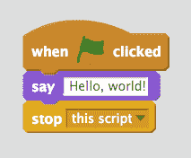
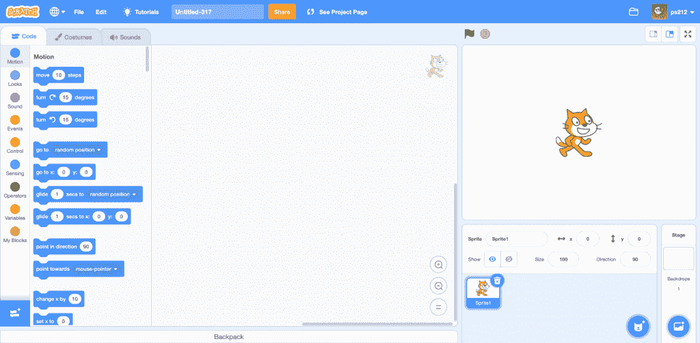

# 学生的第一门编程语言应该是什么？

> 原文：<https://thenewstack.io/what-should-be-a-students-first-programming-language/>

这是一个困扰教育工作者几十年的问题。当学生刚开始学习计算机科学时，他们应该从哪种编程语言开始？

密歇根大学的计算机科学教授马克·古兹戴尔(Mark Guzdial)对此进行了深入思考，他也在计算机科学教育领域进行了自己的研究。两位不同的同事最近提出，先教计算机系学生哪种语言并不重要*，这引起了他的思考。*

 *“我有一个假设，当这个领域还年轻的时候，这个信念曾经是正确的，”Guzdial 在[最近出版的一篇文章](https://cacm.acm.org/blogs/blog-cacm/253393-why-did-we-ever-think-the-first-programming-language-didnt-matter/fulltext)中写道。但那是在 20 世纪 60 年代末，当课程刚建立时——而今天，所有年龄和经验水平的学生都在学习如何编程，他们最终有不同的需求。

对于这个问题，不同的大学仍然有不同的答案，这反映了他们的教学理念，以及他们对在更广泛的科技行业中哪种语言对他们的毕业生最重要的看法。但有趣的是，注意到这些年来发生的变化，计算机科学系逐渐发展了他们对学生至关重要的第一编程语言的选择。

也许这一切让我们第一次看到了下一代程序员——以及我们如何展望未来的一些线索。

## 斯坦福对哈佛

2017 年，斯坦福大学因其计算机科学专业的入门计算课程的一些变化而成为头条新闻。据斯坦福学生报纸[报道，斯坦福大学计算机科学荣誉退休教授埃里克·罗伯茨花了五年时间将这门课程从 Java 过渡到 JavaScript，他最终创建了这门课程的新的基于 JavaScript 的试点版本。(所以这门课被命名为“CS106J”，而不是 CS106A。)这种改变包括创建新的教科书和作业，以及培训新的教学助理，罗伯茨本人退休后也来教这个班。](http://www.stanforddaily.com/2017/02/28/cs-department-updates-introductory-courses/)

以前，斯坦福大学的入门课是基于 C 编程语言的(在此之前是 Pascal)。Roberts 称赞 JavaScript 是“互联网的语言”，早在 2002 年，他就帮助将课堂转向 Java，编写教科书，并与其他教师合作重组课程和作业。但 15 年后，他告诉学生报，“现在是 2017 年，Java 正在展示它的年龄。”

然而，如果你看看他们今天的教学大纲，你会发现 [CS106A](https://web.stanford.edu/class/archive/cs/cs106a/cs106a.1202/handouts/syllabus-cs106a.html) 现在似乎在使用 Python(和 PyCharm IDE)，而 [CS106B 的教学大纲](https://web.stanford.edu/class/cs106b/syllabus)表明他们在使用 C++。

与此同时，哈佛大学自己的入门课程 CS50 多年来一直坚持多语言教学。在第一周，学生们实际上用 Scratch 编写了一个程序，这是一种基于块的可视化编程语言，由麻省理工学院媒体实验室开发，用于教授 younger learned，然后切换到 C——然后在几周内再次切换到 Python，然后是 JavaScript。“CS50 不是只教一种语言，而是向学生介绍一系列‘过程化’编程语言，每一种语言都在概念上建立在另一种之上，”[该课程的官方常见问题解答解释道。](https://cs50.harvard.edu/college/2020/spring/faqs/)

解释者继续说道，“最终的目标是让学生感觉他们不是‘学会了如何用 X 编程’，而是‘学会了如何编程’"

但是为什么要以 C 开头呢？这门课的指导老师，David J. Malan 教授曾经在 Quora 上写道“ [C 是你在学习汇编语言之前所能接触到的最接近计算机硬件的东西，(我认为，对于 CS50 这样的入门课程来说，这太晦涩难懂了)。在 C 语言中，没有魔法。如果你想把某样东西放在内存的某个地方，你必须自己把它放在那里。想要哈希表，就得自己实现。”](https://www.quora.com/Why-does-CS50-at-Harvard-use-C-as-its-primary-language)

根据他在 Quora 上的评论，Malan 认为，学习 C 语言的这几周给了学生一个机会去理解所有编程语言的一些基本构件(同时也提供了一个机会去解释缓冲区溢出这一至关重要的安全概念)。

他写道:“我认为，用 C 语言在一周内实现一个哈希表(或 trie ),然后在一周左右的时间内用一行 PHP 或 JavaScript 代码实现同样的东西，这也是一件非常强大的事情。”。此外，C 也是一种相对较小的语言，所以“到了学期中期，学生们几乎已经看到了所有的内容(除了，例如，联合和函数指针)。”

坏处呢？Malan 承认，与使用 Python 或 Java 这样的高级语言相比，在早期创建引人入胜的问题集可能更难。更难，也许，“但不是不可能！”

然而据 ACM 通讯上的一篇文章报道，到 2014 年，Python 已经是美国顶级计算机科学项目(包括麻省理工学院和加州大学伯克利分校)介绍课程中最受欢迎的语言。“[Philip Guo](https://pg.ucsd.edu/)在该出版物中写道:“具体来说，排名前 10 的计算机科学系中有 8 个(80%)和排名前 39 的 27 个(69%)在 CS0 或 CS1 入门课程中教授 Python。Java 当时还紧随 Python 之后(接着是 MATLAB，C，C++，然后是 Scheme 和 Scratch。)

2016 年，三名英国研究人员进行了他们自己的调查[，发现在英国的大学中，使用 Java 的班级是 Python 的两倍多——“尽管同样的受访者认为 Python 更容易教也更容易学，”研究人员写道。(研究人员引用的一个可能的解释是“由社区指数衡量的长期行业受欢迎程度。”)](https://arxiv.org/ftp/arxiv/papers/1609/1609.06622.pdf)

这是一个经常出现的话题。来自温斯顿-塞勒姆州立大学(University of Winston-Salem State University)的三名研究人员为 ACM 的计算机科学教育小组撰写的一篇 2019 年[论文](https://dl.acm.org/doi/10.1145/3287324.3287494)甚至认为，每个计算机科学学生都应该具备大数据和云计算方面的“基础知识”，“并拥有一些在云中部署和管理大数据应用程序的实践经验。”

该论文提出，与其将云计算课程分开，不如将该材料整合到多个本科计算机科学课程中。它描述了研究人员自己在创建“模块”以将云和大数据主题添加到现有课程中的成功经验。

## 不仅仅是数学

根据英国研究人员的说法，向初级程序员传授什么仍然是一个重要的问题。他们的论文认为，“未能迅速掌握编程几乎肯定意味着计算机科学的进步失败”，并指出“自从计算机科学教学在大学开始以来，首先教授哪种语言的问题就一直在激烈辩论。”

密歇根大学教授 Guzdial 仍然认为我们让学生开始学习哪种语言很重要，但他也希望教育工作者重新审视一个形成性假设。

在他的 ACM 文章中，他回顾了 1979 年的一项研究，该研究认为，一旦学生学会了更广泛的语义概念，他们就可以将它们应用到任何后续的语言中(只需要掌握相对容易的句法差异)。但是 Guzdial 指出，在那个时代，大多数计算机科学专业的学生都是传统的大学生——他们可能比文科专业或今天的 K-12 学生拥有更多的数学知识。因此，回到 20 世纪 70 年代末，教育工作者可能高估了转换编程语言的容易程度，因为他们最终只是在教授基于对数学的已知理解的编程，正如 Guzdial 所说，“新的语法只是数学的新形式主义。”

这位教授补充道，“如果我们不期望学生先了解数学，我们也许可以教更多的人编程，这在 40 多年前我们可能是可以期望的。”

<svg xmlns:xlink="http://www.w3.org/1999/xlink" viewBox="0 0 68 31" version="1.1"><title>Group</title> <desc>Created with Sketch.</desc></svg>*