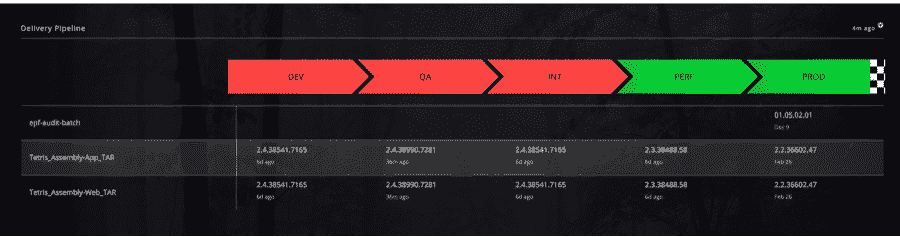
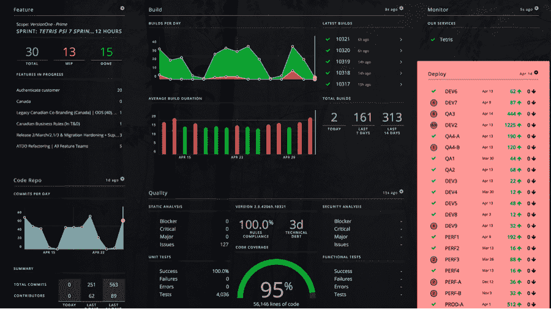

# 观察:Hygieia，Capital One 进入 Neflix 和 Etsy 的开源之地

> 原文：<https://thenewstack.io/what-stands-out-about-hygieia-capitol-ones-entry-into-the-neflix-and-etsy-land-of-open-source/>

Capital One 刚刚让您的 DevOps 环境蒙羞了吗？当 DevOps 经常被定义为技术领域的小公司时，我嘲笑他们。但与此同时，通常很难找到 DevOps 框架在传统非技术业务中被大量使用的案例研究。在受监管的行业中更难找到这样的例子。但实际上，金融服务已经遍布 DevOps 运动。从 Acorns mobile-first DevOps 环境，到富国银行的共享服务模式，再到现在 Capital One 的 Hygieia。

在 O'Reilly 开源大会(OSCON)上，Capital One 展示了代表整个软件交付管道的统一仪表板 [Hygieia](https://thenewstack.io/capital-one-out-to-display-its-geekdom-with-open-source-devops-dashboard/) 。更不用说这是大型非技术公司为 OSS 做出巨大贡献的另一个例子，仪表板显示了大型企业对 DevOps 的能力和准备程度。

Hygieia 还解决了组织在采用 DevOps 框架时将要面临的一个巨大挑战:你成为了当前版本的奴隶。您维持和扩展交付链的能力是有限的。监管不力可能会成为一个问题，只有到那时才有人声称“DevOps 不起作用”。

有几件事对我来说很突出:

## 敏捷

他们谈论的很多东西都是标准的敏捷原则，但是是在 DevOps 思维模式的背景下。这没有错。事实上，这代表着解决大型企业面临的一个重大挑战。他们想要现代化，但他们现有的环境却不是。他们没有试图一下子改变一切，而是尽可能地解决问题，即增加管道的可见性、沟通和进步。但是在这样做的时候，他们承认了改进的动力，并且开始更容易地引入诸如持续交付之类的元素。在任何既定的环境中，[小步前进](http://devops.com/2014/11/11/waterfall-agile-devops-state-stagnant-evolution/)都是必要的，采取已经奏效的措施并加以改进是一个很好的方式。

## 综合

他们在与 JIRA 和 Git 等工具的集成上下了很大功夫。作为完成的集成，他们目前列出:VersionOne，JIRA，Subversion，GitHub，Hudson/Jenkins，Sonar，HP Fortify，Cucumber/Selenium 和 IBM UrbanCode Deploy。这基本上可以被视为资本一栈。Sonar 和 Selenium 是强调质量的好例子，而许多公司都忽略了这一点。我希望更多的代码和组件管理，以及测试，成为 Capital One 添加到 Hygieia 平台的一些集成。

## 应用焦点

仪表板似乎是按应用程序划分的。这使得它在大型组织中更具可伸缩性，但也允许每个应用程序的团队自治，并给出关于应用程序行为的粒度细节。我的问题:跨团队的共享有多少？筒仓是大型组织中不可避免的弊端。在受监管的行业中，防火墙是为某些通信而构建的。新的和更好的东西是不会被分享的，除非是故意的。这通常是通过一个共享服务组织来完成的，就像 Wells Fargo 所做的那样，除了 Hygieia 之外，该组织还将所有流程和工具作为服务库提供给所有应用程序团队。

## 也许不是 DevOps？

有些人可能认为这不是一个新的可视化，肯定不是 DevOps，因为缺乏对持续集成和持续交付语言的强调。然而，卫生更多的是过程。目标是减少客户反馈和更新功能之间的时间，这是 Tapabrata Pal 博士在 Capital One 的发布文章中提出的观点。因为 DevOps 的核心实际上是更频繁、更快速、更高质量的发布，他们已经尽了最大努力在他们的组织中实现这一点。DevOps 是一段旅程。有了卫生学，他们现在有了另一种旅行方式。

卫生学是了解 DevOps 的一个窗口。这不仅有助于团队操作他们的环境，还可以更容易地向那些日常不参与的同事展示正在发生的事情。

Capital One 会加入网飞和 Etsy 的 DevOps 基座吗？有多少其他被贴上“行动缓慢”标签的企业正在秘密地开发出色的工具来完成工作？通过发现真正的问题，并解决它们，Capital One 证明了任何编写代码的人都可以接受 DevOps 心态。他们接受了额外的学分分配，并将其开源。他们致力于保持下去。令人印象深刻。Capital One 展示了更好的产品管理和发布，对我来说，比我所看到的大多数软件供应商的类似努力都要出色。

IBM 是新堆栈的赞助商。

专题图片:tarbakhopper 的《河马之恋——两幅画的故事:绘画，斯科特·理查德，旧金山(2010)》在 [CC BY-ND 2.0](https://creativecommons.org/licenses/by-nd/2.0/) 下获得许可。

<svg xmlns:xlink="http://www.w3.org/1999/xlink" viewBox="0 0 68 31" version="1.1"><title>Group</title> <desc>Created with Sketch.</desc></svg>