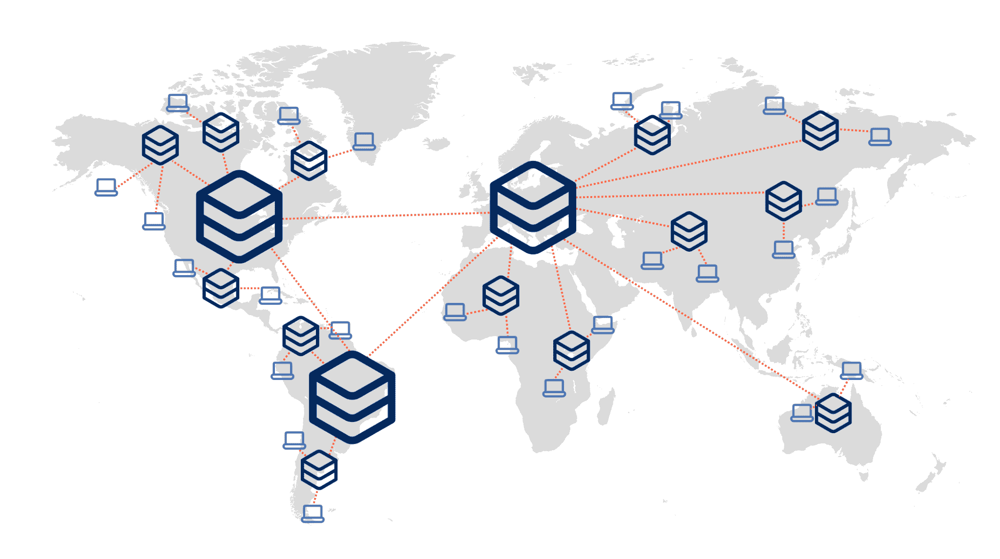
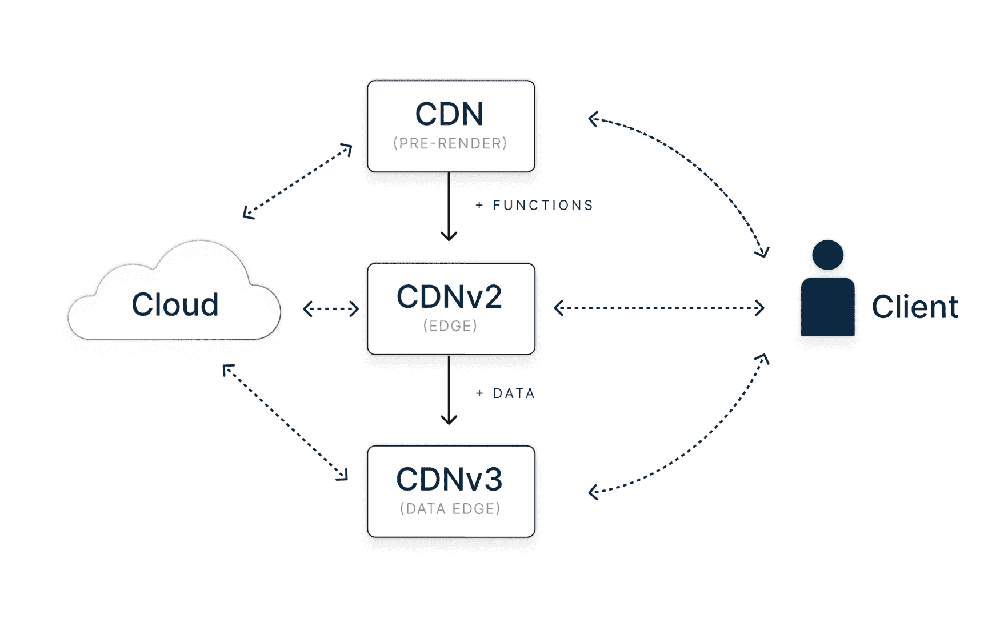
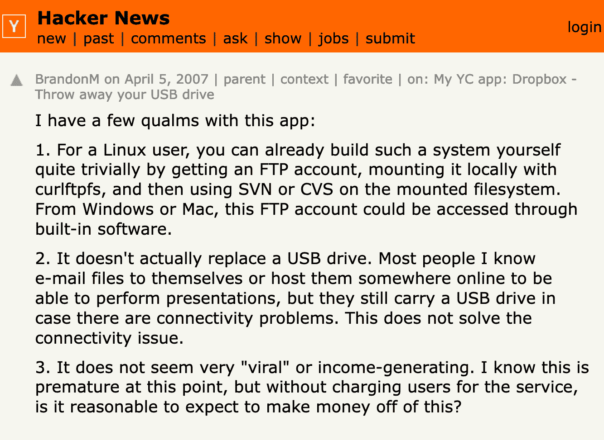

# 边缘到底是什么——你为什么要在乎？

> 原文：<https://thenewstack.io/what-the-heck-is-the-edge-and-why-should-you-care/>

让我们面对现实吧:我们的行业对流行语情有独钟。当人们试图区分自己并建立自己的相关性时，他们经常试图通过发明和捕捉可能有意义或可能没有意义的术语来做到这一点。

我还记得人们试图推动网格计算和 T2 雾计算的时候。

因此，如果你认为“ [the Edge](https://thenewstack.io/what-is-edge-computing/) ”不过是另一个这样的流行词，那也情有可原。尤其是因为这个术语的混乱由于以下事实而变得更糟:

*   两个不同的行业领域对“边缘”意味着两种完全不同的东西。
*   人们经常将它与无服务器混为一谈——这有其自身的误解。

在这篇文章中，我将解释什么是优势，为什么你应该关心。

## 定义

维基百科将[边缘计算](https://en.wikipedia.org/wiki/Edge_computing)定义为“一种分布式计算范式，使计算和数据存储更接近数据源。这有望缩短响应时间并节省带宽。”

我们发现了这个定义中第一个混乱的原因:更接近什么？如果它让计算和数据存储更接近数据源，那就是比较。如果我在 us-east-1 中有一个数据库，并将其复制到 us-west-1，这就是“优势”吗

### “远边”或“离线边”

当我们开始谈论 edge 的产品时，我的一位老同事立即给我发了一条消息，质疑我们所做的并不是真正的 edge。这个人已经与“边缘”合作多年，当与他交谈时，困惑立即变得清晰。

从事[物联网](https://thenewstack.io/managing-time-series-data-in-industrial-iot/) (IoT)、移动设备、销售点或电信的开发人员将“边缘”视为尽可能靠近设备本身的东西，可能在设备内部*。当他们谈论“将计算推到边缘”时，他们可能是在谈论发生在设备内部的计算。*

这些部署的一个直接特点是互联网连接速度慢、时断时续或几乎不存在(想想飞机、工业控制器等)。与云相比，计算和存储资源不仅减少了，而且严重减少了。

由于这些特征，这可以被称为“远边缘”我个人更喜欢的一个术语是“离线边缘”这是[离线优先](https://offlinefirst.org/)解决方案大放异彩的领域。

### “近边缘”或“在线边缘”(网络)

我永远无法让我的朋友相信还有“另一个边缘”直到今天，他可能只是认为我不知道我在说什么。公平地说，据我所知，物联网的人先到那里。所以，如果他们想宣称他们的是真正的优势，我也无能为力。

但事实是，这个行业中有一个日益壮大的细分市场使用术语“边缘”来表示完全不同的意思。这些是网络开发者，他们将自己的应用程序部署到像 [Cloudflare](https://thenewstack.io/cloudflare-raises-1-25-billion-for-startups-using-its-workers-platform/) 、 [Vercel](https://thenewstack.io/vercel-offers-new-figma-like-comments-for-web-developers/) 或 [Netlify](https://thenewstack.io/jamstack-style-build-a-website-with-netlify-and-publii/) 这样的平台上。

虽然“云”可能为您提供“欧洲”的一个地区，但“边缘”将为您提供遍布欧洲的多个城市。那些边缘位置不如云数据中心强大和有能力，但它们仍然是数据中心。从技术上讲，它们可以像任何其他云数据中心一样强大，但这并不经济。

web edge:降低对应用程序的响应时间，但主要还是在线。

## 缺失的部分:数据边缘

对于物联网边缘，每个终端设备都会自带本地存储。但是对于 web edge 来说，事情就不一样了。将数据带到边缘会带来自身的挑战。

计算和存储都出现在边缘计算的定义中，但它们在本质上非常不同。计算机很灵活，可以很容易地移动到任何地方。数据量很大，移动数据需要成本。计算不受法规限制，可以在任何地方进行。数据是受保护的，必须根据不同的管辖区域进行不同的处理。

出于这个原因，瞄准边缘的公司迄今为止将大部分努力集中在计算上，如边缘功能。但是，将计算带到边缘只能解决一半的问题，特别是如果您要调用位于远处集群中某个地方的集中式数据库。与将所有计算托管在传统的集中式云托管位置相比，您最终会面临同样多甚至可能更多的延迟。

开发人员将数据移动到边缘的一种方式是将数据缓存在最终用户的设备上。这对于离线使用很有效，但是缓存和同步是很难做好的事情，并且它不能解决许多需要快速访问的情况。

这些数据边缘问题正是我的公司[chicken strike](https://chiselstrike.com/about-us)旨在通过 [Turso](https://chiselstrike.com/) 解决的问题，它将 SQLite 兼容的嵌入式数据库的力量带到了边缘。Turso 构建于 libSQL 之上，libSQL 是 SQLite 的一个开放贡献分支。

## Edge 和无服务器一样吗？

当像 Vercel、Netlify 和 Cloudflare 这样的公司谈论边缘时，他们通常指的是“边缘功能”。这导致开发人员将“边缘”和“无服务器”混为一谈，好像它们是相似或相同的。使用无服务器，尽管某个地方有服务器，但开发人员不会考虑需要配置、扩大或缩小的服务器。他们从被执行的功能的角度来考虑问题——他们只是部署代码，并期望云提供商来处理剩下的部分。

这种模式非常适合边缘计算:因为我们假设可用的资源越来越少，允许潜在浪费的通用计算就越来越没有吸引力。限制开发人员可以做的事情(通过功能和大规模多租户)可以实现更好的利用率和资源打包。

另一个原因是历史性的:这些平台最初是简单的内容交付网络(cdn)，处理静态资产。随着时间的推移，这些 cdn 的功能开始增加，并成为可编程 cdn。

cdn 正在获得功能，有效地进化到边缘。数据边缘是下一个前沿。

但像 Fly.io 这样的公司也是边缘公司，它们的运营模式不同。您可以将容器抽象与您选择的长期应用程序一起部署，因为它们使该应用程序在许多地区可用，所以它们也是一个边缘玩家。

## 边缘“只是 X”吗？

每当一个新术语出现时，人们就会在某些东西是否真正“新颖”的问题上走得太远。当云诞生时，许多人看不到它的价值，因为它“只是租用服务器”事实并非如此:在几秒钟内而不是几周内租出这些服务器并归还的能力同样轻易地改变了企业的运营方式。

我将永远记得我的一个同事，他认为 Slack 没有任何价值，因为“它只是 IRC”，直到今天我最喜欢的仍然是这个关于 Dropbox 的永恒的 Hackernews [评论](https://news.ycombinator.com/item?id=9224):

那么，网络边缘真的有什么变革性的东西吗？是啊！

在线边缘出现之前，你可以构建跨越多个位置的应用，就像你在云出现之前构建弹性应用一样:精确到令人痛苦的地理配置、路由、位置和执行。

edge 现在允许你做的是编码，就好像这些都不重要一样——就好像这个世界是一个整体一样——并且设置允许在哪里发生什么的政策。edge 允许透明地构建真正的全球应用程序，而无需投入时间和金钱来明确地建立和管理全球存在。

### 相关性的第二个标准

edge 符合第一个标准，即某样东西是“只是 X”还是一个新概念:它确实改变了开发人员设计应用程序的方式。第二个标准是它是否解决了一个独特的业务问题。

读者，这是给你的一个问题:你是否需要构建服务于多个地点且响应时间短的应用程序？我们建立 Turso 的坚定信念是，对你们中的许多人来说，答案是明确的“是”如果是这样，我们很乐意邀请你在 [Twitter](https://twitter.com/glcst) 和我们 [Discord 社区](https://discord.gg/Q4GcDkb7ZA)的其他 edge 爱好者上与我联系。

<svg xmlns:xlink="http://www.w3.org/1999/xlink" viewBox="0 0 68 31" version="1.1"><title>Group</title> <desc>Created with Sketch.</desc></svg>