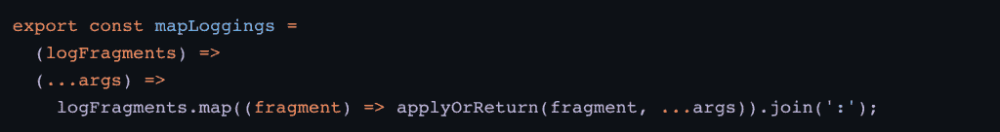
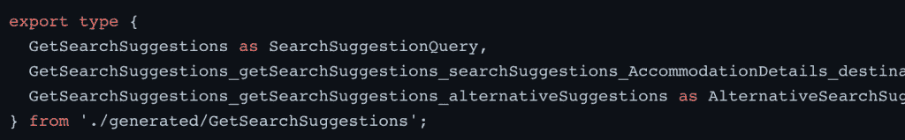
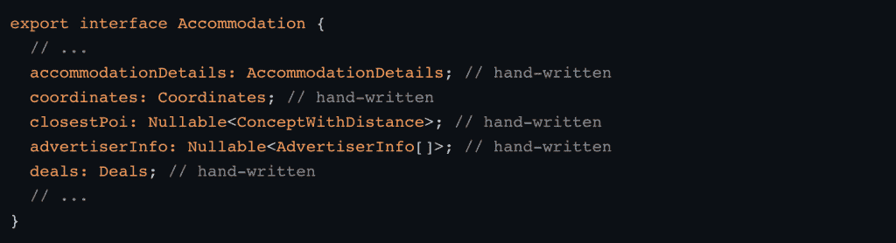

# Trivago 从采用打字稿中学到了什么

> 原文：<https://thenewstack.io/what-trivago-learned-adopting-typescript/>

最近，酒店搜索公司 Trivago T1 将它的核心网站和其他 50 多个 Trivago 域名 T2 从 PHP/ JavaScript 迁移到了 TypeScript T3。这个中型到大型项目的最终版本包括 200，000 行代码，分布在 2，600 行代码中。ts 文件和 115，000 行代码分布在 1，500 个。tsx 文件。

[Tom Bartel](https://www.linkedin.com/in/twbartel/) ，Trivago 团队的平台接口负责人，在最近的一篇博客文章中解释说，团队中的大多数开发人员都没有太多使用 [TypeScript](https://thenewstack.io/what-is-typescript/) 的经验。但是，对于移植来说，每一个可以想象的细节都得到了充分的考虑，所以对编程语言进行评估也是有意义的。

他写道:从 JavaScript 到 TypeScript 有一个学习曲线，这确实会降低代码编写的平均速度。从长远来看，花在考虑应用程序中的数据流上的一些时间是值得的。巴特尔解释说，它“让你的思维变得敏锐，增加你的纪律性。”正确定义类型几乎是成功的一半。

## **一见钟情**

在开始用 TypeScript 编码之前，工程师们，甚至是那些经验有限的人，都抱着开放的心态，接受了一些教育。尽管如此，开发人员最初发现很容易感到沮丧。下面的代码展示了在迁移之前经常使用的 JavaScript 代码的高功能风格(包括大量的 map、reduce 和 currying)。您可以看到，当没有明确定义数据形状时，将参数从一个函数传递到另一个函数会更加容易。

这种类型的代码在 TypeScript 中带来了许多额外的挑战，因为类型定义需要正确。这里的选择是要么花大力气把类型弄对(这可能意味着大量使用泛型)，要么把编码风格改成功能性较弱的风格。

> 即使没有 100%理解代码的每一个细节，只要类型是正确的，  代码就有可能正常工作。

Bartel 解释说，一旦适应过程完成，Trivago 的工程师发现“TypeScript 给你的代码带来了很大的信心”。虽然这在编写新代码时是一个优势，但在处理已经存在的代码时还有额外的价值。巴特尔补充了一个提示，即使代码的每个细节都没有被 100%理解，只要类型是正确的，  代码很可能会正常工作。

现在重写已经接近尾声，Bartel 分享说，对于团队中的任何人来说，在非类型脚本代码库中工作都感觉很奇怪。他问了一个问题，“你怎么能在不知道这个变量是什么的情况下推理出代码，或者这个参数是否可以是 null ？”

## **依赖你的(GraphQL)模式类型**

Trivago 通过利用他们已经在遗留代码中使用的 [GraphQL 模式](https://thenewstack.io/decoupling-frontends-and-backends-with-graphql/)自动生成 TypeScript 类型定义。命令`apollo client:codegen`联系了 GraphQL 服务器并更新了客户端类型:

GraphQL types 是 Trivago 编写自动生成代码的包；他们将其与手写代码隔离开来，作为一种预防措施，以保持文件无冲突。

Bartle 承认，下面的代码说明了自动生成的文件和界面名称“不漂亮”。

Trivago 以不同的名称导出它们，如下例所示。

下面的例子是两个最佳实践之一。这对 Trivago 来说效果很好。两个最佳实践中的第二个是将应用程序类型系统连接到自动生成的模式类型。

## **洞察力:尽可能偏好“连接”类型**

这里我们讨论类型转换的优点、缺点和细节。对于 Trivago 来说，数据建模和在 TypeScript 中创建类型是意料之中的，并且作为一个一般概念，这是不成问题的。Bartel 讨论的挑战和解决方案是引入手写类型的核心实体，它们也是模式的一部分。Trivago 应用程序中的一些核心实体是住宿、价格等。

下面的代码显示了类型转换的错误方式，因为它们只是将一个类型转换为另一个类型:

键入 cast 的正确方法如下:

通过将其类型转换为对象，其 deals 字段也被类型转换，即使来自服务器的 deals 字段具有稍微不同的类型。巴特尔说，这“基本上行得通”，因为手写的类型与自动生成的类型“非常相似”，但最终，这可能是“灾难的处方，因为你欺骗了自己，阻止了 TypeScript 为你发现错误”。

类型转换过程中遗漏的两个常见问题是:

*   **缺失字段:**当手写类型为模式中不存在的字段时，会出现这种情况。开发人员会尝试在服务器不提供字段的情况下创建一个字段。
*   **Null/ non-null:** 当服务器传递一个 Null 值，但是手写类型说设置了一个字段时，就会发生这种情况。

这两个问题是相似的，因为 TypeScript 说有一个字段，但实际上，它是未定义的或空的，这导致了 Bartel 所描述的错误，“令人讨厌的和非常意外的运行时错误。”手动测试是发现它的唯一方法，这真的只能靠运气，因为专门测试具有挑战性，而自动测试很可能不会发现它，因为这些测试还必须通过类似的类型转换来规避类型安全，Bartel 解释说这是不太可能的。不幸的是，这种错误是在生产中遇到的。

## **结论**

Bartel 为新项目和库推荐了 TypeScript。由于能够逐渐迁移，他还推荐现有项目使用它。他认为，“好处很快就会超过最初的适应问题。”

<svg xmlns:xlink="http://www.w3.org/1999/xlink" viewBox="0 0 68 31" version="1.1"><title>Group</title> <desc>Created with Sketch.</desc></svg>