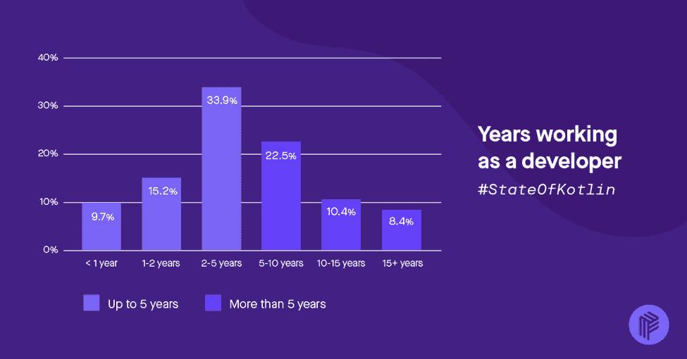
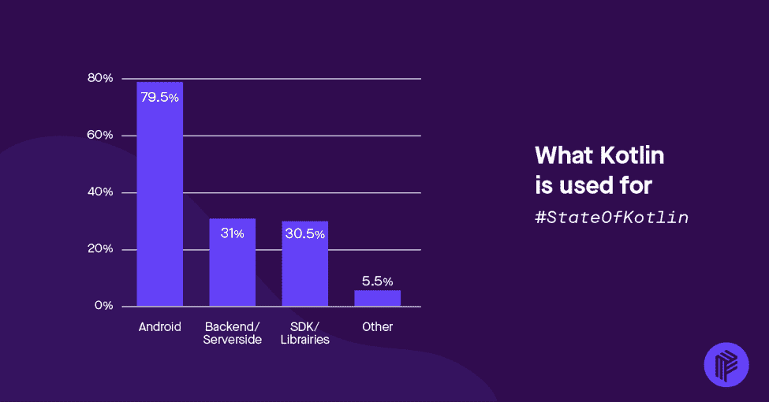
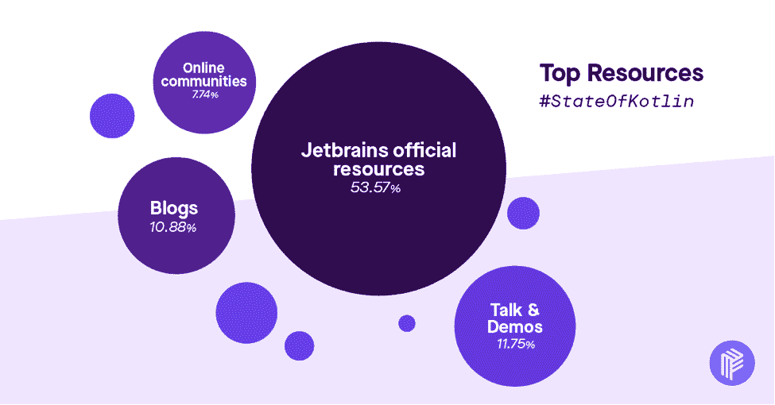
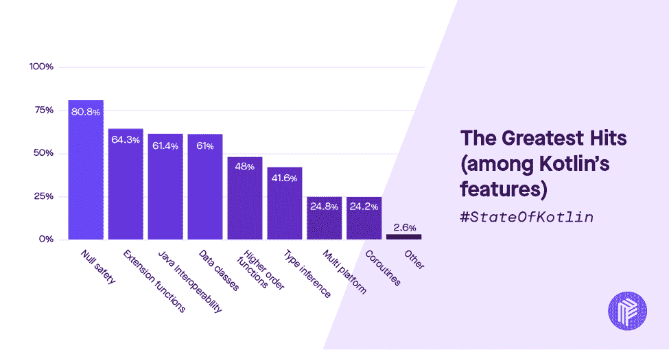

# 关于科特林今年的成长，我们了解到了什么

> 原文：<https://thenewstack.io/what-we-learned-about-kotlins-growth-this-year/>

从一年前谷歌在安卓系统中推出对 Kotlin 编程语言的支持，到超过 10 万名受访者在 T2 stack overflow 调查中将其选为第二受欢迎的语言，JetBrains 的宝宝正在茁壮成长。

我们想进一步调查这种增长，所以在今年年初，我们在 Kotlin 生态系统上进行了一项调查，询问开发人员对这种语言的想法、意见和体验。

虽然我们最初的目标是收集 1，000 个响应，但我们收到了来自世界各地的 2，500 多名开发人员的反馈，这让我们感到非常震惊。我们在[科特林州 2018](https://pusher.com/state-of-kotlin) 报告中汇编了他们的回答。

## 为什么是科特林？

我们在 [Pusher](http://www.pusher.com) 大量使用 kot Lin——用于 2017 年以来创建的每一个 Android SDK 以及我们的新产品 [Beams](https://pusher.com/beams) 、 [Chatkit](https://pusher.com/chatkit) 和 [Feeds。](https://pusher.com/feeds)我们注意到，近年来，在使用我们的核心产品 [Channels](https://pusher.com/channels) 创建新应用的人群中，Kotlin 的使用率显著上升，因此我们决定在我们的新 SDK 中使用 Kotlin。我们还想知道是什么让开发者如此喜爱 Kotlin。

## 开发商是谁？科特林

为了理解这些见解，最好先看看我们的受访者的人口统计数据，这样我们就知道他们的背景了:

 [赞·马尔康

Zan 是 Pusher 的开发人员传道者，拥有超过 8 年的软件开发经验。他致力于向全世界的开发者传授实时技术和优秀 API 设计的奇妙之处。在 DevRel 之前，他曾从事移动开发，尤其是 Android。在 Pusher 之前，他是马克斯&斯潘塞公司的移动业务主管，在此之前，他联合创立了一家初创公司 Equaleyes，为盲人和视障人士开发智能手机。](http://www.pusher.com) 

72%的受访者有工作——为别人而不是自己工作；11%是个体经营者或自由职业者，15%是学生。

当谈到经验时，这些数字告诉了一些其他调查类似的故事，例如最近发布的 StackOverflow 调查:超过 50%的受访者从事开发工作不到五年，三分之一的人工作了 2 到 5 年，22%的人有 5 到 10 年的经验。几乎 10%的人只有不到一年的经验。

就这些人的工作地点而言，我们认为技术是明显的主导部门——77%的受访者在技术行业工作，其次是金融(12%)、教育(11%)和数字机构(9%)。

三分之一的受访者在有两到五个人在科特林编程的公司工作。这大致相当于一个中等规模的团队(Android 会非常普遍)。

## 主要结果和见解

既然我们已经了解了我们的受访者是谁，我们可以深入调查更有趣的部分，即见解:

1.  **谷歌推动 Kotlin 的采用**

Kotlin 第一次出现在我的“个人雷达”上是在 2013 年或 2014 年的某个时候，当时我读到 JetBrains 正在创建一种新的编程语言。很自然地，我认为这是一个 Java 无处可去的东西，并继续前进……直到 2015 年，随着杰克·沃顿(Jake Wharton)的[白皮书](https://docs.google.com/document/d/1ReS3ep-hjxWA8kZi0YqDbEhCqTt29hG8P44aA9W0DM8/edit)倡导 Kotlin 在 Square 的采用，这种用法似乎开始激增。

不出所料，我们的图表也显示了这一点——在谷歌宣布第一方 Kotlin 支持 Android 后，2017 年的采用量出现了爆炸式增长。

这对于学生和更多初级开发人员来说尤其显著，因为他们在那之前没有关注过 Kotlin。

2.  **科特林是安卓开发者中的超级明星。**

大约 80%的被调查开发者说他们使用 Android 应用程序，83%的人说他们使用 Java 程序。然而，它在不同类型的开发人员中并不流行。随着纯 Kotlin 工具的成熟，它可能会改变，我们可以利用更多的本机和 JavaScript 编译功能，Kotlin 将允许 Android 开发人员进入堆栈的其他部分。

3.  Kotlin 正在迅速加速，但是 JetBrains 的资源非常重要。

我们的调查结果显示，虽然大多数人通过多种资源了解 Kotlin，但 Kotlin 的官方文档和 JetBrains 制作的资源对推动它非常重要，超过 53%的回复属于 JetBrains 的资源——从他们的官方网站和学习材料，到 Talking Kotlin 播客，以及 JetBrains 工程师编写的 Kotlin in Action book。

同样不出所料的是，近 90%的受访者认为 kotlinlang.org 官方网站是最受欢迎的资源。

除了 JetBrains(T4)之外，学习 Kotlin 的最大的个人资源是 Kotlin 周刊，有 15%的受访者。

我们还没有询问谷歌资源，所以在 Kotlin 2019 年的状态中，看看他们的资源上升的差异会很有趣。

4.  **深入探究到底是什么让 Kotlin 如此受欢迎，我们揭开了最受欢迎的功能:**

空安全性、扩展函数、Java 互操作性和数据类是目前最受欢迎的特性，其中每一项都受到至少 60%的受访者的喜爱——空安全性显然占 80%。

谈到进入壁垒，Kotlin 的扩展函数获奖了。通过替换 Util 类和类似的类，它们可以很快上手，甚至更快地发现它们的好处:

*   “我在通常会编写实用函数的地方使用它们，尽管更整洁的语法确实降低了我选择该解决方案的门槛。”

尽管这并不完美，因为太多的代码会使代码难以阅读或维护:

*   我尽量避免使用扩展函数，因为它们会“撕裂代码”，也就是说，将属于同一部分的逻辑放在不同的地方

在 Kotlin 最受欢迎的特性列表的另一边，我们有两个仍在积极开发中的特性:协程和多平台支持。

协程有望成为进行异步编程的下一个最佳方式，这是我们过去一直在努力的事情，尤其是在 Android 上，在 Android 上，许多人仍然仅仅为了线程的目的而使用 RxJava。

类似的结构在 C#和 JavaScript 等语言中也很流行:

*   "所有异步工作— Android Room (db) — Android OkHttp(网络)—计划用于并行化遗传算法."

## 结论和走向科特林 2019 年的状态

最后，我相信 Kotlin 将继续流行，并最终统治 Android 空间——特别是对于其中构建的新应用程序。最大的问题是，它是否会像在 Android 中那样成功地扩展到开发的其他部分。

这里，我指的是后端(实际上已经看到一些上升)，但也包括通过 KotlinJS 的 web，使用 Kotlin/Native 的本机编译目标，以及 Kotlin 对多平台支持的承诺。

观察工具生态系统在未来几个月和几年内如何整合也将是一件有趣的事情(如果它真的整合的话)。哪些工具、库、实践会成为标准，哪些会沉沦于默默无闻？在下一期的《科特林状态》中，我们会学到更多。

<svg xmlns:xlink="http://www.w3.org/1999/xlink" viewBox="0 0 68 31" version="1.1"><title>Group</title> <desc>Created with Sketch.</desc></svg>