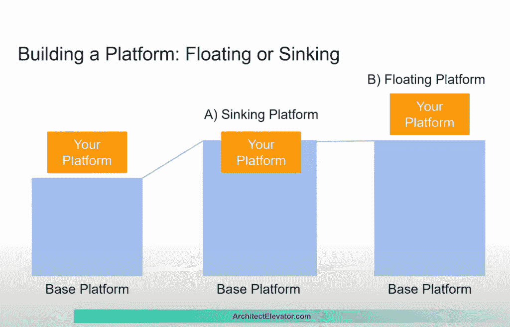
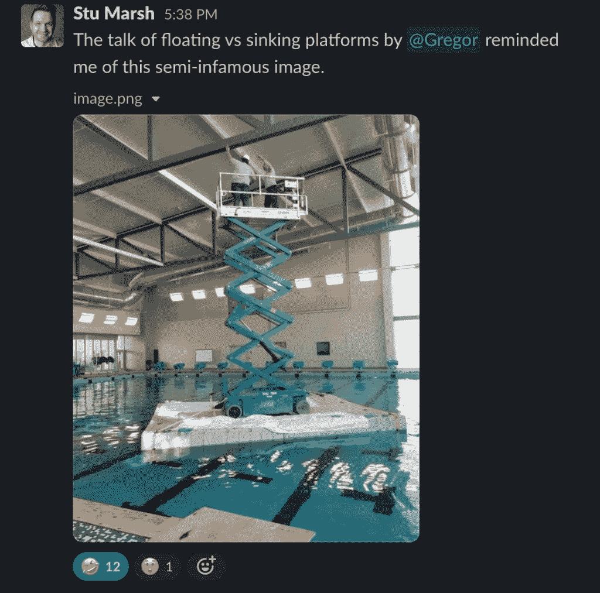
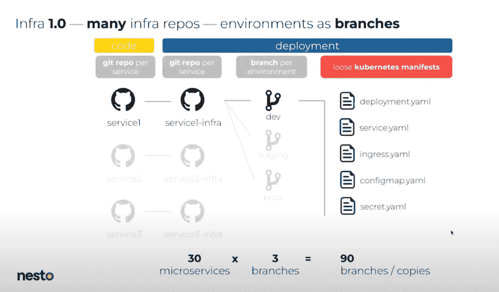

# 我们在 PlatformCon 学到了什么

> 原文：<https://thenewstack.io/what-we-learned-at-platformcon/>

平台工程在不断发展。由平台工程师创建并为其服务的虚拟会议 PlatformCon 2022 就是证明。

[平台工程](https://platformengineering.org/blog/what-is-platform-engineering)是“设计和构建工具链和工作流的学科，能够在云原生时代为软件工程组织提供自助服务能力。平台工程师构建通常被称为[的内部开发者平台](https://internaldeveloperplatform.org)(或 IDP)，涵盖应用整个生命周期的运营需求。”

 [Aeris Stewart

Aeris 管理 Humanitec 和 PlatformEngineering.org 的社区拓展和参与。他们还是 PlatformCon 的联合组织者，Platform con 是有史以来第一个由平台工程师举办并面向平台工程师的会议，他们还是 Platform Weekly 的内容策展人，Platform Weekly 是一个社区驱动的电子邮件时事通讯，内容涉及平台工程和原生云的所有主题。](https://www.linkedin.com/in/aeris-stewart-%F0%9F%8C%88-083487187/) 

这一原则起源于“你建立它，你运行它”的 DevOps，它对大公司很有效，但对资源和人才较少的组织却是灾难性的。它旨在减少开发人员在 DevOps 发展的这一阶段的认知负荷。

在他的[主题演讲](https://www.youtube.com/watch?v=u4o1jcQIaYo)中，Puppet field 首席技术官 Nigel Kersten 提出了这样的担忧，即像 DevOps 一样，平台工程可能成为一个过于模糊的术语，无法提供真正的价值。他敦促社区提出一个平台工程实际需要的描述模型。在许多方面，PlatformCon 似乎是这一过程的开始。

随着 [78 场讲座深入到](https://www.youtube.com/c/PlatformEngineering/playlists)中，我花了大半个夏天来观看和吸收 PlatformCon 的见解。像 Kersten、AWS 的 Gregor Hohpe、DevOps 顾问 Manuel Pais 和咨询公司 OpenCredo 的 Nicki Watt 这样的专家就最重要的平台工程主题发表了意见。发言者分享了他们的平台故事、他们做出的选择以及他们从该过程中学到的东西。

来自全球的近 7000 名平台工程师收听了直播，与[平台工程松弛频道](https://platformengineering.org/slack-rd)的演讲者聊天，并在社交媒体上发表他们的想法。

无论您是平台工程的新手，还是已经从头开始构建了一个平台，PlatformCon 都可以提供很多见解。如果你错过了，这里有一个回顾。

## 核心问题:认知负荷

认知负荷是指一个人完成一项任务必须处理的信息量。当这种负荷超过我们的工作记忆能力时，我们就会努力完成我们的任务。在她的演讲中，Syntasso 首席运营官 [Paula Kennedy](https://platformcon.com/talk/whose-cognitive-load-is-it-anyway) 展示了 DevOps 在过去几年中的发展如何成倍地增加了开发人员的认知负荷。开发人员现在不仅要编写代码，还要在生产中运行代码。

在云原生设置中处理微服务架构通常需要 Kubernetes、基础架构供应、部署管道、配置管理等方面的知识。

有大量新的[工具和框架](https://landscape.cncf.io/)供开发者学习和应用，要跟上几乎是不可能的。所有这些都妨碍了开发人员最重要的职责:交付特性。

> 构建平台是为了改善开发人员的体验，即 DevEx，通过减少认知负荷，同时为开发人员保持适当的自由度。

平台工程试图通过构建支持开发人员自助服务的平台来解决这些问题。Humanitec 首席执行官 Kaspar von Grünberg 将平台描述为“一个平台工程团队结合在一起为开发者铺平黄金道路的所有技术和工具的总和。”

构建平台是为了改善开发人员的体验，即 DevEx，通过减少认知负荷，同时为开发人员保持适当的自由度。最简单地说，DevEx 就是要创造一个环境，让开发人员能够做好他们的工作。

它涉及到提供适当的工具、维护足够的文档、找到正确的抽象级别、自动化和支持开发人员自助服务。

当平台提供黄金路径时，DevEx 得到增强。黄金路径是一条有主见的、有支持的道路，用来建造某物。它建议了用于日常任务的工具和框架，但保持了开发人员在需要时偏离路径的自由。

黄金路径可以防止工程师重新发明轮子，并减少开发人员必须做出的决策数量。所有这些都有助于开发人员释放脑力，更快更有效地发布代码。这种灵活性使得黄金路径成为成功平台的重要组成部分。

## 平台即产品

《团队拓扑》一书的合著者 [Manuel Pais](https://platformcon.com/talk/platform-as-a-product) 在他的演讲中讨论了平台作为产品的概念。他解释说，像任何其他产品一样，平台是可选的，经过精心设计，使用起来更容易，并随着技术的变化而发展。因此，他认为，将相同的原则和流程应用于平台就像应用于产品一样至关重要。

这包括进行用户研究、创建产品路线图、定期征求反馈、迭代、推出平台并在内部向您的客户(开发人员)营销。缺乏用户认同的平台，不是为满足用户需求而设计的平台，也不是随着时间推移而发展的平台，很可能会失败。

许多 PlatformCon 发言人主张从用户研究开始。正如《云战略》一书的作者霍佩所说，你可以“比其他人更聪明，预测他们的所有需求”，或者采取更有可能成功的方法:“根据用户需求发展平台。”

Doma 的平台工程总监 Michael Galloway 认为，除非你深入了解开发人员的痛点以及他们已经在做什么来减轻这些痛点，否则你可能不会建立一个人们真正想要使用的平台。他建议采访你平台的用户，询问他们在做什么，他们最常做什么任务，他们使用什么工具，他们喜欢什么和不喜欢什么，等等。(他分享了他在 Doma 的团队使用的[调查问卷](https://docs.google.com/document/d/1MqfpiV4Wj5YEX-nhrmY5eoRKwRKtAJyLuOK0QuX-83c/edit)。)他还强调了寻求多种视角以获得更透彻理解的重要性。

根据您的研究，您可以绘制出用户完成构建或调试功能等常见任务的过程。您还可以合并其他来源，如入职文档和团队维护的其他材料。

> 除非你对开发人员的痛点以及他们已经采取的缓解措施有了深入的了解，否则你很可能不会构建一个人们真正想使用的平台。

SuperAwesome 高级工程经理 [Olga 布道](https://platformcon.com/talk/available-affordable-attractive-enabling-platform-adoption)强调用户研究在抵消是不够的。她认为平台团队应该定期征求用户的反馈，并利用这些反馈来迭代平台。在她的演讲中，她概述了她的团队如何在平台团队和用户之间建立一个强大的沟通渠道。他们向用户展示问题、目标、可能的解决方案及其用例。然后，他们邀请大家发表意见，并利用这些意见来改进他们的平台。

然而，开发者并不是你唯一的利益相关者。Midokura 首席软件工程师 [Galo Navarro](https://platformcon.com/talk/salesman-tricks-for-the-platform-engineer) 和 HelloFresh 平台产品负责人 [Jessica Ulyate](https://platformcon.com/talk/how-to-convince-management-to-invest-in-your-platform) 讨论了如何获得公司其他部门的认可。他们解释了每个利益相关方群体的独特视角，以及为什么理解他们的差异对平台的成功至关重要。

例如，首席执行官和高管关注战略性的长期问题，因此了解和交流您的平台如何对这些目标产生可衡量的影响是有帮助的。经理们要应付很多事情:在他们的团队中培养健康的协作，创造高质量的东西，创造有助于商业目标的东西。对他们来说，你需要了解哪个需求造成的压力最大，并为平台找到缓解这个问题的方法。另一方面，SysAdmin 和 DevOps 想知道这个平台如何给他们更多的机会来影响整个组织。

[Hohpe](https://platformcon.com/talk/you-dont-have-to-be-a-giant-to-carry-teams-on-your-shoulders) 还讨论了与利益相关者沟通的重要性。他解释说，如果你正在构建一个平台，它很可能是在一个基础平台(比如 Kubernetes)之上，这个基础平台将随着时间的推移而增长。他认为，重要的是决定当这种情况发生时你的平台将做什么，并与利益相关者沟通。

一种选择是保持平台不变。这有助于证明您对所构建功能的投资是合理的。然而，随着基础平台的成长，你的平台将开始复制基础平台所覆盖的东西。随着“水位”——或基础平台的功能——上升，你的平台停留在原地并“下沉”

另一个选择是建立一个“浮动”平台。随着基础平台获得您构建的功能，您可以放弃多余的功能，将您的资源投入到基础平台所不能提供的迭代中。

两者都是合理的选择。让你的利益相关者清楚你的选择是很重要的。例如，如果你建立一个浮动平台，当基础平台的能力赶上来时，利益相关者应该准备好让你扔掉一些东西。

平台作为一种产品有很多方面，但有一个主题:通过避免假设来了解你的客户，提出好的问题，重复反馈，并首先关注最重要的事情。

## 提供正确的抽象层次

构建平台的最大挑战之一是选择正确的抽象层次。这是减少开发人员认知负荷的一个重要方面。

在这里，我们看到两个不同但不互相排斥的主要方向。一方面，受 GitOps 工作流的启发，出现了更多基于代码的声明性方法。另一方面，也有基于 UI 的解决方案。两者都试图向开发者屏蔽复杂性。

抵押贷款网站 nesto 的 DevOps 总监 Mathieu Frenette 在他关于增长挑战、通用掌舵图和黄金路径的演讲[中涵盖了第一种方法他解释了 nesto 的发展如何创造了更多的复杂性:更多的开发者，更多的客户，更多的用例，更多的微服务。这导致太多的基础设施仓库和环境分支拥有松散的 Kubernetes 清单。充分监督和管理一切变得更加困难。](https://www.youtube.com/watch?v=qUn04XUuJsU)

为了应对这些新的挑战，平台团队基于新的通用掌舵图创建了不同级别的抽象。

“我们没有采用为每个微服务定义一个单独图表的诱人方法，”Frenette 解释说，“而是采用了所有微服务通用的独特通用图表。”这使得开发人员和平台团队之间的关注点能够更好地分离。

但这种解决方案有可能将内斯托的黄金之路变成金笼子。为了缓解这个问题，他们为开发人员定义了不同的抽象层次。完整的配方提供了一条阻力最小的路径，只暴露有用的参数，并默认内置最佳实践。

通用模块提供了更多的结构，提供了可重用的构建模块，开发人员可以根据需要进行组合。自定义扩展可用于开发人员需要原始资源或自定义图表的特殊情况。定制扩展的使用被尽可能地重构为黄金路径。

Humanitec 的首席工程师 Nils Balkow-Tychsen 展示了一种平台即代码的方法，使用 GitHub Actions 进行代码搭建，并使用 Humanitec 的平台编制器。通过这种方法，存储库模板拥有开发人员将代码转换为服务的运行版本所需的一切，在任何环境下都是完全自动化的——代码本身、初始配置、依赖项列表以及 CI 管道的定义。(您可以使用这个 [Node.js 应用程序存储库模板](https://github.com/poc-template-org/node-js-sample)亲自查看一下。)

正如 Nils 所指出的，这种方法有助于在开发过程中执行标准，提供快速有效的自动化，并为完全供应的动态环境提供了机会。

Frenette 和 Balkow-Tychsen 的方法是更多基于代码的抽象的例子。然而，其他团队试图在他们的平台设置上使用 ui 来减少认知负荷。网飞高级软件工程师 Brian Leathem 分享了其平台体验和设计(PXD)团队如何采用 Spotify 的开源开发者门户和服务目录 Backstage 来减少上下文切换，并在其基于 GraphQL 的平台 API 之上[统一开发者体验](https://www.youtube.com/watch?v=36FcxlPerdQ)。

基于代码和基于 UI 的方法并不相互排斥。Frontside 首席执行官 Taras Mankovski 在他关于[构建动态内部开发平台](https://www.youtube.com/watch?v=Ky8LWwU2tt8)的演讲中展示了两者如何协同工作。他使用 Backstage 作为服务目录和唯一的事实来源，将基于代码的声明性应用程序模型与[平台编排器](https://humanitec.com/blog/what-is-a-platform-orchestrator)相结合，以支持[动态配置管理](https://humanitec.com/blog/what-is-dynamic-configuration-management)。

## 结论

PlatformCon 2022 挤满了来自众多公司和平台从业者的内部平台使用案例、蓝图和故事。演讲者揭示了一个激动人心的，尽管微妙的，在平台工程上取得成功的路线图的开端。

虽然没有适用于所有组织的确定方法，但许多发言者强调，平台的持续维护和开发是关键因素。

这可能需要为开发人员重新铺设黄金路径，进行用户研究，向不同类型的利益相关者营销平台，并确定正确的抽象级别。这可能不是令人兴奋的工作，但它是至关重要的。

构建、实现和维护一个平台是一个漫长的旅程，但你可以到达那里。PlatformCon 2022 会谈仍在网上进行，以帮助引领方向。

<svg xmlns:xlink="http://www.w3.org/1999/xlink" viewBox="0 0 68 31" version="1.1"><title>Group</title> <desc>Created with Sketch.</desc></svg>