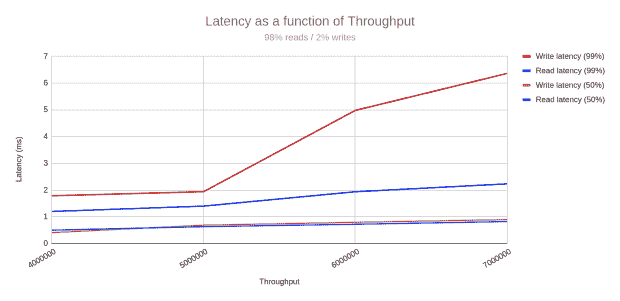
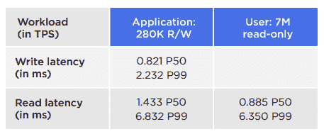
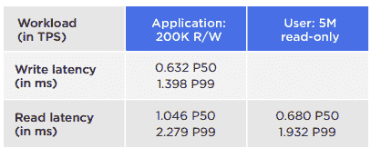
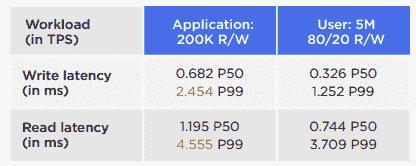
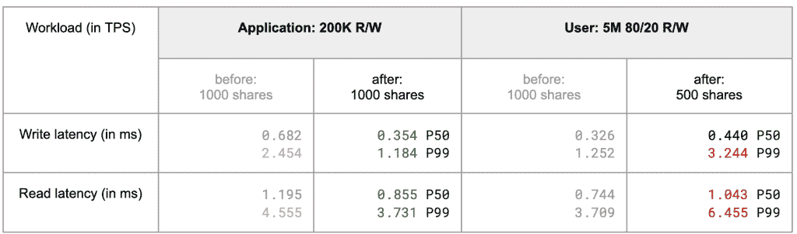

# 我们从 ScyllaDB 的 Pb 级工作负载基准测试中学到了什么

> 原文：<https://thenewstack.io/what-we-learned-benchmarking-petabyte-scale-workloads-with-scylladb/>

随着每天读写数 Pb 数据的实时应用程序的增加，大规模数据库速度越来越受到关注也就不足为奇了。

 [辛西娅·邓洛普

Cynthia 写软件开发和测试的时间比她愿意承认的要长得多。她目前是 ScyllaDB 的内容战略高级主管。](https://www.linkedin.com/in/cynthiadunlop/) 

即使你没有计划增长，在你最意想不到的时候也会出现激增。然而，扩展延迟敏感的数据密集型应用并非易事。团队通常在发现他们最初选择的数据库不能胜任任务时已经太晚了。

在 Pb 级执行的基准测试可以帮助您了解特定数据库如何处理您的公司预计(或至少希望)会遇到的极其庞大的工作负载。然而，这样的基准测试在设计和执行上可能具有挑战性。

在 ScyllaDB，我们对高性能、低延迟的数据库进行了基本的 Pb 级基准测试，原因如下:

*   帮助越来越多拥有 Pb 级用例的 ScyllaDB 用户和评估者了解我们的数据库是否符合他们对大规模速度的要求。
*   建立一个基准来衡量我们的新系列 ScyllaDB V 版本和最新的 AWS EC2 实例(如功能强大的 [I4i 系列](https://www.scylladb.com/2022/05/09/scylladb-on-the-new-aws-ec2-i4i-instances-twice-the-throughput-lower-latency/))所实现的性能改进。
*   量化 ScyllaDB 独特的[工作负载优先级功能](https://university.scylladb.com/courses/scylla-operations/lessons/workload-prioritization/)的延迟影响，该功能允许管理员将可用硬件基础架构的“份额”分配给不同的工作负载。

本文概述了配置过程、结果(有和没有工作负载优先级)和经验教训，这些经验教训可能对其他计划自己的 Pb 级基准测试的人有所帮助。剧透:ScyllaDB 仅使用 20 台大型机器，以每秒 750 万次操作和个位数毫秒延迟运行两种混合工作负载，存储了 1 PB 数据集。

## 配置

### 两个并发工作负载:OLTP 和 OLAP

我们设计了一个模型来代表一个 Pb 级的应用程序，在该应用程序中，事件数据需要快速存储，然后由多个位置(通常是同时)访问，以进行在线事务处理和分析。我们选择了两个并发工作负载:

*   **应用数据(OLTP):** 用于交易处理的数据——例如，交付/优步/物联网应用中的实时广告竞价或实时位置数据。这种工作负载需要低延迟来处理频繁的传入请求。我们估计这将涉及数 TB。
*   **用户数据(OLAP):** 主要用于分析的用户特定数据的较大数据集。它的阅读量很大，并且定期更新。这估计需要 1pb。

为了应用这个模型，我们构建了一个 20 节点的 ScyllaDB 集群(详细信息见下文),并加载了 1 PB(未压缩)的用户数据和 1 TB 的应用程序数据。用户工作负载约为 500 万 TPS，我们测量了它的两种变体:一种是只读的，另一种是 80%读取和 20%写入的。由于该工作负载模拟在线分析，因此高吞吐量至关重要。同时，我们运行了一个较小的 200，000 TPS 应用程序工作负载，其中 50%为读取，50%为写入。由于此工作负载代表在线事务处理，因此低延迟优先于高吞吐量。

这两个工作负载都被构建为一个键-值数据集，键是以高斯分布随机选择的(注意，ScyllaDB 支持宽列数据集和键-值数据集)。用户键空间有 5000 亿个键，而应用程序键空间有 60 亿个。我们在服务器上使用了 LZ4 压缩。然而，我们的客户端工具 cassandra-stress 只生成了完全随机化的字符串，根本没有压缩。因此，我们决定以 3:1 的比例减少有效载荷，以反映现实生活中的情况。此外，我们使用了两次重复(RF=2)。

### 集群规格

为了构建 ScyllaDB 集群，我们提供了 20 个 i3en.metal AWS 实例。每个实例都有:

*   96 个 vCPUs
*   768 GiB RAM
*   60 TB NVMe 磁盘空间
*   100 Gbps 网络带宽

对于负载生成器，我们使用了 50 个 c5n . 9x 大型 AWS 实例。每个实例都有:

*   36 个 vCPUs
*   96 磅 RAM
*   50 Gbps 网络带宽

### 软件

ScyllaDB 节点运行的是 ScyllaDB 企业版 2021.1.6(基于 ScyllaDB 开源 4.3)。为了生成各种负载场景，我们在 ScyllaDB shard-aware Java 驱动程序上使用了行业标准的 cassandra-stress 工具。使用 shard-aware 驱动程序对于从 ScyllaDB 集群获得最佳性能至关重要。我们还使用 ScyllaDB 监控栈来收集和可视化指标。

## 结果

### 数据接收:每秒 750 万次插入

我们可以使用 50 个并发负载生成器以每秒 750 万次插入的速度插入数据。在如此高的吞吐量下，我们看到了 4 毫秒的 P99 写入延迟。这使我们能够在大约 20 小时内加载 1 PB 的集群。摄取期间的 CPU 负载利用率平均约为 90%。摄取期间的总吞吐量约为每秒 120 千兆字节。

### 延迟:一位数毫秒 P99 延迟，每秒 700 万次

该基准测试的主要目标是了解我们可以加载多少 ScyllaDB 集群，并且仍然提供一位数毫秒 99%的延迟。ScyllaDB 集群在 700 万 TPS 吞吐量下实现了个位数毫秒 P99 延迟:写操作不到 7 毫秒，读操作刚刚超过 2 毫秒。



ScyllaDB 集群以 700 万 TPS 实现了个位数毫秒 P99 延迟

从下面两行可以看出，P50 的读写延迟远低于 1 毫秒。上面两条线描述了 P99 的潜伏期。正如所料，P99 延迟随着吞吐量的增加而增加。我们很高兴地看到，它安全地保持在一位数毫秒范围内，最高可达 700 万 TPS。

让我们深入了解不同工作负载的结果。

**并发工作负载:读/写+只读**



**并发工作负载:读/写+只读**



**并发工作负载:读/写+ 80/20**



对于应用程序工作负载，最后一个场景使用了更现实的场景— 80%读取，20%写入。有趣的是，这导致了 P99 读写延迟的显著增加。例如，对于要求 2 或 3 毫秒延迟的应用程序，这可能会导致违反 SLA。

幸运的是，ScyllaDB 配备了一个内置机制，允许用户指定每个工作负载的优先级。这种功能称为工作负载优先级，配置起来很简单。我们希望看到，一旦我们为应用程序应用了更高的优先级，应用程序工作负载会发生怎样的变化。

## 工作负载优先级的影响

然后，我们应用了 ScyllaDB 的工作负载优先级功能，并测量了它对延迟敏感型应用程序工作负载的影响。工作负载优先级可以动态平衡和均衡系统资源，并在共享相同硬件基础架构的不同工作负载之间进行分配。

我们没有更改分配给应用程序工作负载的 1，000 份份额，但我们将授予用户工作负载的份额数量从 1，000 份减少到了 500 份。这显著降低了应用工作负载的 P99 延迟。



## 经验教训

如果您正在考虑执行自己的 Pb 级基准测试，下面是一些您可能需要考虑的经验教训:

*   **供应:**花了几天时间才在 AWS 中找到一个可用性区域，该区域有足够的实例类型用于 Pb 级基准测试。如果您计划部署这样一个大型集群，请确保提前配置好您的资源。
*   **硬件调优—中断处理:**我们默认分配给 I/O 队列处理的内核并没有针对这个场景进行优化。中断处理 CPU 必须手动分配，以最大化吞吐量。对这一问题的修复正在被合并到开箱即用的机器映像中。
*   **硬件调优— CPU 功率调控器:**我们需要将每个节点上的 CPU 功率调控器设置为“performance ”,以最大化系统的性能。
*   **Cassandra-stress:**Cassandra-stress 不是为这个量表设计的(默认人口分布太小)。准备好使用非默认设置来创建 1pb 的数据。
*   **潜在的优化:**我们怀疑使用`BYPASS CACHE`(一个 ScyllaDB CQL 扩展，它要求服务器忽略缓存，直接从磁盘执行查询)可以提高 70%的性能。如果完整的数据集适合缓存，我们可以看到高达四倍的改善。在未来的基准测试中，我们将测量使用`BYPASS_CACHE`的影响。
*   **ScyllaDB 配置:**如果运行 Pb 级基准测试，我们建议使用以下非默认 ScyllaDB 配置:
*   节点级别
    *   四个中断请求(IRQ)-服务 CPU(而不是默认的两个)-用于处理高网络吞吐量
    *   `mount -o discard`(现在默认在 OSS 头行)
*   锡拉. yaml:
    *   `compaction_static_shares: 100`–针对附加为主的工作负载进行了优化(*)
    *   生产线主管对压缩积压控制器进行了改进
    *   `compaction_enforce_min_threshold: true`
*   架构:

```
compaction  =  {
 'class':  'IncrementalCompactionStrategy',
 'sstable_size_in_mb':  10000,
 'space_amplification_goal':  1.25
}  AND compression  =  {'sstable_compression':  'LZ4Compressor'};

```

## 结果摘要

ScyllaDB 仅使用 20 台大型机器，以每秒 750 万次操作和个位数毫秒延迟运行两种混合工作负载，存储了 1 PB 数据集。

结果表明，存储密度为 50tb/服务器，这在业界是无与伦比的。服务器的数量有助于降低总拥有成本(TCO)并简化操作。

在这个基准测试中，ScyllaDB 展示了工作负载优先级，这是它的一个独特特性，允许用户为每个工作负载分配优先级。工作负载优先级支持集群整合，并提供额外的节约。在此设置中，1TB 的较小但非常重要的工作负载托管在相同的 mega 1 PB 部署上。传统上，这样的工作负载可能会被饿死，因为它比大型工作负载小 1000 倍。此外，大型工作负载以每秒 700 万事务(TPS)的速度控制着集群，而较小的工作负载“只有”280，000 TPS。然而，当分配优先级时，较小的工作负载将其 P99 的延迟减少了一半，仅为 1 到 2 毫秒。

总之，ScyllaDB 允许您扩展到任何工作负载规模，并将多个工作负载整合到单个操作集群中。

如果您想了解更多关于我们为什么选择这些工作负载以及我们如何配置它们的详细信息，请参见[以惊人的新规模运行:在 ScyllaDB](https://www.scylladb.com/presentations/operating-at-monstrous-new-scales-benchmarking-petabyte-workloads-on-scylladb) 上对 Pb 级工作负载进行基准测试。

<svg xmlns:xlink="http://www.w3.org/1999/xlink" viewBox="0 0 68 31" version="1.1"><title>Group</title> <desc>Created with Sketch.</desc></svg>