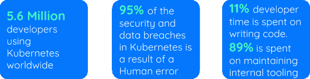
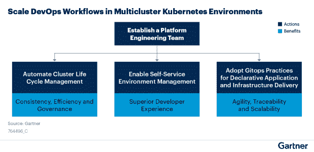
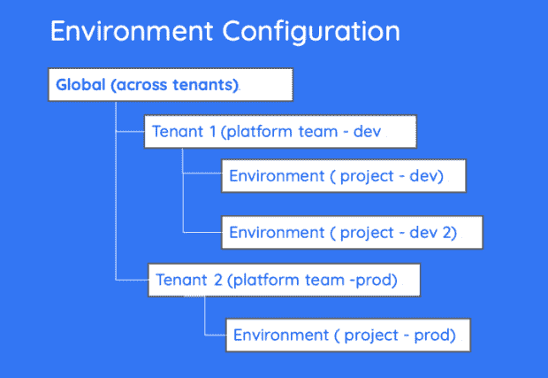
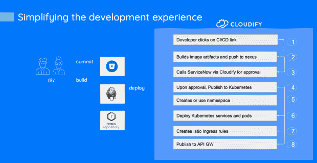
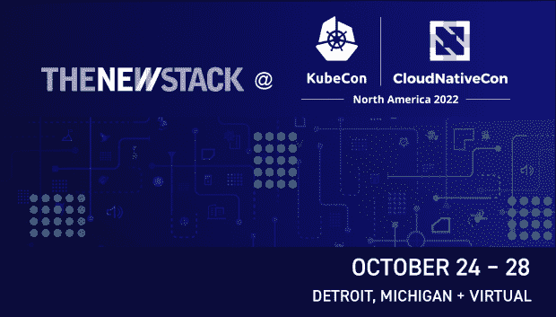

# 我们从支持开发人员自助服务中学到了什么

> 原文：<https://thenewstack.io/what-we-learned-from-enabling-developer-self-service/>

这是 10 月 24-28 日 KubeCon + CloudNativeCon 系列文章的一部分。

组织急切地采用容器和 Kubernetes，投资于原生云以促进创新和增长。根据[云本地计算基金会(CNCF)和 SlashData](https://www.cncf.io/announcements/2022/02/10/cncf-sees-record-kubernetes-and-container-adoption-in-2021-cloud-native-survey/) 的数据，近 560 万开发者使用 Kubernetes。这占所有后端开发人员的 31%。

Kubernetes 是一个很棒的容器管理平台。它很灵活，可插拔，几乎可以做任何事情。从管理跨多个区域和云的应用程序工作负载，到网络，再到边缘部署，Kubernetes 似乎可以做到这一切。

但是这种灵活性的代价很大。所有这些选项使得 DevOps 体验复杂得令人压抑。安全性是另一个挑战。最近的一项红帽调查报告称，Kubernetes 中 95%的安全和数据泄露是由人为错误造成的。几乎有这么多受访者在过去的一年中在他们的 Kubernetes 环境中至少经历过一次安全事件，有时会导致收入或客户损失。

## 我们需要一个自助式开发平台

Gartner 的“[如何在多集群 Kubernetes 环境中扩展开发运维工作流](https://blogs.gartner.com/manjunath-bhat/2022/08/02/how-to-scale-devops-workflows-in-multicluster-kubernetes-environments/?_ga=2.127786825.511402190.1660030713-4280321.1660030713)”指出:“为了简化开发运维工作流，I/O 领导者必须建立平台团队、自动化集群生命周期管理、增强开发人员自助服务并采用 GitOps 实践。”有趣的是，这种方法与 Humanitec 的 [2022 Kubernetes 基准研究](https://www.cncf.io/blog/2022/06/03/5-key-takeaways-from-humanitecs-2022-kubernetes-benchmarking-study/)中的发现一致。

当 Gartner 说“自动化”时，那只是“开发人员自助服务”的另一种说法在 Kubernetes 中启用开发人员自助服务可以提高开发人员的工作效率。配合逻辑云原生架构，工程师可以自行调配、测试、保护和部署他们的应用，而不必等待运营部门为他们调配资源。

开发人员自助服务意味着开发人员不需要成为整个部署工具链的专家。当涉及重复任务时，如开发新功能或预览环境，启用开发人员自助服务可以节省团队时间。没有它，您将面临开发生命周期的减慢，变更失败率、瓶颈和关键人员依赖性的增加。

## 我们从在高度安全的企业环境中支持开发人员自助服务中学到了什么

我一直在支持一家搬到 EKS 的大型金融服务机构。可以理解的是，他们采取了极端的安全措施来保护他们的基础设施。他们还意识到，在这种环境下让开发人员的生活变得理智，同时保持他们所需的创新步伐的唯一方法是为开发人员提供一个自助服务环境，以抽象出底层的 Kubernetes 和云基础架构混乱。

### 步骤 1:对开发环境采取固执己见的方法。

我们采取的第一步是对开发环境采取自以为是的方法。为了到达那里，他们:

1.  使用单一提供商(AWS)避免一开始就陷入多云复杂性。
2.  强制要求应用程序只能在 Lambda 上以云原生方式编写。
3.  将 Kubernetes 集群(EKS)的数量减少到一个用于生产，其他几个用于开发，使用名称空间来分隔项目。

### 第二步:建立专门的平台工程团队。

接下来，他们让平台工程团队(DevOps)负责交付自助服务环境。这意味着提供经认证符合其安全法规的自助式 EKS 集群。同样，该团队还提供其他认证服务，如数据库即服务和 Kafka。

此图描述了拥有专门的平台工程团队来交付自助服务环境的行动和优势:

在 Kubernetes 环境中扩展 DevOps 工作流。

### 步骤 3:采用同类最佳的方法来交付自助式开发平台(IDP)。

该团队首先着手在 EKS 的 Terraform 和 CI/CD 管道上构建一个 IDP 层。他们很快意识到构建所有集成点和抽象层所需的工作量比预期的要大得多。因此，他们开始使用开源替代方案寻找更短的价值路径。这一搜索让团队转向了 Cloudify。

接下来，我们将概述我们使用开源 Cloudify 创建的架构堆栈，以实现他们的目标。

堆栈由以下元素组成:

*   平台堆栈
    *   AWS —公共云
    *   EKS+Istio——开发和生产的中央应用平台
    *   API 网关—提供北向接口
    *   API gee—后端服务的南行接口
    *   ELK —日志聚合和监控
    *   ServiceNow —批准和部署后治理
    *   cloud ify——将服务整合到自助服务环境中的引擎
*   开发者栈
    *   λ—无服务器发动机
    *   Helm —微服务部署
    *   后台—开发门户
*   公共堆栈
    *   Jenkins — CI/CD
    *   Bitbucket —开发回购
    *   Nexus —图像存储库

下图显示了各部分如何协同工作，以及开发团队和平台工程团队之间的所有权如何划分:

### 步骤 A:创建一个着陆区。

当一个开发人员开始一个新项目时，他们需要被分配一个环境，该环境具有他们需要的所有角色和资源凭证:在本例中，一个 git repo (Bitbucket)和一组项目秘密被分组到一个环境存储库中。

平台团队负责创建分配给项目的环境存储库。它提供了所有秘密配置的参考。Cloudify 提供了一个层次化的环境结构来定义这一点，以及每个环境项的范围。范围可以是全局的(与每个人共享)、租户范围的(与特定业务单元中的每个人共享)或私有的(特定项目)。

使用分层环境来存储每个团队/项目的配置。

开发人员 git 存储库和构建管道是基于它们特定的类创建的。Net、Java、web、移动、后端等。).有几个定义良好的项目模板可供用户选择，以创建整个环境堆栈。

该流程还负责创建预定义的构建和升级管道，该管道将预先集成到开发人员 CI/CD 环境中，包括触发构建或升级流程所需的所有引用和参数。

一旦登录区准备就绪，用户将通过电子邮件收到通知，其中包含相关链接以及项目回购和构建管道的参考信息(在 Jenkins 中)。在这种情况下，该团队使用 ServiceNow 来处理电子邮件通知，并管理待批准和确认任务。ServiceNow 提供了一种简单的方法来定制电子邮件模板，使用流设计器创建定制流，并与 Slack 等其他工具集成。

### 步骤 B:创建一个超级简单的开发者体验。

这也许是这个项目最重要的部分。目标是将开发者从底层的 Kubernetes/Istio 基础设施以及用于创建云服务的所有 Terraform 模块中抽象出来。通过这种方式，开发人员可以专注于开发微服务，这些微服务被编译并备份到 Docker 映像中。然后，图像可以存储在 Nexus 图像存储库中。

一旦用户准备好部署，他们需要做的就是从 CI/CD 环境中触发部署管道，或者在推送或合并时使用 GitOps 隐式地完成部署。

该平台现在负责在部署过程中获取该映像。这包括扫描图像，用合适的头盔模板包装图像，并在需要时获得批准(通过 ServiceNow)。一旦请求被批准，部署过程将自动继续。新的微服务部署在分配给项目的名称空间下。最后一个阶段是使用 Istio 和 API 网关将这些微服务连接到网络中。

通过将 Kubernetes 基础设施的复杂性降低到平台上来简化开发人员的体验

### 步骤 C:将所有基础架构资源转变为自助式认证环境。

认证环境通过目录服务交付给开发人员。它基本上是一个预配置的云资源堆栈，旨在满足安全性和性能限制。Cloudify 提供了一个三步方法来简化服务组件的创建:

*   **导入并创建新的自助服务环境**

环境可以从现有的 Terraform、AWS 云形成、Kubernetes 集群或 Azure ARM 组件构建。用户可以将这些导入并发布到 Cloudify 环境蓝图目录，软件将生成一个包装 YAML 蓝图，在资源之间提供一致的 I/O 和关系管理。当然，用户也可以从现有资源中创建复合环境。

*   **使用自助服务环境**

开发人员可以通过安装工作流从预定义的认证环境列表中创建新环境。可以通过 GitOps 操作、CI/CD 管道、REST 调用、CLI 或 GUI 来触发安装。

*   **更新现有的自助服务环境**

Cloudify 提供了跨基础设施资源的一致更新工作流，包括更新 Terraform 模块、舵图和 Ansible 剧本。它还包括从现有堆栈中添加或删除服务，以及资源的就地升级。

你可以[观看演示](https://www.youtube.com/watch?v=34p6fo3UC-U&list=PLA5cw9-zZ-uO7TDQkJw8Xl5A_DaGOSwTi)更详细地展示这一点。

### 最终结果是:极其简单的开发人员体验，而不牺牲安全性

从开发人员的角度来看，平台看起来像一个智能管道，它抽象出基础设施的复杂性，并具有足够的弹性来处理持续的基础设施更新和漂移。从平台团队的角度来看，平台是治理和持续更新基础设施环境而不破坏开发人员管道的中心位置。Cloudify 被用作整合这些部分的平台。

## 是开发者体验，咄！

软件工程中最大的挑战之一是在灵活性和简单性之间找到正确的平衡。在高度安全和监管的环境中尤其如此。

以前解决这一挑战的尝试失败的主要原因是成功需要对整个开发过程采取整体的方法，并建立支持它的团队和基础设施。在许多组织中，孤岛使实施变得复杂。这导致了妥协，这种妥协通常解决了一个领域的复杂性，同时引入了其他领域的复杂性。

我们能够为这家金融服务机构找到合适的平衡点。一方面，开发人员获得了一个极其简单的接口，抽象出底层基础设施的不必要的细节。同时，平台团队拥有充分的灵活性，可以在几分钟内交付几乎任何云服务，并在此过程中简化最复杂的 DevOps 任务之一:处理这些环境的持续更新。

从这一经历中得到的教训可以服务于现在正在建立平台工程策略的团队，以避免陷入过去的错误。开源再次成为解决 DevOps 挑战的一个很好的起点。

*要了解有关云原生话题的更多信息，请参加 10 月 24 日至 28 日在底特律举行的 KubeCon + CloudNativeCon 北美 2022(和虚拟)会议上的云原生计算基金会和云原生社区。*

<svg xmlns:xlink="http://www.w3.org/1999/xlink" viewBox="0 0 68 31" version="1.1"><title>Group</title> <desc>Created with Sketch.</desc></svg>