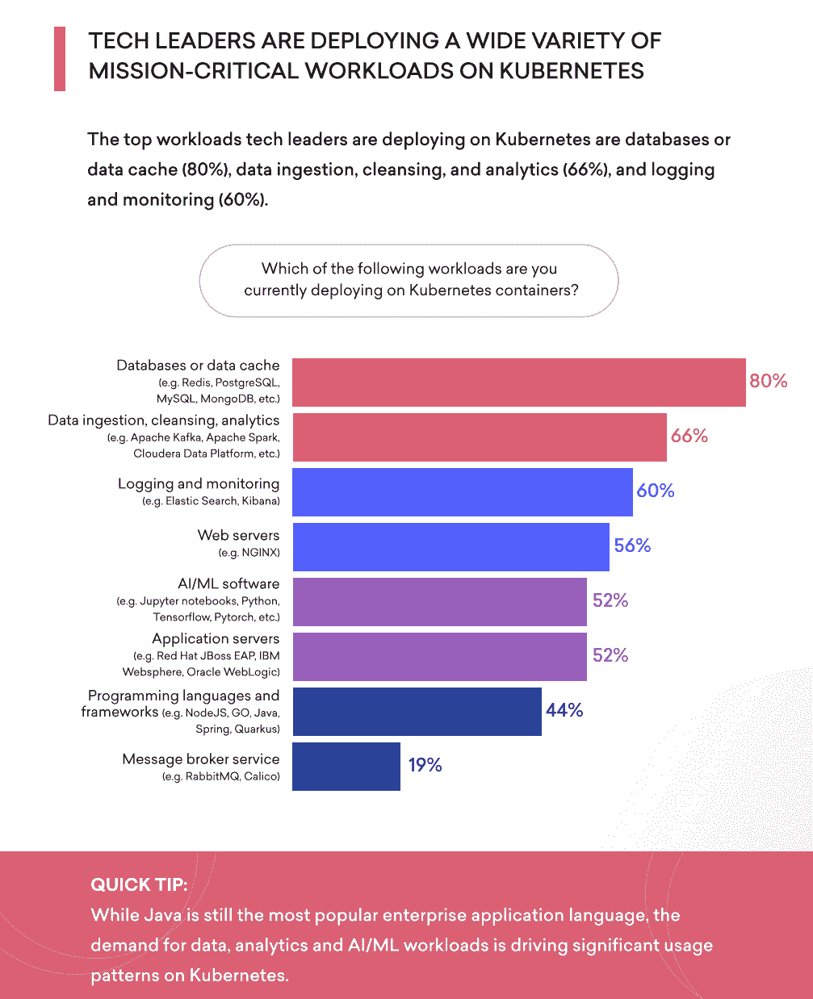
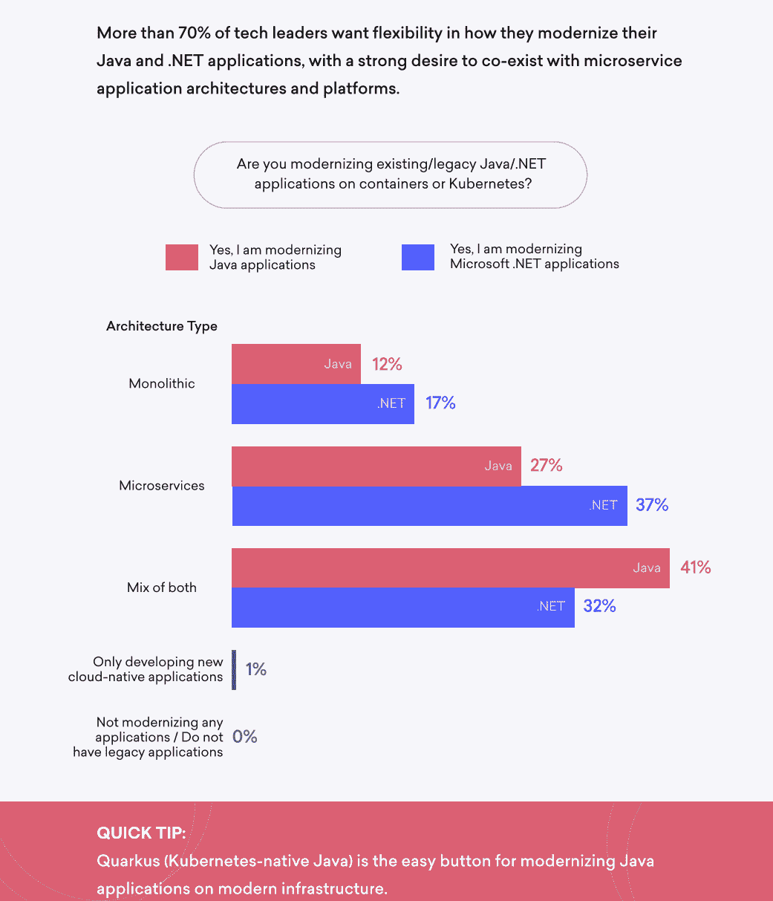
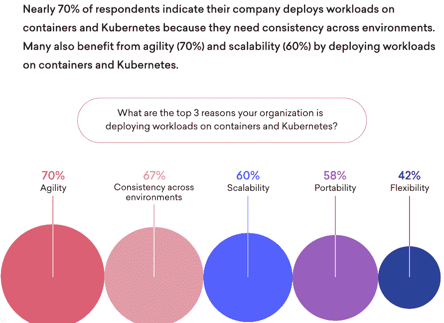
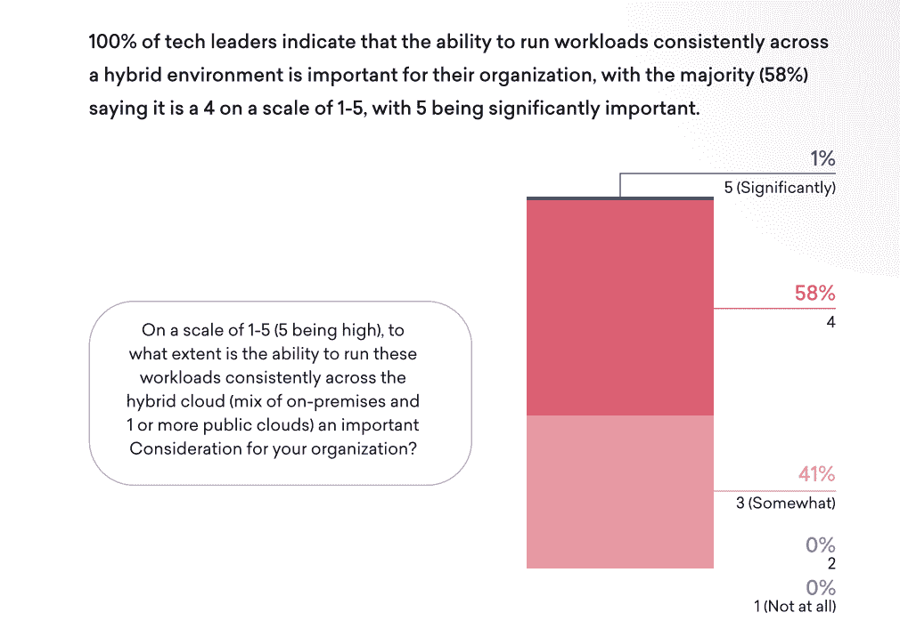

# 企业在 Kubernetes 上运行哪些工作负载？

> 原文：<https://thenewstack.io/what-workloads-do-businesses-run-on-kubernetes/>

我们很想自己回答这个问题，[所以我们联系了 100 位各行各业的企业技术领导者](https://www.redhat.com/en/resources/state-workloads-containers-kubernetes-analyst-paper)，询问他们在 Kubernetes 上运行的工作负载。有些结果，虽然对我们来说并不令人惊讶，但如果你只是简单地阅读了 Kubernetes，而没有使用它，那就出乎你的意料了。

首先，一个被认为不适合容器的工作负载实际上是最常见的托管负载之一:数据库。传统观点认为，开放式混合云应用程序应该尽可能地避免状态，一般来说，容器应该像牛一样对待，而不是宠物。

没有什么比关系数据库更受欢迎的了。然而，80%的受访者表示他们在 Kubernetes 上运行数据库或数据缓存。这包括 Redis 和 MongoDB 等云应用程序的预期数据存储。更令人惊讶的是，我们的调查显示 MySQL 和 PostgreSQL 也属于这一类别，并且也是非常常见的工作负载。

 [亚历克斯·汉迪

亚历克斯是红帽公司的技术营销经理。在他之前的生活中，他报道了第一台 iMac 的发布，然后开始了 20 多年的科技记者生涯。他的作品出现在《连线》、《亚特兰大宪法日报》和《奥斯汀美国政治家》上。](https://www.linkedin.com/in/alhandy/) 

这比 2015 年在 Kubernetes 集群中预期的状态要多得多，但今天，该平台足够稳定和可靠，可以承载这种类型的工作负载，并以冗余备份的方式来实现。

这与我们看到的关于有状态工作负载的整体信息是一致的。在我们的受访者中，77%的人说他们计划在 Kubernetes 上混合运行有状态和无状态工作负载。事实上，只有 1%的人只部署了无状态工作负载，9%的人说他们主要部署了无状态工作负载。剩下的 13%计划托管大部分有状态的工作负载。

这似乎表明 Kubernetes 上运行的工作负载更符合业务，而不是一些虚构的可接受的容器化应用程序列表。相反，企业似乎正在移动他们现有的工作负载，并扩展到与人工智能/机器学习(AI/ML)、分析和数据管理/摄取相关的新工作负载。

事实上，数据接收工具是我们调查中第二受欢迎的工作负载，66%的受访者表示他们正在将 Apache Kafka、Apache Spark 和其他大数据工具部署到他们的 Kubernetes 资产上。

接下来是类似的数据摄取:60%的被调查者运行日志和监控工具，如 Elasticsearch 和 Kibana56%的人说他们使用类似 NGINX 的网络服务器；应用服务器，主要是与 Java 相关的，占 52%。

虽然这些应用服务器通常代表自 21 世纪初 Java 革命以来一直处于企业核心的旧应用程序，但它们总体上与新兴的 AI/ML 应用程序捆绑在一起。

在我们的调查受访者中，52%的人表示他们正在使用 Jupyter Notebooks、Python、TensorFlow、PyTorch 和其他 AI/ML 工具。让我们停下来想一想:现在，在这 100 家企业中，他们正在设计的面向未来的 AI/ML 应用程序占用的计算时间和云空间与他们的传统 Java 应用程序一样多。

这是巨变的核心，以工作负载的形式出现。甚至在三年前，我们才刚刚开始看到 AI/ML 工作负载出现在这些调查中，而现在我们一半以上的参与者都在运行这些工作负载。

虽然这对未来很重要，但它也表明那些较旧的工作负载正在以相对稳定的速度转移到 Kubernetes 上。在我们的调查中，70%的人希望他们的 Java 和。NET 应用程序，强烈希望与微服务应用程序架构和平台共存。

当涉及到那些遗留的 Java 和。NET 应用程序，有几个问题仍然是我们的调查参与者最关心的。57%的人表示他们希望减少现代化时间和成本，而 52%的人表示他们在选择合适的现代化技术方面有困难。

当然，技术并不总是这里的瓶颈。事实上，在我们的调查中，正好有一半的人认为缺乏对其遗留应用程序的了解是一个主要的障碍。就业市场缺乏技能会加剧这种情况:43%的人认为技能匮乏是一个挑战。

当我们更具体地了解 Kubernetes 的使用及其各种功能和特性时，我们发现 Kubernetes 运营商在节省开发人员的时间和精力方面也发挥了很大作用。61%使用运营商的人说，他们节省了开发人员的时间，减少了对更大团队的需求；49%的受访者表示运营商简化了应用部署；44%的受访者表示，在使用运营商时，他们发现部署和生命周期管理方面的错误减少了。

Kubernetes 提供的最省时省力的优势是什么？根据我们的调查，这基本上是 Kubernetes 和 Linux containers 一直承诺的相同的好处:从开发到 it 的移交更容易，总体开销更低。

在我们的调查中可以非常清楚地看到这些好处，其中 70%的受访者表示，他们部署 Kubernetes 和容器的三大原因之一是增加敏捷性；67%的人提到跨环境的一致性；60%的人说他们搬到 Kubernetes 是为了可扩展性。

虽然最初的云革命有点像只有一方能够获胜的政治运动，但企业已经采用了开放的混合云模式。事实上，在我们的调查中，没有人说他们只使用一种云。相反，93%的人说他们正好使用三朵云。

事实上，58%的受访者表示，跨混合云一致运行这些工作负载的能力是一个重要的考虑因素。

虽然 Kubernetes 还有很长的一段路要走，但这项调查相当明确地向我们展示了各种形状和大小的工作负载现在都可以在 Kubernetes 和 Linux 容器中轻松运行。不仅如此，它们还在生产中运行，并接管了基于虚拟机的传统应用程序的角色。

这些新容器化的应用程序也不仅仅运行在一个云中。它们必须在多个地区、跨多个云提供商运行。这就是 Linux 容器和 Kubernetes 操作者的真正好处能够对企业的 it 资产产生影响的地方。通过降低在全球范围内按需部署这些应用程序的复杂性，并使其更接近正在处理的数据，企业可以提高其速度，并更好地利用其开发资源。

如果您想了解此次调查的全部结果，您可以[在此](https://www.redhat.com/en/resources/state-workloads-containers-kubernetes-analyst-paper)下载。

<svg xmlns:xlink="http://www.w3.org/1999/xlink" viewBox="0 0 68 31" version="1.1"><title>Group</title> <desc>Created with Sketch.</desc></svg>