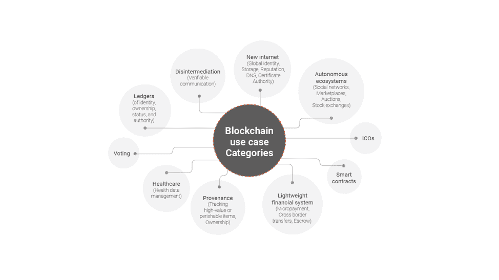

# 在做出飞跃之前，你需要了解区块链的哪些知识

> 原文：<https://thenewstack.io/what-you-need-to-know-about-blockchain-before-making-the-leap/>

[WSO2](https://wso2.com/) 赞助本帖。

 [斯里纳斯·佩雷拉

副总裁 Srinath 领导 WSO2 的研究。他是一名科学家、软件架构师和从事分布式系统的程序员。他是 Apache Software Foundation 的成员，也是 Apache Axis2 和 WSO2 CEP 等几个广泛使用的项目背后的关键架构师。](https://www.linkedin.com/in/srinathperera) 

区块链承诺重新定义信任。一方面，它让我们建立分散的系统，我们不需要信任系统的所有者或操作者。另一方面，区块链让以前不受信任的各方快速有效地建立信任。这使得开发人员能够构建可以在不可信环境中工作的新颖应用程序。同时，区块链用例在哪里是可行的，并且能够交付清晰的价值，这一点并不明显。因此，我和我的同事最近采用了一种系统的方法来分析区块链，使用的是[新兴技术分析画布(ETAC)](https://github.com/wso2/ETAC/blob/master/ETAC.md) ，它通过探索影响、可行性、风险和未来时间表对新兴技术进行了广泛的观察。

很难集中讨论所有提出的区块链用例并得出可靠的结论。这是因为他们有不同的要求和目标。因此，我们通过调查许多区块链用例并将它们分为 10 个类别来开始我们的分析，如下图所示。

然后，主要的区块链用例类别让我们确定共同的特征。例如，分类账、新的互联网服务、自主生态系统和轻量级金融系统让我们可以在不信任系统操作员的情况下建立去中心化的系统。与此同时，非中介化(去除中间的经纪人)、溯源(跟踪历史)和智能合约允许信息交换或支付，需要更少的安全检查。

## **新旧信任系统的对比**

这里提到的大多数用例已经以某种方式实现了。那么，为什么要关心区块链呢？答案是区块链可以提供一种新的信任。

传统的、区块链之前的系统通常会正常运行。然而，它们隐含地假设了两种信任。首先，我们信任集中实现的“超级用户”。在这种情况下，一个人或几个人可以深入访问系统，并被认为是值得信任的。或者，对于一个组织或政府，我们可以合理地假设流程已经到位，应该可以阻止不法行为(当然，并不是所有的世界政府都属于这一类)。

我们建立信任的第二种方式是通过一种不受约束的方式，比如签署一份法律合同，获得一份证明，或者通过提供一张信用卡来获得访问权。这就是为什么大多数系统或生态系统要求您提供凭证，您需要通过其他渠道创建凭证，然后才能访问它们。

与传统的信任系统不同，基于区块链的系统可以在没有任何一个假设为真的情况下运行。没有第一个假设的操作是去中心化，没有第二个假设的操作被称为“动态信任建立”然而，我们能够在没有这些假设的情况下运作并达到新的信任水平并不总是意味着我们应该这样做。

我们需要考虑使用区块链的成本和潜在回报(货币和抽象价值，如更多信任)之间的权衡。这不是一个技术决策，而是对我们的价值观和我们愿意承担多大风险的考虑。

## **权衡区块链成本**

我们的分析确定了几个挑战(技术限制可能会在未来得到解决)和风险(区块链固有的方面不太可能改变)。区块链的挑战是有限的可扩展性和延迟，有限的隐私，存储限制和不可持续的共识(例如，当前的共识算法速度慢，消耗大量的计算能力)。与此同时，区块链风险包括不可挽回性、监管者缺位、被误解的副作用、比特币价格波动以及监管回应不明确。

在我们的分析中，我们随后在区块链的挑战和风险的背景下评估了每个用例类别，我们得出了三个可行性级别。

首先，区块链技术已经为数字货币的应用做好了准备，包括初始硬币发行(ICOs 出处，例如供应链和其他 B2B 场景；和去中介化。我们希望在未来三年内看到使用案例。

第二，分类账(身份、所有权、地位和权力)、投票和医疗保健只在技术限制不妨碍它们的有限用例中可行。

对于剩余的用例——轻量级金融系统、智能合同、新的互联网应用和自主生态系统——区块链面临着重大挑战，包括性能、不可逆转性、监管需求和缺乏普查机制。这些都是难题，可能需要至少 5 到 10 年才能找到答案。

在大多数情况下，当整体考虑时，今天用于建立信任的集中式或半集中式解决方案比基于区块链的分散式解决方案更快、吞吐量更大并且更便宜。采用区块链意味着我们愿意为更多的拖延和重复付出代价。

## **区块链值得吗？**

区块链促成的权力下放和动态信任的建立都不是免费的。然而，虽然真正的去中心化是昂贵的，但是一旦到位，它使得动态信任建立易于实现。

分散对以下情况很有用:

1.  限制政府审查和控制。
2.  避免单一组织控制关键系统或数据。
3.  防止一个或几个流氓雇员造成重大损失。
4.  将系统的规则均匀地应用到每个人身上(限制可以从系统中访问关键人员的人享受特殊待遇的情况)。
5.  减少损失，因为很少有帐户受到损害。

到目前为止，我们已经成功地运行了我们的系统，而没有采用去中心化的场景。

此外，围绕区块链价值观的两极化争论表明，对于分权的价值并没有共同的理解。人们对政府和大型组织的专断权力表示担忧。但是他们是否理解权衡是获得更高信任所需的额外资源？同样，人们担心隐私，但我们大多数人每天分享数据，以换取免费访问大型互联网公司和社交媒体平台。

显然，权力下放需要成为经过广泛讨论后才作出的政策决定的一部分。一方面，在一个越来越受软件控制的世界——从银行到医疗保健和自动驾驶汽车，不一而足——与集中式系统相关的风险正在增加。另一方面，试图实现完全的权力下放可能会因为设定一个过于雄心勃勃的目标而扼杀区块链，因为由此产生的成本将会过高。

幸运的是，集中与分散并不一定是全有或全无的决定。多层次的权力下放是可能的。例如，私人区块链基本上是半分散的，因为任何行动都需要几个关键人物的一致同意。因此，重要的是在三种选择下严格检查每个区块链用例:集中、半分散、分散。

在区块链已经进行了大量的金融投资，但是如果寻求一个完全分散的解决方案需要太长时间；这将危及区块链的未来。据推测，我们支持半分散解决方案(私人区块链)的速度会比完全分散快得多。这是一个很好的例子，可以从区块链用例的半分散方法开始，以最大限度地降低风险，然后在第二阶段努力实现完全分散。

## **结论**

区块链提供了建立信任的机制，可降低与集中式系统相关的风险，并通过自动执行建立信任所需的验证来实现敏捷性。然而，与当前的分散式或半分散式区块链解决方案相比，集中式解决方案速度更快、吞吐量更大、实施成本更低。也就是说，随着政府和市场需求解决区块链面临的技术挑战，相关成本和实施障碍将会减少。我们预计区块链用例的某些类别将在未来三年内投入生产。

决定投资哪一个区块链用例以及何时投资需要权衡的关键分析。使用 ETAC 框架对区块链进行的更详细的分析以及对这些权衡的讨论可以在我们的论文中找到，“以用例为中心的区块链调查:现状和未来方向”

通过 Pixabay 的特征图像。

<svg xmlns:xlink="http://www.w3.org/1999/xlink" viewBox="0 0 68 31" version="1.1"><title>Group</title> <desc>Created with Sketch.</desc></svg>