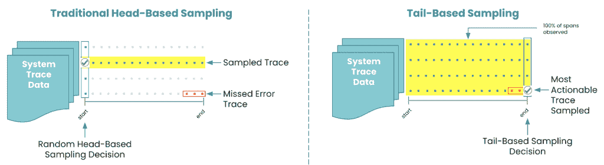

# 关于分布式跟踪和采样，您需要了解什么

> 原文：<https://thenewstack.io/what-you-need-to-know-about-distributed-tracing-and-sampling/>

[新遗迹](https://newrelic.com/)赞助本帖。

 [杰里米·卡斯蒂利亚

Jeremy 是 New Relic 的首席产品营销经理，负责应用性能监控产品的上市策略。他在技术行业已经工作了超过 12 年，从事过工程、产品管理和产品营销等工作。他热衷于帮助客户推动业务增长并交付更完美的软件。Jeremy 拥有乔治福克斯大学的工程学士学位和 MBA 学位，是 AWS 认证的数据呆子。](https://www.linkedin.com/in/jeremycastile/) 

许多软件团队已经从整体服务跳到了微服务。使用微服务开发应用的好处是显而易见的:更小、更容易理解的服务，可以独立部署、扩展和更新。通过将应用程序分解成更小的服务，您可以灵活地选择最适合每个组件的技术和框架。这种灵活性使您能够提高软件从代码到产品的速度。然而，它也带来了更大的复杂性。例如，大多数现实世界的环境混合了传统的 monolith 应用程序和新的基于微服务的应用程序。

当您必须跟踪和解决问题时，这种软件复杂性会造成很大的麻烦。以一个基本的电子商务应用程序栈为例。当最终用户进行在线购买时，一系列请求会通过许多分布式服务和后端数据库。这些请求的路径可能会经过店面、搜索、购物车、库存、身份验证、第三方优惠券服务、支付、运输、CRM、社交整合等等。如果这些服务中的任何一项出现问题，客户体验都会受到影响。事实上，[根据一项研究](https://martechseries.com/mts-insights/guest-authors/consumer-dislikes-and-brand-loyalty-in-the-era-of-digital-customer-experience/)，高达 95%的受访者会因为糟糕的体验而离开一个网站或应用。

## 穿越复杂性

您需要能够在客户受到影响之前，快速排除复杂分布式系统中的错误和瓶颈。分布式跟踪使您的团队能够跟踪每个事务通过分布式系统时的路径，并分析它与每个服务的交互。这项功能有助于您:

*   深刻理解每一项服务的性能。
*   可视化服务依赖关系。
*   更快速有效地解决性能问题。
*   测量整体系统健康状况。
*   优先考虑需要改进的高价值领域。

快速解决问题意味着您了解“几跳之外”的下游服务是如何造成关键瓶颈的。同样重要的是，有效的问题解决方案意味着您可以洞察如何通过优化代码或其他方式来防止问题再次发生。如果您不能确定一个问题发生的时间、原因和方式，那么小的缺陷可能会在产品中持续存在，直到一系列事件排列起来，系统突然崩溃。分布式跟踪为您提供了单个请求的详细视图，因此您可以准确地看到较大系统的哪些部分有问题。

## 使用分布式跟踪呈现有用的信息

分布式跟踪是一个强大的工具，但是并不是所有的跟踪都是同样可操作的。当您使用分布式跟踪工具时，您很可能试图快速回答几个关键问题，例如:

*   我的分布式系统的整体运行状况和性能如何？
*   我的分布式系统中的服务依赖关系是什么？
*   我的分布式系统中有错误吗？如果有，在哪里？
*   我的服务之间或内部是否存在异常延迟，如果是，是什么原因造成的？
*   我管理的服务的上游和下游是什么服务？

当分布式系统中的每个服务都发出跟踪遥测时，即使只有少数服务，数据量也会很快变得难以承受。分布式系统中的绝大多数事务请求都会顺利完成，这使得大多数跟踪数据在统计上没有意义，并且通常无助于快速发现和解决问题。

仔细检查每一个踪迹以发现错误或潜在问题成为典型的“大海捞针”问题。没有人能够实时观察、分析和理解分布式系统中的每一个踪迹。但是您可以使用分布式跟踪工具对数据进行采样，并提取最有用的信息来采取措施。

让我们来看看几种不同类型的分布式跟踪采样方法。

## 基于头部的采样概述

为了处理大量的跟踪数据，大多数传统的分布式跟踪解决方案使用某种形式的基于头部的采样。使用基于头的采样，分布式跟踪系统在完成其通过许多服务的路径之前随机选择一个跟踪进行采样(因此得名“基于头的”)。以下是基于头部采样的优势和局限性:

### 优势

*   适用于事务吞吐量较低的应用程序。
*   快速简单地启动并运行。
*   适用于整体式和微服务混合环境，其中整体式仍然占主导地位。
*   对应用程序性能几乎没有影响。
*   向第三方供应商发送跟踪数据的低成本解决方案。
*   统计抽样为您的分布式系统提供了足够的透明度。

### 限制

*   轨迹是随机采样的。
*   采样是在跟踪完全完成其通过许多服务的路径之前完成的，所以没有办法预先知道哪个跟踪可能会遇到问题。
*   在高吞吐量系统中，有错误或异常延迟的跟踪可能会被抽样掉并丢失。

## 基于尾部的采样概述

在包含关键服务的大容量分布式系统中，必须观察每个错误，基于尾部的采样提供了一个解决方案。使用基于尾部的采样，分布式跟踪解决方案可以观察和分析 100%的跟踪。采样是在跟踪完全完成后进行的(因此得名“基于尾部”)。因为采样是在跟踪完全完成后进行的，所以可以对具有最具可操作性的数据(如错误或异常延迟)的跟踪进行采样和可视化，以便您可以快速准确地找出问题所在。这种能力有助于解决经典的“大海捞针”问题。以下是基于尾部的采样的优点和局限性:

### **优势**

*   100%的痕迹被观察和分析。
*   采样在跟踪完全完成后进行。
*   您可以更快地可视化带有错误或异常缓慢的轨迹。

### **(现有解决方案的)局限性**

*   运行采样软件需要额外的网关、代理和卫星。
*   您必须忍受管理和扩展第三方软件的进一步辛劳。
*   你面临着传输和存储大量数据的额外成本。

## 选择的灵活性

随着新技术在软件世界的广泛采用，应用程序环境将继续变得越来越复杂。您的开发运维团队和软件团队将在 monolith 和微服务环境中开发和管理应用，并且需要分布式跟踪工具来帮助您快速发现和解决任何技术堆栈中的问题。并非每个跟踪都是相同的，不同类型的分布式跟踪数据采样各有优点和局限性。您需要根据用例及成本/收益分析灵活选择最佳采样方法，并考虑每个应用的监控需求。

通过 Pixabay 的特征图像。

<svg xmlns:xlink="http://www.w3.org/1999/xlink" viewBox="0 0 68 31" version="1.1"><title>Group</title> <desc>Created with Sketch.</desc></svg>