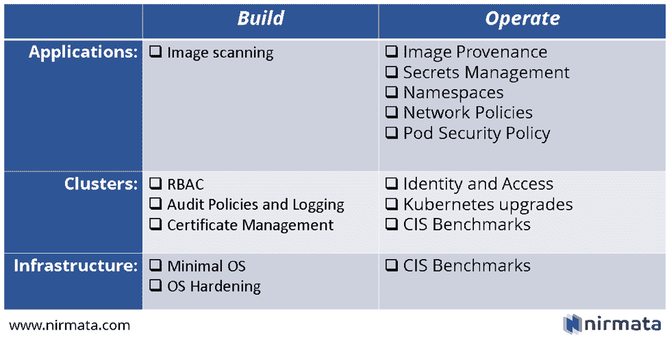

# 你的 Kubernetes 安全清单可能遗漏了什么

> 原文：<https://thenewstack.io/what-your-kubernetes-security-checklist-might-be-missing/>

新技术通常需要改变安全实践。容器和 Kubernetes 的显著之处在于，它们还提供了增强和改进现有安全实践的潜力。

在这篇文章中，我将分享一个我们在 Nirmata 使用的模型，以帮助客户理解安全问题并规划安全的 Kubernetes 实现。

## Kubernetes 安全模型

 [吉姆·布瓦迪亚

Jim 在建立和领导高效团队方面拥有 20 多年的经验，并开发了支持通信系统的软件。在联合创办 Nirmata 并成为首席执行官之前，Jim 是思科云自动化业务的最初架构师和业务领导者之一，他帮助该业务的收入增长到超过 2 . 5 亿美元，IDC 认为该业务是全球云服务的第一名。在思科工作之前，Jim 领导了一些初创公司的工程团队，包括桌面虚拟化初创公司 Pano Logic 无线先驱“空中飞人网络公司”:以及电信设备制造商 Jetstream Communications。](https://nirmata.com/) 

在高层次上，我们可以将 Kubernetes 的安全问题分为三个层次和两个生命周期阶段:

**层**:

*   **应用:**Kubernetes 的全部目的是管理工作负载，即您的应用。保护这一层包括管理应用程序所需的敏感数据，以及保护应用程序中的流量和数据。Kubernetes 本身提供了几个抽象来帮助管理应用程序的安全性。
*   **集群**:Kubernetes 集群由几个控制平面组件和运行在工作节点上的组件组成。一个全面的安全策略需要了解如何保护 Kubernetes 并为每个集群正确配置 Kubernetes 组件。
*   基础设施:像任何其他软件一样，Kubernetes 组件需要计算、网络和存储。对于 Kubernetes，这对应于安装 Kubernetes 的节点(虚拟或物理主机)。还必须保护这一层，以确保 Kubernetes 组件得到正确配置。

**阶段:**

*   **构建**:这个阶段包括设置——在执行任何工作负载之前。对于应用程序，这个阶段包括构建过程和 CI/CD 管道问题。对于集群和集群附加服务，这包括 Kubernetes 的设置和配置。对于基础架构，这包括主机准备过程。
*   **操作**:这个阶段涉及 Kubernetes 组件、集群附加服务和工作负载的持续操作和管理。

通过此模型，我们列出并描述了解决主要安全相关问题的可用解决方案。

下图总结了这些内容，并提供了每个项目的详细信息:

## 图像扫描

***相*** *:打造；**层**:应用*

容器映像通常使用构建流程编排工具构建，如 Jenkins。图像扫描工具需要成为构建过程的一部分，以扫描容器中使用的每一层的漏洞。Clair 是一款开源图像扫描仪，CNCF 支持的图像注册中心如 [Harbor](https://goharbor.io/) 使用 Clair 自动扫描所有图像。

## 图像出处

***阶段*** *:操作；**图层**:应用*

虽然图像扫描可确保您构建的图像是安全的，但图像来源可确保您运行的图像是您扫描并批准的图像！换句话说，企业需要一种方法来确保只有经过扫描和批准的映像才能在其集群中运行。一种方法是提供受信任的映像注册表列表，并使用集群范围的策略管理工具来确保不允许来自不受信任的注册表的映像。

## 机密管理

***相*** *:操作；**层**:应用*

秘密是你的应用程序所需要的敏感数据，就像密码和密钥一样。管理机密的最佳实践是使用“后期绑定”,将机密从机密存储加载到应用程序运行时——通常是 pod 的初始化阶段。这里有一个使用 Hashicorp Vault 和开源 Nirmata Vault 客户端实现的例子(参见[博客](https://www.nirmata.com/2018/12/19/managing-kubernetes-secrets-with-hashicorp-vault-and-nirmata/)和[演示视频](https://www.brighttalk.com/webcast/17111/343476))。

## 名称空间

***阶段*** *:操作；**层**:应用；*

[Kubernetes 名称空间](https://kubernetes.io/docs/concepts/overview/working-with-objects/namespaces/)允许资源的逻辑分割和隔离，基本上允许一个物理集群表现为几个虚拟集群。只要有可能，应用程序应该被隔离到它们自己的名称空间。这和 Kubernetes 的其他几个特性一样重要，比如 RBAC、资源配额等。可以在命名空间级别应用。但是，需要注意的是，命名空间不会自动提供网络隔离，这需要配置网络策略。

## 网络策略

***相*** *:操作；**层**:应用*

[Kubernetes 网络策略](https://kubernetes.io/docs/concepts/services-networking/network-policies/)类似于防火墙规则，允许对每个应用组件(即 pod)的进出流量进行精细控制。默认情况下，Kubernetes 网络策略应该在名称空间级别进行配置，并在每个组件的工作负载级别进行配置。简单地配置网络策略没有任何作用——还需要一个能够执行网络策略规则的 CNI，比如 [Calico](https://github.com/projectcalico/cni-plugin) 。

## 基于角色的访问控制

***阶段*** *:构建；**图层**:集群*

Kubernetes 提供了细粒度的基于角色的访问控制( [RBAC](https://kubernetes.io/docs/reference/access-authn-authz/rbac/) )功能来管理对资源的访问。一个[角色](https://kubernetes.io/docs/reference/access-authn-authz/rbac/#role-and-clusterrole)定义了一组权限规则，这些规则指定了允许对哪些实体进行哪些操作。一个[角色绑定](https://kubernetes.io/docs/reference/access-authn-authz/rbac/#rolebinding-and-clusterrolebinding)将一个角色应用到一个用户身份或服务帐户。Role 和 RoleBinding 这两个构造都应用于名称空间级别。一个[集群角色](https://kubernetes.io/docs/reference/access-authn-authz/rbac/#rolebinding-and-clusterrolebinding)和[集群角色绑定](https://kubernetes.io/docs/reference/access-authn-authz/rbac/#rolebinding-and-clusterrolebinding)适用于集群范围。

注意，Kubernetes 没有提供任何管理用户的选项——我们将在稍后的身份和访问管理一节中解决这个问题。

虽然 Kubernetes 提供了丰富的访问控制，但这些需要跨集群进行配置和管理。对于企业用例，您将需要一种通用的方法来管理跨集群和任何基础架构上的 RBAC。

## 审计策略和日志记录

***阶段*** *:构建；**层**:集群*

Kubernetes [AuditPolicy](https://kubernetes.io/docs/tasks/debug-application-cluster/audit/#audit-policy) 定义了需要记录哪些事件，并控制哪些数据应该包含在审计记录中。可以为不同的存储后端配置审计策略。从 Kubernetes 1.13 开始，您还可以配置 [AuditSink](https://kubernetes.io/docs/tasks/debug-application-cluster/audit/#dynamic-backend) 对象，这支持通过 webhook API 接收事件的动态后端。

必须在 API 服务器级别为每个 Kubernetes 集群配置审计策略和记录审计事件的后端。

## 证书管理

***相*** *:打造；**层**:集群*

Kubernetes 组件使用 X.509 证书进行身份验证和加密。所有 Kubernetes 证书必须由证书颁发机构(CA)签名，但是 CA 本身可以自签名。对于企业部署来说，拥有一个证书管理策略是很重要的，它可以确保 Kubernetes 证书可以跨集群轻松管理。

## Pod 安全策略

***阶段*** *:构建；**图层**:集群*

Kubernetes Pod 安全策略管理 Pod 配置和更新的规则。Pod 安全策略是集群范围的资源，需要由 [PodSecurityPolicy](https://kubernetes.io/docs/reference/access-authn-authz/admission-controllers/#podsecuritypolicy) 准入控制器启用。简单地创建一个 Pod 安全策略没有任何作用——每个 Pod 服务帐户必须被授权使用它。Pod 安全策略可以控制正在运行的或有特权的容器，使用主机网络名称空间，使用主机文件系统和其他几个重要的特权。

## 身份管理

***相位*** *:操作；**层**:簇*

虽然 Kubernetes RBAC 提供了对实体访问的粒度控制，但 Kubernetes 没有提供任何管理用户身份的构造。这很有意义，因为最佳实践是通过一个中央身份提供者(IdP)来管理用户身份，例如 Active Directory 或其他目录服务。此外，对于企业来说，考虑单点登录(SSO)非常重要，这样开发和运营团队在管理跨不同基础架构堆栈或云提供商的多个集群时就可以获得良好的用户体验。

## Kubernetes 升级

***阶段*** *:操作；**层**:集群*

Kubernetes 是一个快速发展的项目，每三个月发布一次小功能，补丁和安全补丁发布得更频繁。这意味着企业需要准备好经常升级 Kubernetes 组件——在生产集群上。运营 Kubernetes 需要一个托管的 Kubernetes 服务或管理工具，以确保安全和及时的升级。

## Kubernetes 的 CIS 基准

***相*** *:操作；**层**:簇*

互联网安全中心(CIS)发布了一份清单，列出了保护 Kubernetes 集群的 100 多条建议和最佳实践。对于安全操作，能够根据 CIS 基准审计集群是至关重要的。有开源工具，如 Aqua Security 的 kube-bench，可以帮助自动运行扫描。但是，对于生产部署，您仍然需要额外的来收集、报告和分析结果。

## 最小操作系统

***阶段*** *:构建；**层**:基础设施*

容器已经改变了包括操作系统在内的整个基础设施的游戏规则。CoreOS (被 Red Hat 收购，然后被 IBM 收购)最初推广了极简操作系统的概念，它只为运行容器而设计，具有原子更新和集群等功能。然而，每个主要的操作系统供应商都很快跟进容器的精简版。减少操作系统导致攻击面更小，因此部署更安全。

## 操作系统强化

***阶段*** *:构建；**层**:基础设施*

默认情况下，大多数操作系统都是不安全的，需要进行强化以最大限度地减少威胁和漏洞。OS 加固有众所周知的程序和标准，在构建运行 Kubernetes 组件的主机时必须遵循这些程序和标准。

## 码头工人的 CIS 基准

***阶段*** *:操作；**层**:基础设施*

Kubernetes 需要一个容器引擎来运行，比如 Docker CE 或 Containerd。集装箱发动机也必须固定和加固。与保护 Kubernetes 集群一样，信息安全中心(CIS)也发布了保护容器引擎的综合基准。构建 Kubernetes 节点时应该遵循这些步骤。

## 结论

Kubernetes 是一个复杂的系统，保护它需要考虑堆栈的几个不同层，并涵盖构建和配置时间问题以及运行时问题。在这篇文章中，我介绍了一个我们在 Nirmata 使用的安全模型，以指导我们的企业客户在企业范围内采用 Kubernetes。

Kubernetes 提供了许多安全构造，可以用来创建一个高度安全的环境。然而，显而易见的是，企业范围的 Kubernetes 安全性需要一个[管理平面](https://thenewstack.io/kubernetes-steering-the-ship-with-cloud-native-management/),它不断地验证、审计和确保跨集群的配置和合规性，以确保 Kubernetes 得到正确配置和保护。

我还假设 Kubernetes 集群是在一个企业中管理的。正如集装箱安全专家 Jessie Frazelle 在她的[博客文章](https://blog.jessfraz.com/post/hard-multi-tenancy-in-kubernetes/)中详细描述的那样，Kubernetes 的硬多租户仍然是一个未解决的问题。

但最令我兴奋的是社区中有新的创新，比如正在进行的关于[无根 Kubernetes](https://fosdem.org/2019/schedule/event/containers_k8s_rootless/) 的工作，这将使 Kubernetes 在未来更加安全。这是建设的大好时机！

<svg xmlns:xlink="http://www.w3.org/1999/xlink" viewBox="0 0 68 31" version="1.1"><title>Group</title> <desc>Created with Sketch.</desc></svg>