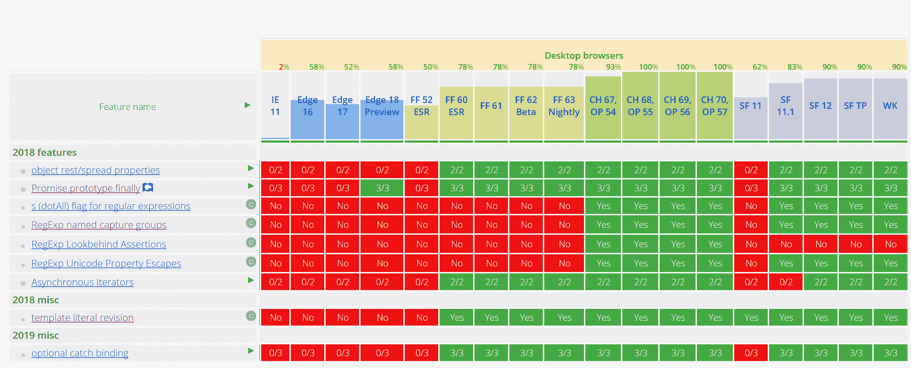

# JavaScript 2018 即将推出什么:异步生成器，更好的正则表达式

> 原文：<https://thenewstack.io/whats-coming-up-in-javascript-2018-async-generators-better-regex/>

最新的年度 [ECMAScript 更新](http://www.ecma-international.org/ecma-262/9.0/index.html)于 2018 年 6 月发布，是迄今为止最大的年度版本，尽管仍然远远小于 ECMAScript 6，因为它积压了许多已经常见的功能。

这个版本中最大的两个开发人员特性是异步生成器和一些期待已久的正则表达式的改进，以及 rest/spread 属性，[ECMAScript 的编辑和微软在](https://github.com/bterlson)[TC39 委员会的代表 Brian Terlson](https://github.com/tc39) 告诉新堆栈。

“异步生成器和迭代器是当你将异步函数和迭代器结合在一起时得到的，所以它就像一个你可以等待的异步生成器或一个你可以从中产生的异步函数，”他解释道。以前，ECMAScript 允许您编写一个可以让步或等待的函数，但不能两者都做。“这对于使用流来说非常方便，因为流越来越成为 web 平台的一部分，尤其是使用 Fetch 对象来公开流。”

异步迭代器类似于可观察模式，但是更加灵活。“可观察的是推动模型；一旦你订阅了它，无论你是否准备好，你都会被全速的事件和通知轰炸，所以你必须实施缓冲或采样策略来处理聊天，”泰尔森解释道。异步迭代器是一种推拉模型——你请求一个值，它就会被发送给你——它更适合于网络 IO 原语之类的东西。

[promise . prototype . finally](https://github.com/tc39/proposal-promise-finally)对于异步编程也很有帮助，在承诺被履行或拒绝后，分配一个 final 方法来处理清理。

## 更多常规正则表达式

Terlson 对正则表达式的改进特别兴奋(大部分工作已经由 V8 团队完成，他们已经实现了四个主要特性的早期实现)，因为这是该语言已经落后的一个领域。

“ECMAScript 正则表达式从 JavaScript 诞生的第一天起就没有显著进步；几乎所有其他编程语言都有比 ECMAScript regexps 功能更先进的 regexp 库。”ECMAScript 6 包括[一些小的更新](http://2ality.com/2015/07/regexp-es6.html)，但他认为 ECMAScript 2018 是“第一个显著改变正则表达式编写方式的更新”。

[dotAll 标志](https://github.com/tc39/proposal-regexp-dotall-flag)使点字符匹配所有字符，而不是无法匹配某些换行符(如\n 或\f)。“除非你处于多行模式，并且不在乎行尾，否则你不能使用点号，”他指出。这个问题的解决方法创造了不必要的复杂正则表达式，Terlson 预计“几乎每个人都会在正则表达式中使用这种模式”。

[命名捕获组](https://github.com/tc39/proposal-regexp-named-groups)类似于许多其他语言中的命名组，您可以命名正则表达式匹配的字符串的不同部分，并将其视为一个对象。“这几乎就像你的正则表达式中的一个注释，通过给它一个名字来解释这个群体试图捕捉的东西，”他解释道。“模式的这一部分是月份，这是出生日期……让你的模式在将来可以被其他人维护，这真的很有帮助。”

还有其他关于自由空格的建议，它告诉 regexp 引擎忽略模式匹配中的空白和换行符，以及注释，它允许在空格后的行尾添加注释，这可能包含在 ECMAScript 的未来版本中，并将进一步提高可维护性。

以前的 ECMAScript 有前视，没有后视。“人们做了一些像反转绳子，然后进行比赛这样的把戏，或者其他一些黑客，”特尔森指出。这对查找和替换的正则表达式特别有用。“你看到的东西不会成为你比赛的一部分，所以如果你要替换一个两边都有美元符号的数字，你可以这样做，而不必做额外的工作来把美元符号放回去。”ECMAScript [lookbehind](https://github.com/tc39/proposal-regexp-lookbehind) 允许像 C#一样的可变长度 lookbehind，而不仅仅是 Perl lookbehinds 的固定长度模式。

特别是对于支持国际用户的开发人员来说，允许正则表达式中的 [Unicode 属性转义](https://github.com/tc39/proposal-regexp-unicode-property-escapes#ecmascript-proposal-unicode-property-escapes-in-regular-expressions) `\p{…}`和`\P{…}`将使创建支持 Unicode 的正则表达式变得容易得多。今天，这对开发人员来说是一项繁重的工作。

Unicode 定义了数字，数字不仅包括基本的拉丁 ASCII 0 到 9，还包括数学数字、粗体数字、轮廓数字、精美的演示数字、表格数字。如果要匹配 Unicode 中的任何数字，支持 Unicode 的应用程序必须拥有完整的 Unicode 数据表。通过增加这个功能，你可以把所有这些都委托给 Unicode，”他说。如果您想以严格的方式匹配 Unicode 字符，比如说进行表单验证，并且您想做正确的事情，而不是告诉人们他们的名称无效，这在很多情况下很难做到，但是使用 Unicode 字符类，您可以明确地知道名称所需的字符范围。有针对不同语言和文字的课程，所以如果你只是想处理希腊或中国的字符，你可以。表情符号变得越来越普遍。

还有一些新的国际化 API，用于本地化的[日期和时间格式](https://github.com/tc39/proposal-intl-formatToParts)、欧元货币格式和[复数](https://github.com/tc39/proposal-intl-plural-rules)，这将使本地化标签和按钮等事情变得更容易。

ECMAScript 2018 将对 rest 和 spread 模式(这在 React 生态系统中非常常见，以至于许多开发人员都没有意识到它还没有完全标准化)[的支持扩展到对象](https://github.com/tc39/proposal-object-rest-spread)以及数组，Terlson 称之为具有巨大影响的小功能。Rest 和 spread 对于复制和克隆对象非常有用，例如，如果您有一个不可变的结构，您希望更改除一个属性之外的所有内容，或者您希望复制一个对象但添加一个附加属性。Terlson 指出，这种模式经常用于为选项记录分配默认值。"对于你一直在做的事情来说，这是一个非常好的语法模式."

像 Babel 和 TypeScript 这样的 transpilers 已经支持 ECMAScript 2018 的许多功能。浏览器支持将随着时间的推移而到来，所有的新功能都已经包含在 Chrome 的发货版本中(要获得完整的支持矩阵，请查看 [ECMAScript 兼容性表](http://kangax.github.io/compat-table/es2016plus/))。)

ECMAScript 兼容性表检测到的浏览器支持。

## 未来发展；ECMAScript 2019

一些有趣的提议还没有达到成为 ECMAScript 标准的一部分所必需的阶段 4 的水平，包括稍微有争议的私有字段和方法声明的想法，这被许多替代提议所涵盖。

当 ECMAScript 6 中引入类时，它们是“最大限度最小化的”，Terlson 解释说这意味着“有意地缩小[范围],目的是我们将继续进行并在以后处理它们。”私有字段将允许开发人员在类中声明字段，他们可以在类内部通过名称引用这些字段，但不能从类外部访问这些字段，”他说。这不仅提供了更好的性能，因为当所有字段都在类构造函数中声明时，运行时可以更好地优化对象的处理，而且语言以一种 TypeScript 中的私有字段没有的方式加强了隐私。与可以使用 get 属性列出对象上所有符号的符号不同，私有字段不允许反射。

“库的作者正在寻求一种方法来拥有私有状态，这样开发者就不能依赖它了，”Terlson 解释道。"图书馆不喜欢打扰用户，即使他们做了不该做的事情。"类中的私有属性将允许库作者避免暴露内部实现细节，例如，如果它们可能在将来改变。

同样处于第三阶段的是 BigInt 提案。目前，ECMAScript 只有 64 位浮点数类型，但许多平台和 web APIs 都使用 64 位整数，包括 [Twitter 用作 tweets](https://dev.twitter.com/overview/api/twitter-ids-json-and-snowflake)id 的 64 位整数。“在 JavaScript 中，你不能再用数字来表示 tweet IDs 了，”Terlson 解释道；"它们必须用字符串来表示."BigInt 不仅仅是将 64 位整数相加，它是一种更通用的将任意精度的整数相加的方法。加密 API 和高分辨率计时器也将利用这一点，Terlson 预计，使用原生 64 位字段传递大整数的 JIT JavaScript 引擎可能会有一些性能改进。

两项提案已经进入第四阶段；使 catch 绑定成为可选的(这样，如果您实际上不需要使用变量，就不必再将变量传递给 catch 块)，以及[小的语法变化](https://github.com/tc39/proposal-json-superset)来处理 JSON 和 ECMAScript 字符串格式之间的不匹配。这些将在 ECMAScript 2019 中发布，其他提案将在未来几个月内发布。

<svg xmlns:xlink="http://www.w3.org/1999/xlink" viewBox="0 0 68 31" version="1.1"><title>Group</title> <desc>Created with Sketch.</desc></svg>