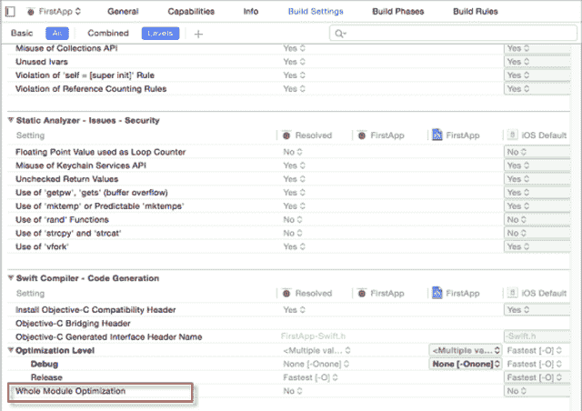
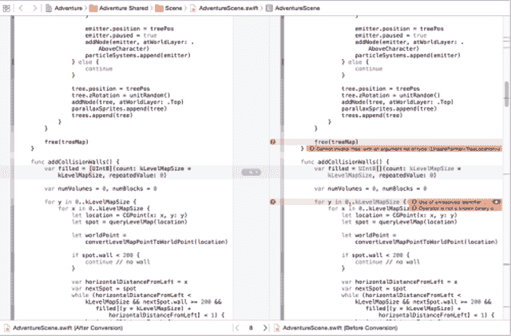
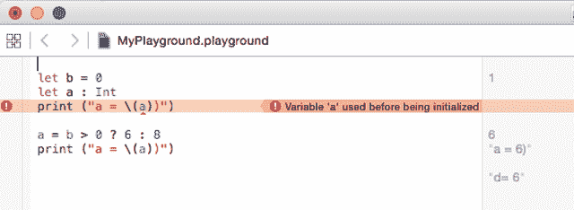

# 新的苹果 Swift 开发者版本中有什么

> 原文：<https://thenewstack.io/whats-in-the-new-apple-swift-developer-release/>

2014 年，苹果发布了一种新的编程语言 [Swift](https://developer.apple.com/swift/) 。当时，Swift 还不太完整，尽管发布了 1.1 版本，但仍有关于性能问题的[报告](http://www.reddit.com/r/swift/comments/2g7dpy/does_swift_have_performance_issues/ "link to ")，特别是在调试模式或非优化代码中。任何新软件的 1.0 版本总会有缺陷，但苹果公司总体上做得很好，值得称赞。

## Swift 1.2 发布

2015 年 2 月下旬，苹果推出了 Swift 1.2，作为苹果 iOS 8.3 测试版的一部分，供注册 iOS 开发者测试。苹果的政策是在开发版本中不断发布测试版，以便让开发者提前了解未来的功能和变化。在几个测试版之后，他们将推出一个主要版本，新的完整版 Xcode 通常会同步到新的 iPhone/iPad 版本、新的 iOS 版本或像 Apple Watch 这样的新工具，将于 4 月份推出 iOS 8.2。

## 那么这个开发者版本有什么新内容呢？

性能。尽管如果启用的话，编译的时间会长一点。有一个新的构建设置叫做整体模块优化(见下文),可以一起优化目标中的所有文件。此外，编译器现在知道增量编译，现在应该只重新编译已经改变的文件。

与 nil 合并运算符结合使用的不可空变量类型的选项"？?"如果变量为零，允许您指定一个默认值，这从一开始就存在于 Swift 中。在 Swift 1.2 中，“？?"这给表达带来了好的影响。在 Xcode 操场上试试下面的代码。它在 Swift 1.1 下无法编译，但在 1.2 下可以正常工作:

|  | (A) (A) (A) (A) (A) (A) (A) (A) (A) (A) (A) (A) (A) (A) (A) (A) (A) (A) (A) (A) (A) (A) (A) (A) (A) (A) (A) (A) (A) (A) (A) (A) (A) (A) (A) (A) (A) (A) (A) (A) (A) (A) (A) (A) (A) (A) (A) (A) (A) (A) (A) (A) (A) (A) (A) (A) (A) (A) (A) (A) (A) (A) (A) (A) (A) (A) (A(A) (A) (A) (A) (A) (A) (A) (A) (A) (A) (A) (A) (A) (A) (A) (A) (A) (A) (A) (A) (A) (A) (A) (A) (A) (A) (A) (A) (A) (A) (A) (A) (A) (A) (A) (A) (A) (A) (A) (A) (A) (A) (A) (A) (A) (A) (A) (A) (A) (A) (A) (A) (A) (A) (A) (A) (A) (A) (A) (A) (A) (A) (A) (A) (A) (A) (A？)(我)(们)(都)(没)(想)(到)(这)(些)(事)(,)(我)(们)(都)(不)(想)(到)(这)(里)(去)(了)(,)(我)(们)(还)(没)(想)(到)(这)(些)(事)(,)(我)(们)(就)(没)(想)(到)(了)(。)(这)(就)(是)(我)(们)(的)(一)(个)(情)(况)(,)(我)(们)(都)(不)(知)(道)(,)(我)(们)(还)(不)(知)(道)(,)(我)(们)(还)(有)(些)(情)(况)(。？&)(我)(们)(都)(不)(知)(道)(,)(我)(们)(还)(不)(知)(道)(,)(我)(们)(还)(不)(知)(道)(,)(我)(们)(还)(不)(知)(道)(,)(我)(们)(还)(不)(知)(道)(,)(我)(们)(还)(不)(知)(道)(,)(我)(们)(还)(不)(知)(道)(。(一) (一) (一) (一) (一) (一) (一) (一) (一) (一) (一) (一) (一) (一) (一) (一) (一) (一) (一) (二) (一) (一) (一) (一) (一) (一) (一) (二) (一) (一) (一) (一) (一) (二) (一) (一) (一) (二) (一) (一) (一) (一) (一) (二) (一) (一) (一) (二) (一) (一) (一) (一) (一) (二) (一) (一) (一) (一) (二) (一) (一) (一) (一) (二) (一) (一) (一 |

第一次打印输出 99999，第二次输出 6。OR ||右边稍显混乱的表达式表示，如果“a”为零，则默认为“0”然后，如果 a > 0 或 b > 0，打印可选的“a”的展开值。零合并运算符"？?"从“a 可选”中展开值，但是 print(a)没有，所以它需要 print(a！)来显式解包。

## 转换工具

如果您有大量 Swift 1.0/1.1 代码，您可能希望运行 Swift 转换工具以升级到 Swift 1.2。在“编辑”菜单上查找“转换”，在子菜单上查找“至最新 Swift”。这可能需要几分钟时间，具体取决于有多少文件。

下面我在苹果 Adventure App 上试了一下，是 Swift 1.0 出来的。在转换之前，它有 103 个编译错误。转换后，它仍然有 26 个，所以它不是完美的，但它纠正了其中的 75%。

冒险的转换失败

在您提交转换(通过点击保存)之前，它会显示更改的并排预览，以便您可以看到将被更改的内容，这为您提供了取消转换的选项。它还为您提供了在大规模转换之前拍摄快照的选项。

许多错误的问题是有两个可能的修复。我只需点击每个错误并选择适当的修复，通常通过添加“？”使类型可选。其他的是没有被打开的可选类型。

## 新的集合数据结构

从 Swift 1.0 中省略，set 相当于 Objective-C 的 NSSet 类型。基于类型定义一个集合，然后向实例添加成员。我使用了枚举类型，但是任何类型都可以:

|  | 

枚举 颜色:Int{case红色，橙色，黄色，  绿色，  蓝色，  红色，  颜色 。 橙色，  颜色 。 绿色)//设置用三种颜色初始化

drink colors。 插入 ( 颜色 )。 蓝色 )

打印(“drink colors”有\( drinkColors )。 计数)颜色)//4

drink colors。 去掉 ( 颜色 )。 红色 )

打印(“drink colors”有\()。 计数)颜色)//3

drink colors。 去掉 ( 颜色 )。 红色 )

打印(“drink colors”有\()。 计数)颜色)//3

 |

这里我定义了一个枚举，Colors，然后基于它创建了一个集合 drinkColors，最初用红色、橙色和绿色填充。然后加入蓝色，红色去除两次。不变的第三个计数为 3 是因为您不能从集合中移除已经移除的值。

## 让常数

要指定一个常量值，可以使用关键字 let 来声明它，同时指定一个值。与许多只能分配编译时间常数的语言不同，Swift 允许您分配一个计算值。在 Swift 1.2 中，您现在可以声明一个常量并推迟赋值。如果您试图在赋值前使用它，编译器会抱怨:

下面是正确的用法:

|  | 

让b=0

让a:Int//声明一个

a ？6:8//赋值取决于 b

打印(" a = \()

 |

这里它在第二行声明，但直到第三行才赋值。老实说，没什么大不了的。与早期的 Swift 版本一样，下面的方法有效:

|  | 

让b=1//试同 0

让a=b？6:8

打印(" a = \()")

 |

## 结论

Swift 在每个版本中都变得越来越好，Swift 1.2 版本——即使是测试版——也是一个重大改进。不过，在 Swift 1.2 正式发布之前，开发者无法在 App Store 中部署 Swift 1.2 应用。推出 iOS 8.3 版本。

专题图片: [aaron_eos_photography](https://www.flickr.com/photos/aaron_eos_photography/) 拍摄的: [Swift in Flight](https://www.flickr.com/photos/aaron_eos_photography/14643982590/in/photolist-oj3eQs-p5cYXE-55uQ7t-5FHEYw-7B8HvS-54xpd1-dPm4pj-71yhY9-6tRvAE-f4Uqt7-8erju2-2DKAXD-boJ451-boJ2NJ-bBCVJn-boJ2a1-6tMn52-8VLbFc-6tRukq-7V5cDA-pMVTtv-5wdmF6-dPm5CE-raJZqF-qHQoYh-7jCGQA-dn1oZx-e5TKkk-9r9KSc-9KYxHu-dPkYUd-qaYjRi-bBCQ4i-9UXw2b-5KYjdu-bBDgqP-bBCWGX-boJ395-8BoB1a-raJZnV-62Scyr-9r9LKg-4SmHDm-4WE364-fgC93j-dPEW5c-b7hNsk-3cwHe9-bBD6Ui-8VRQSk) 获得 [CC BY-NC-SA 2.0](https://creativecommons.org/licenses/by-nc-sa/2.0/) 授权。

<svg xmlns:xlink="http://www.w3.org/1999/xlink" viewBox="0 0 68 31" version="1.1"><title>Group</title> <desc>Created with Sketch.</desc></svg>