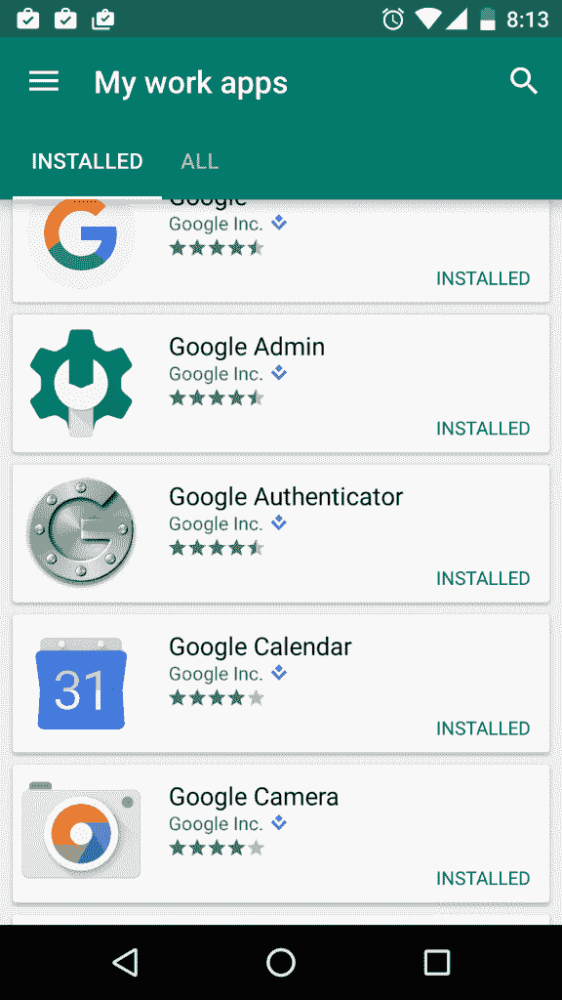
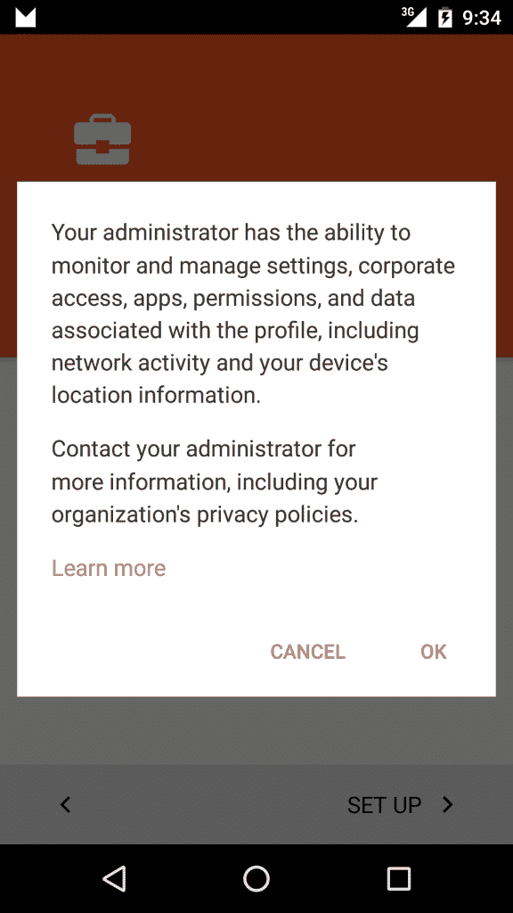
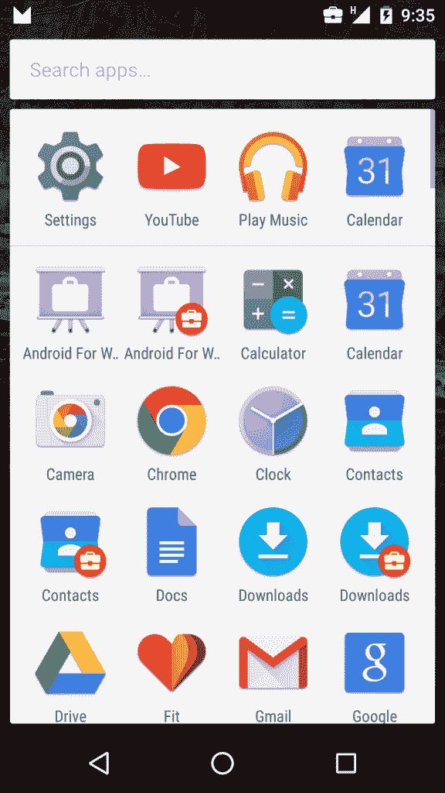
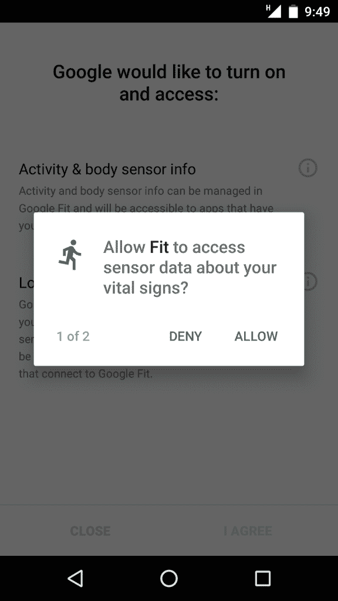

# 面向企业应用程序的 Android Marshmallow 有什么新特性

> 原文：<https://thenewstack.io/whats-new-android-marshmallow-enterprise-oriented-android-applications/>

随着 Android 主导智能手机市场，82.8%的移动设备运行 Android(IDC，2015 年 8 月)，工作场所的移动企业解决方案有很大的潜力。

谷歌今年早些时候宣布的 Android for Work 计划是一系列涉及软件、硬件和企业元素的举措，旨在帮助企业更好地利用移动设备日益增长的普遍性和计算能力。考虑到智能手机和平板电脑在很大程度上没有在工作场所得到充分利用，Android for Work 计划(以及其管理、硬件、软件和网络合作伙伴)旨在提供大量解决方案，以确保企业拥有的一次性(COSU)设备在创新设备上提供一致的安全业务应用管理。

Android 5.0 Lollipop 发布的 Android for Work APIs 兑现了这些承诺，Lollipop 的后续产品增加了许多新功能，以进一步帮助企业将更多设备带到工作中。

## Android for Work 计划的组成部分

### 工作简介

工作配置文件允许专用用户配置文件隔离和保护工作数据，方法是允许用户在其工作设备上拥有个人应用程序和数据，同时知道他们的私人数据是安全的，并且他们的雇主只管理和访问他们工作配置文件上的应用程序和数据。

### 内置生产力工具

它们处理电子邮件、联系人和日历功能。它们还提供文档编辑功能，包括电子表格和演示文稿。

### Google Play for Work

以简单灵活的方式实现面向业务的应用程序的安全部署。所有使用 Android 工作的用户都可以管理应用程序，从而简化为员工和 IT 人员分发应用程序的流程。
[](https://thenewstack.io/wp-content/uploads/2015/09/Screenshot_20150911-081324.png)

### Android 工作应用

对于不运行 Lollipop 和更高版本(但至少运行 Android 4.0 冰淇淋三明治)的旧设备或不能运行原生工作配置文件的设备，Android for Work 应用程序可以提供安全的邮件、联系人、日历、文档、互联网浏览和访问工作应用程序。



要使用 Android for Work APIs，您的应用程序必须有一个 [`DeviceAdminReceiver`](https://developer.android.com/reference/android/app/admin/DeviceAdminReceiver.html) 子类:
这为您的应用程序提供了一种接收 Android 系统发送的与设备管理相关的广播意图的方法。您的`DeviceAdminReceiver`必须在其意图过滤器中处理`DeviceAdminReceiver.ACTION_DEVICE_ADMIN_ENABLED`——这是设备管理员管理设备必须执行的主要操作。当应用程序被启用为管理员时，系统用`DeviceAdminReceiver.ACTION_DEVICE_ADMIN_ENABLED`发送一个意图，它通常在你的`DeviceAdminReceiver`子类的`onEnabled(Context, Intent)`方法中处理。您的`DeviceAdminReceiver`必须包括`BIND_DEVICE_ADMIN`权限，以确保只有系统能够向接收器发送广播。典型的`DeviceAdminReceiver`清单标签如下所示:

```
&lt;receiver
    android:name=".SampleDeviceAdminReceiver"
    android:description="@string/device_admin_description"
    android:label="@string/device_admin_label"
    android:permission="android.permission.BIND_DEVICE_ADMIN"&gt;
    &lt;meta-data
        android:name="android.app.device_admin"
        android:resource="@xml/device_admin_policies"/&gt;
    &lt;intent-filter&gt;
        &lt;action android:name="android.app.action.DEVICE_ADMIN_ENABLED"/&gt;
    &lt;/intent-filter&gt;
&lt;/receiver&gt;

```

`android:description`和`android:label attributes`是启用设备管理员时显示给用户的用户可读文本，描述属性更长，更具描述性。标签中的属性声明了应用程序使用的安全策略。设备管理员可以要求设备要求 PIN 或密码，确定密码要求，要求设备存储加密，禁用摄像头，擦除数据，强制锁定设备，禁用键盘(在 Android Marshmallow 和更高版本中)，等等。这些显然是非常强大的功能，你应该只包括那些与你的应用相关的功能。

完成此操作后，您现在可以将您的应用设置为个人资料所有者或设备所有者。描述文件所有者应用程序在设备上创建受管理的描述文件。这样，用户可以拥有与工作相关的应用程序实例，以及个人应用程序实例。Android 设备管理徽章识别哪些应用是工作应用。



虽然设备所有者比配置文件所有者更强大，但我认为由于设置它们所需的相对麻烦，以及它们带来的潜在安全/隐私问题，企业应用程序应该只设置为配置文件所有者，除非在需要非常严格地控制设备的情况下(例如，单个应用程序总是在最前面的 Kiosk 应用程序)。设备所有者可以执行一些工作配置文件无法执行的操作，包括擦除设备数据、禁用 Wifi 和蓝牙、允许应用程序将自己固定到前台以及许多其他强大的功能。Marshmallow 中添加的一些新功能只能使用设备所有者来实现。但是，在添加任何用户帐户之前，只能在设备的初始设置时(通常通过 NFC)提供设备所有者。请注意，配置文件所有者和设备所有者都需要加密设备。如果设备未加密，将提示用户在资源调配前加密设备。

[![Screenshot_20150911-101016[1]](img/da9a5280a145f7ede5f50d5f5c769f3c.png)](https://thenewstack.io/wp-content/uploads/2015/09/Screenshot_20150911-1010161.png)

要设置工作模式，首先通过检查`FEATURE_MANAGED_USERS`系统功能:
确定设备是否支持管理模式

```
PackageManager pm  =  getContext().getPackageManager();
if  (pm.hasSystemFeature(PackageManager.FEATURE_MANAGED_USERS))  {
    // This device supports native managed profiles!
}else{
    // We need to use an alternative like the Android for Work app
}

```

如果您的设备不支持托管配置文件，我建议您考虑使用谷歌的 Android for Work 应用程序来管理您的 COSU 设备。

接下来，你必须发送一个动作`DeviceAdminReceiver.ACTION_PROVISION_MANAGED_PROFILE`的`Intent`给系统，额外的`DeviceAdminReceiver.EXTRA_PROVISIONING_DEVICE_ADMIN_COMPONENT_NAME`包含一个代表你的应用程序的`DeviceAdminReceiver`的`[ComponentName](https://developer.android.com/reference/android/content/ComponentName.html)`对象。

```
Intent intent  =  new Intent(ACTION_PROVISION_MANAGED_PROFILE);
intent.putExtra(EXTRA_PROVISIONING_DEVICE_ADMIN_COMPONENT_NAME,
new ComponentName(context,  SampleDeviceAdminReceiver.class));
if  (intent.resolveActivity(activity.getPackageManager())  !=  null)  {
    startActivityForResult(intent,  REQUEST_PROVISION_MANAGED_PROFILE);
    activity.finish();
}  else  {
    Toast.makeText(activity,  "Device provisioning is not enabled. Stopping.",
    Toast.LENGTH_SHORT).show();
}

```

请注意，如果您的应用已经在设备上设置了受管理的配置文件，此时会显示一个错误对话框。

设置设备所有者需要更多的工作—设备必须处于未配置状态，这可以通过执行出厂重置来实现。然后，设备所有者通常使用具有 NFC 功能的另一设备来供应。包含应用的设备管理组件(您的`DeviceAdminReceiver`)、url 字符串形式的下载位置以及包校验和的`NdefMessage`通过 NFC 发送到您的目标设备。

```
@Override
public NdefMessage createNdefMessage(NfcEvent event)  {
    try  {
        Properties properties  =  new Properties();
        properties.setProperty(
        DevicePolicyManager.EXTRA_PROVISIONING_DEVICE_ADMIN_COMPONENT_NAME,
        SampleDeviceAdminReceiver.getComponentName(getContext()).flattenToShortString());
        properties.setProperty(
        DevicePolicyManager.EXTRA_PROVISIONING_DEVICE_ADMIN_PACKAGE_DOWNLOAD_LOCATION,  mPackageUrl);
        properties.setProperty(
        DevicePolicyManager.EXTRA_PROVISIONING_DEVICE_ADMIN_PACKAGE_CHECKSUM,  Utils.getCheckSum());
        ByteArrayOutputStream bos  =  new ByteArrayOutputStream();
        OutputStream out  =  new ObjectOutputStream(bos);
        properties.store(out,  "");
        final byte[]  bytes  =  bos.toByteArray();
        return new NdefMessage(NdefRecord.createMime(DevicePolicyManager.MIME_TYPE_PROVISIONING_NFC,  bytes));
    }  catch  (IOException  e)  {
        Log.e(DEVICE_OWNER_LOG,  "Something went wrong!",  e);
        throw new RuntimeException(e.getMessage());
    }
}

```

如果您附近没有 NFC 设备，您也可以使用 ADB shell 中的`dpm`命令行工具在未配置的设备上设置设备所有者。

`adb shell
dpm set-device-owner com.example.android.androidforworksample/com.example.android.androidforworksample.SampleDeviceAdminReceiver`
其中`com.example.android.androidforworksample/com.example.android.androidforworksample.SampleDeviceAdminReceiver`是设备管理组件。

[](https://thenewstack.io/wp-content/uploads/2015/09/Screenshot_20150911-094912.png) 
安卓在棉花糖有了新的权限模型。使用运行时权限，Android 用户在安装或升级应用程序时不授予任何权限。相反，应用程序需要在运行时请求权限。配置文件或设备所有者可以为所有应用程序的运行时请求设置权限策略。棉花糖中默认的运行时权限策略是`DevicePolicyManager.PERMISSION_POLICY_PROMPT`；如果一个应用程序请求运行时权限，系统会向用户显示一个对话框请求权限。设备管理员可以改变这种行为。如果`DevicePolicyManager.PERMISSION_POLICY_AUTO_GRANT`被设置，系统总是授予请求应用程序运行时权限。相反，如果设置了`DevicePolicyManager.PERMISSION_POLICY_AUTO_DENY`，系统总是拒绝运行时权限的请求。如果您想要授予或拒绝特定应用程序的运行时权限，使用`DevicePolicyManager.setPermissionGrantState()`，将目标应用程序的包名和想要的权限作为字符串参数传入。

请注意，已经授予或拒绝的权限不受影响。

```
DevicePolicyManager manager  =  (DevicePolicyManager)
getSystemService(Context.DEVICE_POLICY_SERVICE);
if(setPermissionForAll){
    manager.setPermissionPolicy(SampleDeviceAdminReceiver.getComponentName(this),
    DevicePolicyManager.PERMISSION_POLICY_AUTO_GRANT);
}else if  (setPermissionForSample){
    manager.setPermissionGrantState(SampleDeviceAdminReceiver.getComponentName(this),
    SAMPLE_THIRD_PARTY_APPLICATION,  Manifest.permission.CAMERA,
    DevicePolicyManager.PERMISSION_GRANT_STATE_GRANTED);
}

```

设备管理员现在还可以允许第三方应用程序访问特权证书操作 API。更具体地说，第三方证书安装程序应用程序可以:

*   通过调用`DevicePolicyManager.getInstalledCaCerts()`获取当前信任的所有 CA 证书，不包括系统 CA 证书。
*   通过调用`DevicePolicyManager.hasCaCertInstalled()`检查证书是否被安装为可信 CA。
*   通过调用`DevicePolicyManager.installCaCert()`或`DevicePolicyManager.uninstallCaCert()`作为用户 CA 安装或卸载证书。
*   用`DevicePolicyManager.installKeyPair()`安装证书和私钥对。
*   使用`DevicePolicyManager.uninstallAllUserCaCerts()`从配置文件中卸载所有自定义可信 CA 证书。

在所有情况下，如果已将委托的第三方证书安装程序设置为证书安装程序包，则该安装程序应传递空值作为 ComponentName 参数。您的应用程序可以通过调用`DevicePolicyManager.setCertInstallerPackage()`，以字符串形式传入您的`DeviceAdminReceiver`和您想要的证书安装程序包来设置证书安装程序包。

```
DevicePolicyManager manager  =  (DevicePolicyManager)
getSystemService(Context.DEVICE_POLICY_SERVICE);
manager.setCertInstallerPackage(SampleDeviceAdminReceiver.getComponentName(this),
SAMPLE_DELEGATED_CERTIFICATE_INSTALLER);

```

您的企业应用现在还可以静默授予托管应用对证书的访问权限。通过覆盖`DeviceAdminReceiver.onChoosePrivateKeyAlias()`，您的应用程序可以在系统向用户显示对话框之前返回私钥和证书对的别名。这使您的应用程序能够更好地控制企业应用程序管理的应用程序。

设备所有者对他们在 Marshmallow 中管理的设备有更多的控制权。在企业环境中，尽可能少的分心是很重要的——这就是为什么 Android Marshmallow 允许设备所有者通过调用`DevicePolicyManager.setStatusBarDisabled()`方法，传入他们的`DeviceAdminReceiver`，来禁用状态栏(包括通知)、快速设置和向上滑动手势，从而打开 Google Now。这使得企业体验更加身临其境。设备所有者现在可以选择使用`DevicePolicyManager.setSystemUpdatePolicy()`方法控制用户安装系统更新的时间，这种方法可以自动接受、推迟或设置系统更新窗口，以确保在最合适的时间安装更新。设备所有者也可以通过调用`DevicePolicyManager.setKeyguardDisabled()`来禁用设备的锁屏。

请注意，如果已经设置了密码、模式或 pin，这将不起作用，如果在方法调用后设置了其中的任何一项，键盘守卫将重新启用。

Android for Work API with Marshmallow 的其他变化包括通过`NetworkStatsManager`API 获得数据使用统计的能力、VPN 应用程序的特定通知以及每当来自托管配置文件的应用程序位于前台时出现的新公文包图标。配置文件或设备所有者也可以通过调用`DevicePolicyManager.setUserIcon()`方法来更改当前用户的照片。

随着 IT 管理层有了更多的工具来为 COSU 设备创建企业应用程序，Android Marshmallow 带来了巨大的变化。此外，随着谷歌希望让 Android 操作系统在尽可能多的设备上运行，Android For Work 似乎将继续增长——在此过程中添加新功能。然而，一个问题是由于缺乏与许多新 API 的向后兼容性而导致的碎片问题。并不是每个公司都有能力升级他们的 COSU 设备来安装最新版本的安卓系统。由于大多数 Android for Work API 是在 Lollipop 中引入的(并在 Marshmallow 中更新)，旧设备可能只能用谷歌的 Android for Work 应用程序来凑合。

<svg xmlns:xlink="http://www.w3.org/1999/xlink" viewBox="0 0 68 31" version="1.1"><title>Group</title> <desc>Created with Sketch.</desc></svg>