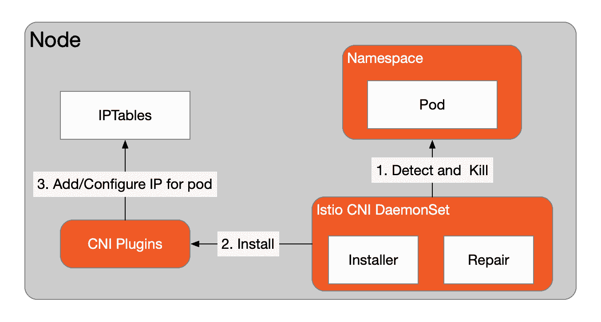

# Istio 1.11 的新功能—强大的第二天体验

> 原文：<https://thenewstack.io/whats-new-in-istio-1-11-robust-day-2-experiences/>

[](https://www.linkedin.com/in/zhihan-zhang-840176169/)

 [张志涵

韩志是 Istio 1.10 的发布经理，也是 Tetrate 的软件工程师。他主要关注云原生开源开发。他是 Tetrate Istio 发行版的维护者和 Istio 贡献者。](https://www.linkedin.com/in/zhihan-zhang-840176169/) [](https://www.linkedin.com/in/zhihan-zhang-840176169/)

[1.11](https://istio.io/latest/news/releases/1.11.x/announcing-1.11/) 是 Istio 在 2021 年的第三次发布。在此版本中，Istio 容器网络接口(CNI)插件升级到测试版。你可以使用 CNI 插件来安装 Istio。

默认情况下，Istio 使用 init-container 来生成从应用程序容器到 sidecar 代理的重定向规则。更改 IPTables 规则需要 NET_ADMIN 和 NET_RAW 权限，这可能不符合生产安全要求。有了这个新插件，社区引入了一种配置 iptables 规则的新方法——使用 Istio CNI。

与 Calico 或法兰绒不同，Istio CNI 不会给工作负载带来新的 IP 地址。它只用于将 iptables 的重定向规则更改为工作负载，并且需要与其他 CNI 插件(如 Calico 或法兰绒)协作。如果工作负载在 Istio CNI 开始之前开始，它可能会触发[竞争条件](https://github.com/istio/istio/issues/11037)问题(即，工作负载箱在 Istio CNI DaemonSet 准备就绪之前开始)。Istio 社区提供了修复控制器解决方案，可通过以下设置进行配置。你可以在[设计文档](https://docs.google.com/document/d/1whTdGCaaD-WPp21XxiLwllnegZpA2FcVLubNm0Tmc98/edit)中找到更多细节。下图显示了 Istio CNI 插件是如何工作的。

[](https://cdn.thenewstack.io/media/2021/08/2ee5750f-image2.png)

您可以使用下面的 YAML 以最小配置文件安装 Istio，然后[安装网关](https://istio.io/latest/docs/setup/additional-setup/gateway/)。

```
kubectl apply  -f  -  <<EOF
apiVersion:  install.istio.io/v1alpha1
kind:  IstioOperator
metadata:
  namespace:  istio-system
  name:  example-istiocontrolplane
spec:
  profile:  minimal
  components:
    cni:
      enabled:  true
      namespace:  kube-system
  values:
    cni:
      cniBinDir:  /home/kubernetes/bin
      repair:  true

```

## 外部控制平面(Beta)

在生产中，如果我们能够将不同集群中的应用程序的责任划分给不同的操作员，那就太好了。Istio 引入了一个外部控制平面，允许用户在不同的集群上安装他们的操作员，并管理运行应用程序容器的集群。

驻留在远程集群中的侧柜，包括网关，可以由控制平面通过远程集群中的入口网关远程操纵。

要尝试外部控制平面，您可以设置多种集群。您可以使用此[设置](https://github.com/istio/istio/blob/master/prow/integ-suite-kind.sh)，并遵循[外部控制平面](https://istio.io/latest/docs/setup/install/external-controlplane/)文档。

## 版本和标签部署的更新

[在我们之前的文章](https://thenewstack.io/istio-1-10-improves-scalability-and-revision-control/)中，我们描述了 Istio 如何为 Istio 集群中的金丝雀升级引入实验性的修订标签升级。现在，修订标签特性已经从实验阶段发展到稳定阶段。

修订标签设置与 1.10 相似。例如，如果您安装了两个版本，比如 1-7-6 用于生产，1-8-3 用于 canary update，那么您可以创建两个版本标记，如下所示:

```
istioctl tag set prod-stable  --revision  1-7-6
Istioctl tag set prod-canary  --revision  1-8-3

```

在我们验证了 canary 修订版运行良好之后，我们可以使用以下命令将生产 Istio 更新到新的修订版:

```
istioctl tag set prod-stable  --revision  1-8-3

```

要查看所有修订标签及其名称空间，您可以运行以下命令:

```
istioctl tag list
TAG REVISION NAMESPACES
prod-canary  1-8-3 ...
prod-stable  1-7-6    ...

```

有关更多信息，请查看更新的 [canary 更新文档](https://istio.io/latest/docs/setup/upgrade/canary/#stable-revision-labels-experimental) **。**

## Kubernetes 多集群服务(MCS)支持(实验)

在 [KEP 1645](https://github.com/kubernetes/enhancements/tree/master/keps/sig-multicluster/1645-multi-cluster-services-api) 中，Kubernetes 引入了它的原生多集群服务 API，这里是它的 alpha 实现。MCS 自定义资源定义(CRDs)定义了用于跨多个集群导出服务及其端点的 API。目前，它仍处于 alpha 阶段，还没有准备好投入生产。您可以在 Istio 上查看有关 MCS 服务发现的[问题 29384](https://github.com/istio/istio/issues/29384) ，并在 Istio 上查看有关 MCS 主机配置的[问题 33949](https://github.com/istio/istio/issues/33949) 。

## 摘要

Istio 今年的三个版本总体上延续了年初设定的目标，即改善第二天的体验，我们已经看到 Istio 社区在安全性和对多个集群的支持方面付出了很多努力。同时，鉴于 Istio 陡峭的学习曲线，Tetrate 发布了免费的 [Istio 基础课程](https://academy.tetrate.io/courses/istio-fundamentals)和[认证 Istio 管理员](https://academy.tetrate.io/courses/certified-istio-administrator)来帮助你学习和掌握 Istio。

<svg xmlns:xlink="http://www.w3.org/1999/xlink" viewBox="0 0 68 31" version="1.1"><title>Group</title> <desc>Created with Sketch.</desc></svg>