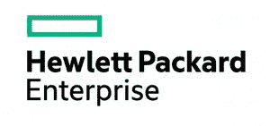

# HPE 探索的四个问题

> 原文：<https://thenewstack.io/whats-new-stack-server-conference-uncovering-future/>

下周，更名为的[惠普公司将在伦敦举行其第一次](http://www.nytimes.com/2015/10/31/technology/meg-whitman-seeks-reinvention-for-hp-as-it-prepares-for-split.html)[发现](https://www.hpe.com/events/discover/)会议，会议将使用 [HPE 品牌](https://thenewstack.io/the-hewlett-packard-enterprise-logo-is-a-story-about-devops-and-the-paradox-of-youth-and-age/)、。顾名思义，HPE 将专注于企业，这对其客户来说是个好消息，因为这将使公司能够更快地创新和响应市场。HPE 不再是生产打印机和笔记本电脑的公司；那是消费品公司惠普公司

但 HPE 主要也是一家硬件公司，因此对于任何一家同时拥有硬件和软件的公司，首席信息官必须询问公司的利益在哪里，尤其是如果首席信息官主要对软件感兴趣的话(我们的读者无疑也是如此)。

去年，[惠普对 OpenStack](http://www.eweek.com/cloud/hp-invests-1b-in-openstack-cloud-rebrands-cloud-os-as-helion.html) 进行了巨额投资，主要是为了生产支持其 Helion 云服务的平台。OpenStack 今年所取得的成就有相当一部分是由于惠普的慷慨才得以实现的。

然而，惠普已经向客户销售了 Helion，以及 OpenStack，主要是通过其硬件，通过一些策略，包括设计和销售专用服务器机架，销售硬件，就像它是一项服务一样，围绕特定用例或为主要企业客户定制服务器，最后，对脸书的开放计算规范进行自己的诠释。

开放计算(Open Compute)正在制定一套新的、对服务器制造商来说可能令人不安的指导原则:寻求接近脸书或谷歌规模的真正大型数据中心必须考虑服务器硬件是短暂的、廉价的和商品化的。如果你认为 Docker 在帮助开发人员像对待牲畜而不是宠物一样对待虚拟服务器方面取得了进展，脸书可以通过帮助数据中心经理像对待一次性电池一样对待物理服务器来取得进展。

为了保持竞争力，HPE 需要解决大型数据中心和企业的问题。为了找到一种方法做到这一点，惠普尝试了它所能做的一切:以一种前所未有的方式细分机架；采用全新冷却技术的集群存储和内存；与英特尔合作，为处理器互操作性设计全新的管道。

当一些东西确实吸引了不同的客户时，这种销售将带来软件堆栈——open stack、OpenShift，可能是 Docker，可能是 Kubernetes，很可能是微服务架构。通过这种方式，HPE 通过向首席技术官和首席执行官销售我们几乎不谈论的硬件，引发了对我们每天谈论的软件的重大投资。

因此，当新的堆栈下周加入伦敦的新 HPE 时，我们将提出四个关键问题:

**1。什么是 HPE 开发者故事，它与它在开源生态系统中的位置有什么关系？**

Helion line 的 HPE 产品和服务副总裁 Omri Gazitt 上周在 Dockercon 表示，HPE 已投资开发由开源驱动的 Helion 平台。它将 OpenStack 视为其基础架构战略的核心，并将云计算作为 PaaS 层的基础。这是一部讲述 HPE“基础设施很重要”的信念的戏剧，它需要影响基础设施之上的软件堆栈。至于容器，Gazitt 说，HPE 将它们的使用与“原生云”场景联系起来，这是一个公司用来定义服务环境的术语，它更多的是以应用程序而不是机器为中心。容器也可以作为公司的一种方式，将后端系统保存在数据驻留的场所，前端系统集成到例如 Amazon Web Services (AWS)中。

通过这种方式，使用 AWS，它提出了一个问题:谁将构建那些可以在 AWS 上使用的应用程序？是已经接受 Docker 及其构建应用程序的能力而不需要固执己见的系统的开发人员，还是更喜欢结构化 PaaS 环境的人。Cloud Foundry、OpenStack 和 Docker 都有独特的生态系统。

[Omri Gazitt，惠普企业:DockerconEU](https://thenewstack.simplecast.com/episodes/omri-gazitt-hewlett-packard-enterprise-the-hpe-helion-platform-at-dockerconeu) 的 HPE Helion 平台

那么，惠普适合做什么？Gazitt 表示，正如它现在如何将 Docker 集成到 Cloud Foundry 中所显示的那样，它处于重叠之中。惠普使用带有液滴执行引擎(DEE)的上游云代工厂。用户可以携带自己的 Docker 容器，并将其部署到 PaaS 中。这是一种可以将 Docker 环境引入 Cloud Foundry 的方法，本质上是将不同的生态系统结合起来。

**2。****HPE 是否致力于有益于异构部署场景的技术？没有人预料到 HPE 的服务器会突然变回印着绿色矩形(公司的新标志)的裸机。可以预期新公司将使其品牌区别于其竞争对手，如 IBM、联想、戴尔和思科，尽管业绩不能是 HPE 这样做的唯一标准。**

根据 IDC 的数据，在 2015 年第二季度，惠普在全球服务器市场的收入份额中占据了超过四分之一的份额，扩大了其与长期竞争对手戴尔的差距。IBM 在同一季度正式失去了份额，但这主要是因为它完成了将其 x86 服务器业务出售给联想。这一举动使联想迅速成为仅次于 IBM 的市场第四大玩家，与思科并列。

为什么这很重要？新的 HPE 有足够的勇气。它有能力创建一种部署服务的技术，使数据中心在很大程度上依赖于 HPE 工具和技术。在某些方面，这样做可能会遭到非议，但如果 HPE 的企业客户签署了协议，没人会在乎去数他们。HPE 将在多大程度上从它的成功中获利？在本地部署 HPE 服务器的企业中工作的开发人员和 DevOps 专业人员是否会被迫按照 HPE 建议的或 HPE 要求的方式改变他们的实践？

换句话说，那些忘记了微软上世纪 90 年代工作方式的人，可能注定会重蹈覆辙。

**3。****Helion 和 Stackato 在新品牌下会变成什么样？** Helion 最初是惠普的公共云品牌，基于 OpenStack (IaaS)和 Cloud Foundry (PaaS)，是亚马逊的替代产品。当亚马逊看起来将继续把惠普甩在身后时，惠普重新选择 Helion 作为其运行私有云和托管云的软件栈。HPE 正在将 Helion 的堆栈部分建设成一个全面的开发平台，并为容器和微服务提供特殊支持。

但是 HPE 与 VMware 有着特殊的关系。Helion 的大规模部署涉及 VMware vSphere 分布式交换机的使用，这为 vSphere 工作负载管理带来了机遇。正如我们在这里所报道的， [vSphere 的容器化概念与我们所熟知的微服务架构有着显著的不同](https://thenewstack.io/vmwares-photon-platform-and-how-it-treats-containers/)。

在 [Project Photon](https://thenewstack.io/vmware-open-sources-photon-controller/) 中，VMware 会将容器包裹在保护涂层中，使其在 vSphere 看来像是普通的虚拟机，从而改变容器之间的网络连接方式，使网络连接依赖于 vSphere 的覆盖层。一方面，HPE 可能正在启用微服务；另一方面，VMware 可能会对它们做一些有趣的小调整。

还有一个值得注意的事项:我们下载了 Discover 2015 计划的 Excel 电子表格，并附有完整的描述，在下周的 799 个单独的会议项目中，“Stackato”这个词一次也没有出现。[惠普去年 7 月从 ActiveState 收购了 Stackato】。11 月 1 日，HPE 将斯塔卡托更名为“HPE 海伦·斯塔卡托”它将继续得到支持和更新，但它会是 HPE 的 OpenStack 的 PaaS 吗——该公司的 Red Hat 的 OpenShift 的对等物？](https://thenewstack.io/hp-acquires-stackato-activestate-will-integrate-helion/)

**4。HPE 在 SDN 领域的举措将如何影响开放系统的架构？**虽然我们在主题列表中没有看到“Stackato”，但我们确实找到了大约 15 处“SDN”正如网络设备领导者思科在大举进军服务器市场后发现的那样，SDN 网络的软件特性降低了数据中心对硬线和第 2 层交换机的依赖。

坦率地说，您的基本 Docker 网络架构并不复杂。每个容器都有自己的端口，一个特定于容器的集线器在端口之间转发数据包，把自己当作“中央车站”对于匆忙的微服务来说，这是一个问题，这就是为什么 Docker Inc .投资 SocketPlane，也是为什么 Weaveworks 变得如此突出，如此迅速。在现代微服务架构中，容器有自己的 IP 地址。

决定本地子网如何通信的层可以由 orchestrator 运行。或者，运行这些服务的服务器的底层硬件也是一个因素。英特尔一直在研究如何让其处理器加快开放式虚拟交换机的功能(开放式 vSwitch 和[直到最近的](https://www.sdxcentral.com/articles/news/intel-dead-ends-fork-open-vswitch/2014/11/)，它自己的专有替代方案)。在过去的几年中，英特尔一直在向其主要客户(包括惠普)开放越来越多的至强处理器硬件，以进行定制。英特尔的目标是让软件深入操作系统和各种服务层，并直接利用嵌入其芯片的功能。

SDN 是英特尔针对这些服务器芯片的“杀手级应用”。但是那些能力如果不会编程就无法实现。在某些时候，这些硬件辅助的 SDN 超能力需要浮出水面。这需要像 HPE 这样的供应商来实现。为什么这对你很重要？因为你现在可能正在构建一个微服务应用，这可能会在下一年改变，或者需要改变。

《书库》的新任主编亚历克斯·威廉姆斯对此做出了贡献。

Docker、HPE 和英特尔是新堆栈的赞助商。

专题图片:[路易斯·勒雷纳](http://negativespace.co/photos/london-eye/)在 NegativeSpace.co 创作的伦敦眼，获得知识共享许可。

<svg xmlns:xlink="http://www.w3.org/1999/xlink" viewBox="0 0 68 31" version="1.1"><title>Group</title> <desc>Created with Sketch.</desc></svg>