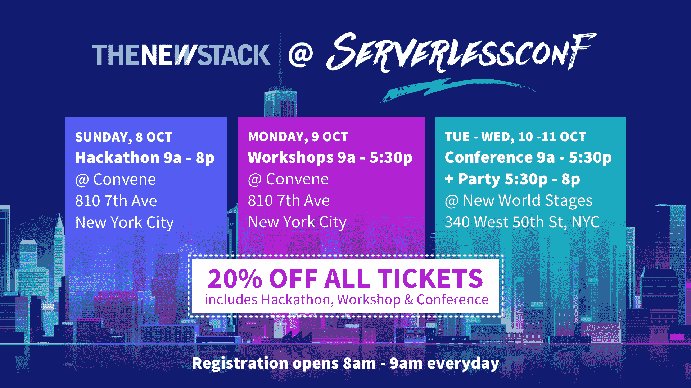

# 无服务器平台的下一步是什么

> 原文：<https://thenewstack.io/whats-next-serverless-platform/>

2015 年，我们发布了[无服务器框架](https://serverless.com/framework/)，希望帮助开发者在新的无服务器计算服务之上构建应用，如 AWS Lambda(也称为 Functions-as-a-Service)。

该框架已经成为 GitHub 上发展最快的开源项目之一，也是无服务器运动的主要焦点。我们的项目倾向于充当一个领头羊:一个任何人都可以去跟踪用例和新兴趋势的地方。

这让我们对为什么无服务器运动如此强劲有了一些了解，并给我们留下了它走向何方的线索。

## 过去

当该框架在 2015 年首次推出时，我们惊讶地发现有这么多进步的企业排队试用它。

 [奥斯汀·柯林斯

Austen Collins 是软件工程领域的领导者，专注于应用技术来创造商业价值、优雅的产品和客户体验。Austen 是无服务器框架的创造者，这是一个流行的工具，通过利用 AWS Lambda、Azure Functions 等新的云技术，以最小的支出和运营开销快速构建应用程序。2015 年，他成立了无服务器公司，为无服务器架构创建开发工具和基础设施。他住在加州旧金山。](https://serverless.com/) 

这些早期采用者是真正的皈依者:来自微服务、容器和传统云架构世界的叛逃者。他们从现代软件开发的复杂性中寻求庇护——数量惊人的工具和最佳实践、运营开销，以及与“如何构建 x”的宗教战争相关的一般宣传。

虽然“无服务器”这个术语在语义上有点争议——现在仍然如此——但早期采用者并不介意。工程师们不顾一切地将产品推向市场并降低管理费用。“无服务器”这个词向他们承诺了一项刚刚脱离他们的方式的技术。这是一个引起共鸣的信息。

无服务器社区团结在一条准则下:少即是多。他们想要更多的结果，而不是更多的技术。

## 便利吸引用户

到 2015 年底，工程师开始在其组织内进行无服务器概念验证。早期试验的成功使他们能够审视现有业务逻辑的每一部分，并问*“它会实现吗？”*

最初的无服务器用例主要是数据处理。但突然之间，工程师们将所有类型的工作负载都塞进了 Lambda:使用无服务器计算来构建后端和自动化工作流。他们通过最少的努力或管理，生产出自动扩展、按执行付费的微服务。效率的提高太诱人了，不容忽视。

尽管无服务器计算的一些早期限制成为了潜在的障碍，工程师们还是选择妥协或寻找变通办法。云提供商急于通过不懈的修复和新功能发布来解决限制。这为无服务器优先工程师提供了更多动力。

> 为了实现无服务器架构的全部潜力，社区需要一个单一、统一的体验来跨所有无服务器计算提供商部署功能和管理其生命周期。

当那个初始问题的答案为“*时，它会λ吗？*”，答案是否定的，企业继续以积极的前景向前推进。他们说，“*好了，还要多久才能到？*

无服务器计算承担了占据工程师一天的大部分管理任务，并消除了这些任务。这些额外的空闲时间开始体现在新项目和创造性的修补上。各种各样的项目浮出水面:聊天机器人、DevOps 自动化、文件操纵器、策略实施器、webhook 监听器、HTML 呈现器、调度任务等等。

在传统的架构会议中，讨论通常是关于管理的；在无服务器的会议中，谈话通常是对已有成果的庆祝。

## 无服务器团队的崛起

无服务器项目完成后，一个有趣的情况出现了:它的工程师(大部分)可以自由地承担新的工作。

在公司内部，流氓无服务器先锋获得了一批追随者，并形成了第一个非官方的无服务器团队——尽管团队规模很大，但却非常高效。他们经常作为独立的单位运作，实践自动化的随机行为，并冒险执行任务，以无服务器的方式处理新的工作。

截至 2016 年底，在无服务器框架发布仅一年后，大型企业中的几个团队已经将数百个无服务器功能投入生产。

## 无服务器优先

经理们注意到了。最高级别的商业领导一直在追求积极的数字产品目标。他们希望比竞争对手更快地创新，并立即推向市场，冲洗，重复。

商业领袖开始着眼于无服务器架构的竞争优势，一些首席技术官甚至选择建立自己的无服务器原型，以加快购买速度。尚未采用公共云的大型企业想要直接进入无服务器模式。

他们认为这是一个更容易使用的云版本，可以相对容易地将他们庞大的劳动力转化为一个重量级的云工程师团队。

## 礼物

无服务器运动的势头激发了其他供应商提供他们自己的无服务器计算服务。已经不只是 AWS Lambda 了。

现在有了 [Azure Functions](https://thenewstack.io/microsoft-debuts-azure-functions-house-use-adds-telemetry-cloud-version/) 、 [Google Cloud Functions](https://thenewstack.io/google-cloud-functions-arrives-challenge-aws-lambda/) 和 [IBM Cloud Functions](https://console.bluemix.net/openwhisk/) (基于 OpenWhisk)，以及服务于特定用例的较小供应商，如 [Twilio Functions](https://thenewstack.io/twilio-functions-show-serverless-useful-model/) 、 [PubNub Functions](https://thenewstack.io/pubnub-makes-network-programmable/) 、 [Auth0 Webtask](https://thenewstack.io/often-choose-webtask-lambda/) 。还有几个无服务器计算实现正在用 Docker 和 Kubernetes 构建，比如 [Kubeless](https://github.com/kubeless/kubeless) 和[裂变](https://github.com/fission/fission)。

较大的提供商正在引入几十种新的托管服务和 API，如谷歌的 [Speech](https://cloud.google.com/speech/) 和[Vision](https://cloud.google.com/vision/)API，以及 AWS 的 [Lex](https://aws.amazon.com/lex/) 和 [Polly](https://aws.amazon.com/polly/) 服务，它们与无服务器计算很好地结合在一起，通常遵循无服务器精神。

主要云提供商之间的功能竞争正在加速。与此同时，开发人员和组织很高兴有越来越多的工具可供他们使用，来解决更多的问题和提供更多的创新。

## 实施的时间到了

无服务器倡导者希望标准化无服务器开发，以便其他人可以在他们的整个组织中采用它。

显然需要更好的工具来支持无服务器开发和生命周期管理。组织已经为此采用了许多特定于平台的解决方案(例如 [AWS CodeBuild](https://aws.amazon.com/codebuild/) ),但稍有犹豫。供应商锁定剥夺了他们在运行时和选择自己的生命周期管理工具方面的任何灵活性。这也使得很难将这些特定于提供商的架构转移到另一个提供商。

因此，对于无服务器的团队来说，无服务器框架已经成为他们采用故事中不可或缺的一部分。

## 激励多云

在这个过程中，无服务器计算出现了一个意想不到的结果。它使得利用云服务就像上传功能一样简单。*需要采用云提供商吗？在那里贴一个函数。*此外，无服务器功能是自动扩展和按执行付费的，这意味着跨多个地区甚至多个提供商提供功能是微不足道的。

AWS Lambda 最初被认为是将 AWS 的服务粘合在一起的一种方式。很快就清楚了，无服务器计算，总的来说，是一种将所有的*服务和平台粘合在一起的方式。这种绑定能力提供了对多云和混合云架构的有趣理解。*

虽然令人兴奋，但它确实引发了关于无服务器架构应该是什么样子的讨论。考虑到无服务器架构同时存在于各个地方，我们应该继续以特定于平台的方式来考虑它们吗？此外，如果无服务器架构是通用的，这对数据意味着什么？

## 将来的

目前没有跨供应商的标准化。为了实现无服务器架构的全部潜力，社区需要一个单一、统一的体验来跨所有无服务器计算提供商部署功能和管理其生命周期。

无服务器框架可以做到这一点。它是第一个为无服务器架构提供应用程序模型的工具；现在，它是第一个为在每个无服务器计算供应商上部署和管理无服务器功能提供统一体验的工具。

但是我们仍然需要无服务器标准。每个供应商对函数签名等东西都有不同的设计，这使得采用和可用性比它需要的更具挑战性。

无服务器框架背后的团队正在与[云本地计算基金会](https://www.cncf.io/)和主要的云提供商合作，以汇聚无服务器概念的标准。讨论仍处于早期阶段，但所有利益相关者都非常合作，包括较大的供应商。

## 功能和事件的故事

到目前为止，无服务器的故事主要集中在函数上。然而，这只是前半部分。

故事的另一半是关于数据——因为无服务器架构本质上是基于事件驱动的计算，所以它们的数据以事件的形式表示。

现在，无服务器功能已经使我们能够轻松地对任何事情做出反应，*一切*都开始看起来像一个事件:业务事件、应用程序状态变化、同步请求、异步请求、通知、消息、审计跟踪、系统日志、错误、指标、警报、webhooks、点击流、健康检查……对于无服务器功能，世界充满了事件，只需等待行动和分析。

事件使数据变得可移植和流动。它们是无服务器函数用来协调的简单契约，不管函数位于何处。它们可以防止供应商锁定，同时支持供应商选择。如果有一种模式可以为组织在未来几年内创建的大量逻辑带来秩序，那么它将是事件驱动模式。

不幸的是，事件驱动的工具和服务目前处于无序状态。在未来，这些工具和最佳实践必须不断发展，以保持我们现在能够达到的生产力水平。

最近，无服务器框架背后的团队宣布了一种新型的开源基础设施，名为[事件网关](https://serverless.com/blog/introducing-serverless-event-gateway/)。该技术融合了 API 网关和发布/订阅模式，为无服务器计算创建了一个高效的事件路由器。

事件网关是无服务器时代缺少的中间件，有可能成为现代数字业务的主干。它的第一个目标是以事件的形式表达所有数据(甚至是原始的 HTTP 请求)。它的第二个目标是将这些事件路由到任何地方的任何无服务器计算提供商。

Event Gateway 将使团队能够轻松编写跨云提供商(或内部)的无服务器功能，并根据这些功能采取行动。

这个项目之后很快就是[无服务器平台](https://www.serverless.com)，它支持跨无服务器应用的团队协作，并为事件数据管理提供解决方案。所有这些工具都将遵循上述无服务器标准。

## 完全自动化和智能化

自动化预计将大幅增长——鉴于世界日益增长的复杂性和成本，这是必然的。为了在竞争激烈、成本高昂的时代取得成功，每个组织、团队和个人都需要自动化的力量。

随着自动化的兴起，智能系统也将兴起。允许实时、上下文相关的数据处理的架构将允许企业在问题出现的确切时刻做出更好的决策。

无服务器计算和无服务器架构可以实现这些场景，其潜力不可低估——尤其是当您将无服务器功能的易用性与事件驱动设计的可扩展组织能力相结合时。功能和事件是我们一直在等待的两个简单的概念，用来构建自动化和智能化的庞大系统，同时保持运营开销最小化。

这只是无服务器架构和无服务器整体故事的开始。虽然潜力是无限的，但要实现这一潜力，我们需要新型工具和基础架构来构建和运行这些下一代无服务器架构。

这是我们在[无服务器公司](https://www.serverless.com)正在建造的东西。

云计算原生计算基金会(T4)、谷歌和微软是新堆栈的赞助商。

通过 Pixabay 的特征图像。

<svg xmlns:xlink="http://www.w3.org/1999/xlink" viewBox="0 0 68 31" version="1.1"><title>Group</title> <desc>Created with Sketch.</desc></svg>