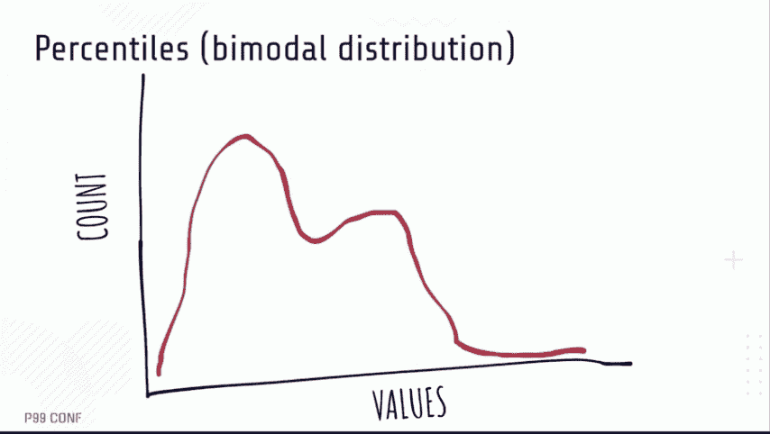

# 当 99%的服务级别目标被高估(并且过于昂贵)时

> 原文：<https://thenewstack.io/when-99-service-level-objectives-are-overrated-and-too-expensive/>

集体智慧认为 99%的站点可靠性可能是标准，但是 [Nobl9](https://www.nobl9.com/) 的主要可靠性倡导者 Alex Hidalgo 说这样高的标准通常是不必要的。有时候 80%就可以了！

什么时候值得退出站点可靠性 99.9%的竞赛？真正了解用户的最佳点，以便将资源放在其他地方，这有多重要？这些问题是[亚历克斯·伊达尔戈](https://www.linkedin.com/in/alex-i-am-not-looking-for-a-job-please-stop-hidalgo-6823971b7/)在他的 2022 年 P99 会议演讲“扔掉你的 9 分”中提出的

对于[站点可靠性工程](https://thenewstack.io/usenix-the-3-measures-of-successful-site-reliability-engineering/) (SRE)来说，服务水平目标 (SLOs)是一个至关重要的数字，它要求 99%以上的站点可靠性，这是一个神话。SLO 指定了服务向其用户保证的正常运行时间的程度。在许多情况下，99%是不必要的，提供如此高可靠性的服务会很快耗尽预算。

假设一家公司希望“所有 API 请求中有 95%返回非错误状态”。加上 SLO 目标，这个请求就变成了“99%的请求每 30 天都是好的”Hidalgo 解释说，通常会附加百分位数，因为正是这些百分位数通知 SLO，以便原始请求再次转换，现在是“所有请求的第 99 个百分位数，每 30 天在 500 毫秒内完成 95%。”这就是伊达尔戈所说的越来越严重的问题所在，“我们真的开始把东西堆在一起，越来越多的 9 被牵涉进来。”

## **延迟是什么样子的？**

在理想情况下，延迟图如下图所示。将图表分成 100 份，因为过去告诉我们，1%的故障率是基线可接受性，这是第 99 百分位(P99)所在的位置。

完美很少发生。更常见的是长尾分布。由快速请求完成组成的小斜坡，随后是平均值，然后当然是由较慢请求组成的右边的长尾逐渐突出部分，这是由于当计算机 API 和网络服务通过互联网交谈时发生的各种问题。P99 还是标配。

但是，如果发生这些延迟事件，会发生什么呢？

标准公式并不是每次都有效。延迟图看起来并不总是一样的。并非所有的 p99 都是生而平等的。

## **扔掉你的九分**

将这些数字并排放在一起是相当疯狂的。如果 SLO 承诺 99.999%的“五个九”可靠性，那么每天就剩下 0.9 秒，或者每年总共 5 分 15 秒的不可靠性时间。理论上的完美，但在现实中，难以实现。无论一个站点是多么健壮、有弹性或冗余，仅考虑人力后勤，因为它们涉及一年中 5 分 15 秒的不可靠时间。

即使一年只发生一次事件，如果事件发生在凌晨 3 点，待命工程师登录到他们的计算机并检查 longs 将需要超过 5 分 15 秒的时间。这是花光预算的好方法。降低一些 9 到 99.9%会给一个网站每年 8 小时 45 分钟的不可靠时间，这在现实中看起来要好得多，但这有必要吗？不再需要绝对全能的九种方法意味着什么？这会给斯洛斯带来什么？

## **根据用户需求和现实目标设定意向目标**

当第三方依赖降低了可靠性时该怎么办？伊达尔戈讨论了他的两位富有创造力的客户。

一个客户，公司 A，是一个面向 web 的 API，对它的每个调用都依赖于对它背后的数据库的调用。不幸的是，对于公司 A 来说，数据库经常返回错误，错误率高达 20%。B 公司依赖于“几乎所有能想到的消息供应商”，每个供应商都有不同的错误率。

两家公司都希望获得 99.9%的股份，但在这两种情况下都没有必要。公司 A 采取了保持 80% SLO 目标的方法，但是建立了更好的重试逻辑，所以用户不会注意到有问题。他们将不得不解决数据库问题，但在此期间，用户的需求得到了识别和满足，这难道不是重点吗？B 公司还设置了更好的重试逻辑，以平衡不同的延迟，同时他们更深入地研究了最适合用户的方法。它达到了 SLO 设定的 97.2%的目标。超过这个范围，用户不会注意到，但是在这个范围之下，他们肯定会注意到。

公司 C 和公司 D 之间常见联系是，由于“停机时间”，他们无法达到 99.9%公司 C 执行长时间运行的批处理作业，耗时数小时，每五次就有一次。公司 C 将其 SLO 设定为 80%,因为五分之一的失败被他们视为成功。

D 公司虽然处于迁移过程中，但其主要代码存储系统每天停机一小时来完成备份过程。D 公司从备份流程之外的时间构建了其 SLO。C 公司和 D 公司都远没有达到 99%的可靠性，但是仍然有他们的用户认为成功的指标。

总之，故意就好。并非所有的 9 都是不好的，但是在创建 SLO 目标时，“除了 9，还有 9 个数字你可以实际使用。”当需要时，99%或试图达到 99.99999%的可靠性没有什么错，只要这些指标不只是因为其他人都在做而存在。“适用于一个网站的不一定适用于所有其他网站，”Hidalgo 说。

<svg xmlns:xlink="http://www.w3.org/1999/xlink" viewBox="0 0 68 31" version="1.1"><title>Group</title> <desc>Created with Sketch.</desc></svg>