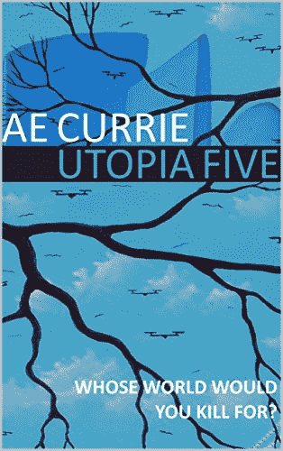

# 当艾获得神的地位:柯里的《乌托邦五》

> 原文：<https://thenewstack.io/when-ai-gains-god-status-ae-curries-utopia-five/>

** 反乌托邦小说远没有，嗯，这年头的小说。然而，很少有作家能写出一个完全被科技扭曲的世界，但却是可信的——甚至是一眼就能认出来的。

AE Currie 是一位居住在伦敦的作家，也是几家科技初创公司的资深人士，也是该行业道德和环境问题的活动家——最近担任 Container Solutions 的首席策略师。她将自己的处女作《乌托邦 5》设定在一个毁灭的世界，从生态和技术角度来说，这个世界离我们现在的位置只有一两步之遥。因此，这个故事听起来非常真实，令人毛骨悚然。

《乌托邦 5》开篇写道，“我叫李，出生于 2025 年 1 月 8 日——圆形监狱开启的那一天。”

因此，我们遇到了我们的主角，李桑兹，并了解了被称为透明日的重大事件。这个想法是许可英国任何地方公共场合使用的每一架无人机、照相机和记录设备，并公开所有数据——全景监狱。

> 这个理论是，任何人都可以看到或听到任何东西。不可能有更多的秘密，我们必须判断或接受人们，只要他们遵守法律。

其他国家迅速跟进，形成了一个全球网络(尽管像朝鲜这样的少数国家仍处于黑暗之中)。当然，问题是如何有效地访问大量的原始数据。谁有时间看这些直播？一位名为 Kirby Cross 的默默无闻的程序员用一个机器人解决了这个问题，这个机器人可以抓取流并返回用户提出的任何问题的答案。克罗斯的公司 Omniscience Industries 成为了一个无处不在的全球观测网络的实际接口，更不用说是世界上最富有的公司了。克罗斯的聊天机器人于 2030 年上线，被命名为德乌斯——这只是一个小小的预兆。毕竟，一个全视全听的全球人工智能会出什么问题呢？

对于这样的设置，这是显而易见的方式。然而，柯里的故事走了一条非常不同的道路。几年后，在 2036 年，气候变化终于兑现了人类几十年来对地球的透支支票。在炎热的夏天，地球上的大部分地区不是被烧毁就是被洪水淹没，数十亿人死亡。幸存者求助于德乌斯，想知道如何应对和管理灾难，然后如何开始恢复文明和环境。

所有这些构成了这本书错综复杂的背景。故事本身对读者来说是一次引人入胜的旅程:主角李桑斯(Lee Sands)在自己的家/实验室里差点被炸死。当他掸掸身上的灰尘，喝一杯恢复性的茶时——我们毕竟是在英国——他全身的触觉服告诉他，他不再能够控制他和他的兄弟尼莫建立的网络，以运行由 Nautilus 建立的宇宙，Nautilus 是他们非常成功的 VR 游戏开发公司。

现在是 2053 年，李需要找出谁试图杀死他，为什么他已经从自己的网络中被切断——以及为什么尼莫突然完全从圆形监狱的注视中消失了。所有这些问题都与尼莫的最新视频游戏“乌托邦五号”的测试版有关，该游戏只有李才能正式访问，他必须从头到尾玩一遍才能找到解开这一系列谜团的线索。

柯里很喜欢解开这个未来版《海底总动员》的曲折，但《乌托邦 5》的真正天才在于故事发生的世界的小细节。在她对不久的将来的描述中，人类的基本需求——食物和住房——由世界政府(WorldGov)提供，这个全球管理机构的主席是长寿得令人生疑的比尔·盖茨。(作者热衷于构建这种有趣的小细节，这增加了故事的趣味性，并对抗了仅仅 35 年后世界发现自己所处的相当可怕的环境)。社会本身已经发生了永久性的变化，正如李遇到一群“线路行走者”时所显示的那样，这些“线路行走者”是乘坐马车在电网上行走的巡回工人，他们进行预防性维护，以避免更多破坏国家的野火。

> 在过去的 28 年里，圆形监狱摧毁和创造了许多职业……雷告诉我，在 21 世纪 20 年代，他曾“犯罪”我不确定他是警察还是罪犯，这样问似乎很不礼貌。无论起点是什么，结果都是一样的。撇开我目前的问题不谈，警察队伍现在大部分是社会工作者。这些天来，绝大多数 999 电话都与丢失登录凭证有关。当受害者或调查者通常要做的只是问德乌斯是谁干的时，犯罪几乎不值得努力。

《乌托邦 5》比通常的科幻冒险故事更深入。柯里探索了自由意志的主题，以及快速发展的科技对现代生活稳定的、很大程度上未经检验的改造。更不用说当我们为了安全和透明而自愿放弃隐私时出现的社会类型的非常适用的话题，以及如果我们不开始认真应对气候变化将会发生什么。有趣的是，她在一个重要方面保持了公正:这个版本的未来是反乌托邦还是乌托邦。

毕竟，总得有人考虑这些事情。魔鬼在细节中，安妮·柯里有各种各样的魔鬼般的乐趣来创造错综复杂、令人不安、令人信服的细节世界，这就是“乌托邦五”

***乌托邦五**在[亚马逊上有数字版和印刷版](https://www.amazon.com/Utopia-Five-Panopticon-Book-1-ebook/dp/B07QSW8W9J/ref=sr_1_3?keywords=Utopia+5&qid=1560456040&s=gateway&sr=8-3)。这是一个独立的故事，但也是柯里新推出的全景监狱系列的第一部。后续第二本小说《Conundra》将于 2019 年晚些时候出版。*

披露:这篇文章的作者在 Container Solutions 工作过。

图片由来自 Pixabay 的 Gerd Altmann 提供。

<svg xmlns:xlink="http://www.w3.org/1999/xlink" viewBox="0 0 68 31" version="1.1"><title>Group</title> <desc>Created with Sketch.</desc></svg>