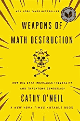

# 人工智能系统中隐藏的偏见

> 原文：<https://thenewstack.io/when-ai-is-biased/>

人工智能和“自动化决策”系统正在许多关键的现实世界环境中实施，将人类排除在这些系统做出的决策之外。但是我们有多确定他们做出的决定从根本上说是正确的呢？

研究人员发现，人工智能模型和决策算法中出现了数量惊人的人类偏见，这反过来又会在不知不觉中导致部署这些系统的公司和政府采取歧视性做法。

美国公民自由联盟刑法改革项目主任[Ezekiel Edwards 去年](https://www.nytimes.com/2016/06/23/us/backlash-in-wisconsin-against-using-data-to-foretell-defendants-futures.html)对《纽约时报》表示:“我认为，我们带着大数据风险评估冲进了未来的世界，而没有适当地审查、研究和确保我们将数据中的许多潜在偏差最小化。”。

本周在麻省理工学院的一次会议上，美国公民自由联盟和数据科学家[宣布了一项新的持续努力](https://www.technologyreview.com/s/608248/biased-algorithms-are-everywhere-and-no-one-seems-to-care/)，以突出算法偏见的例子，与微软研究员 [Kate Crawford](http://www.katecrawford.net/) 和谷歌研究员 [Meredith Whittaker](https://twitter.com/mer__edith) 领导的团队合作，将[称为“AI Now”倡议](https://artificialintelligencenow.com/)。9 月，人工智能造福人类和社会伙伴关系(Partnership on AI to Benefit People and Society)启动，这是一个由亚马逊、谷歌、脸书、IBM、微软和苹果支持的非营利组织，“旨在促进公众理解……并就该领域的挑战和机遇制定最佳实践。”

11 月，麻省理工学院的技术评论[报道](https://www.technologyreview.com/s/602950/how-to-fix-silicon-valleys-sexist-algorithms/)称“计算机正在继承植入语言数据集中的性别偏见。”

从聊天机器人到图像字幕系统，大规模的训练数据集被广泛用于各种事物，“认为‘程序员’这个词更接近‘男人’而不是‘女人’，与‘女人’最相似的词是‘家庭主妇’，”他们引用微软新英格兰研究院的詹姆斯·邹的研究报告。谈到研究结果，哈佛大学教授 [Barbara Grosz](https://grosz.seas.harvard.edu/) 警告说，社会“试图改变未来，使之不同于过去……这是一个伦理问题，即我们是否在抑制我们想要的进化。

“这并不是说你可以避免所有这些类型的偏见，但我们需要在我们的设计中保持警惕，我们需要注意我们对我们的项目及其结果的声明。”

还有指控称，在刑事司法系统中广泛使用的风险评估算法存在另一种偏见。“风险评估的问题从来不会直接询问种族或收入，”内特·西尔弗的 FiveThirtyEight 网站 2015 年的一份报告指出[。"但无论如何，答案可能最终成为种族和阶级的代表."他们提供了一个互动工具，让读者自己处理数据。“例如，如果你是一个没有高中文凭的男人，你更有可能是贫穷的黑人或西班牙裔。如果你是单身，没有工作，情况也是如此。”](https://fivethirtyeight.com/features/prison-reform-risk-assessment/)

多年来，哥伦比亚大学法学教授伯纳德·e·哈科特(Bernard E. Harcourt)一直警告说，一个流行的风险评估问题——过去的定罪——也有同样的效果。他在 2010 年的一篇论文中写道:“前科[已经变成了种族](https://papers.ssrn.com/sol3/papers.cfm?abstract_id=1677654)的代名词。”。

到 2014 年，美国司法部长埃里克·霍尔德[对算法](http://time.com/3061893/holder-to-oppose-data-driven-sentencing/)对少数族裔和社会弱势群体判决的影响也有自己的相关担忧——这一次引用了另一种可能扭曲结果的数据。使用教育水平和就业历史的算法可能会让“那些白领阶层的人受益，他们可能拥有更高的学位，如果你退后一点，他们可能比那些没有完成硕士学位、没有法律学位、不是医生的人造成更大的社会危害…

“我真的担心这会把我们带回到一个我们不想去的地方。”

## 量化偏差

即使到了 2014 年， *Time* [报道称](http://time.com/3061893/holder-to-oppose-data-driven-sentencing/)“在过去十年中，几乎每个州都在不同程度上使用了这种风险评估，许多州已经将这种评估作为判决和矫正的强制手段，以减少飙升的监狱人口，减少累犯和节省资金。”

2016 年，ProPublica——一个获得普利策奖的调查性新闻报道的非营利网站——[检查了佛罗里达州刑事司法系统中用于判决的“风险评估”算法](https://www.propublica.org/article/machine-bias-risk-assessments-in-criminal-sentencing)的准确性，在两年时间里，对布劳沃德县的 7000 名罪犯的实际结果进行了交叉检查。与白人罪犯相比，它发现了对黑人罪犯的惊人偏见。

“这个公式特别容易错误地将黑人被告标记为未来的罪犯，错误地将他们标记为未来罪犯的比例几乎是白人被告的两倍。白人被告比黑人被告更容易被误贴上低风险的标签。”

即使他们排除了过去的犯罪和定罪，“黑人被告仍有 77%的可能性被认为未来有更高的暴力犯罪风险，45%的可能性被预测未来有任何形式的犯罪。”

ProPublica 得出结论，这是风险评估算法的最大问题:它们的有效性还没有得到研究。2013 年的一项研究检查了美国使用的 19 种不同的风险评估方法，并得出结论，“在大多数情况下，有效性只在一两项研究中进行了检查”，并且“通常，这些调查是由开发该工具的同一批人完成的。

在分析中，ProPublica 使用了最广泛使用的风险评估算法之一，该算法来自一家名为 Northpointe 的盈利性公司，该公司“质疑我们的分析”。

ProPublica 也很快指出，它是一个封闭源代码的软件，“所以无论是被告还是公众都不可能看到是什么导致了这种差异。”Northpointe 向该网站承认，他们使用了教育历史以及被告目前是否被雇用作为他们公式的一部分，但坚持认为他们的具体计算是专有的。

闭源算法遭到抨击已经不是第一次了。

## 地理偏见

有时偏见的指控与性别或种族无关。有时偏见可能只是奇怪的地理上的。

六月，美国公民自由联盟报道了一个涉及爱达荷州 4000 名医疗补助接受者的案例，根据他们对评估问卷的回答，他们突然发现他们的福利被削减了 20%到 30%。当被问及为什么被告知“这是商业秘密。”

[Richard Eppink](https://www.acluidaho.org/en/richard-alan-eppink) ，美国公民自由联盟在爱达荷州的法律主管，总结了他们法律团队的回应:“你不能只是用秘密公式得出这些数字。”一名法官同意了——引用了正当程序的基本问题(以及医疗补助法案的细节，需要解释)。“那是五年前……”

美国公民自由联盟最终获得了该算法，他们的分析结论是，该算法基于一个由于“数据输入错误和没有意义的数据”而丢弃了三分之二记录的数据集。他们的分析得出结论，最终的公式在统计上也有缺陷。但它似乎也不成比例地(莫名其妙地)影响着该州的不同地区。

“去年，法院认为该公式本身非常糟糕，违反了宪法——违反了正当程序——因为它实际上给许多人带来了武断的结果。”

美国公民自由联盟的博客认为这是一个教学时刻。“随着我们的技术列车在轨道上疾驰，我们需要联邦、州和地方层面的决策者，他们要很好地理解使用计算机做出影响人们生活的决策所涉及的陷阱。”

 纽约数据科学家凯茜·奥尼尔也表达了同样的担忧，她是畅销书《数学毁灭的武器:大数据如何加剧不平等并威胁民主》的作者上周，她告诉麻省理工学院的《技术评论》,算法“取代了人类的过程，但它们没有相同的标准。人们太信任他们了。”

美国公民自由联盟的埃平克还指出“我们对计算机化的结果都有这种偏见——我们不会质疑它们……我的预感是，随着人们转向这些计算机化的系统，这种事情在美国和世界各地正在大量发生。没有人理解他们，他们认为别人理解他们——但最终，我们信任他们。”

他还担心私营企业会有多大动力去测试他们系统的准确性——“除非通过诉讼将成本转嫁到他们身上。”

西北大学计算机科学教授 Kristian Hammond 在论文中指出[*大多数*系统都有偏差，这些偏差可以从多个来源悄悄进入——其中大多数都没有被发现。这可能包括训练数据——甚至是人工智能系统的人类“导师”的无意识偏见。但是她的文章以积极的口吻结尾。](https://techcrunch.com/2016/12/10/5-unexpected-sources-of-bias-in-artificial-intelligence/)

“通过了解偏见本身和问题的根源，我们可以积极地设计系统来避免它们。”

* * *

# WebReduce

安德鲁·沃利通过 [Unsplash](https://unsplash.com/?utm_source=unsplash&utm_medium=referral&utm_content=creditCopyText) 拍摄的特写图片。

<svg xmlns:xlink="http://www.w3.org/1999/xlink" viewBox="0 0 68 31" version="1.1"><title>Group</title> <desc>Created with Sketch.</desc></svg>