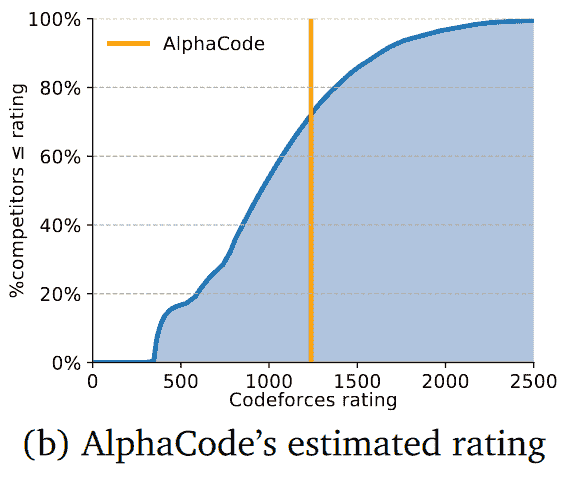

# 当 DeepMind 的“阿尔法代码”与人类程序员竞争时

> 原文：<https://thenewstack.io/when-deepminds-alphacode-competed-against-human-programmers/>

现实世界的编程问题可以用最先进的人工智能解决吗？本月，DeepMind 探索了这个问题，以一种全新的视角看待编程和人工智能的能力和局限性。

但同样有趣的是他们在这个过程中吸取的教训——关于什么可以自动化，什么不能自动化，以及关于我们当前数据集中的错误。

虽然人工智能生成的解决方案并不比人类程序员的解决方案*更好*，但它已经提出了一些关于这对未来意味着什么的问题。

## 一个有前途的新竞争者

总部位于伦敦的 DeepMind 是谷歌母公司 Alphabet 的人工智能子公司，它已经取得了历史性的里程碑，超越了人类玩的[象棋](https://thenewstack.io/new-google-ai-achieves-alien-superhuman-mastery-chess-shogi-go-mere-hours/)和[围棋](https://thenewstack.io/google-ai-beats-human-champion-complex-game-ever-invented/)，也证明了自己在[预测蛋白质折叠方式](https://thenewstack.io/deepmind-ai-makes-breakthrough-with-protein-folding-problem/)方面更胜一筹。

本月，DeepMind 宣布，它还开发了一个名为 AlphaCode 的系统，用于参加编程比赛，在竞争性编程网站 CodeForces 举办的 10 场不同的编程比赛中评估其表现——每场比赛至少有 5000 名不同的参与者。

结果呢？DeepMind 的一篇博客文章报道说，AlphaCode“将[置于大约中等竞争对手](https://deepmind.com/blog/article/Competitive-programming-with-AlphaCode)的水平，”这标志着人工智能代码生成系统首次在编程竞赛中达到有竞争力的性能水平。”

DeepMind 指出，现实世界的公司在招聘中使用这些竞争——并在编码面试中向求职者提出类似的问题。

在博文中，引用 CodeForces 创始人 Mike Mirzayanov 的话说，AlphaCode 的结果超出了他的预期。他补充说，“我对此表示怀疑，因为即使在简单的竞争问题中，也经常需要不仅实现算法，而且(这是最困难的部分)发明算法。

“AlphaCode 的表现达到了一个有前途的新竞争对手的水平。我迫不及待地想知道前方会发生什么！”

DeepMinds 研究人员的一篇论文承认，它耗费了巨大的计算能力。一个 [petaFLOP](https://en.wikipedia.org/wiki/FLOPS) 表示每秒钟高达 10 亿次浮点运算。一个[千万亿次浮点运算日](https://openai.com/blog/ai-and-compute/#fn2)在一天 24 小时中的每一秒都保持这个速度，总共大约有 864 亿次运算。

"从我们的模型中取样和训练需要数百个千万亿次浮点运算日."

一个脚注补充说，运行这些操作的谷歌数据中心“购买与消耗量相等的可再生能源。”

## AlphaCode 如何工作

研究人员在一篇 73 页的论文中解释了他们的结果(尚未发表或经过同行评审)。作者写道，他们的系统首先是在公共 GitHub 库中对代码进行“预训练”，就像早期的人工智能代码建议工具 Copilot 一样。(为了避免围绕 Copilot 的方法产生的一些争议，AlphaCode 过滤了它训练的数据集，选择了在许可许可下发布的代码。)

然后，研究人员在竞争性编程问题、解决方案甚至测试案例的小型数据集上“微调”他们的系统，其中许多都是直接从 CodeForces 平台上刮来的。

他们发现了一件事？目前可用的来自编程竞赛的问题和解决方案的数据集有一个问题。这些程序中至少有 30%通过了所有的测试用例——但实际上并不正确。

因此，研究人员创建了一个包括更多测试案例的数据集，以严格检查正确性，他们认为这大大减少了仍能通过所有测试的不正确程序的数量——从 30%降至 4%。

当最终在编程挑战上展开竞争时，“我们为每个问题创建了大量的 C++和 Python 程序，”DeepMind 博客帖子称。“然后，我们对这些解决方案进行筛选、聚类和重新排序，形成 10 个候选项目，并提交给外部评估。”

“在这些比赛中胜出所需的解决问题的能力超出了现有人工智能系统的能力，”DeepMind 的博客文章认为，这归功于“大规模[变压器模型](https://daleonai.com/transformers-explained)(最近显示出有望生成代码的能力)的进步”与“大规模采样和过滤”。

这篇博客文章表明，研究人员的结果证明了深度学习的潜力，即使是在需要批判性思维的任务中——以代码的形式表达问题的解决方案。DeepMind 的博客文章将该系统描述为该公司“解决智能”(其网站[将其描述为“开发更通用、更有能力的问题解决系统”——也被称为人工通用智能)使命的一部分。](https://deepmind.com/about)

博文补充道，“我们希望我们的结果能够激励竞争激烈的编程社区。”

## 人类程序员的反应

DeepMind 的博客帖子还包括来自[彼得·米特里切夫](https://twitter.com/petrmitrichev)的评论，他被认为是谷歌软件工程师和“世界级”的竞争性程序员，他对 AlphaCode 甚至可以在这一领域取得进展印象深刻。

“解决竞争性编程问题是一件非常困难的事情，需要良好的编码技能和解决问题的创造力，”Mitrichev 说。

米特里切夫还为[的六个解决方案](https://alphacode.deepmind.com/)提供了评论，指出几个提交的方案也包含了“无用但无害”的代码块。

在一次提交中，AlphaCode 声明了一个名为 x 的整型变量——但从未使用过它。在另一个图形遍历提交中，AlphaCode 不必要地先对所有相邻顶点进行排序(根据它们在图形中的深度)。对于另一个问题(需要计算密集型的“暴力”解决方案)，AlphaCode 的额外代码使其解决方案慢了 32 倍。

米特里切夫写道，事实上，AlphaCode 通常只是实现了一个大规模的暴力解决方案。

但米特里切夫指出，人工智能系统甚至像程序员一样*失败了*，他引用了一份提交的材料，其中当解决方案避开它时，AlphaCode“表现得有点像一个绝望的人。”他写道，它实际上编写的代码总是提供与问题的示例场景相同的答案，“希望它在所有其他情况下都有效。”

“人类也会这样做，但这种希望几乎总是错误的——就像这次一样。”

那么 AlphaCode 的结果到底有多好呢？CodeForce 计算了一个程序员的评分(使用标准的 Elo 评分系统，也用于对国际象棋选手进行排名)AlphaCode 获得了 1238 分的评分。

但更有趣的是，在过去六个月所有程序员在 CodeForce 上竞争的图表中，该评级出现在哪里。研究人员的论文指出，AlphaCode 的估计评级“在这些用户中排在前 28%。”

不是每个人都被打动了。[迪米特里·巴丹瑙](https://mila.quebec/en/person/dzmitry-bahdanau/)，一位人工智能研究人员和麦吉尔大学的兼职教授，[在推特](https://twitter.com/DBahdanau/status/1489009994007674881)上指出，许多 CodeForce 的参与者是高中生或大学生——他们解决问题的时间限制对预先训练的人工智能系统的影响较小。

但最重要的是，AlphaCode 的过程涉及过滤人工智能生成的代码洪流，以找到一个真正解决手头问题的代码，因此“AlphaCode 生成的绝大多数程序都是错误的。”

因此，尽管这是一个充满希望的探索方向，但 Bahdanau 并不认为这是一个编程里程碑:“就击败人类而言，这不是 AlphaGo，就彻底改变整个科学领域而言，也不是 AlphaFold。我们有工作要做。”

但是这通向哪里呢？就在他们论文的结论之前，AlphaCode 的研究人员添加了两句话，指出了反乌托邦的可能性，即代码生成能力“可能导致能够递归编写和改进自己的系统，迅速导致越来越先进的系统。”

他们的论文还指出了另一种可怕的可能性:“程序员的供给增加，需求减少。”

幸运的是，已经有一些历史先例可以证明这一点，该论文认为，“以前部分自动化编程的例子(例如编译器和 ide)只是将程序员推向了更高的抽象层次，并向更多人开放了这个领域。”

至少在一些程序员中，这已经引起了一些关注。最近，一名编程学生在黑客新闻[上抱怨“AlphaCode 焦虑症](https://news.ycombinator.com/item?id=30182570)”(以及对 [GitHub 的副驾驶](https://thenewstack.io/github-copilot-a-powerful-controversial-autocomplete-for-developers/)的担忧)。这位学生写道:“现在感觉我在和时间赛跑，直到我努力工作的事业自动消失。”

当 CodeForces 的一篇博客文章宣称“未来已经到来”时，一位忧心忡忡的程序员甚至认为“人类应该自动化的东西是有限度的。”这位程序员尖锐地补充说，开发 AlphaCode 的 DeepMind 开发人员“认为他们是不可替代的，但他们会是第一个被取代的人。”

但是 AlphaCode 排在后半部分的事实也遭到了人类的蔑视。

第一位评论者回应道:“艾真是个笨蛋。”

<svg xmlns:xlink="http://www.w3.org/1999/xlink" viewBox="0 0 68 31" version="1.1"><title>Group</title> <desc>Created with Sketch.</desc></svg>