# 当霍尔特-温特斯比机器学习更好的时候

> 原文：<https://thenewstack.io/when-holt-winters-is-better-than-machine-learning/>

机器学习(ML)得到了大量的宣传，但它的经典前辈仍然非常强大，特别是在时间序列空间。误差、趋势、季节性预测(ETS)、自回归综合移动平均(ARIMA)和霍尔特-温特斯(Holt-Winters)是三种经典方法，它们不仅非常流行，而且也是优秀的时间序列预测方法。

事实上，根据[统计和机器学习预测方法:关注点和前进方向](http://journals.plos.org/plosone/article?id=10.1371/journal.pone.0194889)，ETS 在一步预测中胜过其他几种 ML 方法，包括长短期记忆(LTSM)和递归神经网络(RNN)。实际上，所有的统计方法都比最大似然法具有更低的预测误差。

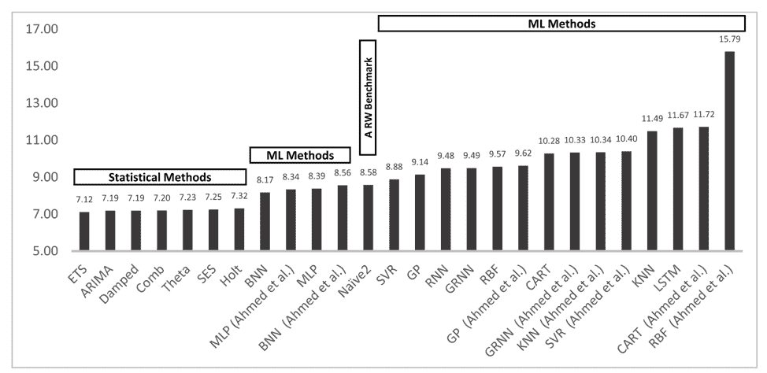

比较单步预测误差的条形图。摘自《统计和机器学习预测方法:关注点和前进方向》

 [阿纳伊斯·多蒂斯-乔治乌

Anais 是 InfluxData 的开发者倡导者，热衷于通过使用数据分析、人工智能和机器学习来使数据变得美丽。她将收集到的数据进行综合研究、探索和工程设计，将其转化为具有功能、价值和美感的东西。当她不在屏幕后面时，你可以发现她在外面画画、伸展身体或追逐足球。](https://www.influxdata.com/) 

我希望在完成这个由三部分组成的博文系列后，你会对霍尔特-温特斯的工作原理有一个很强的概念和数学理解。我关注霍尔特-温特斯公司有三个原因。首先，霍尔特-温特斯或三重指数平滑法是 ETS 的兄弟。如果你了解 Holt-Winters，那么你将很容易理解时间序列数据最强大的预测方法(在上述方法中)。第二，你可以使用[霍尔特-温特斯](https://docs.influxdata.com/influxdb/v1.7/query_language/functions/#holt-winters)开箱即用的 InfluxDB。最后，InfluxData 社区要求在 [Github 第 459 期](https://github.com/influxdata/docs.influxdata.com/issues/459)中对 Holt-Winters 做出解释。对我们来说幸运的是，Holt-Winters 相当简单，将它与 InfluxDB 结合使用甚至更容易。

**在这篇文章中，我将向你展示:**

1.  何时使用霍尔特-温特斯。
2.  单指数平滑的工作原理。
3.  单指数平滑优化的概念综述。
4.  Extra:线性回归残差平方和(RSS)优化的证明。

在第二部分中，我将向您展示:

1.  单指数平滑与三指数平滑的关系；平滑/霍尔特-温特斯。
2.  RSS 与均方根误差(RMSE)的关系。
3.  如何使用 Nelder-Mead 方法为霍尔特-温特斯优化 RMSE？

**在第三部分，我将向您展示:**

1.  如何使用 InfluxDB 的内置乘法 Holt-Winters 函数对时间序列数据进行预测。
2.  学习资源列表。

## **何时使用霍尔特-温特斯**

在选择任何预测方法之前，您需要评估数据集的特征。要确定您的时间序列数据是否适合 Holt-Winters，您需要确保您的数据:

*   难道[不是随机的](https://en.wikipedia.org/wiki/Stochastic_process)。如果它是随机的，那么它实际上是单指数平滑的一个很好的候选。
*   有一个趋势。
*   有[季节性](https://en.wikipedia.org/wiki/Seasonality)。换句话说，你的数据有规律的间隔。例如，如果您正在监控流量数据，您会看到在中午出现峰值，而在晚上活动减少。在这种情况下，你的季节周期可能是一天。

## **单一指数平滑的工作原理**

在我们深入 Holt-Winters 或三重指数平滑之前，我将解释一下单指数平滑是如何工作的。[单指数平滑](https://en.wikipedia.org/wiki/Exponential_smoothing)是最简单的[指数平滑](https://en.wikipedia.org/wiki/Exponential_smoothing)方法。指数平滑只是一种平滑时间序列数据的技术，其中指数递减的权重被分配给过去的观察值。它建立在[简单方法](https://en.wikipedia.org/wiki/Forecasting#Na%C3%AFve_approach)的基础上。使用这种方法，预测值等于最后观察值，

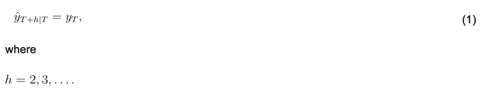

很难相信 nave 会希望用这样一个简单的模型来获得信任，但事实证明它在预测金融数据方面非常出色。此外，计算实际值和预测值之间的百分比差异是揭示季节性的好方法。

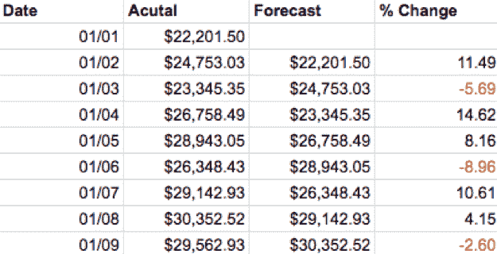

天真的方法有助于说明我们每三天就有一次收入减少。

单一指数平滑(SES)与朴素方法一致，即可以通过查看过去来预测未来值，但它更进一步地说，最近发生的事情将对接下来发生的事情产生最大的影响。SES 的预测只是一个指数加权平均值。

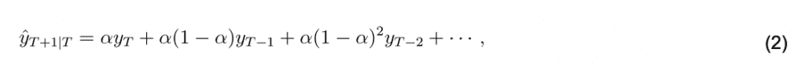

其中 0 ≤ α ≤ 1 为平滑参数。一个[平滑参数](https://en.wikipedia.org/wiki/Exponential_smoothing#Background)将先前平滑的统计量与当前观测值联系起来，并用于产生两者的加权平均值。有多种方法可以确定最佳平滑参数。然而，最小化 RSS 可能是最流行的。(我们将在第二部分讨论这个问题。)同样值得注意的是，如果 ***alpha*** = 1，那么 SES 又回到了原始方法。

下表显示了 ***alpha*** = 0.2 时每次观察的权重。权重以指数方式下降，从而给予最近的观察对预测的最大影响。

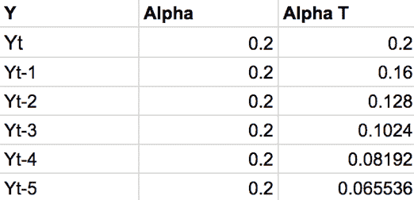

此表显示了 ***alpha*** = 0.2 时观察值的权重。注意这些权重的和是如何接近 1 的。更简单地说，这保证了你的预测和你的观察在同一尺度上。如果权重之和等于 1.5，则您的输出将比您的观察值大 50%。收敛到 1 的权重之和是[几何收敛](http://tutorial.math.lamar.edu/Classes/CalcII/Series_Special.aspx)。

数学家喜欢重写公式。接下来，我们将看看如何获得 SES 的分量形式，因为它与最常用于表示 Holt-Winters 的形式相同。

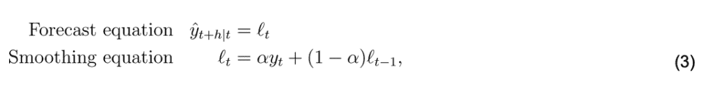

我们简单地用*来表示平滑方程。同时， ***l_(t-1)*** 表示之前的预测。这样，我们可以概括 Eq 的迭代性质。(2)简明扼要。*

 *然而，有两点我们还没有解决。首先是我们不知道如何找到 ***阿尔法*** 。其次，你可能对情商做了敏锐的观察。(3).这是迭代的，那么在开始时，在时间 1，当我们有***l _ nout***时会发生什么？简而言之，我们最小化 RRS(残差平方和)来找到 ***alpha*** 和***l _ nout***。详细的答案在下一部分。

## **单指数平滑优化的概念概述**

下面介绍如何找到[回归线](https://en.wikipedia.org/wiki/Linear_regression)。这样做，你最终会有一个很好的数学类比，帮助你理解如何计算 SES 的*和***l _ nout***。在本节中，我只是从概念上设置了这些步骤。根据本节内容，您可以通过最小化[残差平方和(RSS)](https://en.wikipedia.org/wiki/Residual_sum_of_squares) 找到线性回归优化的证据。*

 *让我们看看时间 1 的平滑方程:

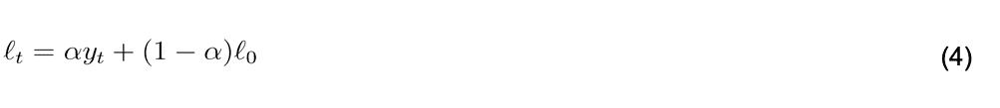

请注意，它看起来很像直线的点斜率形式:

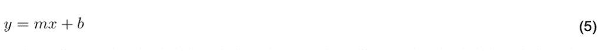

情商的优化。(4)是如果您想要找到 SES 的平滑参数，您实际上应该优化的参数。然而，对于这一节，我们用等式。(5)对于 Eq。(4)为了简化起见。然后我们通过最小化误差平方和(RSS)找到最优的 ***m*** 和 ***b*** 。一旦我们找到了最优的 ***m*** 和 ***b*** ，我们就找到了回归线。这些相同的步骤用于寻找霍尔特-温特斯的平滑参数。唯一的区别是，最小化回归直线的 RSS 只是一个三维优化问题，证明是 90%的代数，而寻找 Holt-Winters 的平滑参数是多维的，需要大量的微分方程。

为了理解如何最小化 RSS，你需要知道它是什么。RSS 的定义如下:

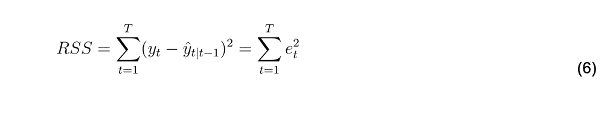

这是衡量我们的数据点和最佳拟合线之间的误差。

让我们来看看我们的数据:

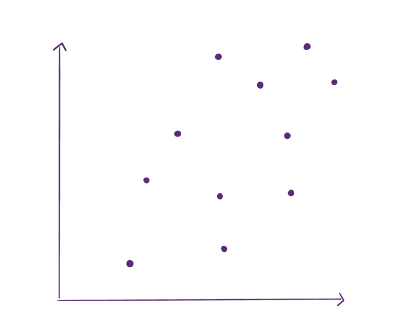

这是随机的，但我们可以找到一条回归线或最佳拟合线。为此，我们画一条线并找到该行的 RSS:

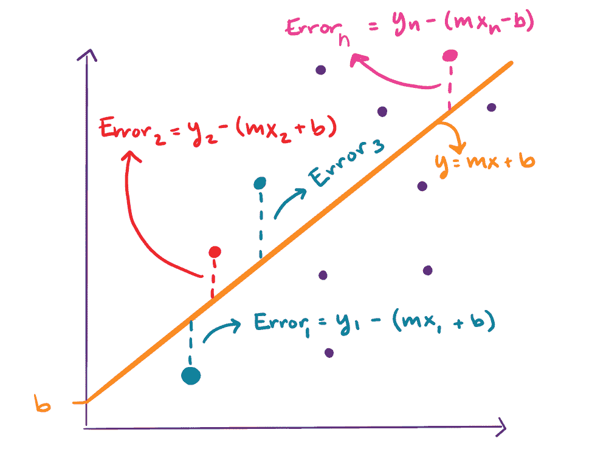

我们将所有这些误差的平方和作为 RSS。现在想象一下，我们画了一堆不同的线，计算了几百次 RSS。RSS 现在可以在 3d 中被可视化为一种碗，其中 RSS 的值取决于我们所画的线。我们画的线是由它的斜率、 ***m*** 和 y 轴截距、 ***b*** 定义的。

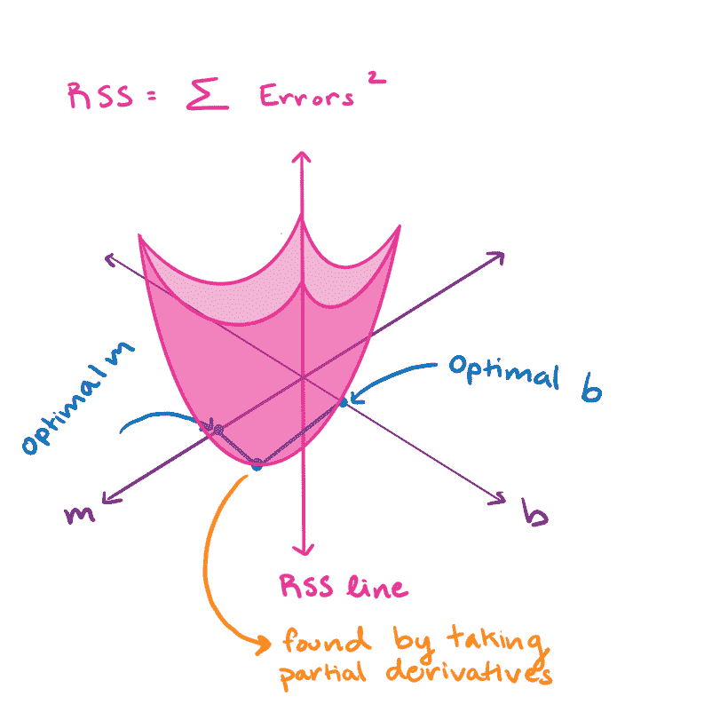

这个碗的最底部是最佳坡度。我们取 RSS 的偏导数，并将其设为 0。然后我们求解为 ***m*** 和 ***b*** 。这就是全部了。线性回归优化非常简单。寻找单指数平滑的平滑参数也是用同样的方法。

## **号外:线性回归 RSS 优化的证明**

如果你像我一样，你需要看到一些数学才能感到满足。正如我喜欢说的，“证据就在匹配中”。如果你已经确信或者你不喜欢数学，跳过这一节。它的颜色与本博客“单一指数平滑优化的概念概述”部分的图表相匹配。

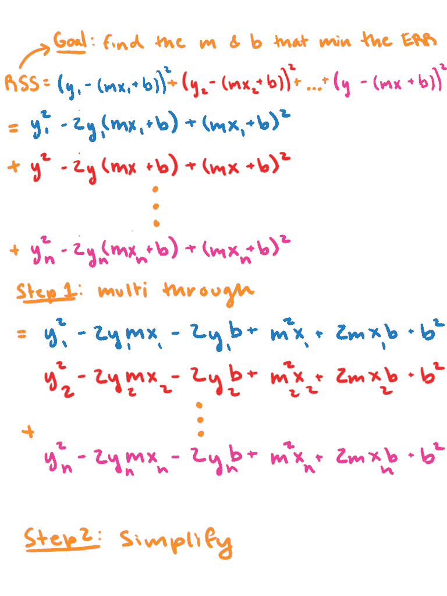

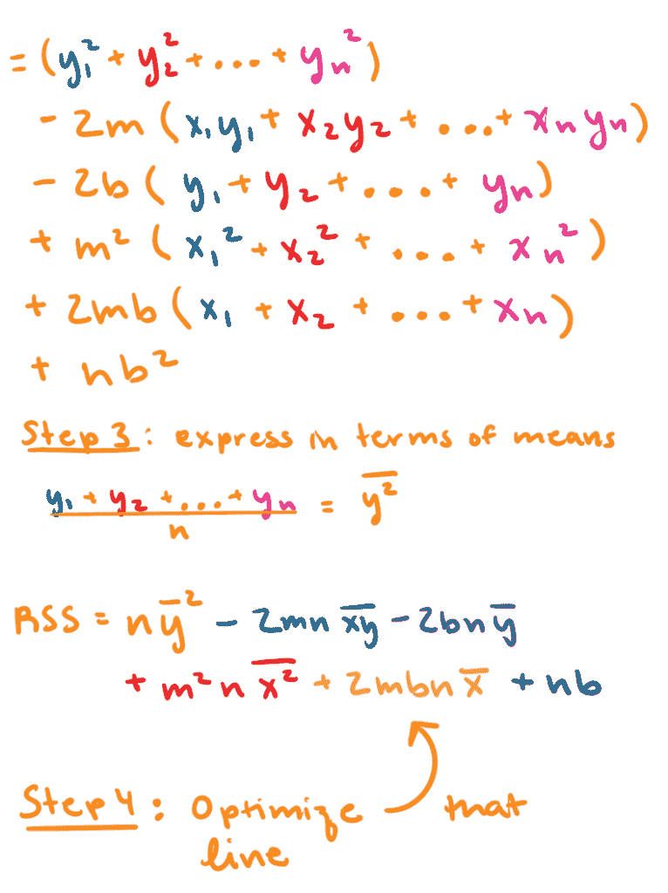

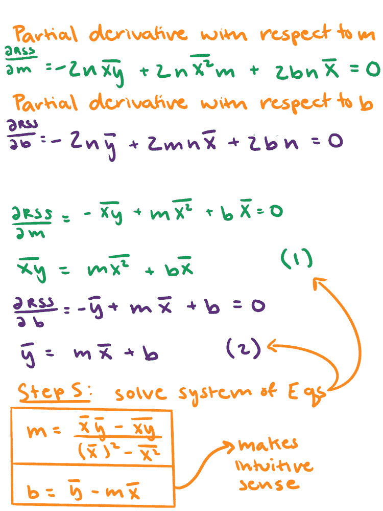

感谢你坚持和我在一起，祝贺你走到这一步。我希望这篇教程能帮助你开始你的预测之旅。如果您有任何问题，请在[社区网站](https://community.influxdata.com/)上发表，或者发推特给我们 [@InfluxDB](https://twitter.com/InfluxDB) 。你应得的这次大脑休息:

<svg xmlns:xlink="http://www.w3.org/1999/xlink" viewBox="0 0 68 31" version="1.1"><title>Group</title> <desc>Created with Sketch.</desc></svg>**