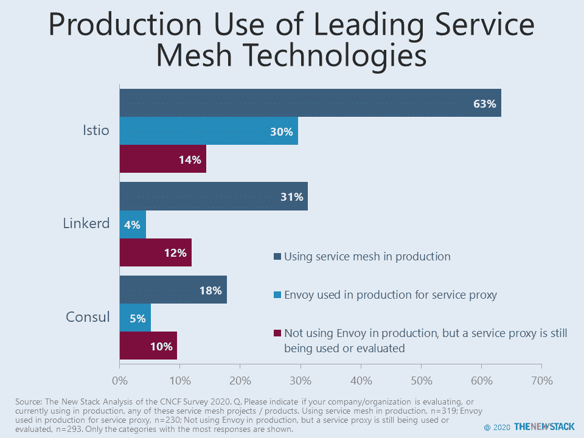
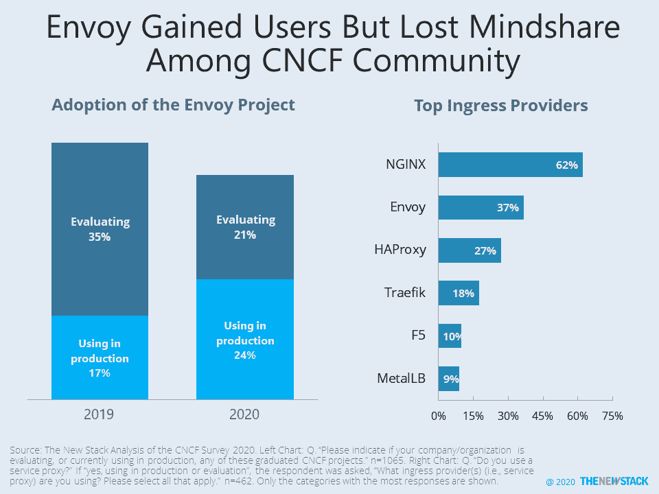
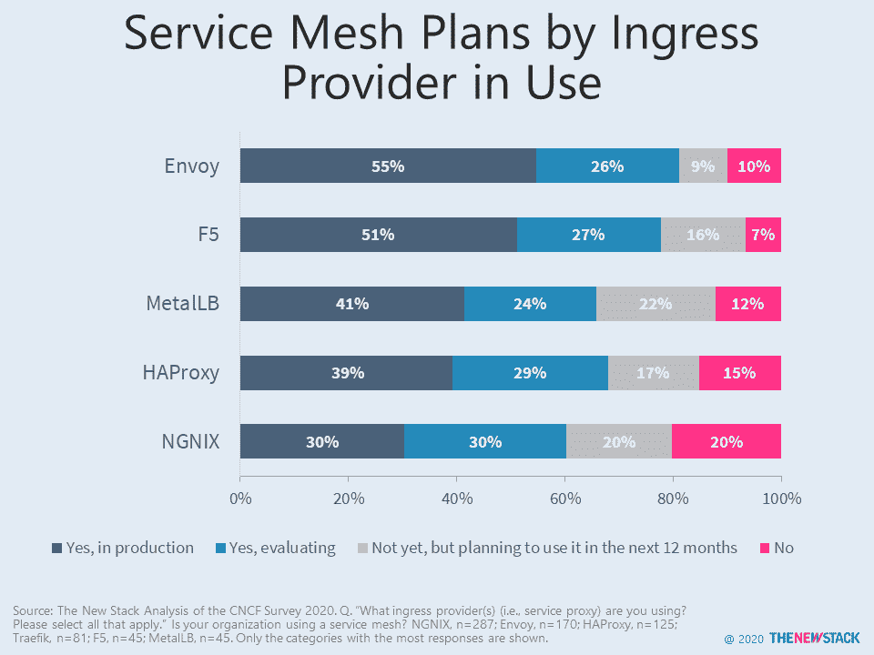

# 当服务网格可以从特使/Istio 阴影中出现时

> 原文：<https://thenewstack.io/when-service-meshes-can-emerge-from-envoy-istio-shadows/>

Istio 在服务网络方面遥遥领先，但仅限于一部分早期用户。根据我们对云本地计算基金会(CNCF) [今年早些时候的调查](https://github.com/cncf/surveys/tree/master/cloudnative)的分析，在那些已经在生产中使用服务网格的人中，63%采用了 Istio，这是 [Linkerd](https://linkerd.io/) 的两倍多。除了 [HashiCorp 的执政官](https://thenewstack.io/how-hashicorp-widened-the-reach-of-the-consul-service-mesh/)，其他选项都没有破两位数。

如果你抛开它通常与 [Envoy](https://www.envoyproxy.io/) 一起部署的事实，Istio 就不那么令人生畏了，不可否认，最近它做得很好。CNCF 社区中特使项目的生产使用从 2019 年的 17%上升到 2020 年的 24%。评估该项目的人从 35%下降到 21%，这可能意味着许多组织考虑并拒绝了 Envoy，这可能对未来服务网格的采用产生影响。并非所有人都将 Envoy 与服务代理或入口控制联系在一起。当调查筛选采用该功能时，只有 18%的人在生产或评估环境中使用 Envoy。

注:右图更新于 2022 年 2 月 16 日。提供者的顺序是相同的，但是值大约是以前的两倍，因为计算现在只基于那些使用或评估服务代理的。

超过一半(55%)使用 Envoy for Ingress 的受访者在生产中拥有服务网格。另有 26%的公司正在积极测试服务网格，9%的公司计划在未来 12 个月内开始。大多数受益者是 Istio 以及基于该项目的技术的解决方案，如 F5 Networks 的 [Aspen Mesh](https://aspenmesh.io) 和 [Tetrate](https://www.tetrate.io/) 。

输入一个新的数据集，它提醒我们，并非所有服务网格的采用都来自充斥着供应商和大公司的 CNCF 社区。2020 年 6 月，NGINX [利用其 nginx.org 邮件列表和社交渠道调查了近 500 人。根据 NGINX 的 OSS 传播者](https://www.nginx.com/blog/state-of-modern-app-delivery-2020-results-annual-user-survey/) [Libby Meren](https://www.linkedin.com/in/libbymeren/) 的说法，16%的社区使用 NGINX 入口控制器(NIC)，其中 19%也使用服务网格，另外 33%计划在 12 个月内这样做。尽管 NGINX 的传统来自云原生时代之前，但 57%的调查对象已经在生产应用程序中使用容器。

正如[之前](https://thenewstack.io/nginx-steps-into-the-service-mesh-fray-promising-a-simpler-alternative/)所报道的，NGINX 服务网格(NSM)是为那些 Istio 过于复杂而无法满足其初始需求的组织而设计的。对于希望避免 Kubernetes 复杂性的组织来说，到目前为止只有 6%的社区在使用 NSM——但是有一个成熟的机会来吸引使用 NGINX 作为入口的组织。

除了 NGINX， [Traefik Maesh](https://traefik.io/traefik-mesh/) 通过与自己的入口控制器集成，降低了复杂性。[去年 2 月](https://thenewstack.io/survey-results-service-mesh-useful-for-security-observability-and-traffic-control/)，踢服务网轮胎的人想了解集成控制和数据平面的解决方案。市场正在努力实现这一目标。2021 年，下一代服务网格采用者会决定他们的堆栈中不需要 Envoy 或 Istio 吗？如果是这样，还有哪些技术能最好地与它们集成？诸如 [AWS App Mesh](https://thenewstack.io/aws-app-mesh-amazons-own-service-mesh-for-microservices/) 这样的简化产品会吸引 Kubernetes 人群以外的用户吗？

Aspen Mesh、Cloud Native Computing Foundation、HashiCorp 和 Tetrate 是新堆栈的赞助商。

通过 Pixabay 的特征图像。

<svg xmlns:xlink="http://www.w3.org/1999/xlink" viewBox="0 0 68 31" version="1.1"><title>Group</title> <desc>Created with Sketch.</desc></svg>