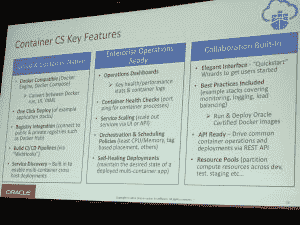
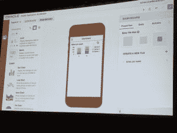
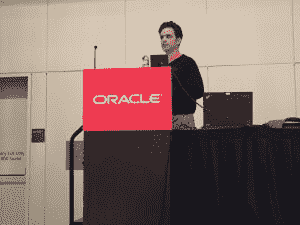

# 容器适合 Oracle 云的位置

> 原文：<https://thenewstack.io/where-containers-fit-into-the-oracle-cloud/>

你已经走了很长的路了，宝贝。

甲骨文全球大会(OOW) 不仅仅是甲骨文的一次大转变；这是一个历史性的转折。从[甲骨文的创始人兼首席技术专家拉里·埃里森](https://www.oracle.com/corporate/executives/ellison/index.html)称云为“[2013 年最愚蠢的想法](http://www.forbes.com/sites/oracle/2012/10/09/larry-ellison-doesnt-get-the-cloud-the-dumbest-idea-of-2013/#c51fcfb6f693)”，到他在 2016 年左右的 [OOW 主题演讲](https://www.oracle.com/openworld/on-demand/index.html)中的第一句话:“我们正处于一代人的变革之中”，这不仅仅是一场变革。

听听埃里森的话，你可能会认为甲骨文已经以一种主要的方式采用了云技术，包括投入 10，000 名程序员来构建甲骨文云、一套平台、基础设施和软件服务，以及企业软件市场。

上个月在旧金山举行的 OOW 是云驱动、云聚焦和云包围的。主题演讲、会议、横幅和 t 恤都是关于 Oracle 云的。

“云不是一种时尚，”T8 首席执行官马克·赫德在开幕主题演讲中宣布，呼应了埃里森前一天所说的话。“这不仅仅是一次技术上的转变——这是一代人才会经历的行业转变。”

好吧，废话。但他们是在与企业客户交谈，其中许多人刚刚开始涉足云技术，所以有很多解释要做。许多观众都见证了从大型机到客户机-服务器架构的“一代人一次”的变化，见证了许多时尚的来来去去。

埃里森在他的主题演讲中花了大部分时间解释为什么云会存在，以及他如何追求当前基础设施即服务(IaaS)的领导者亚马逊网络服务(AWS)。“亚马逊的领先地位，”他说，“已经结束了。”

大多数企业仅仅是“接触了云”，甲骨文于去年 12 月收购的 StackEngine 的创始人、现任甲骨文容器集团副总裁 Bob Quillin 在一次采访中说。但他们只将一小部分工作负载转移到了那里。Hurd 给出的官方数字是，目前 90%的企业工作负载不在云中。

甲骨文的云服务

这个经常在会议上重复的数字，可以解释为什么埃里森对他接管 AWS 如此有信心。如果他能说服当前的企业甲骨文客户使用甲骨文的云网络，那么他也许可以让 AWS 为他们的钱而战。

## Oracle 云故障

会议介绍了该公司最新的 Oracle 云迭代，这是一个全栈、三层服务，将基础设施、平台和软件服务集成到一个单一的产品中，提供给企业客户。

甲骨文公司平台即服务和基础设施即服务业务部门高级副总裁 Steve Daheb 在一次会议上表示，完整、集成的产品套件易于甲骨文现有客户部署和运行。他为尚不确定云的 OOW 企业与会者展示了商业案例。这是一个很好的愿景。

## 把所有的放在一起

听听 Daheb 的解释，构建云原生应用应该是轻而易举的事情，只需将组件拖放到屏幕上的移动设备模拟器中，瞧！你有一个充满销售数据或其他有用信息的移动应用程序。

智能手机+ OCN:完全集成的堆栈允许非技术用户为他们的智能手机创建应用程序。

达赫布和甲骨文产品管理高级总监乔恩·里夫(Jon Reeve)在不同的会议上发言，他们都强调了将数据从现有系统转移到甲骨文云中的便利性。Reeve 声称这很容易开始，很容易移动你的数据，也很容易使用。

Daheb 说，底线是为他们的企业客户降低复杂性，尽可能隐藏技术，并提供简单的端到端解决方案。不需要决定为堆栈的每个模块使用哪个软件，他们已经为您做出了这些决定。安全性更强，因为您不需要管理无数软件的权限。

事实上，时间会证明让系统启动并运行有多容易，以及与非 Oracle 云堆栈元素的连接有多顺畅。获胜者是谁？合并到 Oracle 堆栈中的现有公司，包括 MySQL、Docker 和 StackEngine。

去年，[甲骨文公司收购了 stacken engine](https://thenewstack.io/oracle-settles-docker-ecosystem-stackengine-purchase/)，该软件致力于使 Docker 更容易为企业客户所用，这些企业客户拥有整合到 OCN 的本地容器。奎尔林说，这家初创公司的技术现在提供“企业级码头管理”根据 Quillin 的说法，作为收购的一部分，现有的 StackEngine 客户被转移到 OCN 平台上。

Oracle Cloud 旨在与 Docker 容器无缝协作，尽管 Oracle Cloud 为客户提供了内部流程编排。但是如果你已经在使用 Docker 容器和编排，云可以支持这种操作。

## 和睦相处

Oracle 云的一个关键组成部分是它能够与您公司已经使用的东西协同工作，并让云填补空白。

尽管只有 10%的企业工作负载在云上，但大多数大公司已经开始创建自己的堆栈。

乔恩·里夫在 OOW16 展示 OCN

在 Reeve 的会议“Docker Agility in the Cloud:Introducing Oracle Container Cloud Service”中，他解释说，如果您的系统已经在使用 Kubernetes 或 AWS，Oracle Cloud 可以允许 [webhooks](http://www.webhooks.org/) 与您现有云结构的任何部分配合工作。

你已经上 AWS 了吗？没问题。通过 API，它可以通过 AWS 运行 app，但不能通过 Oracle 管理 AWS 云。类似地，Google 将你锁定在 Kubernetes，但是 Oracle webhooks 可以让你访问 Oracle 云中的 Kubernetes 应用程序。

事实上，所有的服务平台都是开放的架构，在它们自己内部是完整的，但是允许 webhooks 出去抓取你当前正在使用的任何数据结构或软件。

奎尔林指出，许多人希望保持他们的选择开放，因为“编排战争”刚刚开始，公司不愿意在一个完整的赌注。

这就是我们坚持 Docker 兼容性的原因，Reeve 表示同意。他解释说，真正的应用在很长一段时间内都不会是 100%的容器，它们需要适应这种转变。

## 开发者是关键

开发人员是这项计划的关键。Oracle 已经意识到与客户的开发人员保持联系至关重要，Daheb 和 Reeve 也在主题演讲中传达了这一信息。

Reeve 说 Oracle 一直都有 Java，但是他们没有直接与开发者社区对话。他说，Docker 和 containers 在其中发挥了作用，因为基础设施团队的部分作用是建立开发人员受众。

在 Oracle 的一个重大转变中，他们将直接瞄准开发者社区。开发者现在在甲骨文世界里有了自己的网站，他们发布信息并希望开发一个强大的社区。

根据 Hurd 的说法，Oracle 致力于与 Oracle 以外的开发人员建立联系，并将在明年在全球 20 个城市为开发人员举办会议，展示 Oracle 云产品并让开发人员试用。

<svg xmlns:xlink="http://www.w3.org/1999/xlink" viewBox="0 0 68 31" version="1.1"><title>Group</title> <desc>Created with Sketch.</desc></svg>