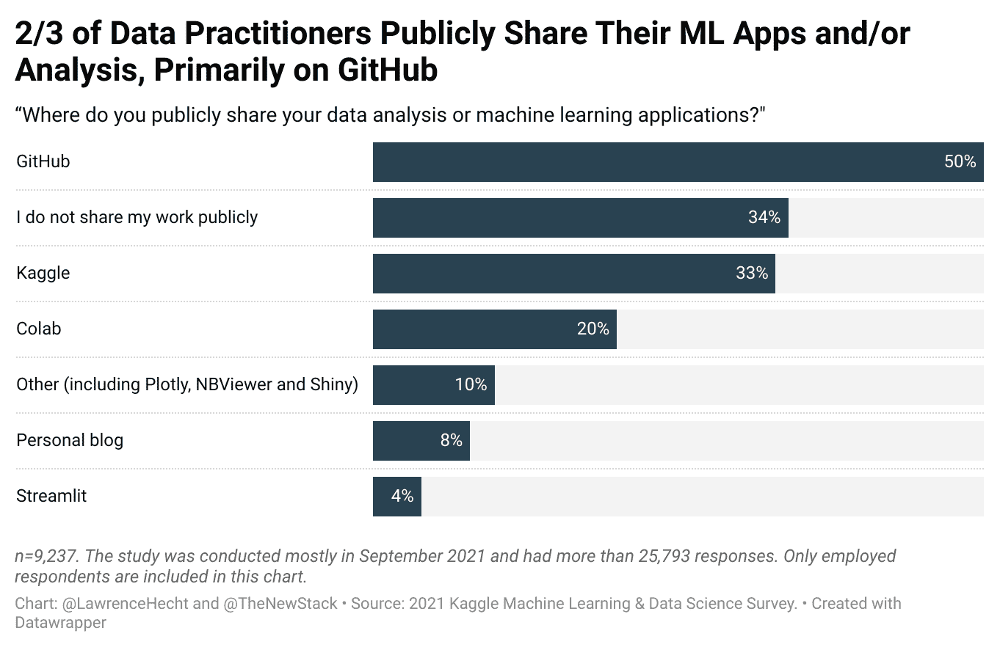

# 数据从业者更喜欢在哪里合作？开源代码库

> 原文：<https://thenewstack.io/where-do-data-practitioners-prefer-to-collaborate-github/>

根据 New Stack 对 [Kaggle 最新的机器学习和数据科学年度调查](https://www.kaggle.com/c/kaggle-survey-2021/overview)的分析，三分之二的数据从业者公开分享他们的数据分析或机器学习应用。

在那些公开合作的人中，76%的人说他们使用 GitHub。[尽管受到批评，](https://thenewstack.io/github-copilot-a-powerful-controversial-autocomplete-for-developers/)对于开发数据和人工智能应用的开发人员和非开发人员来说，该平台仍然是技术栈中最重要的部分之一。

2021 年，超过 25000 人参加了这项调查。由于许多参与者都在使用谷歌旗下的 Kaggle 平台学习如何成为数据科学家，新堆栈的分析只调查了 17182 名报告被雇佣的受访者。

在这项研究的 840 名机器学习工程师中，61%的人说他们使用 GitHub 进行分享，这是报告中所有职业中比例最高的。虽然只有 40 名开发者关系/倡导者参与了这项研究，但值得注意的是，只有 45%的人说他们使用 GitHub 来分享他们的应用或分析。

数据科学家、软件开发人员和数据分析师代表了该研究参与者的最大部分。以下是这项研究的一些收获:

*   在 Kaggle 的调查中，为数据科学、机器学习和人工智能用例构建的协作工具没有得到广泛采用。在声称公开合作的研究参与者中，三分之一使用 Kaggle 本身，20%使用 Colab，这也是谷歌的产品。由于这些产品与调查本身相关，我们认为它们并不代表更大的市场。
*   今年早些时候被雪花收购的 Streamlit 被 4%的人认为是首选的协作工具。今年 5 月， [Streamlit 的前首席执行官描述了数据驱动应用](https://thenewstack.io/the-rise-of-data-driven-apps-where-we-are-and-whats-next/)在新堆栈中的崛起。
*   开源的 [nbviewer](https://nbviewer.org/) 和 [Plotly Dash](https://plotly.com/dash/) ，它将一个流行的开源可视化工具变成了一个低代码平台，这是数据分析 ML 应用程序共享的另外两种方式。

## ide 和协作

协作也发生在笔记本电脑内部和之间，它们作为集成开发环境(ide)已经有了自己的生命。就像大多数开发人员一样，一般的数据从业者会使用不止一个 IDE，但是一些 Juypter 或 JuypterLab 是最常见的，Visual Studio 代码排在第二位。然而，许多类型的托管笔记本电脑正在拥挤的领域中苦苦挣扎:

*   超过三分之一的研究参与者报告使用 Kaggle 和 Colab 笔记本。谷歌似乎成功地将这些用户转化为其其他笔记本和云产品的付费用户。
*   8%的人在使用[活页夹](https://mybinder.org/)，它将 Juypter 笔记本的 Git repo 变成了一个互动的现场环境。
*   而总体来说，7%的受访者表示他们使用特定的[亚马逊网络服务](https://aws.amazon.com/?utm_content=inline-mention)和微软 Azure 笔记本产品。然而，超过 15%的 AWS 和微软 Azure 云计算客户也在使用他们的云提供商的笔记本电脑或其他人工智能类型的解决方案。
*   Databricks 和 IBM 的产品不仅仅被提及，而是利基产品
*   只有 1%的研究使用了 Deepnote、Code Ocean、Gradient 和 Observable。

我们仍处于数据支持应用的早期。大多数数据分析师对[软件许可](https://thenewstack.io/this-week-in-programming-github-copilot-tests-the-copyleft/)或他们使用的代码库不感兴趣。他们想去有数据的地方，去人们最有可能分享他们模型的地方。[根据 Meltano](https://meltano.com/blog/why-meltano-is-moving-to-github/) 的说法，一家由 [GitLab](https://about.gitlab.com/?utm_content=inline-mention) 自己剥离出来的公司，那就是 GitHub。

我可以提供大量的低代码平台、[数据操作](https://thenewstack.io/the-basics-of-dataops-and-why-it-matters/)管道集成、协作工具和下一代 Airtables，其中许多都有强大的追随者。但是很少有人真正接近大规模采用。有些已经在利基行业中成为利基产品，但只有 Juypter 笔记本和 GitHub 的变体似乎为非技术受众、数据专家和开发人员所熟悉，足以成为突破性的成功。

你怎么想呢?现代数据堆栈如何在不抑制协作的情况下打破这种模式？这里可以伸出[。](mailto:research@thenewstack.io)

<svg xmlns:xlink="http://www.w3.org/1999/xlink" viewBox="0 0 68 31" version="1.1"><title>Group</title> <desc>Created with Sketch.</desc></svg>