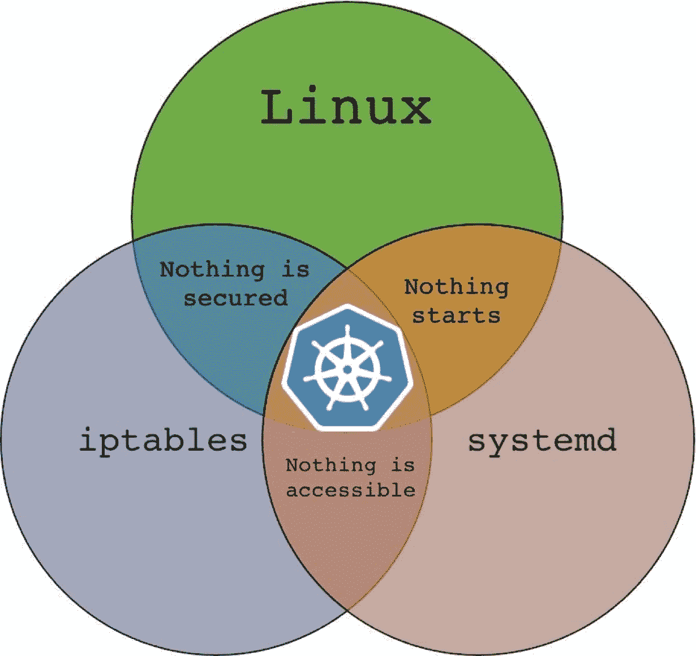

# Kubernetes 结束，云铸造开始

> 原文：<https://thenewstack.io/where-kubernetes-ends-cloud-foundry-begins/>

我们已经吸收了许多关于创业公司 galaxy 成功的文献。我们读到过关于创业失败的故事或推文，其中夹杂着鄙视和同情。作为技术专家，我们相信工程，尤其是软件，在决定一家初创公司成功与否的过程中起着关键作用。

## 不作为和惰性:创新的最大敌人

适应和采用新技术来实现业务功能被认为是其成功的关键。对于这些组织中的工程领导者来说，建立一个能够有效解决问题的技术堆栈，同时引入最少的权衡，是向前发展的最佳途径。不断发展，迎接新的挑战，成功驾驭自由市场力量——这是任何处于成长尖端的组织的主要需求。

## 技术债。一样糟糕。

 [拉姆·艾扬格

Ram 实际上是一名工程师，本质上是一名教育家。作为一名开发人员，他被推上了技术福音传道者的道路，从此一往无前。他喜欢帮助世界各地的工程团队发现新的和创造性的工作方式。](https://www.linkedin.com/in/ramanujank/) 

债务，非常笼统地，被认为是坏的。一些微妙的财务状况，当操作成熟时，可以将债务转化为有利地位。与金融债务类似，技术债务会给公司的发展造成一些障碍。特别是，负面影响往往会波及整个软件工程团队。

工程团队运营的某些领域，如支持应用程序的核心技术堆栈的迁移和更新，可能会导致更大的债务低谷。延迟和长时间的犹豫不决也会导致技术债务的积累。想象一下，推迟决定升级用于构建容器的基本操作系统映像。即使是长期支持版本也会在几年后撤销支持。那些在周期后期采用它的人会发现自己陷入困境，不仅要执行更新，还要进入昂贵的升级周期。对于可能过期的安全证书也是如此。这样的例子不胜枚举。

## 技术问题转化为商业问题

在很大程度上依赖于软件工程团队来交付价值的公司中——这是一个重要且不断增长的数字——每个人都必须意识到业务成果直接受到技术能力的影响。来自技术的任何失败都将很容易转移到业务领域，并将战术和战略计划推向地下。一般来说，整个行业都在吹嘘技术是如何推动创新的。虽然这是真的，但这是众所周知的硬币的另一面。在实现目标的工程团队和实现目标的业务团队之间几乎没有隔离。在今天的融合世界中，两者齐头并进。因此，关键技术领域的投资至关重要。一些经常被引用的例子是在 web 性能和延迟减少方面。几个电子商务团队报告说，在投资于绩效改进的正确领域后，取得了成功的增长。

让我们根据一些新兴技术来进一步研究这些想法。经典作品包括《集装箱》、《区块链》、《人工智能/机器学习》等等。货物养殖和炒作驱动的发展对这个行业来说并不新鲜。然而，所有这些想法只是帮助巩固了整个软件行业的基础。现在，我们可以选择任何一种在炒作浪潮中冲浪的技术，我们将能够识别上述模式。特别是，让我们把聚光灯照在 Kubernetes 上，看看兔子洞有多深！

## 什么是 Kubernetes？

Kubernetes 可以有多种定义。这里有几个开始:

1.  Kubernetes 是一个容器编排系统。它获取所有需要运行的应用程序容器，并通过提供一个环境来帮助管理这些容器的部署、扩展、联网和安全性，从而对它们进行管理。
2.  Kubernetes 是一个巨大的自动化层，应用于原本需要大量工程时间、努力和专业知识的任务。它从部署容器开始，一直延伸到扩展、连接和保护容器，而无需开发人员花费时间和精力。

## Kubernetes 不是…

Kubernetes 不是一个类似平台的界面。诚然，它解决了很多问题，但它需要很多额外的部分才能完全发挥作用，就像所有的技术一样。由于它所解决的问题的复杂性，Kubernetes 对于那些使用它的人来说似乎表现出了很大的复杂性。此外，它需要连接的移动部件的数量可能会很快让事情变得不堪重负。

## Kubernetes 结束的地方，云铸造开始！

Kubernetes 的优势只能延伸到基础设施本身之上的一层。几个组件——比如 HTTP 路由、日志管理、基于角色的访问控制、租户隔离和容器映像构建——围绕着 Kubernetes 接口，形成了一个健壮的平台，开发人员可以将他们的应用程序推送到这个平台上。当远程实例是生产实例时，甚至需要更多的子系统。面向 Kubernetes 的 cloud Foundry(cf-For-k8s . io)就是一个健壮的 PaaS 的例子，它覆盖了完成基础架构堆栈所需的所有内容。

## 云铸造体验

Cloud Foundry 在为复杂的技术基础设施提供简化的开发人员体验方面有着良好的记录。今天，Cloud Foundry 的目标是成为那些希望在传统 Kubernetes 支持的基础设施上获得便捷的平台即服务(PaaS)接口的人的首选平台。Cloud Foundry 可以帮助团队专注于核心业务问题，减少部署和维护 web 应用程序带来的麻烦。它可以帮助消除几个领域的技术债务，这些债务通常是由陈旧的依赖、过时的构建过程等引起的。采用可靠的基础设施，加上可以提高效率的 PaaS，可以大幅降低风险，最终能够在不牺牲技术能力的情况下交付业务成果。

参观 cloudfoundry.org 是一个很好的起点。Cloud Foundry 是完全开源的，可以在 GitHub 上获得。您可以遵循与 repo 相关联的部署选项，它将在您带来的任何 Kubernetes 发行版上工作。加入 Slack 上的 Cloud Foundry 社区，获得与 Cloud Foundry 运营相关的任何方面的支持。

<svg xmlns:xlink="http://www.w3.org/1999/xlink" viewBox="0 0 68 31" version="1.1"><title>Group</title> <desc>Created with Sketch.</desc></svg>