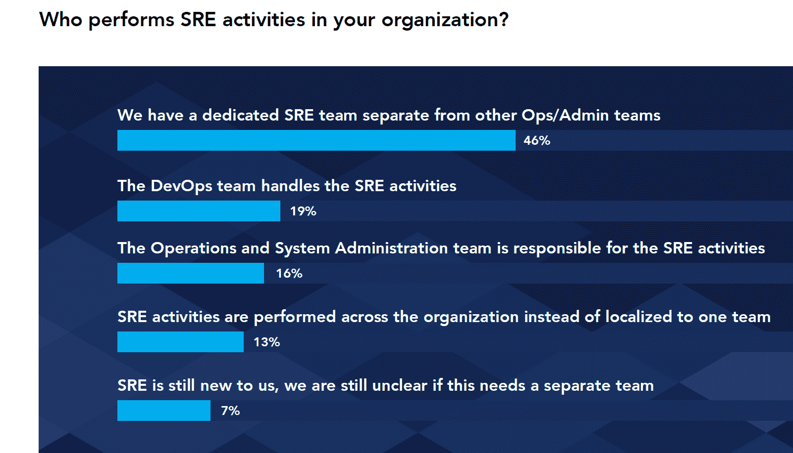
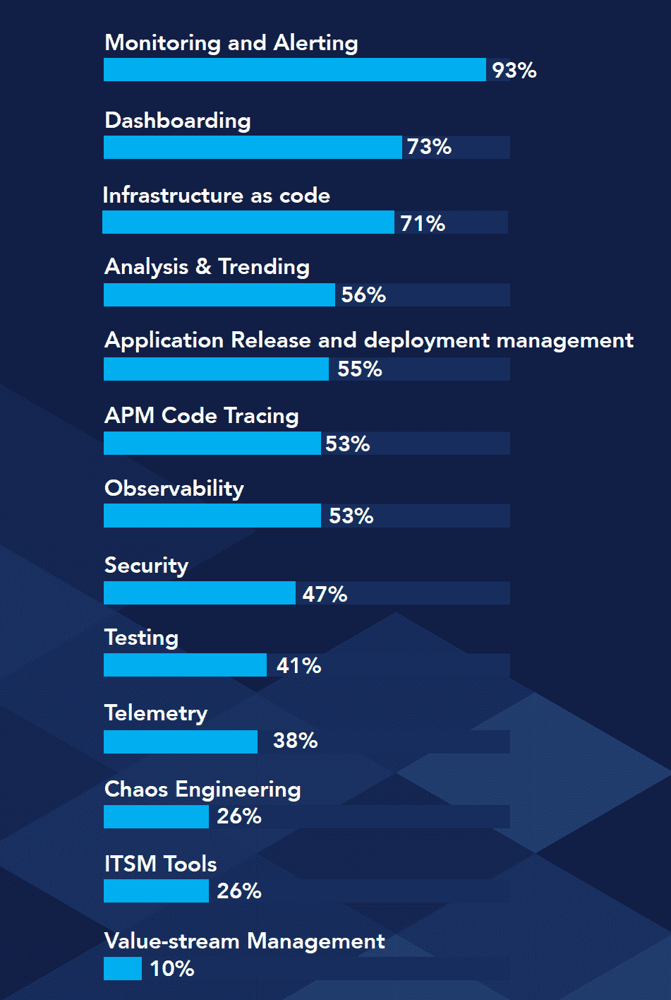

# 当现场可靠性工程与开发运营计划重叠时

> 原文：<https://thenewstack.io/where-the-site-reliability-engineer-role-overlaps-with-devops/>

现场可靠性工程师(sre)不断平衡优先级。工作角色继续演变，但非常真实。Catchpoint 的“ [2020 SRE 报告](https://pages.catchpoint.com/2020-sre-report)”调查了 600 多名从事 SRE 式工作的人，其中 46%的人表示他们的组织有一个专门的 SRE 团队，与处理 IT 运营和管理的团队截然不同。尽管如此，该角色经常与 DevOps 混为一谈，19%的受访者表示 DevOps 团队处理 SRE 的职责。事实上，有理由相信这两个职能可以作为一个整体来管理——41%的人说 SREs 和 DevOps 是同一个团队的一部分，而只有 26%的人认为它们是互补的。

虽然 sre 兼顾开发和运营职责，但超过一半的人花在开发上的时间不到 25%。几乎一半(48%)的人花了大量时间编写软件来帮助操作，其中大部分代码有助于自动化以前的手动任务。尽管要使大多数基础设施可编程还需要很多年的时间，但 SREs 有望引领潮流，因为 71%的受访者表示站点可靠性工程师使用基础设施即代码。

资料来源:Catchpoint 的《2020 年 SRE 报告》。

总体而言，监控和事件管理仍然是 sre 执行的最常见活动，但 55%的受访者表示 sre 使用应用发布和部署管理工具。只要 DevOps 是应用程序发布管理的主要所有者，那么这两个团队之间的区别可能会继续存在。然而，这只是意味着将会有一个新的冲突领域。对于您来说，SREs 应该侧重于监控基础架构还是应用程序是不言而喻的吗？

问:SREs 使用哪些工具类别？资料来源:Catchpoint 的《2020 年 SRE 报告》。

[Catchpoint](https://www.catchpoint.com/) 一直专注于终端用户监控，终端用户可以是客户，也可以是支持其他应用的基础设施服务。“监测和警报”类别的一般性质意味着 93%的人说 SRE 使用这些工具，而只有 55%的人使用可观察性工具。准确定义什么是可观察性工具可能很困难。这份报告证实了 TNS 赞助商 Honeycomb 最近关于这一主题的调查结果。该研究发现，采用可观测性栈的单个组件是普遍的，即使可观测性作为一种实践相对不成熟。

报告的一个基本主题是，可观察性需要是一个整体的实践。从供应商的角度来看，这意味着所有服务都应该有一个 API，该 API 可以插入到一个可观察性框架中，以检测中断和性能问题。

*   **混沌工程**在报道中出现了好几次。对于 19%的执行 SRE 任务的人来说，通过混沌工程等实践进行的弹性检查至少要花费一定的时间。这些工具在 sre 中的流行程度实际上更高，但是很多时候这些工具并不是日常活动的核心。
*   **远程办公的 sre 是有效的。在新冠肺炎强制实施居家命令后，356 名受访者中，迄今只有 14%的人必须待在家里。三分之二的受访者表示，sre 是组织随叫随到轮值的一部分，这意味着与此相关的大多数手动工作都可以远程执行。查看疫情病发作后收集的数据，80%的人认为他们处理事件管理的有效性没有因为转向在家工作而受到影响。只有 9%的人说他们的网站或应用程序在被迫在家工作期间经历了更多的事故，但同样多的人看到了事故的下降。虽然由于远程工作可能会出现流量和容量问题，但它们不会对面向客户的运营产生严重影响。** 
*   但是不要对远程工作过于兴奋。虽然有一半的人认为在家工作时事故管理更具挑战性，但 28%的人认为上报给合适的团队更困难。如果没有面对面的交流，团队交流的某些方面可能需要重新调整。虽然 SREs 将来可能会有更多在家工作的灵活性，但许多工作仍然会有现场或办公室的成分。

<svg xmlns:xlink="http://www.w3.org/1999/xlink" viewBox="0 0 68 31" version="1.1"><title>Group</title> <desc>Created with Sketch.</desc></svg>