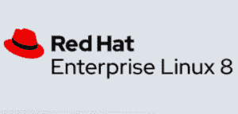

# 哪里可以找到 CentOS 替代品？这里有 5 个可靠的 Linux 发行版可以看看

> 原文：<https://thenewstack.io/where-to-turn-for-a-centos-replacement-heres-5-solid-linux-distros-to-check-out/>

到现在为止，你已经非常清楚 [Red Hat](https://www.openshift.com/try?utm_content=inline-mention) 的[对其 CentOS 社区分布的](https://thenewstack.io/red-hat-deprecates-linux-centos-in-favor-of-a-streaming-edition/)的改变已经使其对于许多用例来说成为一个不太理想的的[。从常规版本切换到滚动版本](https://thenewstack.io/wherefore-art-thou-centos-rocky-linux-cloudlinux-and-centos-stream/)，这一变化带来了多米诺骨牌效应，给许多管理员带来了相当混乱的前进道路。他们会冒险坚持使用一个可能变得不稳定的平台吗？那些依赖 cPanel 的人呢？他们去哪里了？

因为这是开源的，你知道在问题变成严重问题之前，开发人员(或开发团队)介入解决问题只是时间问题。因此，无论您的服务器采用 CentOS 7、8 还是 Stream，您都有多种选择。你可能会感到惊讶，这些选项中的一些感觉非常熟悉。他们应该这样做，因为他们几乎是你所熟悉和依赖的 CentOS 的精确克隆。

但是您应该使用哪一个特定于 Linux 服务器的发行版呢？让我们来看看每一个，看看我们是否能帮你解决这个问题。

## AlmaLinux

AlmaLinux 是尘埃落定后发布的首批 CentOS 克隆产品之一。诞生于 CloudLinux，一家以托管和提供全球数千个数据中心而闻名的公司。CloudLinux 已经有了自己的 CloudLinux OS，它是专门为共享主机环境而构建的。在宣布 CentOS 加入主流后，CloudLinux 决定接过衣钵，发布 [AlmaLinux](https://almalinux.org/) 。

[AlmaLinux](https://thenewstack.io/almalinux-captures-the-soul-of-centos/) 与 Red Hat Enterprise Linux 8 and 二进制兼容，不仅“永远免费”，而且由 command 为社区开发。这个发行版得到了 AWS、ARM、开源实验室、cPanel、CHEF、Pleak、Mattermost 等公司的支持。

这个 CentOS 的替代品已经推出了第二个版本(8.4 版，基于 Red Hat Enterprise Linux [RHEL] 8.4)，并且已经可以用于企业生产。

据 [CloudLinux](https://www.cloudlinux.com/) 的总裁兼首席收入官[吉姆·杰克逊](https://www.linkedin.com/in/james0248/)称，AlmaLinux 更重要的一个方面(尤其是对大公司而言)是，你可以通过 [TuxCare](https://tuxcare.com/linux-support-services/almalinux-support/) 购买企业级支持。

> 如果你用过 CentOS，你会很快熟悉 alma Linux——它甚至默认为 GNOME 桌面

对于那些依赖 cPanel 和 WHM 的人来说，请放心，这两种技术都在 AlmaLinux 上得到支持，cPanel 的制造商甚至说，“我们已经承诺通过 CloudLinux 支持 RHEL 分叉，”Jackson 说。

如果你用过 CentOS，你会很快熟悉 alma Linux——它甚至默认为 GNOME 桌面，就像你多年来最喜欢的数据中心 Linux 发行版一样。

## Oracle Linux

Oracle Linux 已经存在了很长一段时间，但似乎一直处于 CentOS 的阴影之下——事实上，它几乎是 Oracle 商店的 RHEL 克隆版。现在可能是您的公司了解这种替代发行版的最佳时机。

在你这么做之前，你可能想问问自己，“我和开源的联系有多深？”你看，这些年来，甲骨文和开源有着一种很好的关系。甲骨文对 OpenOffice(甲骨文在 2009 年收购 Sun Microsystems 时收购的)的管理不力可以说导致了 LibreOffice 的分叉。如此多的人担心 MySQL 会发生同样的事情，以至于该数据库系统的代码库被分叉为创建 MariaDB。

但是，如果你能抛开 Oracle 并不总是开源软件的最大支持者这一概念，它确实有一个非常出色的基于服务器的发行版。Oracle Linux 是市场上性能最好的 CentOS 克隆之一。在升级/更新性能方面，这可能是唯一一个可以与 Ubuntu Server 这样的公司针锋相对的 RHEL 克隆版本。因为 Oracle Linux 已经存在了一段时间，所以您会发现它是坚如磐石的服务器发行版。

> 就升级/更新性能而言，Oracle Linux 可能是唯一能够与 Ubuntu Server 等公司针锋相对的 RHEL 克隆版本之一。

对于云原生开发人员来说，总会有 Oracle Linux 云原生环境，这是一个完全集成的套件，用于开发和管理云原生应用程序和服务。这些工具都基于开放标准，由[开放容器倡议](https://opencontainers.org/)和[云本地计算基金会](https://cncf.io/?utm_content=inline-mention)定义，并且已经过互操作性测试。这些工具不是默认安装的，但是它们被设计和优化为在 Oracle Linux 上运行。

对 Oracle Linux 的一个重要警告是它不受 cPanel 的支持。因此，如果你正在寻找一个替代的主机提供商，Oracle Linux 不是你想要的发行版。如果您正在寻找云原生开发和(尤其是)与 Oracle 数据库的集成，Oracle Linux 可能是满足(并超越)您需求的理想发行版。

而且，像 AlmaLinux 一样，您可以购买对 Oracle Linux 的[支持。](https://www.oracle.com/linux/support.html)

## 红帽企业版 Linux

如果不包括所有 CentOS 克隆所基于的分布，您就无法获得 CentOS 克隆的列表。Red Hat Enterprise Linux 应该被认为是所有企业业务的首选之一。为什么？因为红帽都是大生意。它不仅是全球收入最高的开源公司之一，也是开源项目的最大贡献者之一。

> 因此，如果您想要所有 Linux 服务器发行版之母，为什么不选择原版呢？

当然，RHEL 是有代价的。与列表中的其他发行版不同，您不会免费部署这个发行版——除非您使用[小型生产工作负载的免费 RHEL](https://www.redhat.com/en/blog/new-year-new-red-hat-enterprise-linux-programs-easier-ways-access-rhel)计划部署到 16 个或更少的系统。

Red Hat Enterprise Linux 是基于 Fedora 的，Fedora 是一个社区驱动的发行版，作为最终将到达 RHEL 的测试场。RHEL 可通过包括世界一流支持的订阅获得(或者您可以选择自助订阅以获得更低的费用)。RHEL 还包括一些市场上最好的[发行版文档](https://access.redhat.com/documentation/en-us/red_hat_enterprise_linux/8/)。因为 RHEL 支持 x86/64、ARM、Power 和 IBM System Z，所以您会发现它能够在几乎任何环境下运行。

但更重要的是，如果你发现自己在考虑这个列表中的任何发行版，要知道它已经被 RHEL 严重影响(或者简单地克隆)。因此，如果您想要所有 Linux 服务器发行版之母，为什么不选择原版呢？

## 洛基 Linux

Rocky Linux 很特别，因为它是由创建 CentOS 的同一个开发者创建的。所以，如果你想要一个接近 CentOS 的分布，这就是你应该开始你的旅程的地方。如果你用过 CentOS Linux，你用过 Rocky Linux。这意味着零学习曲线。就这一点而言，Rocky Linux 比 CentOS 更胜一筹。

> Rocky Linux 是由创建 CentOS 的同一个人开发的，所以你可以肯定，它将采用同样缓慢、有条不紊的方法，使 CentOS 如此稳定。

因为 Rocky Linux 是由创建 CentOS 的同一个人开发的，你可以肯定它将采用同样缓慢、有条不紊的方法，使 CentOS 如此稳定。如果 Rocky Linux 的第一个候选发行版有任何暗示的话，这个服务器发行版将会成为市场上最可靠的发行版之一。

关于 Rocky Linux(我在采访创造者 Gregory Kurtzer 时报道了这一点)有一点很重要，那就是这个发行版不仅仅是重新创造 RHEL，而是“建立社区、基础设施和信任，让 Rocky Linux 永远保持稳定、开放、协作和安全。”

换句话说，Rocky Linux 不会是一个不可靠的 Linux 发行版，它将聚集大量用户，然后像 CentOS 那样改变策略。Rocky Linux 有望成为 CentOS 改变领导地位之前的样子。

Rocky Linux 已经获得了 45 Drives、OpenDrives、MontaVista 和[亚马逊网络服务](https://aws.amazon.com/?utm_content=inline-mention)的支持，所以你知道它将在第三方云主机上可用。

## VzLinux

VzLinux 是另一个似乎凭空出现的 CentOS 克隆体。但事实并非如此。VzLinux 作为 OpenVz(以及其他商业产品，由 [Virtuozzo](https://www.virtuozzo.com/) 提供)的基础操作系统已经存在了二十多年。对于那些从未听说过 Virtuozzo 的人来说，这家公司专门从事虚拟化，并负责开发第一个商业化的操作系统级虚拟化容器技术。这项技术 Virtuozzo 于 2000 年首次推出，并于 2005 年作为开源 OpenVz 发布。

Virtuozzo 了解容器，所以 VzLinux 面向云原生也就不足为奇了。该服务器发行版有三种风格，针对以下方面进行了优化:

*   运行高密度系统容器
*   虚拟环境
*   裸金属

VzLinux 也支持作为不同虚拟机管理程序(Virtuozzo、OpenVz 和 KVM)下的客户操作系统，并且可以使用来自各种超大规模市场的模板进行部署。VzLinux 甚至可以作为 Docker 容器镜像使用(可以使用命令*Docker pull virtuozzo/VzLinux 8*来拉取)。

> Virtuozzo 了解容器，所以 VzLinux 面向云原生也就不足为奇了。

然而，最终你会发现 VzLinux 和 CentOS 一样熟悉。像这个列表中的所有其他发行版一样，它与 RHEL 8 是 1:1 二进制兼容的。可以从[VzLinux 官方页面](https://www.virtuozzo.com/vzlinux.html)免费下载使用 VzLinux。

## 结论

最后，你有选择。如果您发现自己对决定将 CentOS 从使其如此受欢迎和可靠的地方转移出来感到恐慌，您可以将这种恐慌放在一边，知道您可以从丰富的发行版中进行选择，所有这些发行版都会将最初使您选择 CentOS 的东西带到桌面上。因为这些发行版大多数都是免费的，所以您可以试用它们，并找到完全符合您的用例、风格和公司规模的发行版。

<svg xmlns:xlink="http://www.w3.org/1999/xlink" viewBox="0 0 68 31" version="1.1"><title>Group</title> <desc>Created with Sketch.</desc></svg>