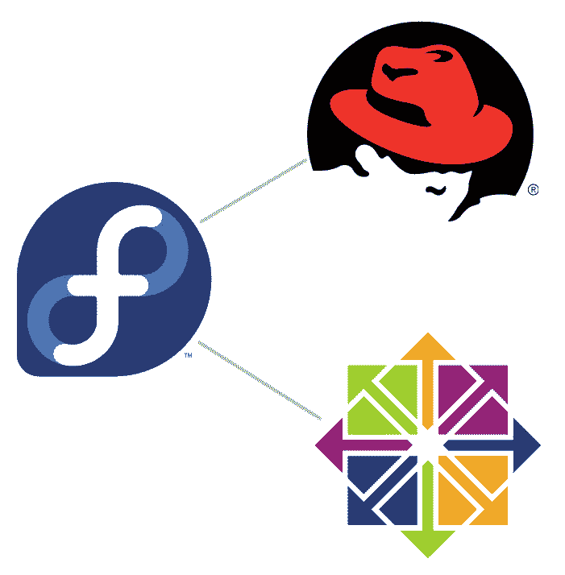

# 你在哪里，森托斯？Rocky Linux、CloudLinux 和 CentOS Stream

> 原文：<https://thenewstack.io/wherefore-art-thou-centos-rocky-linux-cloudlinux-and-centos-stream/>

茱丽叶在阳台上呼喊着罗密欧的名字——这个阻止他们两人在一起的名字。

随着 IBM/Red Hat 决定[将 CentOS 从传统版本转移到滚动版本](https://thenewstack.io/red-hat-deprecates-linux-centos-in-favor-of-a-streaming-edition/)，Linux 和商业技术社区正以类似的方式哀叹。为什么？这感觉非常像一种损失，就像 CentOS 背后的公司正在使依赖开源操作系统的社区不再与他们选择的平台有关系。

听起来有点刺耳。

让我们后退一点。

## 什么是 CentOS …真的吗？

这是一个要问的重要问题。

最初，CentOS 是 CAOS Linux 的构建版本，是由 [Gregory Kurtzer](https://gmkurtzer.github.io/) 创建的发行版。2006 年 6 月，Tao Linux(一个 Red Hat Enterprise Linux 克隆版)的主要开发人员宣布退出发行版，并将他的工作转入 CentOS。此时，森托斯第一次尝到了真正的 RHEL 克隆人的滋味。两年后，CentOS 取代 Debian 成为网络服务器最受欢迎的 Linux 发行版。

然后是红帽。2014 年，红帽成为官方赞助商或 CentOS。CentOS 的所有商标都被转让给了 Red Hat，一切都解决了。CentOS 开发激增，这有助于该发行版在企业用户中得到广泛采用。

最终，开发过程看起来像这样:

*   Red Hat Enterprise Linux 是 Fedora 的下游
*   CentOS 在 RHEL 的下游

那是什么意思？Red Hat Enterprise Linux 受益于 Fedora，CentOS 受益于 RHEL。

字里行间，CentOS 有效地成为了红帽企业版 Linux 的免费(100%开源)版本。

这种模式非常有效，因为它允许用户体验 RHEL 提供的东西，而不必支付入场费。对一些人来说，这很重要，因为 RHEL 订阅对于小企业和非营利组织来说并不总是划算的。

然后是 IBM。

## 前方全“流”

我大概可以在这里结束，因为每个人都知道当大企业消费开源公司时会发生什么(想想甲骨文)。

大企业只关乎一件事——底线。虽然这纯粹是猜测，但一个相当容易得出的结论是，IBM 将 CentOS 视为达到一个非常有损失的目的的手段。对许多人来说，CentOS 就是 RHEL，没有额外的支持或订阅费用。但事实是，多亏了谷歌，有全世界的支持。所以 CentOS 蚕食了 IBM 的摇钱树——RHEL。

不管是什么原因，IBM 做出了激烈的举动。此举是为了结束许多用户都知道和喜爱的 CentOS，并以滚动发布版本 CentOS Stream 取而代之。

什么是滚动发布？简单:滚动发布意味着所有软件都要频繁更新。滚动发布不是每年(或定期)进行主要和次要的迭代，而是始终保持所有内容的更新。

任何长期使用操作系统的人都可以看到潜在的问题。拥有最新的软件(从内核到用户空间应用程序)会导致不稳定的问题。软件可能没有经过广泛的测试，所以很可能存在漏洞或稳定性问题。

在台式机上，这可能是可以接受的。在服务器上？不会吧。

因此，Linux 和商业社区的反应不出所料——气喘吁吁，大喊“犯规！”

CentOS Stream 并不意味着可以替代坚如磐石的 CentOS。CentOS Stream 充其量是一个测试场，让用户看一眼最新版本的 RHEL 可能会提供什么。

或者有可能是。然而，这并不是 IBM 为 CentOS Stream 准备的。相反，新的上游/下游看起来如图 1 所示。

图 CentOS 流如何融入流中。

换句话说，CentOS 流和 RHEL 都是 Fedora 的下游。那是什么意思？这意味着 CentOS 流将不再接收红帽添加到 RHEL 的位。

CentOS Stream 只是一个基于 Fedora 的滚动发布服务器发行版。此时，为什么不直接使用 Fedora 服务器呢？这不是一个滚动版本，已经从 Fedora 的工作中受益。

对此，红帽的官方说法是:

CentOS Stream 不能替代 CentOS Linux 相反，这是一个自然的、不可避免的下一步，旨在实现项目的目标，进一步推动企业 Linux 创新。Stream 缩短了 RHEL 地区各方开发者之间的反馈回路，让我们在设计未来版本的 RHEL 时，更容易听到所有人的声音，无论是大合作伙伴还是个人贡献者。

对我来说，这明确了 IBM/Red Hat 可能认为保留 CentOS 会危及 RHEL 的想法。这足以证明 CentOS 有多棒。

但是，唉，现在已经没有了。

或者是？

## 溪流中出现了新的支流

我们宣布 CentOS 流还不到一周，CentOS 的两个分支就已经诞生了。CentOS 的最初创造者(Kurtzer)宣布 [Rocky Linux](https://github.com/rocky-linux/rocky) ，这是一个“社区企业操作系统，设计为 100% bug 对 bug 兼容企业 Linux，现在 CentOS 已经改变了方向。”

第二个分支将由 [CloudLinux OS](https://blog.cloudlinux.com/announcing-open-sourced-community-driven-rhel-fork-by-cloudlinux) 的创造者发布，他们将在 2021 年的 Q1 开发一个“免费、开源、社区驱动、1:1 二进制兼容的 RHEL 8 分支(以及未来的版本)。”

所以救援马上就到。

## 如何将 CentOS 8 转换为 CentOS 流

好的，那么你可能有一些 CentOS 8 机器正在生产或者闲置着。在某种程度上，该发行版将被弃用，并且不再接收更新。如果您想在这一过程中领先一步，您可以通过几个快速命令将 CentOS 8 平台转换为 CentOS Stream。方法如下:

1.  登录您的 CentOS 8 机器。
2.  使用命令**sudo dnf install centos-release-stream**安装必要的存储库。
3.  使用命令 **sudo dnf swap centos-{linux，stream}-repos** 使新的流存储库成为默认存储库。
4.  使用命令 **sudo dnf distro-sync** 同步已安装的软件包和可用的软件包。

当上述过程完成时，您的 CentOS 平台现在应该是 CentOS Stream。您可以通过发出命令 **cat /etc/centos-release** 来检查它。该命令的输出将显示 CentOS Stream 版本 8。

这就是全部了。

不管是好是坏，CentOS 已经不存在了。您的企业很有可能会寻找 CentOS 的替代品。如果你想要一个没有相关费用的服务器发行版，我建议你试试 [Ubuntu Server](https://ubuntu.com/download/server) 、 [Debian](https://www.debian.org/) 、 [Fedora Server](https://getfedora.org/en/server/) 或 [openSUSE](https://www.opensuse.org/) 。如果你不介意企业级操作系统的成本，一定要看看 [SUSE](https://www.suse.com/) 和 [Red Hat Enterprise Linux](https://www.redhat.com/en/technologies/linux-platforms/enterprise-linux) 。

<svg xmlns:xlink="http://www.w3.org/1999/xlink" viewBox="0 0 68 31" version="1.1"><title>Group</title> <desc>Created with Sketch.</desc></svg>