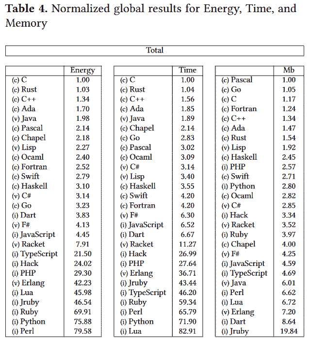
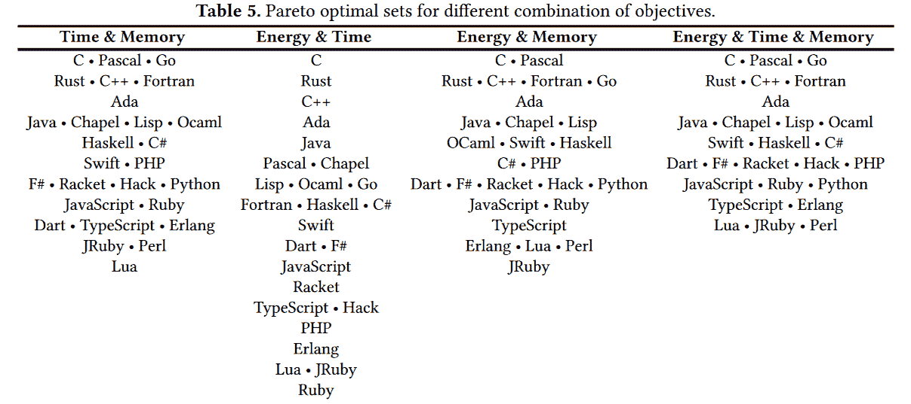

# 哪些编程语言用电最少？

> 原文：<https://thenewstack.io/which-programming-languages-use-the-least-electricity/>

能源使用数据能告诉我们编程语言的质量吗？

去年，来自葡萄牙三所不同大学的六名研究人员决定调查这个问题，最终发表了一篇题为“跨编程语言的能效”的论文他们运行了用 27 种不同语言编写的 10 个编程问题的解决方案，同时仔细监控每个方案的用电量——以及其速度和内存使用情况。

具体来说，他们使用了来自[计算机语言基准游戏](https://en.wikipedia.org/wiki/The_Computer_Language_Benchmarks_Game)的 10 个问题，这是一个比较性能的免费软件项目，包括一组标准的简单算法问题，以及一个运行测试的框架。(它的前身是“伟大的计算机语言枪战”。)“这使我们能够获得一组可比较的、有代表性的、广泛的程序…以及编译/执行选项和编译器版本。”

运行各种各样的基准测试是很重要的，因为最终它们的结果会根据所执行的测试而变化。例如，总的来说，C 语言被证明是最快的，也是最节能的。但在基准测试中，扫描 DNA 数据库中的特定基因序列，Rust 是最节能的，而 C 排在第三位。

然而，即使在同样的测试中，“最好的”语言也取决于你的标准。在那次测试中，C 也是仅次于 T4 的第二快的语言(再次排在 Rust 之后)。但是如果按照内存使用情况排序，Rust 下降了整整 9 个位置。虽然 Fortran 是该测试中第二节能的语言，但当结果改为按*执行时间*排序时，它也下降了整整六位。

> 更快的语言并不总是最节能的。

研究人员指出，他们“严格遵循”了 CLBG 项目关于编译器版本和最佳优化标志的指导方针。功耗使用英特尔的工具进行测量，即[运行平均功耗限制](https://01.org/blogs/2014/running-average-power-limit-%E2%80%93-rapl)工具，每个程序执行不止一次，而是 10 次，“以减少冷启动和缓存效应的影响，并能够分析测量的一致性，避免异常值。”(为此，他们报告说“测得的结果相当一致。”)为了增加一致性，所有测试都是在运行 Linux Ubuntu Server 16.10(内核版本 4.8.0-22-generic)的台式机上进行的，内存为 16GB，CPU 为 3.20GHz Haswell Intel Core i5-4460。

在他们的论文中，研究人员指出了一些有趣的结果。

Lisp 的平均能耗(131.34 焦耳)是 C 的 2.27 倍，执行时间(4926.99 毫秒)是 C 的 2.44 倍，内存(126.64 兆字节)是 Pascal 的 1.92 倍

他们还比较了编译语言和解释语言的结果(运行在虚拟机上的语言有单独的类别)。本文还包括不同编程范例的单独比较，包括函数式和命令式编程，以及面向对象编程和脚本。

## 越快越环保吗？

这篇论文审视了一个普遍的假设，即一个更快的 T2 程序总是使用更少的能量，指出这并不像物理定律所说的 E(能量)= T(时间)×P(能量)那么简单。研究人员指出，这部分是因为电力消耗的速度不一致，这可能会影响其他研究人员调查程序运行时间是否影响其能耗的工作。(“关于这个问题的结论有时会有分歧……”)在他们的一次基准测试中，一个 Chapel 程序的执行时间比用 Pascal 编写的同等程序少 55%——然而 Pascal 程序使用的能量少 10%。

因此，尽管人们仍然普遍认为程序运行越快，能耗就越低，但研究人员明确表示，“一种更快的语言并不总是最节能的。”

这可能是一个很难回答的问题，因为功耗受许多因素的影响(包括编译器的质量和使用的库)。但最终，研究人员甚至能够根据 CPU 或 DRAM 消耗的能量来分解能量消耗，得出的结论是，无论基准程序是在虚拟机上编译、解释还是运行，平均而言，CPU 消耗了大部分能量(约 88%)。

有趣的是，解释语言显示了稍微高一点的变化，CPU 有时消耗高达 92.90%的功率或低至 81.57%。

在研究了他们的结果后，研究人员还得出结论，DRAM 的峰值使用和能耗之间的关系“几乎不存在”

这项研究为这个永恒的问题提供了更多的见解:越快越环保吗？没错，“前五名最节能的语言在按执行时间排序时保持了它们的排名，并且在能量和时间值上的差异非常小。”

事实上，对于 10 个基准测试问题中的 9 个，最高分(速度和能效)来自总体上最快和最节能的三种语言之一——这并不令研究人员惊讶。“众所周知，这三种顶级语言(C、C++和 Rust)针对执行性能进行了大量优化，效率也很高，我们的数据也显示了这一点。”

但是，当你根据运行时间对其他 24 种语言进行排序时，你不会看到与根据能效对它们进行排序时相同的顺序。只有四种语言保持相同的能量和时间等级(OCaml、Haskel、rank 和 Python)，而其余的则完全打乱了顺序

即使在单独的基准测试中，也有快速运行的语言不是最节能的。

## 编译语言的优点

还有其他有趣的结果。编译语言“往往”是最节能、运行速度最快的——他们的论文甚至可以用一个数字来量化这种差异。平均而言，编译语言执行解决方案消耗 120 焦耳，而虚拟机和解释语言的这一数值分别为 576 焦耳和 2365 焦耳

研究人员在比较执行时间时也采用了同样的精度，得出的结论是，平均而言，“编译语言需要 5103 毫秒，虚拟机语言需要 20623 毫秒，解释语言需要 87614 毫秒。”

在这两个类别的前五种语言中，有四种是编译过的。(例外？Java。)

五种最慢的 T2 语言都被解释了:Lua、Python、Perl、Ruby 和 Typescript。消耗能量最多的五种语言是*也是*解释的:Perl、Python、Ruby、JRuby 和 Lua。

来自谷歌的[编程语言 Carbon 使用了多少能源，这个问题还没有定论。](https://thenewstack.io/google-launches-carbon-an-experimental-replacement-for-c/)

但与此同时，当使用正则表达式操作字符串时，五种最节能的语言中有三种变成了解释型语言(TypeScript、JavaScript 和 PHP)，“尽管它们在其他场景中往往不是很节能。”

编译语言也占据了使用最少内存空间的前五名。

“平均来说，编译语言需要 125Mb，虚拟机语言需要 285Mb，解释语言需要 426Mb，”研究人员报告说。与此同时，解释语言占据了五个底部位置中的四个，这意味着它们消耗了最多的内存空间:JRuby、Dart、Lua 和 Perl。(虽然 Erlang 不是一种解释型语言，但它也会出现在排名最后的五种语言中，介于 Dart 和 Lua 之间)。

如果按编程模式分类，命令式语言需要 116Mb，面向对象的语言需要 249Mb，函数式语言需要 251Mb，最后是脚本语言需要 421Mb

事实上，当比较不同的范例时，命令式编程经常处于领先地位。它的基准程序平均使用的能量也少得多——*和*比面向对象、函数和脚本范例的基准程序运行得快得多。

但是有很多因素要考虑。研究人员写道:“很明显，不同的编程范式，甚至同一范式内的语言，对能耗、时间和内存的影响完全不同。”然而，哪一个是最重要的将取决于您的场景。(例如，后台任务并不总是需要最快的运行时间..)

有些应用需要考虑两个因素，例如，能耗和执行时间。在这种情况下，“C 是最好的解决方案，因为它在两个单一目标中都占主导地位，”研究人员写道。如果你试图在使用更少内存的同时节省时间，C、Pascal 和 Go“是等价的”——如果你观察所有的*三个*变量(时间、能量使用和内存使用)，情况也是如此。但是如果你只是想节省能量，同时使用更少的内存，你最好的选择是 C 或 Pascal。

在论文的最后，研究人员补充说，为了进一步研究，他们想检查总内存使用量*随着时间的推移*是否与消耗的能量有更好的关联。

例如，他们在网上分享他们的数据，这让未来的研究人员更容易进行比较。NET 语言或 JVM 语言。对于使用移动应用、物联网系统或其他消耗有限电源的应用的开发人员来说，功耗是一个主要问题。

但最终，这项研究也可能留给程序员他们最讨厌的东西:模糊性。研究人员报告说，如果你正在寻找一种最好的编程语言，“这个问题没有具体的最终答案。

研究人员总结道:“虽然在每个基准测试中，最节能的语言几乎总是最快的语言，但事实是，没有一种语言始终比其他语言好。”“一种语言的使用环境是决定这种语言是否是最节能选择的核心因素。”

<svg xmlns:xlink="http://www.w3.org/1999/xlink" viewBox="0 0 68 31" version="1.1"><title>Group</title> <desc>Created with Sketch.</desc></svg>