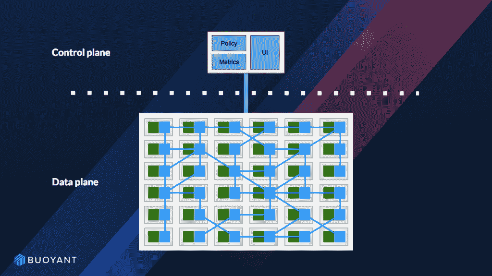

# 我应该使用哪个服务网格？

> 原文：<https://thenewstack.io/which-service-mesh-should-i-use/>

 [乔治·米兰达

乔治·米兰达是浮力社区的主任。他在 WebOps 工作了 15 年多，在各种创业公司和企业工作。从那以后，他一直与那些相信简化大规模运行应用程序的日益增长的复杂性的供应商合作。在加入 bubbly 之前，他是 Chef Software Inc .的开发倡导者，使用自动化来管理向云基础架构的转移。](https://buoyant.io/) 

如果你正在管理云原生微服务，你听说过一个[服务网格](https://thenewstack.io/category/service-mesh/)，并且你理解为什么你需要一个服务网格[，那么这篇文章就是为你准备的。当您开始更仔细地研究使用服务网格时，您可能会突然意识到许多可用的选项。你应该选择什么？你怎么能找出它们之间的区别以及什么可能适合你呢？本文提供了一个客观的供应商中立指南来帮助您开始。](https://buoyant.io/2017/04/25/whats-a-service-mesh-and-why-do-i-need-one/)

服务网格是一个专用的基础设施层，用于管理服务到服务的通信，使其可见、可管理和可控。具体细节因产品而异，但一般来说，在“服务网格”中有一些共同的东西

## 服务网格的公共属性

在上面的基本架构图中，数据平面中的绿色方框表示应用程序，蓝色方框表示服务网格代理，矩形表示应用程序端点(pod、物理主机等)。控制平面提供了用于总体控制代理行为的集中式 API。虽然与控制平面的交互可以自动化(例如，通过 CI/CD 管道)，但这通常是您(作为一个人)与服务网格进行交互的地方。

本指南中的任何服务网格都具有某些应被视为表桩的功能:

*   弹性功能(重试、超时、截止时间等)
*   级联故障预防(断路)
*   健壮的负载平衡算法
*   对请求路由的控制(对于 CI/CD 发布模式很有用)
*   在通信端点之间引入和管理 TLS 端接的能力
*   丰富的指标集，在服务到服务层提供工具

这些特性的细节——它们的实现方式、配置选项等——因产品而异。但是，在高层次上，这些应该被认为是任何服务网格都应该提供的标准东西。相反，本指南将侧重于区分不同产品的特性。

## 服务网格有什么不同？

服务网格的存在是为了让您的分布式应用程序在生产中可靠地运行。借助微服务，服务对服务的通信成为应用运行时行为的基本决定因素。过去作为同一个运行时的一部分在本地发生的应用程序功能，现在变成了通过不可靠的网络传输的远程过程调用。反映业务需求的复杂决策树的成败现在要求您考虑分布式系统编程的现实。

因此，当我们(供应商)提倡“服务网格”时，我们倾向于关注管理那些远程过程中的消息(或 API 调用)。不可避免地，服务网格会与其他消息管理解决方案进行比较，如面向消息的中间件、企业服务总线(ESB)、企业应用集成模式(EAI)或 API 网关。服务网格可能与其中一些有细微的功能重叠，但是作为一个整体，它是围绕着一个更大的问题集的。

服务网格是不同的，因为它是作为位于应用程序之外的基础设施来实现的。它的价值主要是在检查 RPC(或消息)的管理时实现的，但是它的价值扩展到所有入站和出站流量的管理。他们可以利用一系列互连的代理(或“网格”)将远程通信管理直接编码到您的应用中，而不是将该逻辑从您的应用中分离出来，并减轻开发人员的责任。

## 好吧，我该选什么？

在查看服务网格类别中的特定产品之前，如果您从以下运营和技术问题的清晰答案开始，将有助于您的导航。

1.  **我和我的组织为服务网格做好准备了吗**？使用任何新工具都要付出学习实现、使用和维护它的代价。根据您对解决方案的准备情况，确保您的选择值得认知投资。如果您管理一个进行大量不同服务调用的分布式应用程序(即微服务)，您将知道您已经为服务网格做好了准备。
2.  **我今天遇到了什么问题**？在管理您的分布式生产应用程序时，最大的难点在哪里？是可观察性、理解服务依赖、管理安全性还是管理脆弱性？如果任何一个问题的答案是肯定的，那么您已经为服务网格做好了充分的准备。记住哪个痛点最疼，因为你马上就会需要它。
3.  **需要哪些平台来支持**？您的分布式应用程序在哪里运行？除了支持您选择的容器管理平台之外，您是否需要将您关心的使用服务网格管理的服务连接到可能不在服务网格中的其他服务？您能在多大程度上扩展您正在考虑的特定服务网状产品的覆盖范围？
4.  **您的服务目前的可观察性水平如何**？服务网格最容易实现的好处是深入服务通信的透明的开箱即用可见性。它对您的组织有多重要，目前的差距在哪里？这是一个经常被忽视的问题，但是这是第一个你可能从中获得价值的问题。(记住你的痛点！)
5.  **您已经拥有服务网格的哪些功能**？当您引入服务网格时，这将如何在您的中实现？与上述相关，在您考虑的服务网格中，您已经构建了多少模拟特性功能的解决方案？当你介绍它的时候会有问题吗？您将如何推出新功能，而不中断或废弃可以替换的现有功能？您需要的集成是否得到支持？
6.  **你的团队中的责任分工是怎样的**？各个开发团队是否期望管理他们自己的代理配置？控制是否由中央平台运营团队维护？无论您的组织职责是什么，您都应该确保您所考虑的服务网格允许您以对您的组织有意义的方式来分配控制。
7.  **您倾向于集中式功能还是分散式功能**？根据您的部署的规模和复杂性，您是喜欢基于主机的代理池这样的实现，还是应该考虑使用 sidecar 部署模型的潜在复杂性？在您的环境中，哪些组织驱动因素会影响该决策？
8.  **你和你的团队有什么支持期望**？典型的开源社区支持标准对您的团队来说足够了吗？你对快速发展的产品特性和标准有多大的容忍度？您需要商业支持选项吗？在生产中运行时，这些考虑因素非常重要。

当然，答案取决于你的具体情况。没有对每个人都普遍正确的选择。但是在比较特性集、设计理念和目标用例时，请记住这些事情。

## 产品比较

对于本指南，我们将重点关注目前可用的四种开源产品。我们将按照发行日期的顺序来介绍它们。这些总结旨在强调不同服务网格选项之间的重要区别。

### 林克尔德

作为由[浮力](https://buoyant.io/)赞助的开源项目，Linkerd (发音为“linker-dee”)于 2016 年 2 月首次发布。这是第一个普及“服务网格”术语的产品。Linkerd 是一个强大的、多平台的、功能丰富的服务网，可以在任何地方运行。Linkerd 建立在 [Twitter 的欺骗库](https://github.com/twitter/finagle)上，用 Scala 编写，运行在 JVM 上。它可以扩展到每个实例每秒管理数万个请求。

显著的特点包括:

*   所有的“牌桌赌注”特征(如上所列)，
*   支持多种平台(Docker、Kubernetes、DC/OS、亚马逊 ECS 或任何单机)，
*   内置的服务发现抽象来统一多个系统，
*   支持 gRPC、HTTP/2 和 HTTP/1.x 请求+所有 TCP 流量。

Linkerd 包括代理数据平面和 Namerd(“namer-dee”)控制平面，所有这些都在一个包中。Linkerd 是一个开源项目，但它也得到了浮力的商业支持。截至 2018 年 4 月，超过 50 家公司正在生产中运行 Linkerd，它有着良好的记录，已经管理了用户超过 1 万亿次的服务请求。

### 使者

[特使](https://www.envoyproxy.io)于 2016 年 10 月作为开源项目由[马特·克莱恩](https://twitter.com/mattklein123)和 [Lyft](https://www.lyft.com/) 团队首次发布。它是作为一个高性能 C++应用程序代理编写的，专为现代云原生服务架构而设计。Envoy 既可以用作独立的代理层，也可以用作服务网格架构的“通用数据平面”。Envoy 有一个多样化的社区，由在生产中使用它的贡献者组成。

显著的特点包括:

*   所有“表桩”功能(当与控制平面配对时，如 Istio)，
*   在负载下运行时，p99 尾部延迟较低，
*   在其核心充当 L3/L4 滤波器，开箱即用地提供许多 L7 滤波器，
*   支持 gRPC 和 HTTP/2(上行/下行)，
*   API 驱动、动态配置、热重装、
*   强烈关注度量收集、跟踪和整体可观察性。

特别是作为更高级应用程序代理的基础，Envoy 填充了服务网格架构的“数据平面”部分。Envoy 是一个高性能的解决方案，占用的资源很少，这使得它可以作为共享代理或边车代理部署模型来运行。Envoy 由社区支持，或者来自商业供应商，如 [Turbine Labs](https://www.turbinelabs.io) 。您还可以在安全框架、网关或其他服务网格解决方案(如 [Istio](https://istio.io) )中找到 Envoy。当与 Istio 控制平面配对时，Envoy 可以提供所有“表桩”服务网格功能。

### 伊斯迪奥

[Istio](https://istio.io) 于 2017 年 5 月首次发布，是 Lyft、IBM、谷歌(与其他合作伙伴，如红帽，以及其他许多不久后加入的合作伙伴)之间的开源合作。Istio 旨在提供一个通用控制平面来管理各种底层服务代理(默认情况下，它与 [Envoy](https://www.envoyproxy.io) 配对)。Istio 最初的目标是 Kubernetes 部署，但是它是从平台无关性的角度出发编写的。Istio 控制平面是可扩展的，并且是用 Go 编写的。Istio 项目侧重于性能和规模、可移植性的设计原则，以及保持松散耦合组件的灵活性。

显著的特点包括:

*   所有的表格都具有一些特性(当与数据平面配对时，如 Envoy)，
*   包括身份、密钥管理和 RBAC 在内的安全特性，
*   故障注入，
*   支持 gRPC、HTTP/2、HTTP/1.x、WebSockets 和所有 TCP 流量，
*   复杂的政策、配额和利率限制，
*   多平台、混合部署。

Istio 控制平面侧重于为运营商提供许多不同的结构来组成管理策略。它的设计目标意味着组件是为许多不同的应用程序编写的，这是使 Istio 与不同的底层数据平面配对成为可能的一部分，如商业许可的 Nginx 代理。Istio 必须与底层代理成对出现。

### 水管

Conduit 于 2017 年 12 月首次发布，作为另一个由[浮力](https://buoyant.io/)赞助的开源项目。Conduit 的目标不是针对各种平台进行优化，而是大幅简化 Kubernetes 的[服务网格用户体验。Conduit 专注于轻量级、高性能、安全，并且非常容易理解和使用。Conduit 包含一个数据平面(用 Rust 编写)和一个控制平面(用 Go 编写)。](https://thenewstack.io/why-do-you-need-istio-when-you-already-have-kubernetes/)

显著的特点包括:

*   所有牌桌赌注功能(截至 2018 年 4 月，部分功能仍在路线图中)，
*   极快且可预测的性能(低于 1 毫秒的 p99 延迟)，
*   原生 Kubernetes 用户体验(仅支持 Kubernetes)，
*   支持 gRPC、HTTP/2 和 HTTP/1.x 请求+所有 TCP 流量。

Conduit 以极简主义架构和零配置理念为中心，旨在开箱即用，极少用户交互。基于支持生产服务网格用户的经验教训，Conduit 专为寻求以最小的额外复杂性解决生产中管理分布式应用的挑战的用户而设计。

## 结论

对产品设计和差异化功能的介绍旨在帮助您确定您的服务网格之旅应该从哪里开始。评估选项需要尽职调查，我们鼓励您亲自演示不同的解决方案，看看哪种方案最适合您的环境。

这本指南是克里斯蒂安·波斯塔和 T2 本人共同努力的结果。波斯塔为[红帽](https://www.openshift.com/)工作，红帽是 [Istio](https://istio.io/) 服务网的主要贡献者之一。我为[浮力](https://buoyant.io/)公司工作，该公司赞助[连接器](https://linkerd.io/)和导管服务网。根据定义，这使我们成为竞争对手。Posta 和我作为用户、贡献者和供应商都有长期从事开源工作的经历。为了更好地利用我们对生态系统的洞察力，造福最终用户，我们决定将竞争对手之间的任何差异放在一边。我们希望这个指南能帮助你更有效地开始评估什么适合你。

为了获得更深入的信息，我们还举办了一场[联合网络研讨会](https://buoyant.io/2018/03/26/webinar-recap-navigating-the-service-mesh-ecosystem/)，进一步探讨这些产品对比。如果你有更具体的问题( [Linkerd](https://linkerd.slack.com/) 、[特使](https://envoyslack.cncf.io/)、 [Istio](https://istio.slack.com/) 和#conduit on [Linkerd Slack](https://slack.linkerd.io/) )。你也可以通过 Twitter、 [CNCF 松弛小组](https://cloud-native.slack.com/)或 [Kubernetes 松弛小组](https://kubernetes.slack.com/)直接联系 [Posta](https://twitter.com/christianposta) 或[本人](https://twitter.com/gmiranda23)。我们希望了解您在服务网格生态系统中的旅程，以及我们如何帮助您起步。

克里斯蒂安·波斯塔对本文有贡献。

<svg xmlns:xlink="http://www.w3.org/1999/xlink" viewBox="0 0 68 31" version="1.1"><title>Group</title> <desc>Created with Sketch.</desc></svg>