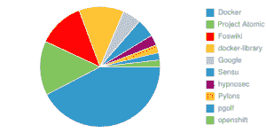

# Docker 开发人员是谁？

> 原文：<https://thenewstack.io/who-are-the-docker-developers/>

我们分析了 Docker 存储库，并提出了两个问题:

1.  Docker 贡献者还对哪些存储库感兴趣？
2.  谁是 Docker 贡献者？

我们在之前的一篇文章中回答了第一个问题。本帖试图回答第二个问题。

为此，我们从 GitHub 中提取了 Docker 存储库，并寻找 Docker 项目的贡献者。正如我们在另一篇文章中所说的，成为一名贡献者让你在 Docker 社区中变得特别:

> 向像 Docker 这样受欢迎的项目贡献代码需要深厚的技术知识，但也需要坚持不懈地坚持过程……向 Docker 这样的项目贡献代码有很多障碍；设法做出贡献的人是罕见的。

在我们收集了贡献者列表后，我们想知道他们属于什么组织，以及是否有比其他组织更活跃的组织。几个脱颖而出: [Docker](http://docker.com) (nee DotCloud)最活跃(大惊喜！)，有 16 个人使用他们的 GitHub 帐户参与 Docker 存储库。有两家公司脱颖而出: [Project Atomic](http://www.projectatomic.io/) ，Red Hat 的“部署和管理 Docker 容器”项目，有五个贡献者，以及 [Google](https://google.com) ，也有五个人(来自 GitHub 上的两个不同小组，“Google”组织和“GoogleCloudPlatform”)。两家公司最近都被卷入了 DockerCon。

其他做出贡献的著名组织有 [GitHub](https://github.com) (3)、 [FedoraCloud](https://fedoraproject.org/wiki/Cloud_SIG) (3)。有一些国际亮相似乎令人惊讶: [AlphaGov](https://www.gov.uk/) ，英国政府的一个分支，有三个贡献者，以及鹤，由巴西最大的广播公司[Globo.com](http://globo.com)(相当于《纽约时报》)提供的“一个可扩展的开源平台即服务软件”。

除了做出贡献，还有其他组织在问题列表上制造了很多噪音。参与问题列表的障碍并不高，但对围绕 Docker 的问题的熟悉和参与确实表明哪些组织将在 Docker 革命中发挥作用。该列表还汇总了参与 Docker 发行的组织。我们的前 20 名组织名单:

1.  点云:816 条评论
2.  projectatomic: 281 条评论
3.  福斯维基:239 条评论
4.  docker 图书馆:233 条评论
5.  谷歌:96 条评论
6.  感觉:95 条评论
7.  hypnosec: 54 条评论
8.  塔架:41 条评论
9.  pgolf: 38 条评论
10.  docker: 36 条评论
11.  openshift: 35 条评论
12.  alphagov: 30 条评论
13.  djangomaine: 23 条评论
14.  a4: 22 条评论
15.  詹金斯:20 条评论
16.  sysu: 19 条评论
17.  spacedock-io: 17 条评论
18.  鸟瞰软件:16 条评论
19.  gollector: 15 条评论
20.  doctape: 14 条评论

Foswiki 活跃在 Docker 问题列表上。谷歌再次排名很高，但远不及 Project Atomic: RedHat 从他们的开发人员中抽出一些时间来理解和塑造 Docker。Sensu 是波特兰重水运营公司的一个开源监控框架，或者很明显他们的基础设施依赖于 Docker。

【T2

再次有一些有趣的国际团队在考虑 Docker: LiberTIC(做有趣的[公民数据研究](http://www.datalab-paysdelaloire.org/))和法国的真纪奈语料库，以及比利时皇家自然科学研究所。这些团体在 Docker 问题列表上发表了很多意见。

我最喜欢的是催眠师:两个来自澳大利亚的高中生。显然有才华的开发人员虽然他们在澳大利亚可能还不能喝酒(也许这与那里的生产力有关),但看到开源的原则在聪明的年轻人心中扎根是很有趣的。

有一个明显的组织无处可寻:亚马逊。Amazon 在 GitHub 上保持着存在和组织，但是 Amazon 组织内部的开发者并没有使用 GitHub 为 Docker 做贡献(至少是公开的)。

<svg xmlns:xlink="http://www.w3.org/1999/xlink" viewBox="0 0 68 31" version="1.1"><title>Group</title> <desc>Created with Sketch.</desc></svg>