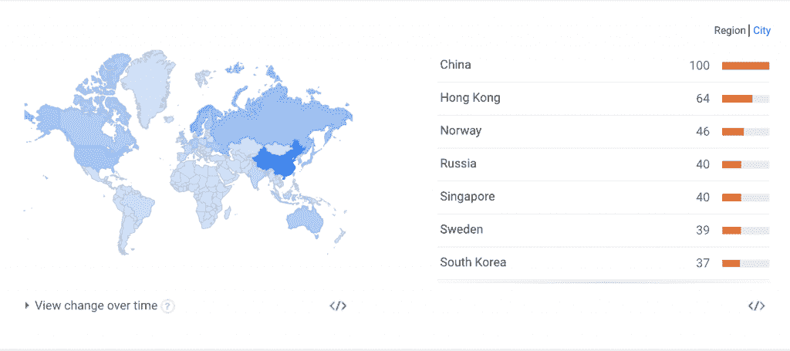
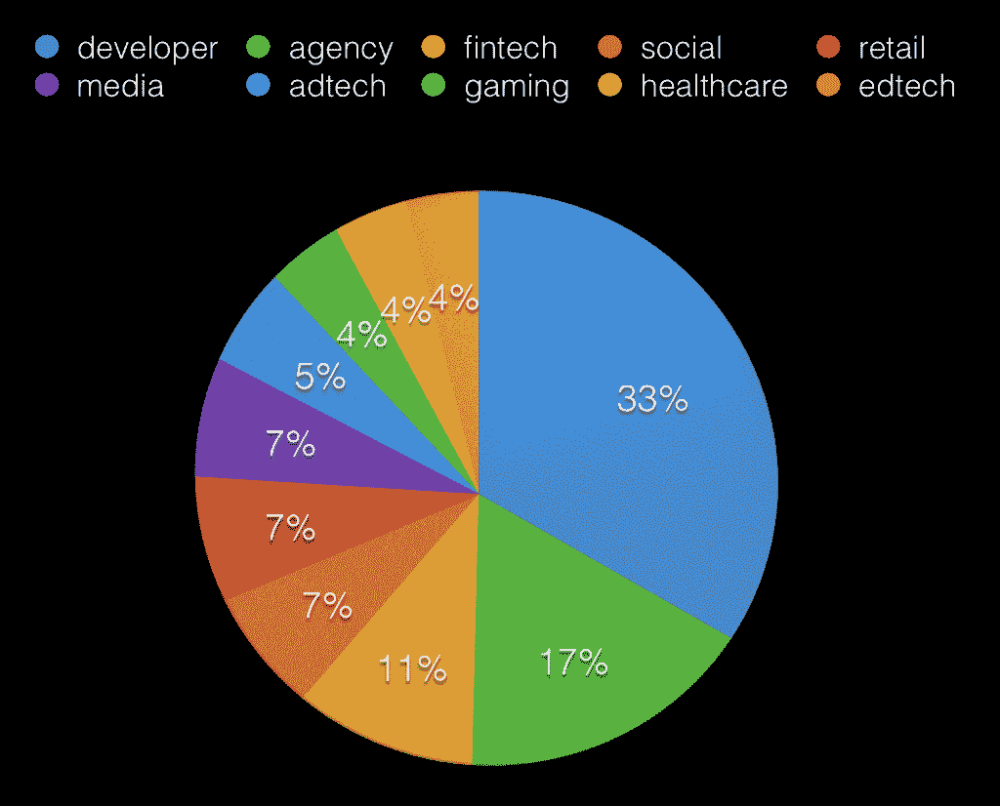

# 谁是 Go 开发者？

> 原文：<https://thenewstack.io/who-is-the-go-developer/>

[Gophercon](http://www.gophercon.com/)

将于 7 月 7 日至 10 日在丹佛举行，New Stack 是一家媒体赞助商。如果你对 Go 编程语言感兴趣，这是你应该参加的活动。我们将会参加，在 CoreOS 的展台上，在走廊里，寻找故事，听取主题演讲。参加 Gophercon？自录音再现装置发出的高音

[Alex Williams](https://twitter.com/alexwilliams)

告诉他你会去。我们一直在寻找关于 Go 和作家的故事，他们也有兴趣写这种快速出现的编程语言。

作为我在[defer panic](https://deferpanic.com/)工作的一部分，我花了很多时间与世界各地的许多地鼠交谈。钦奈、特拉维夫、悉尼、伦敦、柏林、纽约、里约热内卢、开普敦、多伦多——你能想到的地方，你附近可能都有地鼠在编码。

有趣的是，当我与非地鼠交谈时，许多人仍然坚持这种想法，即它在某种程度上是一种小众语言。有些人认为它是一种“系统”语言。有些人认为它是一种“时髦”语言。

然而，这些想法与事实相去甚远。我认为这很大程度上与这样一个事实有关，即对于 gopher 社区实际上是由谁和什么组成的，存在着普遍的误解。当你听到像 DTrace/Joyent fame 的 Brian Cantrill 这样的人在最近的 DockerCon 上说 Go 是一种“蒸汽朋克”语言时，你可以理解为什么人们会有这种印象。

在 [golang-nuts](https://groups.google.com/forum/#!forum/golang-nuts) 的邮件列表上有超过 15，000 只地鼠，在 GitHub 上有 8，000 颗星星作为主语言库。还有很多很多人甚至不知道邮件列表。有整整一代开发人员甚至不使用邮件列表。

你可能会认为所有的 Go 用户都是旧金山 SoMa 区某个时髦的、骑着独角兽的社交/本地/移动创业公司的 xooglers 或潮人。(需要说明的是，在 SoMa 中有很多使用 Go 的创业公司。)

比普通的地鼠更神秘的是 Go 编程语言实际上有多流行。

## 中国/Windows

你知道中国号称拥有世界上最多的围棋用户吗？

Go 的核心团队成员 Andrew Gerrand 在去年的 GopherCon [上发表了他对中国](https://www.youtube.com/watch?feature=player_detailpage&v=u-kkf76TDHE#t=1743)的看法。

事实上，如果你看看 Golang 的[谷歌趋势](https://www.google.com/trends/explore#q=golang)(gophers 很早就发现谷歌搜索‘Go’，咳咳，是‘no Go’)，美国在列表中仅排名第九。

如果你深入到城市景观，山景城(谷歌总部)是第二，旧金山是第五，中国城市的聚宝盆占据了名单的其余部分。我们可以从自己的亲身经历中证实中国的兴趣。

有人试图从中国通过 Stripe 支付，但遗憾的是被拒绝了(Stripe 不直接支持中国银行，尽管他们显然正在推出一个[支付宝选项](https://stripe.com/payments))。(勾搭一个兄弟，[碰撞](http://www.wired.com/2015/04/john-and-patrick-collison/)？)

有人抱怨说[防火长城](https://en.wikipedia.org/wiki/Great_Firewall)有时会严重限制我们来自中国的流量，因为它是 100%加密的。与其他城市相比，在广州这样的地方，测试服务器的可怕延迟是显而易见的。该死的那些颠覆性的垃圾收集(GC)延迟统计。

也许我们可以让他们像美国政府那样安装一些假的认证机构(CAs)来代替节流？

尽管如此，中国确实在 Windows 上拥有很大一部分地鼠，这让西方世界的很多人感到困惑。

谁知道未来会怎样？在过去的几个月里，微软在开发者关系上基本上做了一个 180 度的大转变。

## 开放源码

还记得过去一年容器炒作的惊人数量吗？哦，等等，还在继续。整个容器生态系统建立在 Go 编程语言的基础上。仅在过去的一年里，就有无数的公司成立，它们都在大量使用围棋。

Docker 和 Kubernetes——去年最受欢迎的两个开源项目——都是用 Go 编写的。Docker 目前在 GitHub 上拥有超过 22，000 颗星星。这让多少潜在的围棋开发者面临风险？Kubernetes 只是比主要的 Go 语言 repo 本身少了几百颗星。

当 Docker 的某个用户需要修补某个东西，或者修复某个 bug，或者定制代码时，会发生什么呢？他们必须写 Go。这正是围棋的传播方式。

最近出现的大多数新 DevOps 工具完全是用 Go 编写的，它是进入组织的后门。见证这一领域的公司浮出水面，如 HashiCorp 和 InfluxDB。

还记得比特币以及围绕加密货币和区块链的一系列公司吗？这些公司和项目绝大多数都在使用 Go。

我发现这一点值得注意，因为一旦一家公司大量采用了一种语言，并围绕该语言建立了一个工程团队，就很难让每个人都转向另一种语言。

当你将整个生态系统(如容器生态系统和加密货币生态系统)锁定在一种特定的语言上时，这将产生巨大的增长动力。

截至目前，GitHub 已经标记了一个令人瞠目结舌的用 Go 编写的 72，000 个知识库——这只是开源，当然，这只是冰山的一角，很难说出海洋下面的冰山有多大。我们能让 GitHub 的人证实这一点吗？

很容易指出，估计有 900 万开发人员(T2)和大量的语言开源软件——比如 Java，它们都存在于 Java 虚拟机(JVM)上——但是你是在比较一种已经有 20 年历史的语言和一种还没有过 6 岁生日的语言。它甚至还没有拿到幼儿园的第一本书。

## 乔布斯

作为一个花时间与使用 Go 的公司交谈的人，我收到的最常见的请求之一是，“你知道有什么我们可以雇用的地鼠吗，就像昨天一样？”

如果你是一名开发人员，认为你需要给自己加薪，或者你想探索一家新公司或一座新城市，现在可能是学习围棋的时候了。需求非常旺盛。

毕竟，没有人有 7 到 8 年的专业 Go 工作经验，而且社区仍然在为各种任务寻找最佳实践。

## 使用 Go 的公司

按市值排名的美国前 20 大公司中，超过一半的公司目前都在使用 Go。

认得这些名字吗？

*   chevron
*   威瑞森
*   迪斯尼
*   亚马孙
*   沃尔玛
*   脸谱网
*   通用电气
*   谷歌
*   微软
*   苹果

如果你仔细看看这个列表，你会发现所有的科技巨头都在以某种方式使用 Go:

*   亚马孙
*   谷歌
*   脸谱网
*   苹果
*   微软

如果这都不说明问题，我不知道还有什么。

按员工人数计算，最大的公司当然是沃尔玛，拥有 220 万名员工，不过如果美国国防部或中国人民解放军的队伍中没有一些地鼠，我也不会感到惊讶。

按需经济充斥着 Go 架构。这是有道理的，因为这个市场最近相当火爆，所以有很多新的进入者。

几年前，JavaScript 或 Ruby，以及它们各自的框架 Node.js 和 RoR，可能会被新公司选中，但现在，皇冠正强劲地走向 go。

原因很简单:与使用动态类型语言相比，使用 Go，你可以和使用动态类型语言一样快或更快，一样高效，甚至更高效。它在传统的静态类型语言(如 Java 和 C++)和动态类型脚本语言之间找到了一个平衡点。

这就是短暂的原因。更长远的原因是，过去的小商店倾向于选择动态类型的语言，因为他们认为这使他们能够快速行动。我认为，在更广泛的开发者意识中，这种思维过程正在发生翻天覆地的变化。

动态类型语言通常非常慢，漏洞百出，难以测试，并且会产生大量的资本支出。当公司看到他们的代码审查时间加快，回归速度减慢，更重要的是他们的 AWS 账单从每月 20，000 美元增加到每月 5，000 美元，这是显而易见的。

## 围棋公司的细分市场

现在，我要向你们抛出一些谎言，该死的谎言和统计数据——我非常高兴得到更好的数据来纠正，我知道至少有两家公司可能有这样的数据:它们都以 G 开头，与 oogle 和 ithub 押韵。

请对这些数据持保留态度——有相当多的偏见影响着它。对于这个数据，我们有一个 500 家使用 Go 的公司的样本，它们主要是由那些做工程工作广告或者有开源代码的公司组成的；也就是说，有很多公司在使用 Go，我们甚至不知道。

从我们自己的数据来看，我们看到了一个庞大的早期采用者群体。据我们所知，使用 Go 的公司中有超过三分之一从事开发工具/API 业务。另外 17%是发展机构。

这很有道理。

这非常有趣，因为有一半的公司可以说是这种语言增长的主要驱动力。对于代理公司来说尤其如此，因为他们为第三方公司做了很多项目，这就产生了飞轮效应。

接下来，我们看到金融科技占据了 11%的份额，其中大部分建立在区块链上；而社交、媒体和零售各占 7%。

令人惊讶的是，广告技术仅比游戏、医疗保健和教育技术稍微突出一点。

我不想假装知道为什么所有这些公司都在学习围棋，我也无法解释一些非常奇怪的数据，但不管发生了什么，有一点是非常清楚的:围棋将在几年内成为使用最广泛的语言。

围棋是未来。

<svg xmlns:xlink="http://www.w3.org/1999/xlink" viewBox="0 0 68 31" version="1.1"><title>Group</title> <desc>Created with Sketch.</desc></svg>