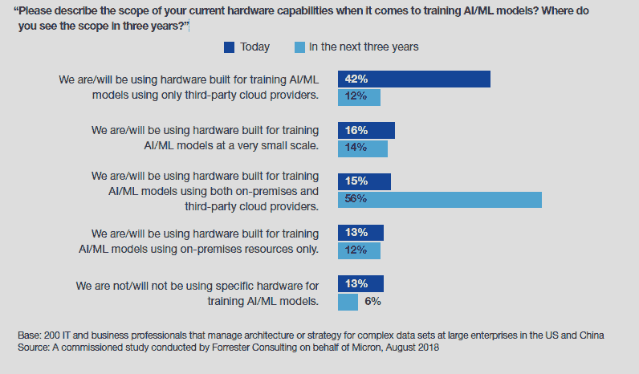
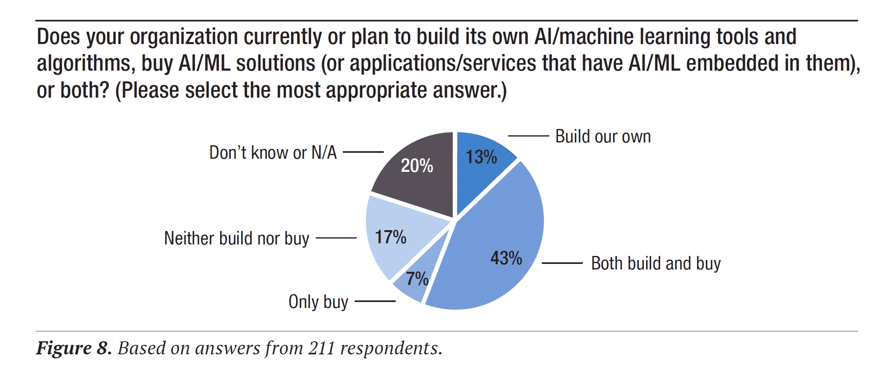

# 谁的硬件将运行分析、AI 和 ML 工作负载？

> 原文：<https://thenewstack.io/whose-hardware-will-run-analytics-ai-and-ml-workloads/>

AI/ML 工作负载将在哪里执行，由谁来处理？全行业兴起的公共云浪潮并不是一个必然的结论，正如 Forrester Consulting 委托 Micron 发布的一份报告[所提醒我们的那样，该报告调查了美国和中国大型企业中管理复杂数据的架构、系统或战略的 200 名商业专业人士。](https://event.on24.com/eventRegistration/EventLobbyServlet?target=reg20.jsp&referrer=&eventid=1907807&sessionid=1&key=88F7E7A1575B07F34713B81CF42F8405&regTag=&sourcepage=register)

截至 2018 年年中，72%的企业在内部数据中心内分析复杂数据，51%的企业在公共云中进行分析。三年后，仅内部使用将降至 44 %,用于分析的公共云将升至 61%。那些使用边缘环境来分析复杂数据集的人将从 44%上升到 53%。

这些数字为云提供了强有力的理由，但它们实际上并没有说复杂的数据实际上与 AI/ML 有关。许多分析工作负载实际上处理的是 BI，而不是需要高性能计算(HPC)功能的任务。虽然并非所有的 AI/ML 工作负载都属于这一类别，但有些工作负载确实需要定制硬件，以便在训练 AI/ML 模型时最大限度地提高性能。AI/ML 模型的早期采用者实际上更依赖公共云，而不是他们自己的设备。

目前，42%的受访者完全依赖第三方云提供商的硬件来构建 AI/ML 模型，但只有 12%的人会在三年后这样做。相反，大多数人将同时使用内部云和公共云。许多公司可能会首先选择云提供商，因为他们希望快速启动 AI/ML 活动。这些公司可能会迁移到内部环境来处理专门的工作负载，以便在扩大生产规模或使用专有数据时降低成本。

资料来源:Micron/Forrester。完全依赖云提供商的硬件来训练 AI/ML 模型的公司将从今天的 42%下降到三年后的 12%。在未来，大多数使用专门为 AI/ML 定制的硬件的公司将结合内部和云环境工作。

改变计算环境的另一个原因是为了提高性能。43%的 Forrester/Micron 受访者表示，计算和内存的位置对 AI/ML“至关重要”，另有 46%的受访者表示“重要”为了应对这一挑战，90%的公司正计划将计算和内存移近 AI/ML 工作负载。在不同的问题中，超过四分之三的人表示，重新设计内存和存储以满足他们的 AI/ML 培训需求是至关重要的。

Micron、Intel、Nvidia 和 AMD 等芯片厂商都在销售针对 AI/ML 工作负载优化的硬件。人们似乎认为有必要。唯一的问题是，云提供商、企业或两者是否会购买这些处理器。此外，尽管一些 AI/ML 工作负载将迁移到“边缘”，但数据并不能最终证明这是在内部完成还是通过第三方云提供商完成。

## 其他研究的背景

对于一般的分析而言，关于云的短期影响范围，存在相互矛盾的报告。根据 Teradata [的一项研究](https://www.teradata.com/Resources/Executive-Briefs/The-State-of-Analytics-in-the-Cloud)，83%的 IT 决策者认为云是运行分析的最佳场所。然而，我们对这一发现持怀疑态度，因为大多数数据科学工作都不是[那么大](https://thenewstack.io/add-it-up-machine-learning-developers-dont-predict/)和常规，以至于需要专业的云提供商。事实上，JetBrains [的一项调查](https://www.jetbrains.com/research/data-science-2018/)发现，78%的数据科学专家在本地机器上执行计算，而只有 32%的人使用云服务。

如果将 AI/ML 活动更广泛地捆绑到数据基础设施的使用中，那么几乎每个人都在使用公共云作为他们解决方案的一部分。为 O'Reilly 的“[演进数据基础设施](https://www.oreilly.com/data/free/evolving-data-infrastructure.csp)”所做的调查发现，85%的受访者至少部分使用七大云提供商之一的数据。

根据 TDWI 的“[人工智能和大数据时代的商业智能和分析](https://tdwi.org/research/2018/12/adv-all-best-practices-report-bi-analytics-age-of-ai-and-big-data/asset.aspx?tc=assetpg&tc=page0&utm_source=web&utm_medium=press_release&utm_campaign=Q4BPR2018&utm_content=AIBigData)”，人工智能/人工智能最常见的计划方法是使用购买的解决方案和本土工具和算法的组合然而，实际使用预建模型的需求是有限的。正如我们今年早些时候[报道的](https://thenewstack.io/add-it-up-data-scientists-not-developers-lead-machine-learning-efforts/)，虽然一半的数据专家说他们公司的数据科学家创建了 ML 模型，但只有 3%的人说他们为此使用了云 ML 服务。

资料来源:TDWI

## 新的堆栈视角

贾纳基拉姆·MSV 最近写了“[机器学习平台即服务简介](https://thenewstack.io/an-introduction-to-the-machine-learning-platform-as-a-service/)”和“[用 Azure ML 服务构建和部署机器学习模型](https://thenewstack.io/build-and-deploy-a-machine-learning-model-with-azure-ml-service/)”请继续关注更多文章，因为我们正在为即将到来的“Kubernetes 上的机器学习管道”电子书进行研究。

通过 Pixabay 的特征图像。

<svg xmlns:xlink="http://www.w3.org/1999/xlink" viewBox="0 0 68 31" version="1.1"><title>Group</title> <desc>Created with Sketch.</desc></svg>