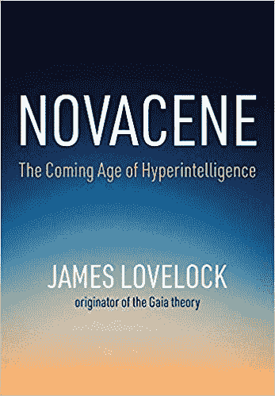

# 为什么一位 100 岁的科学家预言人工智能将取代人类

> 原文：<https://thenewstack.io/why-a-100-year-old-scientist-predicts-ai-will-replace-humans/>

上个月，一本发人深省的新书出版了，作者是一位受人尊敬的科学家，他已经 100 岁了，写得非常漂亮。但成为头条新闻的是它对超级智能人工智能最终将取代人类的预测。

詹姆斯·洛夫洛克(James Lovelock)的《新星:即将到来的超智能时代》(Novacene:The Coming Age of Hyperintelligence)的封面承诺，这本书提供了“人类和人工智能共同帮助地球生存的未来时代的愿景。”但这只是故事的一半。“未来学家预测电子人将取代地球上的人类，”未来主义网站的标题[写道——该网站不是唯一一个对这本书拥抱我们即将到来的人工智能霸主感到震惊的网站。](https://futurism.com/the-byte/futurist-predicts-cyborgs-replace-humans)

这是一个不和谐的假设，但看洛夫洛克构建他的案例是很有趣的——偶尔回顾一下他那硕果累累、生活幸福的漫长一生。但它也挑战读者参与一项雄心勃勃的思想练习，迫使我们考虑如何看待自己，我们所做的工作，我们在宇宙中的位置，以及我们最终为后代留下的遗产。

## **思维非常自由**

洛夫洛克的书首先提到了 [AlphaZero](https://thenewstack.io/new-google-ai-achieves-alien-superhuman-mastery-chess-shogi-go-mere-hours/) ，这是一个由 DeepMind 开发的程序，它成功地教会了自己如何在国际象棋和围棋等数学复杂的游戏中击败对手。但随后它想象了一个世界，在那里复杂的人工智能设计复杂的人工智能，创造出超级智慧的生物，开启了一个新时代，洛夫洛克称之为“新时代”。这本书的内页似乎将洛夫洛克的书视为一种巨大的乐观主义行为，在这种情况下，这个新时代“甚至可能是一个过程的开始，这一过程将最终导致智能遍布整个宇宙。”

那就不会是一个*人类*智能。

洛夫洛克的激进观点可能在这本书的序言中表达得最为清楚，合著者布莱恩·阿普尔亚德在序言中描述了他最近收到的一封来自洛夫洛克的电子邮件。在书中，洛夫洛克解释说，最重要的是生命本身——无论是人类还是活生生的地球。"只要它们有一个共同的目的，其各个组成部分的性质并不重要."

阿普尔亚德解释了这最终将洛夫洛克引向何方。“生命的概念包含了知识的可能性，包含了能够观察和思考宇宙本质的生物的可能性。无论人类是继续与电子后代生活在一起，还是被他们取代，我们都将在宇宙自我认知的过程中扮演重要而必要的角色。”

“不要为此感到沮丧，”这本书的最后一段开始告诉读者，伟大时代的智慧是“接受我们的短暂，同时从我们做过的事情以及幸运的话，我们可能还会做的事情的记忆中获得安慰。”

“此外，也许我们可以希望，随着智慧和理解从地球向外传播到宇宙，我们的贡献不会被完全遗忘。”

从某种角度来看，2017 年《旁观者》写道，洛夫洛克“一直是那种顽固的自由思想的人”，同时补充道，“他仍然充满了生活的乐趣，他们应该把他装瓶，作为滋补品出售。”

## **之前的 100 年**

事实上，整本书散布着一些近乎伤感的传记笔记。《自然》[杂志最近的一篇文章也提到了洛夫洛克在 20 世纪 70 年代与微生物学家琳·马古利斯](https://www.nature.com/articles/d41586-019-01969-y)的开创性工作，他帮助洛夫洛克发展了“盖亚假说”,该假说认为地球是一个复杂的自我调节系统，它为维持生命提供了永久的环境。然而在书中，洛夫洛克记得他们对盖亚假说的实际反应。"几乎所有地方的学术界都表现得像伽利略时代的教会，尽管更加温和."

但是他表示感谢，由于有报酬的技术工作，他能够自己资助他的工作。对于洛夫洛克来说，这只是他漫长的科学和发明生涯中的又一项成就。

[https://www.youtube.com/embed/Fg-3wBBpM_M?feature=oembed](https://www.youtube.com/embed/Fg-3wBBpM_M?feature=oembed)

视频

他的新书现在预测，超级智慧生物将认识到有机生命形式(像我们人类)的存在有助于保持地球凉爽，因此他们不会忍不住发动一场科幻小说式的反人类战争。他写道，我们“不必假设在新生代出现的新人工生命会像我们一样残忍、致命和好斗”。但是这些未来生物也会从事“保护或改变环境的大规模项目”例如，一面 600，000 平方英里的镜子可以反射足够的阳光来解决全球变暖问题，或者其他项目可以将废热转移或反射到宇宙中。

洛夫洛克想象地球被“一种新的无机外衣”包裹着，不幸的是，这可能最终使地球变得太热，我们这些可怜的有机生命形式无法生存。然后，他继续愉快地写道，由于我们人类扮演的重要(尽管短暂)角色，“新 IT 盖亚”将会持续更长时间。但他仍然不相信外星生命，这让他诗意地写下这些数字生物是“在一个没有生命的宇宙中唯一的理解者…”

这导致了一个更加惊人的预测。"也许智慧生命的最终目标是将宇宙转化为信息."

有趣的是，洛夫洛克在 2016 年接受《卫报》采访时，已经在考虑人工智能的收购了。“一旦它们在任何地方建立起来，这就是终结，因为对机器人来说，时间发生的速度比我们快一百万倍——这是一个相当精确的数字。从某种意义上来说，这很棒，不是吗？对一个机器人来说，一旦在新世界里完全立足，一秒就是一百万秒。一切都发生得如此之快，以至于他们在地球上的生存、成长和进化时间是我们的一百万倍。”

他补充说，我们与他们互动的方式“将会非常特别。”

《卫报》的记者绞尽脑汁地想，他们可能会像我们看待红杉树一样看待我们。“我认为，他们甚至可能想要拥抱我们？洛夫洛克喜形于色。是的，完全正确！没错。这是一个很好的。”"

他们的文章将他的一些回应描述为“令人困惑的快乐”

### **翻页**

这是一个令人兴奋的阅读，一个关于我们人类的一个前哨可能灭绝的翻页器:第二章的标题是“灭绝的边缘”这本简短的书对读书俱乐部来说是一个完美的选择，有很多可以谈论的内容。例如，洛夫洛克认为殖民火星是巨大的金钱浪费，这些钱本可以更好地用来了解地球。但他后来写道，超级智能电子生物可能会欣赏它不受氧气和地球上令人不安的丰富水的“骚扰”——并愉快地殖民那个“完全不适合像我们这样的潮湿含碳生命”的邻近星球

这本书提供了一个真正新颖的视角和一些令人耳目一新的想法。

Appleyard 在序言中指出，这可能是洛夫洛克的最后一本书，在这本书的最后一章，洛夫洛克回忆道，他将自己对地球的强烈感情归因于很久以前与父亲一起在乡下散步——大概是在 20 世纪 20 年代。他补充说，直到今天，从他的四个房间的小屋可以俯瞰汹涌的大西洋，附近有一片国民信托拥有的荒地，他和他的第二任妻子桑迪住在那里(他在 69 岁时遇见了她)。洛夫洛克最终与他的读者分享了他温柔和沉思的心情。“现在，当我在晚上眺望大海，看到天空中的红色星球时，我非常激动地知道，我设计的两个硬件就在火星沙漠中。”

在整本书中，有关于历史上科学家的精选名言和故事，洛夫洛克似乎对人类的成就有着真正的欣赏。不知何故，当他温和地接受全人类正被自己的数字创作所取代的观点时，这一点变得更有影响力。

洛夫洛克在本书的最后一章写道:“我们不应该因为这些人，我们的后代而感到被贬低。”。

“想想我们已经走了多远。”

* * *

# WebReduce

<svg xmlns:xlink="http://www.w3.org/1999/xlink" viewBox="0 0 68 31" version="1.1"><title>Group</title> <desc>Created with Sketch.</desc></svg>