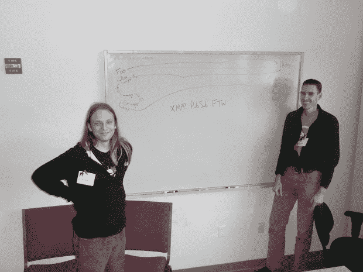

# 为什么一个 Twitter 的创始工程师现在全押在乳齿象上

> 原文：<https://thenewstack.io/why-a-twitter-founding-engineer-is-now-all-in-on-mastodon/>

布雷恩·库克于 2005 年加入 Ev Williams 的初创公司 Odeo。库克和他的开发伙伴[乌合之众](https://mastodon.social/@rabble)(又名埃文·亨肖-普拉斯)是 2006 年 Twitter 的创始工程师之一。同年，Twitter 被分拆成自己的公司，由创始人杰克·多西领导。但是在 2008 年 4 月，库克——[称](https://web.archive.org/web/20120729165926/http://news.cnet.com/8301-13577_3-9926813-36.html)当时是 Twitter 的“首席架构师”——突然离开了。

鲜为人知的是，库克曾试图说服他在 Twitter 的老板创建该服务的分散版本，但没有成功。一张拍摄于 2008 年 2 月的照片显示，他和另一名开发人员 Ralph Meijer 通过 XMPP PubSub 为联合 Twitter 和 Jaiku(一个类似的微博网站)创建了一个地图。

2008 年 2 月，布雷恩·库克(左)和拉尔夫·梅耶尔为联合社交媒体服务制作地图。照片[由马克·阿特伍德](https://www.flickr.com/photos/fallenpegasus/2238720339)拍摄。

好吧，现在已经过去了将近 15 年，库克对去中心化 Twitter 的愿景看起来更加可行。乳齿象，Twitter 的[新克星](https://thenewstack.io/devs-are-excited-by-activitypub-open-protocol-for-mastodon/)，正在快速成长；它目前拥有[250 万](https://www.techmeme.com/221220/p7#a221220p7)月活跃用户。在接受 New Stack 的采访时，我问库克对乳齿象的崛起有何感想。

“感觉很熟悉，很刺激，”他笑着回答。他指出，2008 年，Evan Prodromou 和其他人与他同时在为《Status.net》工作，在这个乌合之众的社交软件开发者社区中有一种感觉，“它将会比现在大得多。”因此，尽管他喜欢乳齿象在 2022 年爆发的事实，但这仍处于游戏的早期。

“我们回到了那个点上……我们有了乳齿象，它是一个提供特定功能的软件，但我认为它给我们的多样性和启示比乳齿象大得多。因此，我现在真正感到兴奋的是，现在我们处于这个更发达的起点，看到人们在此基础上构建什么。”

## 不同的协议(可能包括蓝天)

库克在构建去中心化互联网协议方面有着多年的经验——他也是 OAuth 和 WebFinger 协议的合著者——所以我问他这些年来学到了什么是可行的，什么是不可行的。

他说:“我认为对我来说最主要的一点是，为社交活动制定一套规则是行不通的。”。“总会有不同的意见，所以联合模式让我们有能力拥有不同的社区和不同的规则——不同的在线文化。这只是承认循环中有人类，真的。”

几年前，库克的前老板杰克·多西宣称他有兴趣为 Twitter 创建一个去中心化的协议(晚做总比不做好)。2019 年 12 月，虽然仍是首席执行官，[多尔西在推特上发推文](https://twitter.com/jack/status/1204766078468911106)说，Twitter 正在资助一个项目，以“为社交媒体开发一个开放和分散的标准”，目标是 Twitter“最终成为这个标准的客户。”

这个名为 Bluesky 的项目变成了一个独立的公司——尽管它依赖于 Twitter 的资金支持(目前还不清楚这笔资金的状况)。10 月，Bluesky 发布了其协议草案，即“认证传输协议”(“AT 协议”)。我问库克他对蓝天的看法。

“我认为这很棒，”他回答道，并补充道，“fediverse 不仅仅是一种协议。”

“我认为技术方法是好的，”他谈到蓝天时说。“他们有很多东西要弄清楚和努力，但这个团队真的很棒，我很高兴看到他们的发展。”

## 乳齿象如何继续进化

回到乳齿象，Cook 期望看到服务器上“不同文化规范的出现”,因为不同的社区寻求不同的功能。

一个很好的例子就是乳齿象社区关于关键词搜索的意见分歧。乳齿象开源软件项目的[默认立场](https://thenewstack.io/what-its-like-to-run-a-mastodon-server-in-the-musk-twitter-era/)是严格限制搜索功能，主要是为了防止钓鱼者利用它。但是许多人(包括我自己)希望加入一个乳齿象实例，让他们打开帖子进行索引，这样我们就可以在那个实例上搜索内容——这有利于话题跟踪、监控新闻等。

即使乳齿象项目让不同的规范进化，在技术社区也有相当多的怀疑，关于 fediverse 是否会篡夺 Twitter 在我们社会中的角色。Twitter，[公司喜欢说](https://thenewstack.io/twitter-turmoil-we-need-an-open-protocol-for-public-discourse/)这是“公共对话”发生的地方。我问库克，他是否认为 fediverse 有可能取代这一角色，并最终成为公众对话的默认平台。

“是啊，我认为这是不可避免的。我们以前见过类似的故事——电话网络曾经是垄断的，”他说，并补充说政府监管迫使他们开放。他预测社交媒体也会出现类似的情况。“我希望随着乳齿象的成长，Twitter 最终会被授权联合起来。”

## 建设更好的多元化基础设施

如今，库克正在研究其他形式的权力下放，这最终可能有助于 fediverse 的规模。他是裂变公司的首席工程师，该公司将协议实验室视为其主要投资者之一。Protocol Labs 是 Filecoin 和 IPFS 协议(星际文件系统)这两个流行的加密项目的创造者。裂变表示，它正在 IPFS 的基础上建立一个“边缘计算栈”。我问库克这到底是什么意思？

“所以我们正在构建分布式计算工具，”他解释道。“我们的出发点是，有了 WASM——web assembly——我们现在有了一个安全的面向功能的容器来执行代码。所以基本上你可以安全地运行人们给你的其他代码。有了这些原始数据、内容地址数据以及来自加密世界的一系列技术，但不仅仅是在加密世界中的应用，我们正在考虑能否建立一个执行环境，让你可以拥有一个本地优先的应用程序，它可以在你的手机上运行，但当它需要针对一些大型复杂数据运行时，它也可以在云中运行，无需修改，你也不必部署一些复杂的 Kubernetes 集群或类似的东西。”

虽然这项工作是在 Fe diversity 之外进行的，但库克表示，它可能对 Fe diversity 非常有帮助。

“我们认为有很多一致性，”他说，并指出 Mastodon 是一个 Rails 项目，与 Twitter 一样依赖于传统的 web 服务器和数据库技术。

“你已经建立了你的服务器，你有一些数据库，你有很多基础设施，”他说。“运行乳齿象服务器的成本相对较高。自我们创建 Twitter 以来的 15 年里，发生了很多变化[……]我们可以做很多事情。”

他指出了乳齿象最近出现的缩放问题，并建议 IPFS 的解决方案可以解决这个问题。

“我们可以使用像 IPFS 网络这样的东西，以一种基本上是 BitTorrent 风格的方式来托管这些内容。因此，没有一个主机会承担所有这些请求的负载[……]我们正在努力建设基础设施，以各种方式帮助 fediverse 扩展。”

很高兴看到布雷恩·库克在过去 15 年中所做的富有远见的工作开始在更广泛的互联网中产生回报。我迫不及待地想看到他和他的团队在裂变的基础设施方面提出了什么。

<svg xmlns:xlink="http://www.w3.org/1999/xlink" viewBox="0 0 68 31" version="1.1"><title>Group</title> <desc>Created with Sketch.</desc></svg>