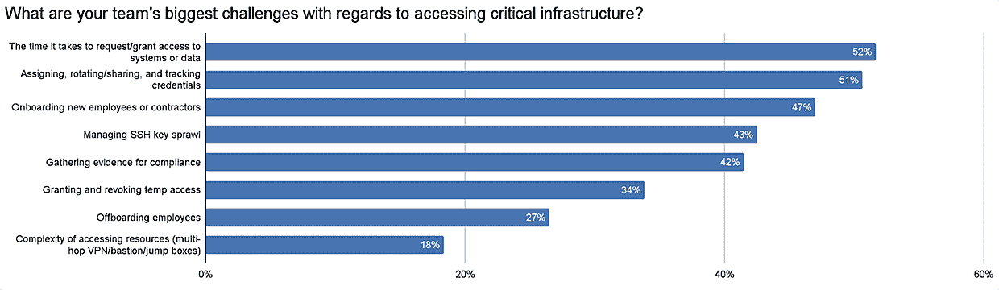

# 为什么访问管理是零信任安全的第一步

> 原文：<https://thenewstack.io/why-access-management-is-step-one-for-zero-trust-security/>

根据一份新的报告，对[安全](https://thenewstack.io/category/security/)的[“零信任”方法](https://thenewstack.io/why-cloud-native-systems-demand-a-zero-trust-approach/)最近得到了很多关注，但是大多数组织还没有准备好采用那套实践。相反，在接下来的几个月中，许多人将把重点放在访问管理上。

[https://www.youtube.com/embed/x3Uk22OZ-I0](https://www.youtube.com/embed/x3Uk22OZ-I0)

视频

参与基础设施访问平台提供商 [strongDM](https://www.strongdm.com/?utm_content=inline-mention) 的[新调查](https://www.strongdm.com/discover/2022-the-year-of-access?utm_medium=paid&utm_source=tns&utm_campaign=year-of-access)的近 80%的组织表示，他们计划在未来 12 个月专注于访问管理，相比之下，30%的组织表示[零信任](http://Primary%20URL%20https://thenewstack.io/why-cloud-native-systems-demand-a-zero-trust-approach/)将是他们同期的战略重点。

调查结果显示，授予基础设施访问权限的缓慢而笨拙的协议导致太多的团队以生产力和效率的名义偷工减料，在太多人之间共享密码和 SSH 密钥。

这个问题，包括跟踪谁可以访问什么的困难，正在降低组织的安全性。

这个问题可能会变得更糟，在 strongDM 对 600 名 DevOps 专业人士的调查中，三分之一的受访者称 Kubernetes 是他们工作中最具挑战性的技术——Kubernetes 的时代才刚刚开始。

strongDM: Kubernetes 的首席执行官 Tim Prendergast 表示，这些发现指出了一个持续的困境:Kubernetes 提供了工作负载移动性——一个容器可以在数据中心之间轻松移动——但许多企业仍然依赖传统的网络安全工具，如 VPN，它允许任何拥有正确凭据的人访问。

“这是安全和生产力之间的传统拉锯战，”他说。“传统的接入解决方案对 Kubernetes 不起作用。”

## 访问管理是如何变得混乱的？

Prendergast 说，对于包括大多数企业在内的云前公司来说，访问管理尤其复杂。虽然创业公司可能会全身心投入 Kubernetes 和云服务器，但企业可能是云和遗留系统的大杂烩，伴随着基于身份和基于角色的访问协议的混合。

“随着时间的推移，它变得越来越复杂，而不是越来越容易，即使技术变得越来越好，因为他们从未放弃传统，完全转向新的东西。”

他说，这不仅会影响企业系统的安全性，还会影响企业在一个充满云本地创业公司的世界中吸引 IT 人才的能力。

“如果你走进几乎任何一家大型企业或巨型公司，一旦人们开始跟你谈论他们是如何获取信息的，你很可能会转身走出门外。”

访问管理似乎是一个非常简单的想法:拥有一个系统，让人们只访问他们工作所需的内容。

问题是，如此多的组织为他们的用户设置了如此多的障碍，以至于太多的用户转而求助于捷径和变通办法来简单地完成他们的工作。

超过一半(53%)的 strongDM 调查受访者表示，他们可能需要几个小时到几周的时间才能获准访问基础架构。四分之一的调查参与者表示，至少需要四个人来批准和授予访问权限。

> 如此多的组织为他们的用户设置了如此多的障碍，以至于太多的用户转而求助于捷径和变通方法来简单地完成他们的工作。

随着公司规模的扩大，这个问题变得越来越严重:43%在企业(1，000 名员工或更多)工作的调查受访者表示，批准和授予对基础设施的访问权限至少需要四个人。

让工程师和开发人员跑普伦德加斯特所谓的“障碍赛”为创造变通办法提供了激励。他总结了自己的想法:“做这件事有一条捷径。所以我可能想这么做，因为我必须完成这项工作。它必须在今天下午 5 点完成，所以跳过这条线，直接完成它。

“他们不一定是恶意的演员。但也有人感到沮丧，我们已经看到这种趋势越来越明显。”

strongDM 调查的这些发现显示了现在如何管理访问，包括变通办法的广泛使用:

## Kubernetes 是否使访问管理变得更加困难？

编排容器化微服务的 Kubernetes 本身给企业系统带来了更大的复杂性。在 strongDM 的调查工作中，这并不是最具挑战性的技术参与者——两倍多的受访者提到了云提供商和客户。

但是自从新冠肺炎疫情颠覆了所有组织的工作方式，更多的企业加快了他们的数字化转型。随着越来越多的企业开始构建在 Kubernetes 上运行的新系统，将会有更多的企业了解它所面临的挑战，包括与访问管理相关的挑战。

“公司将全力以赴，”普伦德加斯特说。“为了做到这一点，他们确实需要在世界之间架起桥梁，并以编程方式定义现代化的访问，针对每个人进行个性化，因为没有两个人必然会访问相同的基础架构。”

首席执行官说，容器的短暂性以及 Kubernetes 如何编排它们，也使得访问管理和[可观察性](https://thenewstack.io/category/monitoring/)至关重要。

“那些集装箱在几分钟内就能上上下下，”他说。“如果有人登录并做了一些恶意的事情，而那个容器消失了，你可能永远也不会知道。但有了合适的访问解决方案，您将知道谁访问了什么、何时访问了什么，以及他们做了什么。”

Prendergast 说，在云和 Kubernetes 上运行的分布式系统也使某些以前的安全工具，如特权访问管理(PAM)变得不充分。

PAM 依赖于数据库管理员，访问权限仅限于组织中的少数人。“但现实是，基础设施民主化程度相当高，”他说。

因此，更多的人需要定期访问更多的东西:“你们有数据科学家，有工程师进行质量验证，检查新功能或正确填充数据。您让开发运维团队进行备份和维护。现在他们都需要随时访问它。”

与 PAMs 相比，Prendergast 说，“程序化访问解决方案说，‘好，我们提升你的访问权限，现在你可以看到数据库，你可以登录，你可以做你的维护，并且整个维护会话被记录下来。然后，当你注销时，访问权限就消失了。"

## 如何改进访问管理？

Prendergast 指出，在一个组织中，访问管理通常不是一个得到足够重视或资助的领域。但是，它不仅对组织的整体安全性至关重要，而且对其留住 it 人才的能力也至关重要。

他说，如果要花 45 分钟才能访问数据库，运行 10 秒钟的查询，这种日常障碍会让员工感到沮丧。如果这种低效的访问管理使您的工作变得困难，[您可能不想再做了](https://youtu.be/Xb6Mo47pxec)。

“有时候访问就像是，‘别担心，我们以后会解决的，’”他说。“每个人都有一个房子项目，你说，‘我会在这个周末做，而不是上个周末’，而它总是，把罐子踢到路上。总会有别的东西着火。”

如果一个[零信任方法](https://thenewstack.io/what-is-zero-trust-security/)仍然是你的组织的最终目标，那么第一步就是整理访问管理。普伦德加斯特说，这要从“诚实盘点”开始。他承认，这对许多公司来说并不容易，因为他们的工作负载在如此多的不同环境中运行。

他们应该问自己的问题是:“您的技术如何定义您的基础架构？那么，支持这一观点的最小公分母是什么呢？”

Prendergast 的公司 strongDM 是由在一个复杂的分布式环境中拥有许可访问管理的公司工作的创始人创办的，直到该公司经历了一次重大的安全事故。

因此，普伦德加斯特说，strongDM 努力设身处地为用户着想。它通过一个平台来应对访问管理挑战，该平台可自动调配用户及其对基础架构的访问，为他们提供即时访问。

> “有时 access 就像是在说，‘别担心，我们以后会解决的。’每个人都有一个房子项目，你说，'我会在这个周末做，而不是上个周末，'它总是，踢罐子在路上。总会有别的东西着火。"

strongDM 首席执行官 Tim Prendergast

他说，例如，一家使用 strongDM 解决方案的公司的新员工，“会在第一天的第一分钟就出现，并获得你需要的所有东西。你不需要经历八个小时的入职流程来尝试访问所有系统。”

这个自动化系统是程序化的，支持传统数据中心技术以及尖端的云原生数据中心、Kubernetes、命令行工具等。“我们不再需要公司的任何用户实际拥有任何登录信息的凭证。”

监管压力不断增加，尤其是对于那些处理个人或健康数据的组织。今年 5 月，[乔·拜登总统签署了一项行政命令](https://www.whitehouse.gov/briefing-room/presidential-actions/2021/05/12/executive-order-on-improving-the-nations-cybersecurity/?utm_source=thenewstack&utm_medium=website&utm_campaign=platform)，要求联邦政府和云服务提供商采取零信任安全政策，遵守零信任原则和框架，指导方针已经出台。

国家标准与技术研究所(NIST)发布了一份为零信任设置标准的文件，包括[身份和访问管理](https://www.nist.gov/identity-access-management)。

Gartner 的高级主管和分析师 John Watts 在 10 月的他的公司的 [ThinkCast 播客上建议，当你向零信任方法的最终目标迈进时，首先要考虑你希望你的访问管理策略达到什么目的。](https://www.gartner.com/en/podcasts/thinkcast/prepare-your-organization-for-zero-trust)

“我的建议是不要从一个项目开始，”瓦茨说。“你要从策略开始。首先要做的是谈谈你想在零信任的情况下做什么。想出一个策略；这一战略将奠定基础。零信任的基础将建立在身份上。”

一旦制定了访问管理策略以及相应的技术和基础设施。旨在取代“完全开放的、易受攻击的”VPN 的零信任网络访问项目是“对大多数组织来说相当容易实现的成果”，并将成为一个良好的第一个项目。

但是为了达到零信任，访问管理必须是第一优先，普伦德加斯特强调说:“世界上所有的复杂技术都不能解决你的基本问题。你可以建造一座非常棒的豪宅。但是如果你把它建在沙滩上，它就会倒塌。

“我们都必须回去，抚平伤痛。我们已经忍受了很长时间。”

<svg xmlns:xlink="http://www.w3.org/1999/xlink" viewBox="0 0 68 31" version="1.1"><title>Group</title> <desc>Created with Sketch.</desc></svg>