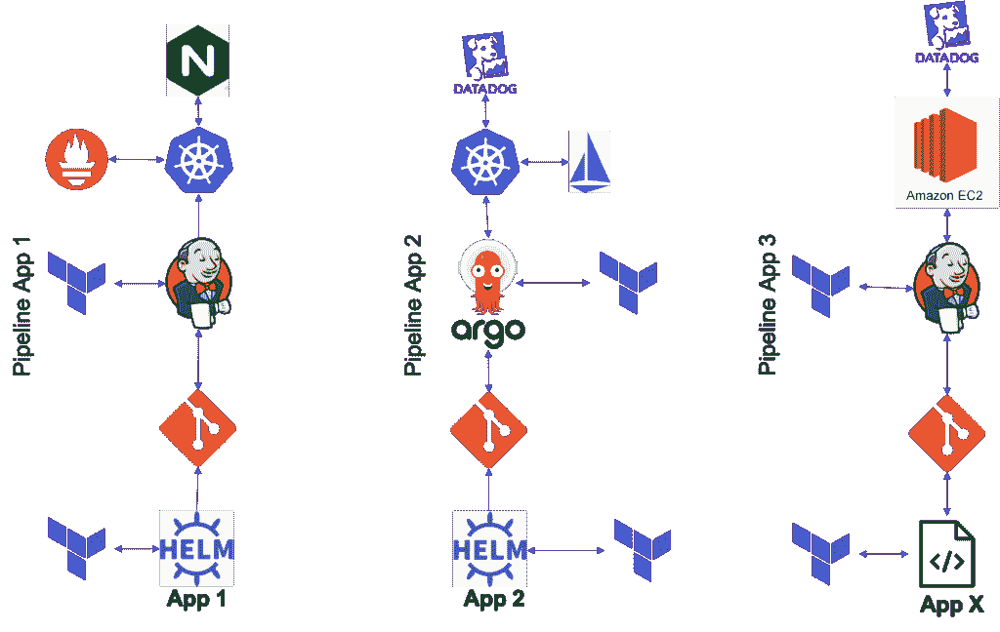
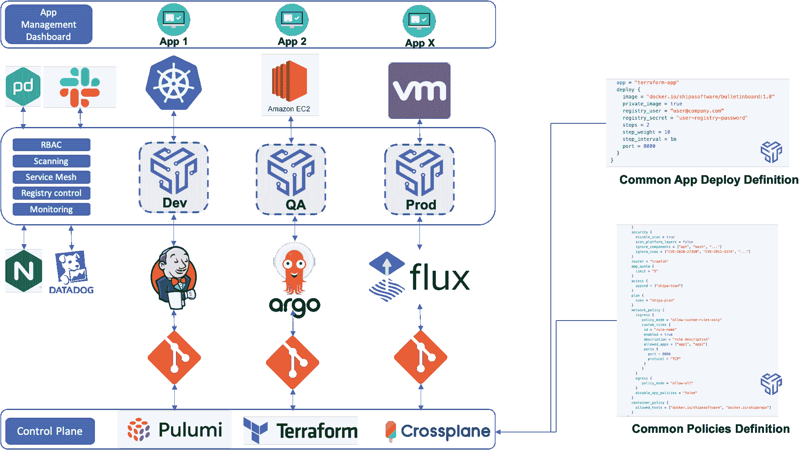

# 为什么 AppOps 模型赋予开发者力量

> 原文：<https://thenewstack.io/why-an-appops-model-empowers-developers/>

 [维维克潘迪

维维克是云原生应用即代码平台 Shipa 的工程副总裁。在 Shipa 之前，Vivek 是 CloudBees 的联合创始人，并在 Sun Microsystems 和 VMware 担任过工程职位。](https://www.linkedin.com/in/vivekpandey/) 

曾几何时，配置一台新服务器意味着等待数周的物理硬件到货，然后在几天内手动安装和配置操作系统。虚拟机(VM)的发展意味着服务器可以在几分钟内启动，带来了可喜的效率。Ansible、Puppet 和 Chef 等工具随之出现，引入了基础设施自动化。云计算的出现后来需要一批新的基础设施工具，如 Terraform 和 Docker。最近，向微服务和 Kubernetes 的转变刺激了 Crossplane 和 Pulumi 等工具的出现。在这一不断演进的每个阶段，新的基础设施自动化工具都服务于一个最终目的:实现更快的应用交付。

但是，开发人员目前面临的最大挑战之一是跨多个基础设施平台及其相关工具自动部署应用程序的耗时复杂性。虽然新诞生的云公司一开始就使用云原生技术和工作流，但大多数老牌公司仍在进行重大转型，以完全实施 Kubernetes 或 GitOps 等先进方法。相反，大多数仍然使用本地或云虚拟机来运行应用程序。这样做需要开发人员部署应用程序来处理多个持续集成(CI)管道，以及多个 Terraform 或自定义脚本。部署后支持应用程序也同样复杂。

今天的开发人员努力应对多个复杂的应用程序部署管道，如本例所示。

这种复杂性和糟糕的应用程序控制降低了开发速度，限制了应用程序支持，并加剧了开发人员和运营团队之间的摩擦。复杂性只会随着组织的环境、开发团队和应用程序的增加而增加，使这些挑战变得越来越困难。

## 新视角:关注应用层

组织通常专注于自动调配基础架构和服务的控制平面，开发运维团队则采用自动化工具来部署应用。例如，实施 Kubernetes 和 GitOps 的组织将需要构建新的管道、安全控制等。这些努力迅速助长了工具蔓延、应用程序控制的不统一，以及开发人员与平台和开发团队之间的不和谐，他们认为这是障碍。

然后，许多组织试图通过投入资源来跟上这种复杂性，即额外的昂贵工具和扩大的人员。构建内部开发者平台(IDPs)就是一个很大的例子。IDPs 的目的是抽象基础设施，使开发人员能够更快地交付和支持应用程序。然而，在实践中，开发人员仪表板并不能解决复杂性或者为客户提供核心业务价值。在多年的投资浪费、定期停机和安全不足之后，国内流离失所者往往会自生自灭。

更好的方法是关注应用层本身:构建一个通用的应用程序操作模型。

AppOps 模型允许开发人员以相同的方式部署和管理他们的应用程序，不管是什么控制平面——Kubernetes、VMs 等等。—支持他们的项目和管道。通过这样做，DevOps 可以根据需要更改控制平面，而不会对开发人员的活动产生任何影响。组织应该能够灵活地将跨其现有堆栈的任何平台插入到应用程序操作模型中，使其成为标准化的解决方案。然后，DevOps 能够使用这个集中控制层来定义安全性和控制，在每个部署的应用程序上自动实施这些控制，并消除开发人员的负担。最后，一个通用的应用程序控制模型应该使用可用的基础设施来自动创建应用程序需要的所有资源。

## 引入 AppOps 作为一个新的类别

AppOps——提供自动化的基础设施和应用程序层，以满足组织加速应用程序开发的实际目标——应该被视为一个类别，而不是一个单一的工具。就像虚拟机、云计算和微服务的到来带来的自动化浪潮一样，AppOps 的出现可以带来一批新的变革性解决方案。与持续集成、应用性能管理、应用安全和其他类别相邻，AppOps 应该在一个旨在推动应用开发的统一运营模式中无缝实现速度、安全性和控制。

通过 AppOps 简化应用程序管道的示例

有人预测, [Kubernetes 将会消失，成为一个透明的工具，不再以其复杂性给开发者带来负担，这说明了 AppOps 的可能性。对于致力于部署、管理、支持和保护其应用的开发人员来说，AppOps 可以使底层基础设施、CI 管道和控制平面变得不可见和不相关。](https://www.shipa.io/development/k8s-will-disappear/)

随着这种方法的发展，AppOps 承诺消除限制开发人员生产力的主要基础设施干扰，最终使开发人员能够专注于行业长期追求的开发。

*要了解 AppOps 和其他云原生技术的更多信息，请考虑参加 [KubeCon+CloudNativeCon 北美 2021](https://events.linuxfoundation.org/kubecon-cloudnativecon-north-america/)—10 月 11 日至 15 日。*

<svg xmlns:xlink="http://www.w3.org/1999/xlink" viewBox="0 0 68 31" version="1.1"><title>Group</title> <desc>Created with Sketch.</desc></svg>