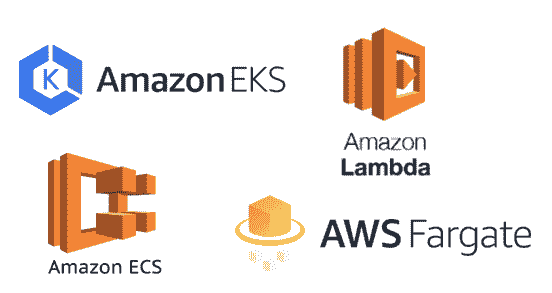
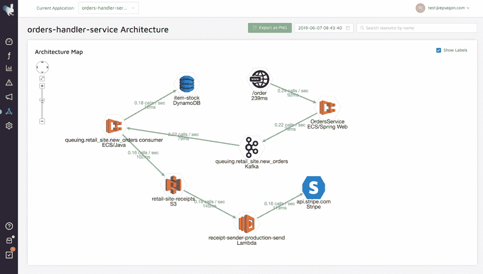

# 为什么以及如何使用 AWS 托管服务

> 原文：<https://thenewstack.io/why-and-how-to-use-aws-managed-services/>

十年前，软件部署很少发生，主要是由于服务器供应的复杂性。当云提供商推出计算服务(如虚拟机、远程存储和虚拟网络)时，发生了一个重要的转变:IT 经理意识到，通过使用这些新的云服务，底层硬件的成本可以降低，基础设施的所有权可以由 IT 基础设施团队和开发人员共同承担。

本文将讨论云上应用程序部署的发展，还将展示一些在 AWS 上选择托管服务的用例。

## 整体部署

 [尼赞·沙皮拉

Nitzan 是 Epsagon 的首席执行官和联合创始人。他是一名软件工程师，在编程、机器学习、网络安全和逆向工程领域拥有超过 13 年的经验。他还喜欢弹钢琴，是一个旅游爱好者，一个经验丰富的棋手，并沉迷于运动。](https://epsagon.com/) 

如果你观察许多传统应用的软件架构，你很可能会发现它们是用单一的方法构建的，由一个包含不同模块的大代码库组成，通常有一个数据库作为持久层。对于此类应用程序的部署，策略与云部署类似:

*   用于供应服务器的管道；
*   将代码库推送到目标服务器的管道；
*   与数据库引擎对话的管道，以便应用数据库模式更改；
*   两种服务都位于防火墙之后；
*   大部分时间垂直执行缩放。

事实上，当整体架构仍然有意义时，这种策略仍然用于一些应用程序。但今天的不同之处在于，它们现在主要由云提供商部署，通常是虚拟机(例如 [AWS EC2](https://aws.amazon.com/ec2/) )或托管计算服务，如 [AWS Elastic Beanstalk](https://aws.amazon.com/elasticbeanstalk/) 。

## 微服务部署

当微服务架构出现时，部署变得更加复杂。因此，部署策略受到了显著影响:

*   不仅单台机器需要资源调配，多台机器也需要资源调配；
*   团队之间的同步更加复杂；
*   由于组件数量众多，监控和日志记录变得非常复杂。；
*   拥有同质管道很难，因为每个团队/服务都是独立的；
*   不是只有一个而是很多数据库(通常每个服务一个)；
*   需要更多的 IT 资源:发现服务、负载平衡器等。

一般来说，需要更多的开发运维工作和同步。虽然手动为微服务调配基础架构需要花费大量精力，但许多公司仍会这样做，以满足其业务需求。然而，如下所述，托管服务是一个受欢迎的到来，因为它们大大减少了团队的实施工作量。

## 现代云部署

如今，敏捷时代和微服务的高采用率促使云提供商提供许多新服务来简化实施。他们这样做主要是通过将所需的服务器维护排除在外，并允许团队使用这些不同的服务，只需要最少的配置。这些被称为托管服务。

托管服务是一种云特性，您可以使用它，而不必关心底层硬件的管理。例如，在亚马逊生态系统中，你会发现 [AWS Fargate](https://aws.amazon.com/fargate/) 、 [AWS Lambda](https://aws.amazon.com/lambda/) 、 [AWS Aurora](https://aws.amazon.com/rds/aurora/) 、 [Amazon DynamoDB](https://aws.amazon.com/dynamodb/) 和 Elastic Beanstalk 等等。所有这些服务有什么共同点？服务提供商(而不是您的组织)负责在这些平台上启动和运行部署。

现代部署由运行在混合服务/集成上的应用程序组成。这种混合在未来仍然会被使用，但是将会倾向于使用云提供商提供的更多托管工具和 API。仅举一个例子:一个常规的 [Django](https://www.djangoproject.com/) 应用程序通常可以部署在 AWS Fargate 上，并集成了用于 Google API(地图、翻译等)的 [OAuth2。).](https://developers.google.com/identity/protocols/OAuth2)

尽管托管服务被认为具有很好的可扩展性和易用性，但它们的常规成本较高，定制化程度较低。尽管如此，与节省的工程师时间相比，它们绝对是值得的。

## 面向托管服务的 AWS 生态系统

本节将介绍一些指导原则，帮助您根据常见的基础设施和应用程序级别的要求，在 AWS 上选择不同的托管服务。

流行的 AWS 托管服务。

## 集装箱化解决方案

容器化应用程序有很多原因:可移植性、隔离、分发等。如果您正从整体服务迁移到微服务，那么您可能希望将容器作为将组件拆分成小型独立服务的第一步。此外，如果您正在通过基于微服务的架构从头创建一个应用程序，那么您可能会希望拥有一个容器集群来表示不同的特性/服务。

不管容器化的原因或使用情形如何， [AWS 提供了一些托管服务](https://epsagon.com/blog/aws-ecs-fargate-kubernetes-orchestration-services-comparison/)供您在部署中使用:

### AWS ECS/Fargate

如果你想在不需要任何编排的情况下使用容器，并且仍然想要 IAM 和其他 AWS 集成，那么 [AWS Fargate 就是你需要的](https://epsagon.com/blog/aws-fargate-the-future-of-serverless-containers/)。Fargate 的伟大之处在于，您不必关心容器将在其中运行的 EC2 实例。Fargate 将您从任何编排工作中完全解放出来。您创建一个 Docker 映像，将其推送到 AWS ECR，然后定义一个 Fargate 任务，指定您想要使用的映像。通过这样做，您可以获得数百个服务于您的应用程序的容器。继续前进，看看官方指南“[使用 Fargate](https://docs.aws.amazon.com/AmazonECS/latest/developerguide/ECS_GetStarted_Fargate.html) 开始使用亚马逊 ECS”了解更多信息。

要知道 Fargate 有一个很大的缺点:供应商锁定。一旦你采用了这种方法，你就必须坚持下去，因为在其他云上基本上没有对等的服务。

### AWS EKS

如果为了在不同的云提供商上运行您的应用程序，您更喜欢一个更标准的容器化解决方案，该怎么办？如果失去与一些 AWS APIs 的某种程度的集成不成问题，那么 AWS EKS 就是你需要检查的。AWS EKS 为您提供了主节点，但是您仍然需要负责定义工作节点。这意味着您将需要定义各种元素，如您的 pod 和服务，这将需要大量的配置工作，因此代表了使用 AWS EKS 部署应用程序的缺点。但是考虑到你得到的能力的增加，额外的工作是值得的。

AWS EKS 的另一个好处是，将您的集群迁移到另一个云提供商并不困难，因为 Kubernetes 部署是标准的，这意味着您的节点配置仍然可以在其他云上工作。

### FaaS 解决方案

如果您的应用程序(或其中的一部分)由一组可以独立执行的小功能组成，并且不需要一直运行， [AWS Lambda 是一个不错的选择](https://epsagon.com/blog/why-devops-engineers-love-aws-lambda/)。Lambda 允许您轻松定义小型服务，无需服务器供应。与 FaaS 同行的其他好处还有:

*   由于函数不会一直运行，您将节省资金；
*   它与 AWS 集成在一起，所以，举例来说，你可以用很少的代码与 AWS 数据库对话；
*   API 网关是默认提供的，因此您可以利用它来保护您的端点；
*   默认情况下它会自动缩放。

[AWS Lambda](https://epsagon.com/blog/the-5-best-use-cases-for-the-serverless-beginner/)有很多用例。其中，您可以使用它来:

*   后端手机和[小型 web API](http://www.iamondemand.com/blog/serverless-for-humans-a-simplified-overview/)；
*   对其他 AWS 服务上的事件做出反应的任务；
*   自动化作业。

Lambda 并不适用于所有情况。尽管 [Lambda 支持多种语言](https://epsagon.com/blog/aws-lambda-programming-language-comparison/)并且允许你为你的函数附加适当的资源，你仍然需要担心[冷启动](https://epsagon.com/blog/how-to-minimize-aws-lambda-cold-starts/)，运行时间限制，供应商锁定等等。记住，函数通常用于小型服务。此外，请记住，它们将随着函数内部代码的伸缩而伸缩。

如果你是从 AWS Lambda 开始，请查看[这个](https://epsagon.com/blog/considerations-for-the-beginner-serverless-developer/)链接，了解一些注意事项。

## API 服务集成

除了容器化解决方案和 Lambdas 之外，AWS 还为特定用例提供了许多其他服务，例如:

处理托管服务总是比部署自己的解决方案容易得多。此外，不要只局限于 AWS 服务。有许多云公司提供了很好的产品。[例如，Epsagon](https://epsagon.com/) 有一个自动化的解决方案来帮助您监控分布式云应用程序并对其进行故障排除。

由 Epsagon 自动跟踪的 AWS ECS、Fargate 和 Lambda。

## 结论

云的未来肯定会是混合和管理的。托管服务允许团队更加关注代码和业务逻辑，而不是基础设施。通过实现外部 API 集成，他们可以避免重新发明轮子，而是能够更快地响应市场需求。选择就在那里。你的任务是分析它们，看看它们如何符合你的业务要求的成本/收益参数。

希望这篇文章能够帮助您获得更多的背景知识，以便在 AWS 生态系统上更好地选择服务。花时间评估它们，并明智地使用它们。

要了解有关混合云应用程序自动化监控的更多信息，[请观看 Epsagon](https://epsagon.com/demo/) 的演示。

<svg xmlns:xlink="http://www.w3.org/1999/xlink" viewBox="0 0 68 31" version="1.1"><title>Group</title> <desc>Created with Sketch.</desc></svg>