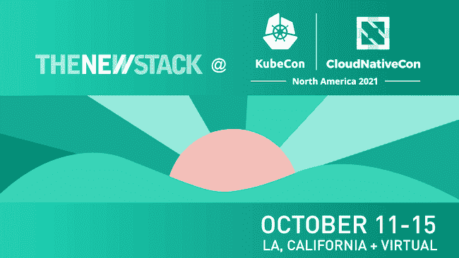

# 我们为什么以及如何在 Salesforce 推出 Kubernetes SIG

> 原文：<https://thenewstack.io/why-and-how-we-launched-a-kubernetes-sig-at-salesforce/>

 [劳拉·林德曼

劳拉作为技术、人员、创新&学习团队的一员，在 Salesforce 管理工程博客、社交媒体和会议内容。她称佐治亚州的亚特兰大为她的大本营。](https://www.linkedin.com/in/lauralindeman/) 

我们在 Salesforce 所做的工作是[重新设想我们在公共云上部署的架构](https://www.salesforce.com/products/platform/hyperforce/)，我们有许多不同团队和产品线的人在 Kubernetes 上工作。虽然我们是按照传统的“组织结构图”来组织的，员工映射到管理链，管理链解决我们问题空间的某些部分(通常与产品一致)，但 Kubernetes 的关注会横向影响团队中的每个人。我们需要一种方法来为企业 Kubernetes 用例及需求提供一致的专业知识，所有这些都与架构一致的愿景相关联。特殊兴趣小组(SIG)模式似乎是一个很好的基础，所以我们最近启动了一个内部 Kubernetes SIG，来自使用 Kubernetes 的每个不同小组的代表都参加了。

Kubernetes 社区的许多项目都是由特殊利益集团管理的。这些小组使得管理如此庞大的项目变得更加容易。根据 Kubernetes 贡献者指南，一个关键点是“每个 SIG 中的开发人员对该 SIG 的 Kubernetes 部分拥有自主权和所有权。”但同样重要的是，因为 Kubernetes 是一个开源项目，所以“任何人都欢迎加入 SIG 并开始解决问题，评论设计提案和审查代码。”

像公共 SIG 一样，我们的 SIG 有一个托管团队和一个定期开会的技术监督委员会(TOC)，以及一个公共聊天频道、文档和定期会议，对任何人开放。

我们的 SIG 章程包括以下目标:

*   推动和维护与 K8s 相关的 Salesforce(内部)客户要求和问题列表。
*   向 Salesforce 开发人员和利益相关方推动 K8s 相关公司路线图的一致性。
*   维护具有优先级的 K8s 相关工作项目的积压。
*   促进公司内各个团队对内部和开源 K8s 的贡献。
*   利用基于 Istio+Envoy 的服务网络推动协作和协同。
*   在 Salesforce 向客户介绍 K8s 产品和最佳实践。
*   代表 K8s OSS 社区中的 Salesforce K8s 使用案例。

SIG 的许多创始成员都在致力于我们的 [Kubernetes 平台即服务](https://vmblog.com/archive/2020/10/30/how-salesforce-operates-kubernetes-multitenant-clusters-in-public-cloud-at-scale.aspx#.YS_E-9NKg-Q) (PaaS)，因此他们在听取和支持使用他们平台的人们方面有既得利益。我们公司有如此多的技术平台，Kubernetes 有不同的舒适度，所以 SIG 可以在培训和引导人们使用我们的工具方面发挥作用。此外，我们非常关心对我们所依赖的开源工具的支持，因此 SIG 可以帮助优先向核心 Kubernetes 提供修复和新功能。

那么它是如何工作的呢？TOC 定期召开会议，了解问题、关注点和新想法。有一个开放的提交表单，其他人可以提交主题，任何人都可以投票支持他们强烈感兴趣的主题。排名靠前的员工将被安排在定期的公开会议上，与更大的 Salesforce K8s 社区进行讨论。讨论主题可能会产生项目，由 SIG 成员组成的小组将参与这些项目。SIG 有一个专门的 Slack 频道，还负责偶尔举办 meetups 等特殊活动，并邀请更广泛的 K8s 社区的成员与我们分享他们的专业知识。例如，SIG 最近接待了 AWS EKS 团队的一名成员，他分享了一些关于他们的愿景的信息，并参加了问答活动

启动会议产生了大量的讨论和问题，将有助于推动 SIG 从现在开始的发展。你可能会想，“谁还需要再开一次会呢？!"，我们希望 SIG 不仅仅是一个重复的日历邀请，而是成为 Kubernetes 从业者相互学习和建立一个强大社区的地方。

请在 Twitter 上通过[@ sales forceng](https://twitter.com/SalesforceEng)让我们知道你是如何在你的公司中围绕 Kubernetes 进行组织的！

*要了解更多关于 Kubernetes 和其他云原生技术的信息，请考虑参加 10 月 11 日至 15 日举行的 [KubeCon+CloudNativeCon 北美 2021](https://events.linuxfoundation.org/kubecon-cloudnativecon-north-america/) 。*

<svg xmlns:xlink="http://www.w3.org/1999/xlink" viewBox="0 0 68 31" version="1.1"><title>Group</title> <desc>Created with Sketch.</desc></svg>